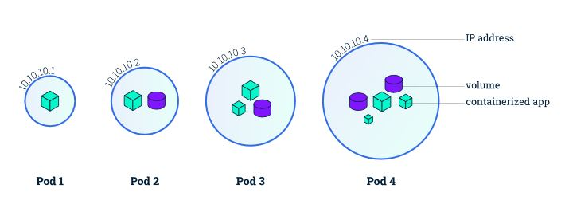

Pods are an important feature of Kubernetes. A Pod is the smallest unit of work that Kubernetes manages and is the fundamental unit that the rest of the system is built on. Each pod contains one or more containers. Instead of deploying containers individually, you always deploy and operate on a pod of containers. Pods are always scheduled together (always run on the same machine). A pod is as an atomic unit. Even if a pod does contain multiple containers, they are always run on a single worker node, it never spans multiple worker nodes. All the containers in a pod have the same IP address and port space. They communicate using localhost or standard inter-process communication. All containers in a pod have access to shared local storage on the node hosting the pod. This shared storage is mounted on each container. Pods provide a great solution for managing groups of closely related containers that depend on each other and need to co-operate on the same host to accomplish their purpose. Pods are considered as ephemeral, throwaway entities that can be discarded and replaced at will. Any pod storage is destroyed with its pod. Each pod gets a unique ID (UID), so you can still distinguish between them if necessary.

It is possible to run multiple applications inside a single container in a pod, but this is not ideal for the following reasons -

- Transparency: Making the containers within the pod visible to the infrastructure enables the infrastructure to provide services to those containers, such as process management and resource monitoring. This facilitates several conveniences for users.
- Decoupling software dependencies: The individual containers may be versioned, rebuilt, and redeployed independently.
- Ease of use: Users don't need to run their own process managers, worry about signal and exit-code propagation, and so on.
- Efficiency: Because the infrastructure takes on more responsibility, containers can be more lightweight.

Kubernetes pod  
  
From -https://kubernetes.io/docs/tutorials/kubernetes-basics/explore/explore-intro/

Pods can also define application level health-checks that can provide a richer, application-specific way of determining if the Pod should be automatically restarted. Kubernetes maintains and reports on the Pod's status, as well as the state of each of the containers that make up the Pod. A container can be Running, Terminated, or in Waiting status. The life cycle of a Pod is a bit more complicated, consisting of a strictly defined Phase and a set of PodStatus. Phase is one of Pending, Running, Succeeded, Failed, or Unknown, and the specific details of what's included in a Phase is documented here (https://kubernetes.io/docs/concepts/workloads/pods/pod-lifecycle/#pod-phase.)  

A Pod can also contain Probes, which actively check the container for some status information. Two common probes that are deployed and used by Kubernetes controllers are a livenessProbe and a readinessProbe. The livenessProbe defines whether the container is up and running. If it isn't, the infrastructure in Kubernetes kills the relevant container and then applies the restart policy defined for the Pod. The readinessProbe is meant to indicate whether the container is ready to service requests. The results of the readinessProbe are used in conjunction with other Kubernetes mechanisms such as services (which we will detail later) to forward traffic to the relevant container. In general, the probes are set up to allow the software in a container to provide a feedback loop to Kubernetes. You can find more detail on Probes, how to define them, and how they are used at https://kubernetes.io/docs/concepts/workloads/pods/pod-lifecycle/#container-probes.  

To understand the YAML definition of a pod , I use the below Kubectl command. Here i am using the Kubectl get pods command to get the pod definition of the pod named docone-deployment3-6594cdc4d-ls9pk and am outputting the definition as JSON using the -o flag.

> kubectl get pods docone-deployment3-6594cdc4d-ls9pk -o json

<a href="https://gist.github.com/PradeepLoganathan/940d2f659933a2d6e4abc42101cffcb9">View this gist on GitHub</a>

Pod YAML definition

The pod definition consists of a few parts. First, there’s the Kubernetes API version used in the YAML and the type of resource the YAML is describing. Then, three important sections are found in all Kubernetes resources:

1. Metadata includes the name, namespace, labels, and other information about the pod. (lines 4 - 25 above).
2. Spec contains the actual description of the pod’s contents, such as the pod’s containers, volumes, and other data. (lines 27 -84 above).
3. Status contains the current information about the running pod, such as what condition the pod is in, the description and status of each container, and the pod’s internal IP and other basic info. (lines 85 - 141)
