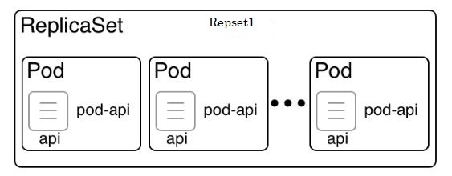
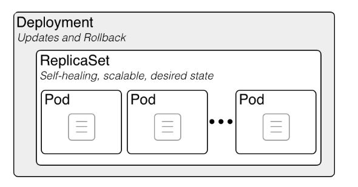
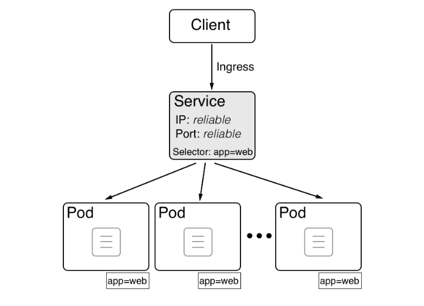

Controllers create and manage pods. Controllers respond to pod state and health. Kubernetes lets you assert that resources such as pods are in a certain desired state, with specific versions. Controllers track those resources and attempt to run your software as described. There are a variety of controllers in Kubernetes, primarily ReplicaSets and Deployments.

  
**_ReplicaSet -_** A ReplicaSet is responsible for reconciling the desired state at all times. The ReplicaSet is used to define and manage a collection of identical pods that are running on different cluster nodes. A ReplicaSet defines the image are used by the containers in the pod and the number of instances of the pod that will run in the cluster. These properties and the many others are called the desired state. If some Pods in the ReplicaSet crash and terminate, the system will recreate Pods with the original configurations on healthy nodes automatically and keep a certain number of processes continuously running. For e.g if you specified three Pods in a ReplicaSet and one fails, Kubernetes will automatically schedule and run another Pod for you. If elementary conditions are met (for example, enough memory and CPU), Pods associated with a ReplicaSet are guaranteed to run. They provide fault-tolerance, high availability, and self-healing capabilities.

Replicaset

**_Deployment -_** A deployment controller manages the rollout of a replicaset. It supports gracefully deploying, updating, and rolling back pods and ReplicaSets. Deployment augments a ReplicaSet by providing rolling update and rollback functionality. The deployment controller includes metadata settings to know how many Pods to keep running. This enables seamless rolling updates by adding new versions of a container and stopping old versions when you request it.

Deployment

**_Service -_** A service provides stable endpoints to ReplicaSets or Deployments. A Service in Kubernetes is an abstraction layer for routing traffic to a logical set of pods. Kubernetes allocates a persistent IP and DNS name for the service. The routing information is dynamically updated and maintained even as pods are redeployed. With service, we don't need to trace the IP address of each pod. Service usually uses label selector to select the pods that it needs to route to (in some cases service is created without selector in purpose). The service abstraction is powerful. It enables the decoupling and makes communication between micro-services possible. Currently Kubernetes service supports TCP and UDP. Services also provide load balancing. There are four types of services namely ClusterIP, NodePort, LoadBalancer, and ExternalName.

Service
