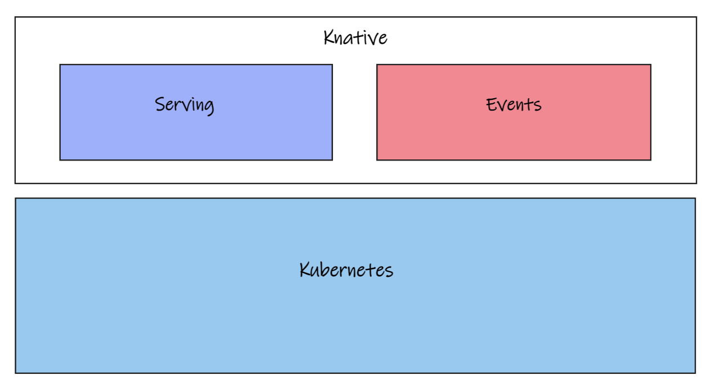
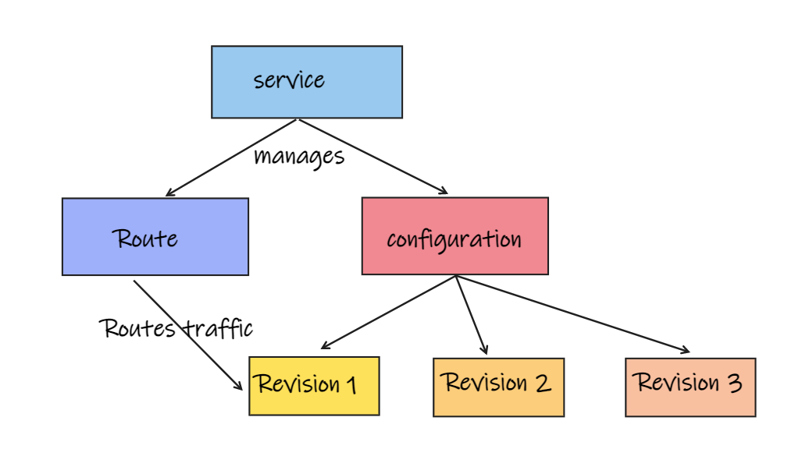

## Why Knative ?

Kubernetes helps developers bootstrap the building blocks of cloud-native applications. It has been extremely successful in doing so.  However, Kubernetes brings along a lot of complexity and overhead. It does not provide a clear boundary of separation between developers and operators. Developers end up authoring yaml files to manage the underlying infrastructure. Kubernetes provides a bunch of powerful tools to manage the underlying infrastructure. However, the tools are not intuitive and easy to use. Developers must learn the underlying concepts and the underlying tools. This leads to inconsistencies in how these tools are used and plugged together. A lot of complexity gets built into the development process leading to lower developer velocity.

Knative focuses on the inner loop of the development process and allows developers to focus on their application logic rather than the underlying infrastructure. It provides a consistent way to deploy workloads and manage them post deployment. It provides a standard mechanism for deploying all kinds of workloads to Kubernetes including serverless functions. It provides simplified processes for deploying workloads, upgrading workloads, routing requests, autoscaling and eventing. Knative builds on Kubernetes and presents a standard pattern for building and deploying serverless and event-driven applications.

## Knative Stack



Knative focuses on two key areas hosting/serving traffic to an application, and enabling applications to easily consume and produce events. It provides a complete application deployment platform, including setting up a build process, automated deployment etc. It abstracts away complexity around routing and eventing. It provides an eventing mechanism that standardizes the way applications use messaging and queueing systems such as RabbitMQ, Kafka or Pub/Sub.

The Knative stack consists of the Serving and Eventing modules built on top of the Kubernetes platform. The serving module serves stateless applications using HTTP/S endpoints and the eventing module integrates with eventing engines such as Kafka, RabbitMQ, Azure Service Bus, AWS SQS, Google Pub/Sub and many others. The build module has been extracted into a stand-alone project called [Tekton]()

The Serving module provides a virtual endpoint for your service and listens to it. When it discovers a hit on the endpoint, it creates the required Kubernetes components to serve that traffic. The serving component scales the number of containers needed to handle the load. It can scale up as more load is generated, or down, including all the way to zero. The eventing component produces and consumes cloud events in your serverless functions. It provides a simple mechanism for sending and receiving events. Let us look at these modules in more detail.

## Knative Serving

Knative serving provides the functionality needed to run your workloads. It manages the deployment and serving of applications and functions. It creates the necessary kubernetes resources such as pods, deployments, services, ingress etc.  It manages request traffic and provides scale to zero functionality. It keeps your workload running while you need it and stops it when you don’t need it. The serving module defines a bunch of custom resource definitions (CRD's) to define and control how workloads behave. These resources are created when a Knative workload is deployed. Understanding the building blocks of the Serving module is essential to working with Knative. This diagram represents the core components of the serving module and their relationships.



### Service

A Service manages the lifecycle of the workload including deployment, routing and rollback. It coordinates routing and configuration. The service object ensures that the app has a route, a configuration and a new revision for each new version of the app. It is optional to create a service , however, it is recommended to create a service for each application to orchestrate the routing and the configuration. An example service definition yaml is below

```yaml
apiVersion: serving.knative.dev/v1
kind: Service
metadata:
  name: knative-helloworld
  namespace: default
spec:
  template:
    spec:
      containers:
        - image: apps-repo.azurecr.io/helloworld-dotnet:v1
          livenessProbe:
            httpGet:
              path: /healthz
          readinessProbe:
            httpGet:
              path: /healthz
          env:
            - name: varone
              value: "my env var"
```

This yaml provides a minimal service definition to define a service named knative-helloworld. When this yaml is applied it creates a revision for this version of the app. It also creates a route, ingress, service and a load balancer for the app. It will also scale the pods serving the app up and down based on the load.

### Configuration

Configuration describes the desired state of the deployment. It provides a clear separation of code and configuration as advocated by the 12 factor app principles. Each change to a configuration creates a new revision. The Knative configuration controller creates a new deployment for each configuration version.

### Revision

A Revision is a specific version of a configuration. It is a point-in-time snapshot of the code and configuration that is deployed to the cluster. Each revision has a corresponding deployment associated with it. It makes deployments immutable. Revisions allow for multiple versions of the workload to run in parallel. Multiple Revisions can receive traffic for a single endpoint. It can be used to test changes to the configuration and allows for rollbacks, canary and blue/green deployments.

### Route

The Knative route is a URL by which a Knative service can be accessed. A Route maps a network endpoint to a Revision. It maps a named, HTTPS-addressable endpoint to one or more Revisions.A Route also helps with traffic shaping. A route can be defined as below. In the below example, I have added the traffic section to indicate that 50% of traffic should go to knativehello-v1 revision and 50% of traffic should go to knativehello-v2 revision of the same service. We can use this traffic shaping to perform blue-green, canary or progressive deployments by changing the percentage factors. The ```traffic``` key is an array of traffic targets. Tags are names that are attached to particular Revisions and can be used as names for targeting.

```yaml
apiVersion: serving.knative.dev/v1alpha1
kind: Route
metadata:
  name: knative-helloworld-route
  namespace: default
spec:
  traffic:
  - tag: v1
      revisionName: knativehello-v1
      percent: 50
    - tag: v2
      revisionName: knativehello-v2
      percent: 50
```

## Knative Eventing

Knative eventing is the event subscription, event delivery and management component for handling events. It provides a standard mechanism for delivering events to applications, subscribing to events from applications. It provides a standard mechanism for managing subscriptions. It also provides objects to define the flow of events and the routing of events. The primary components of the eventing module are Messaging, Eventing, Sources and Flows.

### Messaging

Messaging is the plumbing that moves events from one location to another. Messaging functionality is provided by channels and subscriptions.

#### Channel

Channels abstract the underlying messaging solution. This allows the underlying messaging solution to be changed without a change to the solution architecture. Channels are used to describe and configure systems like RabbitMQ, GCP PubSub, AWS SQS, Azure ASB etc. They handle buffering and provide a persistence mechanism to ensure that messages can be delivered even when the receiver is down. A channel sources events from various systems such as a queue, a topic, a database, etc. It has one or more subscribers in the form of sink services. A channel can be configured to deliver events to multiple subscribers. An example channel implementation using the InMemoryChannel is below.

```yaml
apiVersion: messaging.knative.dev/v1
kind: Channel
metadata:
  name: example-channel
  namespace: default
spec:
  channelTemplate:
    apiVersion: messaging.knative.dev/v1
    kind: InMemoryChannel
```

#### Subscription

Subscriptions connect a channel to a service. A subscription can connect multiple services to a channel. The subscription design allows for the application architecture to be decoupled from the underlying messaging technology. It also allows for the application to be able to subscribe to events from multiple sources. A sample subscription definition is below. It defines a subscription helloworldsub connecting the channel helloworldchannel to the service helloworldservice.

```yaml
apiVersion: messaging.knative.dev/v1
kind: Subscription
metadata:
  name: helloworldsub
spec:
  channel:
    apiVersion: messaging.knative.dev/v1
    kind: Channel
    name: helloworldchannel
  subscriber:
    ref:
      apiVersion: serving.knative.dev/v1
      kind: Service
      name: helloworldservice
```

### Sources

Events flow from Sources. An Event source generates or imports events. and relays these events to another endpoint called a sink. Knative eventing provides three reference sources namely PingSource, ApiServerSource and ContainerSource. PingSource produces events with a fixed payload on a schedule that you can configure. The ApiServerSource observes changes made to the underlying Kubernetes records by the Kubernetes API Server and events them out. A ContainerSource is a specialized adapter. It can be used to inject a sink into a container. Anything running in the container can now send to this sink and event the information out. There are several other Knative sources that can be used to produce events.  [VSphereSource](https://github.com/vmware-tanzu/sources-for-knative) is an example of a Knative source that can be used to produce events from a vSphere cluster.

## Knative build

Knative build was spun off into the Tekton pipeline project. [This]() blog post talks about the fundamentals of Tekton.

## Installation & First Run

We now have a good grounding of the fundamentals of Knative. This is critical to understand as part of taking steps to building [event driven architectures]() on Kubernetes. [This blog post]() takes you through installing Knative and running a simple hello world app.
