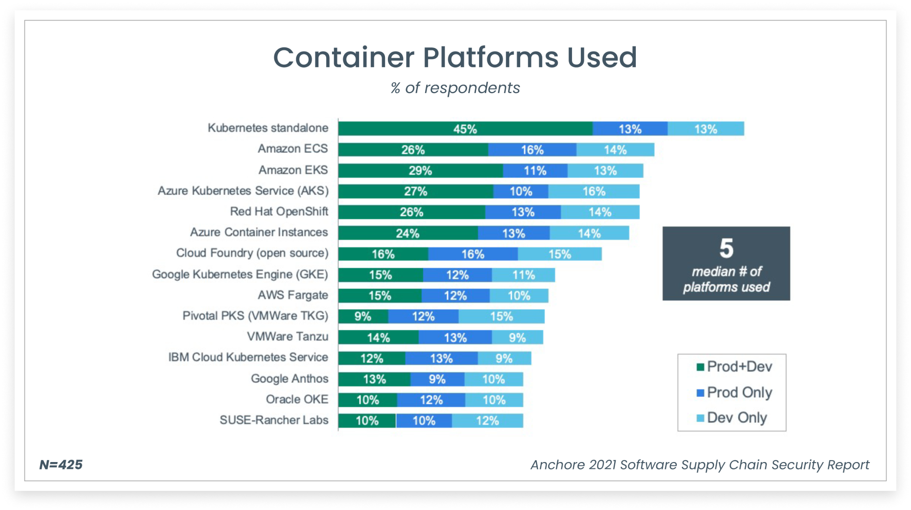
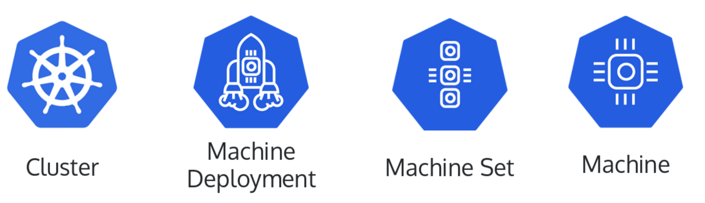

## Introduction

There are many ways to get a Kubernetes cluster up and running. There are over 125+ different K8s certified distributions, hosting providers, and installers. A comprehensive list is [here](https://www.cncf.io/certification/software-conformance/). Most of the public cloud providers offer managed Kubernetes solutions (AKS, EKS, GKE…) that abstract away the K8s cluster creation process behind their proprietary APIs. These offer you a fantastic way to get started on creating and running K8s cluster workloads on their specific platforms. Another option is to use tooling such as [kubeadm](https://kubernetes.io/docs/reference/setup-tools/kubeadm/kubeadm/),[kOps](https://kops.sigs.k8s.io/), [Kubespray](https://github.com/kubernetes-sigs/kubespray), and many others. These tools provide the necessary functionality to create clusters on different cloud providers as well as on-premises infrastructure, enabling multi-cloud and hybrid-cloud scenarios. If you are of the more adventurous kind, then you can try and create it from scratch. [Kelsey Hightower](https://twitter.com/kelseyhightower) demonstrates one such method [here](https://github.com/kelseyhightower/kubernetes-the-hard-way). This involves everything from installing custom Linux services, generating TLS certificates, and a host of other steps.

## Platform Diversity

A survey by [Anchore](https://anchore.com/software-supply-chain-security-report/) demonstrates the diversity of Kubernetes platforms used across the board.



While having multiple options to create a Kubernetes cluster is great, it results in massive operational and governance challenges. If you want to migrate your K8s cluster to a different cloud provider, you will need to rewrite your IaC code completely. If you need to change your bootstrap tool you would need to rewrite your IaC code again. Cluster creation is just one part of the problem, we need to perform cluster upgrades, deletion, scaling operations, etc. Cluster lifecycle management is challenging, especially if you are managing a fleet of clusters. Each of the above cluster creation options has strong opinions on the lifecycle management process of the cluster. All these problems become exacerbated as we create multiple clusters sometimes across cloud providers and on-premises systems. Additionally, a cluster requires other components such as load balancers, VPC/VNET and many others to provide the necessary functionality. Each of the above providers has highly opinionated and proprietary mechanisms to provision these into the cluster.

## Cluster SIG

To address the above challenges the [Cluster Lifecycle Special Interest Group](https://github.com/kubernetes/community/tree/master/sig-cluster-lifecycle) came together to identify a better way of creating a cluster, configuring it, and managing its lifecycle. The primary objective of this SIG is to simplify the creation, configuration, upgrade, downgrade, and teardown of Kubernetes clusters and their components. This should work across multiple providers, infrastructure types and enable uniformity, interoperability, extensibility, and simplicity. This would ideally use the same Kubernetes primitives and declarative model that have proven to be successful and is well known. The underlying cluster infrastructure, like virtual machines, networks, load balancers etc., would be managed the same way that developers manage application workloads. This should enable consistent and repeatable cluster deployments across a wide variety of infrastructure environments. Thus, the Cluster API was born primarily focusing on providing declarative API’s and tooling to simplify provisioning, managing, and operating multiple Kubernetes clusters.

Thus, the Cluster API enables us to

* Provision multi-master Kubernetes clusters.
* Provisioning and maintenance of all the required cluster primitives (compute, networking, storage, security etc.)
* Implementation of security best practices (NSG’s, subnets, bastion hosts etc.)
* Upgrades of Control Plane and Workers on a rolling basis
* Support for multiple bare metal & public and private cloud providers.

## Cluster API

A consistent, declarative API was chosen as it enables broader use cases such as hybrid-cloud and multi-cloud allowing providers to implement platform specific Intrinsics in a standardized manner. It allows for the development of standardized tooling talking to a standardized interface eliminating provider and tooling lock-in. This declarative API allows for immutable infrastructure (once created they are never updated, only deleted). Teams can use familiar processes such as GITOPS to manage clusters similar to managing their code daily. This community-driven “Kubernetes style” API provides familiarity and integrates well with existing tooling for cluster lifecycle management.

### Cluster Types

Cluster API distinguishes between two distinct types of clusters, the management cluster, and the Workload clusters. It also uses a bootstrap cluster to enable bootstrapping the other clusters.

#### Bootstrap Cluster

A bootstrap cluster is used to create the management cluster. It is a temporary cluster typically created locally using kind. It is destroyed once the management cluster is created. A bootstrap cluster performs the following actions

* Generates the cluster certificates.
* Initializes the control plane and manages the creation of other nodes until it is complete.
* Join the control plane and worker nodes to the cluster.
* Install and configure networking plugin (Calico CNI), CSI volume provisioners, cluster-autoscaler and other core Kubernetes components.

#### Management Cluster

A management cluster is also called a control-plane cluster. A management cluster is used to create and manage the lifecycle of workload clusters. This is a long-lived cluster. It contains the Custom Resource Definitions (CRD’s) and hosts the CAPI controllers to manage the resources.

#### Workload Clusters

Workload clusters are provisioned and managed by the management cluster using CAPI resources defined on the management cluster. The workload clusters are not CAPI-enabled and are not aware of the CAPI CRD’s or controllers. Typically, you would end up building multiple workload clusters. The workload clusters are used to host the application workloads.

## Cluster API – Components

The Cluster API is implemented as several custom resource definitions (CRD) and controllers which are grouped into the Cluster API core manager and several types of “providers”. The Cluster API uses declarative resources to specify how a cluster topology should be configured.

### Custom Resource Definitions (CRD’s)

The Cluster API provides four new CRD’s which map closely to familiar resources such as Pods, Replicasets and Deployments. It uses a Cluster resource at the highest level, and then MachineDeployments and MachineSets, and lastly Machines at the lowest level.



Let us now understand each of these CRD’s better.

#### Cluster

The _Cluster_ resource represents a Kubernetes cluster with necessary configuration parameters such as pod network CIDR, service network CIDR, API endpoints, Service domains etc. An infrastructure provider uses this information to create a Kubernetes cluster. This template was generated to deploy a cluster on azure.

```yaml
apiVersion: cluster.x-k8s.io/v1beta1
kind: Cluster
metadata:
  labels:
    cni: calico
  name: pradeepl-cluster
  namespace: default
spec:
  clusterNetwork:
    pods:
      cidrBlocks:
      - 192.168.0.0/16
  controlPlaneRef:
    apiVersion: controlplane.cluster.x-k8s.io/v1beta1
    kind: KubeadmControlPlane
    name: pradeepl-cluster-control-plane
  infrastructureRef:
    apiVersion: infrastructure.cluster.x-k8s.io/v1beta1
    kind: AzureCluster
    name: pradeepl-cluster
---
apiVersion: controlplane.cluster.x-k8s.io/v1beta1
kind: KubeadmControlPlane
metadata:
  name: pradeepl-cluster-control-plane
  namespace: default
spec:
  kubeadmConfigSpec:
    clusterConfiguration:
      apiServer:
        extraArgs:
          cloud-config: /etc/kubernetes/azure.json
          cloud-provider: azure
        extraVolumes:
        - hostPath: /etc/kubernetes/azure.json
          mountPath: /etc/kubernetes/azure.json
          name: cloud-config
          readOnly: true
        timeoutForControlPlane: 20m
      controllerManager:
        extraArgs:
          allocate-node-cidrs: "false"
          cloud-config: /etc/kubernetes/azure.json
          cloud-provider: azure
          cluster-name: pradeepl-cluster
        extraVolumes:
        - hostPath: /etc/kubernetes/azure.json
          mountPath: /etc/kubernetes/azure.json
          name: cloud-config
          readOnly: true
      etcd:
        local:
          dataDir: /var/lib/etcddisk/etcd
          extraArgs:
            quota-backend-bytes: "8589934592"
    diskSetup:
      filesystems:
      - device: /dev/disk/azure/scsi1/lun0
        extraOpts:
        - -E
        - lazy_itable_init=1,lazy_journal_init=1
        filesystem: ext4
        label: etcd_disk
      - device: ephemeral0.1
        filesystem: ext4
        label: ephemeral0
        replaceFS: ntfs
      partitions:
      - device: /dev/disk/azure/scsi1/lun0
        layout: true
        overwrite: false
        tableType: gpt
    files:
    - contentFrom:
        secret:
          key: control-plane-azure.json
          name: pradeepl-cluster-control-plane-azure-json
      owner: root:root
      path: /etc/kubernetes/azure.json
      permissions: "0644"
    initConfiguration:
      nodeRegistration:
        kubeletExtraArgs:
          azure-container-registry-config: /etc/kubernetes/azure.json
          cloud-config: /etc/kubernetes/azure.json
          cloud-provider: azure
        name: '{{ ds.meta_data["local_hostname"] }}'
    joinConfiguration:
      nodeRegistration:
        kubeletExtraArgs:
          azure-container-registry-config: /etc/kubernetes/azure.json
          cloud-config: /etc/kubernetes/azure.json
          cloud-provider: azure
        name: '{{ ds.meta_data["local_hostname"] }}'
    mounts:
    - - LABEL=etcd_disk
      - /var/lib/etcddisk
    postKubeadmCommands: []
    preKubeadmCommands: []
  machineTemplate:
    infrastructureRef:
      apiVersion: infrastructure.cluster.x-k8s.io/v1beta1
      kind: AzureMachineTemplate
      name: pradeepl-cluster-control-plane
  replicas: 3
  version: v1.22.0
---
apiVersion: infrastructure.cluster.x-k8s.io/v1beta1
kind: AzureCluster
metadata:
  name: pradeepl-cluster
  namespace: default
spec:
  identityRef:
    apiVersion: infrastructure.cluster.x-k8s.io/v1beta1
    kind: AzureClusterIdentity
    name: cluster-identity
  location: eastus
  networkSpec:
    subnets:
    - name: control-plane-subnet
      role: control-plane
    - name: node-subnet
      natGateway:
        name: node-natgateway
      role: node
    vnet:
      name: pradeepl-cluster-vnet
  resourceGroup: pradeepl-cluster
  subscriptionID: 345345345-4545-454545-7567657-345345345

```

#### MachineDeployment

A _MachineDeployment_ is a definition for a well-managed set of machines. It is similar to a deployment. It manages the MachineSet and allows for rollout/rollback. Each change to a MachineDeployment creates and scales up a new MachineSet to replace the old one. It reconciles changes to the Machine resources, by having a solid rolling-out strategy between MachineSets configurations similar to Deployments.

```yaml
apiVersion: cluster.x-k8s.io/v1beta1
kind: MachineDeployment
metadata:
  name: pradeepl-cluster-md-0
  namespace: default
spec:
  clusterName: pradeepl-cluster
  replicas: 3
  selector:
    matchLabels: null
  template:
    spec:
      bootstrap:
        configRef:
          apiVersion: bootstrap.cluster.x-k8s.io/v1beta1
          kind: KubeadmConfigTemplate
          name: pradeepl-cluster-md-0
      clusterName: pradeepl-cluster
      infrastructureRef:
        apiVersion: infrastructure.cluster.x-k8s.io/v1beta1
        kind: AzureMachineTemplate
        name: pradeepl-cluster-md-0
      version: v1.22.0

---
apiVersion: infrastructure.cluster.x-k8s.io/v1beta1
kind: AzureMachineTemplate
metadata:
  name: pradeepl-cluster-md-0
  namespace: default
spec:
  template:
    spec:
      osDisk:
        diskSizeGB: 128
        osType: Linux
      sshPublicKey: ""
      vmSize: Standard_D2s_v3

---
apiVersion: bootstrap.cluster.x-k8s.io/v1beta1
kind: KubeadmConfigTemplate
metadata:
  name: pradeepl-cluster-md-0
  namespace: default
spec:
  template:
    spec:
      files:
      - contentFrom:
          secret:
            key: worker-node-azure.json
            name: pradeepl-cluster-md-0-azure-json
        owner: root:root
        path: /etc/kubernetes/azure.json
        permissions: "0644"
      joinConfiguration:
        nodeRegistration:
          kubeletExtraArgs:
            azure-container-registry-config: /etc/kubernetes/azure.json
            cloud-config: /etc/kubernetes/azure.json
            cloud-provider: azure
          name: '{{ ds.meta_data["local_hostname"] }}'
      preKubeadmCommands: []
```

#### MachineSet

A _MachineSet_ represents a group of machines. It is similar to a replicaset. The MachineSet controller will create machines based on the defined _replicas_ and the machine template. This ensures that the desired number of Machine resources are up and running.

#### Machine

A _Machine_ represents a K8s node. It represents an instance at a provider, which can be any kind of server, like an Azure VM, an AWS EC2 instance, a PXE booted bare-metal server or a Raspberry Pi. It is a declarative spec for a platform or infrastructure component that hosts a Kubernetes node such as a bare metal server or a VM. A machine resource is immutable. When a machine spec is updated, the controller deletes the machine and creates a new one that conforms to the new spec.

### Management Cluster Components

The management cluster hosts three distinct types of components namely

#### Cluster API Core Manager

This controller manager is responsible for managing the lifecycle of the cluster. It understands the Cluster, Machine, MachineDeployment and MachineSet resources which are used to declare a cluster without any specific infrastructure details. The specific infrastructure declaration of the cluster is by other resource types that the bootstrap and infrastructure providers understand. These resource instances are referenced from the core CRDs.

#### Bootstrap Provider

The purpose of this provider is to generate a cloud-init script that can be used by the infrastructure providers when creating the machines for the clusters. It converts a Machine into a Kubernetes Node. There can be multiple implementations of this provider and each implementation will have its own CRD. The default provider is [CABPK](https://github.com/kubernetes-retired/cluster-api-bootstrap-provider-kubeadm) which uses kubeadm for bootstrapping the cluster. CABPK’s main responsibility is to convert a `KubeadmConfig` bootstrap object into a cloud-init script that is going to turn a Machine into a Kubernetes Node using `kubeadm`. The infrastructure provider will pick up the cloud-init script and proceed with the machine creation and the actual bootstrap. There are also other bootstrap providers such as [CABPT](https://github.com/talos-systems/cluster-api-bootstrap-provider-talos) which is a bootstrap provider for deploying [Talos](https://www.talos.dev/) based Kubernetes nodes.  

#### Infrastructure Provider

The infrastructure providers provision infrastructure in the target operating environment for the Kubernetes clusters. They use the bootstrap configuration created by the bootstrap provider. The actual infrastructure provisioned will depend on which provider you use. Each provider will have its own CRD implementations (infrastructure specific versions of Cluster, Machine, MachineTemplate). For example, The vSphere provider ([CAPV](https://github.com/kubernetes-sigs/cluster-api-provider-vsphere)) will provision components like virtual machines on a vSphere instance. The AWS provider ([CAPA](https://cluster-api-aws.sigs.k8s.io/)) will provision components like a VPC, NAT Gateway, EC2 Instances etc. There are providers for Azure, GCP, Packet, Metal3, OpenStack and others.  

## Using CAPI to Standup Clusters

The Cluster API thus allows us to standup clusters across multiple infrastructure providers both in the cloud and on-premises. The below blog posts go into detail on using CAPI to standup clusters

* [Using CAPI to create Kubernetes clusters on Azure.](https://pradeeploganathan.com/kubernetes/using-cluster-api-to-create-kubernetes-clusters-on-azure/)
* Using CAPI to create Kubernetes clusters on AWS.

## Conclusion

The cluster API architecture allows for the creation of clusters in a declarative manner. It uses a familiar programming model and enables infrastructure providers to create clusters using an open, extensible model for implementation.