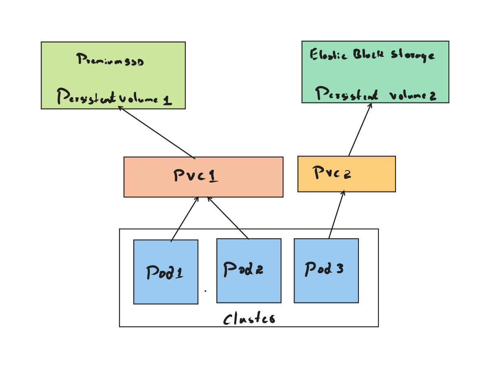

# Kubernetes Storage concepts

Applications that run on Kubernetes can be stateless or stateful. Kubernetes abstracts away persistent storage from ephemeral pods and containers. Kubernetes provides the ability to dynamically create storage resources. The Kubernetes storage architecture is based on volumes as the primary abstraction. Volumes are created and managed by Kubernetes. It is bound to pods and containers. Volumes are attached to the nodes where the pods and containers are running. Volumes are mounted to the containers and are bound to persistent storage. 

Kubernetes provides a structured way to manage persistent storage. It provides API's to manage persistent storage. It provides the following storage API objects

1. Volume: A volume is a container that is used to store data.
2. Persistent Volume: A persistent volume is a volume that is stored in the cluster.
3. Persistent Volume Claim: A persistent volume claim is a request for a persistent volume.
4. Storage Class: A storage class is a specification for a persistent volume.

Let us look at each of the above storage types in further detail.

## Volumes

Volumes are the fundamental abstraction of storage in kubernetes. A volume is a storage device exposed by a node that is accessible to containers on the node. Volumes are mounted into containers in a pod allowing containers to access storage as a local filesystem. It can be mounted as a read-only or read-write volume. A volume can be access by multiple containers in a pod. It can be mounted by more than one container in a pod allowing the pods to share data. A volume has an explicit lifetime that coincides with its pod. It is defined as part of the pod spec. When the pod is deleted access to the volume is removed but the data in the volume is not destroyed. There are different types of volumes. The full list of volume types is [here.](https://kubernetes.io/docs/concepts/storage/volumes/#types-of-volumes) There are many volume types for the various cloud environments, networked filesystems and various other needs. The configuration values for the volumes are dependent on the volume type. For example, an NFS volume would need to be configured with the NFS server location and the path.

To define a volume in kubernetes, we need to specify the type of volume and the volume name. `` emptyDir `` volume is the simplest type of volume. It creates an empty volume which can be used by the application running in the pod. By default, emptyDir volumes are persisted on the medium backing the node, either disk, SSD or network storage. A volume of type emptyDir  lasts for the lifetime of the Pod. It continues to exist even if the Container terminates and restarts. In the example below, I am creating a volume named scratchvolume of type emptyDir in lines 15-17. This volume is mounted in the pod by specifying the volume name in lines 11-13.

```yaml showLineNumbers
apiVersion: v1
kind: Pod
metadata:
  name: testpod
spec:
  volumes:
    - name: scratchvolume
      emptyDir: {}
  containers:
    - image: nginx
      imagePullPolicy: IfNotPresent
      name: samplecontainer
      volumeMounts:
        - mountPath: /scratch
          name: scratchvolume
  
```

Another example of a volume is a volume of type ConfigMap. A ConfigMap is a mechanism to inject application configuration data into pods. The data stored in the ConfigMap is mounted as a volume and is read using standard file I/O calls. Below is an example pod manifest with a configmap.

```yaml
apiVersion: v1
kind: Pod
metadata:
  name: configmap-pod
spec:
  volumes:
    - name: config-vol
      configMap:
        name: log-config
        items:
          - key: log_level
            path: log_level
  containers:
    - name: test
      image: busybox
      volumeMounts:
        - name: config-vol
          mountPath: /etc/config
```

## Storage Class

Applications workloads have varying storage needs. Some workloads require fast access to storage and some others may need to retain and backup data. A storage class is a Kubernetes object that provides the ability to define different types or class of storage. The type of the storage can be based on storage attributes such as storage speed, backup/retention policy, quality of service levels( premium vs standard disk) etc.A persistent volume can select the storage class when it is created. The storage class is defined in the storage class section of the persistent volume. 

We can use the below yaml to define a storage class in aws. This storage class uses the AWS EBS gp2 storage.

```yaml
kind: StorageClass
apiVersion: storage.k8s.io/v1
metadata:
  name: gp2
provisioner: ebs.csi.aws.com # Amazon EBS CSI driver
parameters:
  type: gp2
  encrypted: 'true' # EBS volumes will always be encrypted by default
volumeBindingMode: WaitForFirstConsumer # EBS volumes are AZ specific
reclaimPolicy: Delete
```

This is an example of defining a storage class in azure. This storage class uses the Azure premium managed disk. It also specifies that the underlying disk should be retained when the pod is deleted.

```yaml
apiVersion: storage.k8s.io/v1
kind: StorageClass
metadata:
  name: managed-premium-retain
provisioner: disk.csi.azure.com
parameters:
  skuName: Premium_LRS
reclaimPolicy: Retain
volumeBindingMode: WaitForFirstConsumer
allowVolumeExpansion: true
```

The ```provisioner``` assigned to the storage class takes care of provisioning the storage. The provisioner is responsible for creating the storage and assigning the PersistentVolume to the claim. Most Kubernetes providers come with a list of existing provisioners. The parameters defined in the StorageClass definition are passed to the provisioner and are specific to each provisioner plugin. The ```volumeBindingMode``` field specifies how the volume is bound to the pod. The default value is ```Immediate```. The ```WaitForFirstConsumer``` value indicates that the volume is bound to the pod when the first pod consumes the volume. The ```Immediate``` value indicates that the volume is bound to the pod when the pod is created. The ```reclaimPolicy``` indicates whether the persistent volume should be deleted or retained when the pod is deleted. The default value is ```Delete```. The ```Retain``` value indicates that the persistent volume should be retained when the pod is deleted. The ```allowVolumeExpansion``` field indicates whether the persistent volume can be expanded. 

## Persistent Volumes

Persistent volumes are storage resources provisioned ahead of time by the cluster administrator. Administrators can provision external storage and create persistent volumes specific to a cluster. Persistent volumes are backed by a storage medium such as a disk, SSD or network storage. Persistent volumes can be provisioned statically or dynamically.

```yaml
apiVersion: v1
kind: PersistentVolume
metadata:
  name: pv-azuredisk
spec:
  capacity:
    storage: 10Gi
  accessModes:
    - ReadWriteMany
  persistentVolumeReclaimPolicy: Retain
  storageClassName: managed-csi
  csi:
    driver: disk.csi.azure.com
    readOnly: false
    volumeHandle: /subscriptions/<subscriptionID>/resourceGroups/<resourceGroupID>/providers/Microsoft.Compute/disks/build_pipeline_disk
    volumeAttributes:
      fsType: ext4
```

Capacity is the size of this PersistentVolume. The persistentVolumeReclaimPolicy is used to define the behavior when a PersistentVolume is released. The default value is Retain. The value of Delete indicates that the PersistentVolume should be deleted when the claim is deleted. The value of Recycle indicates that the PersistentVolume should be recycled when the claim is deleted. The value of Retain indicates that the PersistentVolume should be retained when the claim is deleted.The accessModes field of a persistent volume is based on the capabilities of the underlying storage system in terms of simultaneous access on read-only or read/write mode. The accessModes are

* ReadWriteOnce (RWO) - The storage is accessible for read and write operations by a single client.
* ReadOnlyMany (ROX) - The storage is accessible for read-only operations, by several clients.
* ReadWriteMany (RWX) - The storage is accessible for read and write operations, by several clients.

## Persistent Volume Claims

A persistent volume claim is created by a developer and defines the storage needs of an application workload. The persistent volume claim is bound to a persistent volume by the Kubernetes control plane. The persistent volume claim is created in the namespace of the pod that is using the persistent volume. 
A PVC is both a request for storage and an identifier that establishes a claim on the storage once it’s granted. . A PVC requests access to a PV using one of the following access modes:

* ReadWriteOnce (RWO) - Read-write access by all pods on a single node
* ReadOnlyMany (ROX) - Read-only access by multiple nodes
* ReadWriteMany (RWX) - Read-write access by multiple nodes
* ReadWriteOncePod (RWOP) - Read-write access by a single pod only

This is an example of creating a persistent volume claim.


```yaml
apiVersion: v1
kind: PersistentVolumeClaim
metadata:
  name: mysql-pvc          # The claim will be used by a specific app.
spec:
  accessModes:                # The required access mode
    - ReadWriteOnce
  resources:
    requests:
      storage: 40Mi           # The amount of storage requested
  storageClassName: ""        # A blank class means a PV needs to exist.
```

The PVC spec includes an access mode, storage amount, and storage class. If no storage class is specified, Kubernetes tries to find an existing PV that matches the requirements in the claim. If there is a match, then the PVC is bound to the PV.

PVs and PVCs work together as follows:

* An application developer creates one or more PVCs describing the storage resources the application needs.
* The storage administrator can either create PVs explicitly in response, or create a StorageClass that can dynamically provision new PVs as needed.
* Kubernetes manages the binding of PVCs to PVs.

## Putting it all together



When a workload in pod1 requests storage, the associated persistent volume claim created by the developer is used to bind to a Persistent Volume. The Persistent Volume is now avaialbale to the workload running in that pod. 
