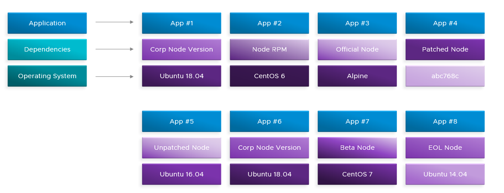
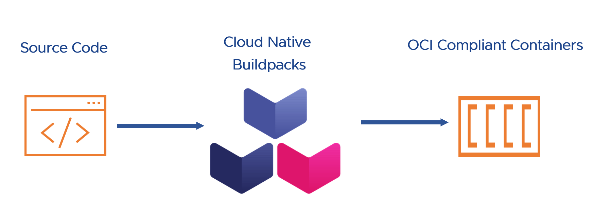
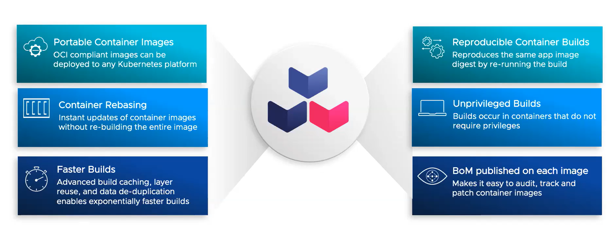
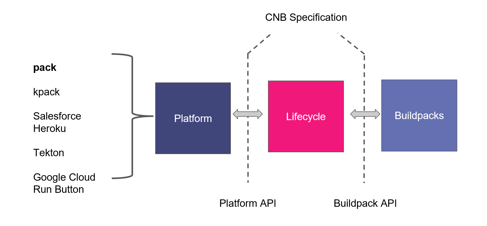
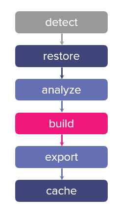
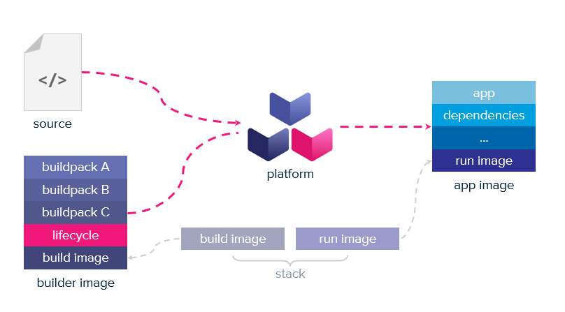

Container images are a popular and standard format to package applications. Container images bundle a program and its dependencies into a single artifact under a root filesystem. Container images are created according to the [Container Image Format (CIF)](https://github.com/opencontainers/image-spec/blob/main/spec.md) specification created by the Open Container Initiative (OCI). CIF is the container image format used by Docker, Kubernetes, and other container orchestration platforms.

A DockerFile is the most popular mechanism for building container images. It is a combination of the Dockerfile format and the Dockerfile syntax. Dockerfile is a text file that describes how to build a container image. It specifies a base image along with a series of instructions to execute on top of it. The instructions are written in a simple language that is similar to shell commands. The docker build engine processes  the docker file to produce container images that adhere to the OCI specification.

## DockerFile Challenges

An example of a very simple docker file to build a dotnet application is below

```
# Base image with specific version
FROM mcr.microsoft.com/dotnet/core/sdk:3.1 AS build-env

WORKDIR /app

# Copy csproj and restore dependencies
COPY *.csproj ./
RUN dotnet restore

# Copy everything else and build
COPY . ./
RUN dotnet publish -c Release -o out

# Runtime image
FROM mcr.microsoft.com/dotnet/core/aspnet:3.1
WORKDIR /app
COPY --from=build-env /app/out .

ENTRYPOINT ["dotnet", "YourApp.dll"]

```


This is a very simple dockerfile. It works fine and looks innocuous but has issues that can turn into larger problems at a later point in time. Some of these issues are 

- Manual Dependency Management: The Dockerfile explicitly defines base images and requires manual updates. Explicitly defined base images require you to constantly monitor and update them to patch any security issues, which might not be feasible in a fast-paced development environment. Human errors from manually creating Docker files can further make it hard.

- Non-Reproducible Builds: Using tags like latest or even version-specific tags (like 3.1 in .NET Core) can lead to non-reproducible builds. These tags might get updated to point to different images over time, meaning a build today might not be the same as a build tomorrow, even with the same Dockerfile.  

- Security Vulnerabilities: The Dockerfile does not handle security patches for base images or dependencies automatically. Security patches issued by vendors for CVE's are not automatically applied to the image. The docker engine used to generate the image is susceptible to vulnerabilities.

- Complexity and Maintenance: The Dockerfile requires knowledge of the .NET Core build process and maintenance. The creation of the docker file requires an implicit understanding how .NET Core builds and publishes applications. Operational concerns bleed into the development loop which is not ideal for the development team.

- Optimization: The Dockerfile does not inherently optimize for layer caching or image size. While the Dockerfile follows some best practices for layer caching and image size optimization, such as using multi-stage builds and separate COPY commands for dependencies, there are always opportunities for further optimization, especially in complex applications. An example of optimization might be to  choose a more minimal base image, if available and appropriate, to reduce the size further.

- Standardization: Different teams may use different patterns for Dockerfiles, leading to a lack of standardization. Each development team creates a Dockerfile for each deployable unit. The base images and included frameworks are different for each image. This makes it difficult to manage and maintain.

This problem get further excacerbated as teams across the organization create container images using docker files similar to above. 



Each container above is a separate image. The images package a node based application on Linux. Each image uses different Linux distributions and different versions of Linux distributions. The images also use different versions of the application's dependencies such as node. There is no standardization of the images. The images are not optimized for performance, they are not reproducible, they are not secure and the images are not optimized for operational concerns. A security vulnerability (CVE) in any of the base images or its dependencies will need the operations and the development teams to check all images for vulnerabilities and apply patches manually. This does not scale well and is prone to errors and issues.

## Cloud Native Buildpacks

A bunch of solutions emerged to help solve the issues above. [Cloud Native Buildpacks](https://buildpacks.io/) is one such solution.  Cloud native Buildpacks are the evolution of Heroku's Buildpacks released in 2011. Heroku and Pivotal collaborated to create the Cloud Native BuildPacks solution. Cloud Native Buildpacks are a set of tools that are used to build container images. It addresses the above issues by creating a standardized and automated process to build container images. Cloud Native Buildpacks produce container images that adhere to the OCI image specification and can run on any container platform. The images are optimized for performance, reproducibility, security and optimized for operational concerns. Cloud Native Buildpacks optimize packaging applications into container images, providing access to best-practice container image tooling with a streamlined developer experience.



Buildpacks provide a higher level of abstraction compared to Dockerfiles. It removes the need for the development teams to manually create container images using a Dockerfile. Cloud Native Buildpacks analyze the applications source code to determine the best buildpack to use and automatically produce a container image. It is language agnostic and can be used to build container images for applications developed using Java, .NET Core, Ruby, Node.js, Go, Python and others. Development teams can focus on the application and not worry about the details of the container image. It allows the platform operators to focus on runtime support and day 2 operations while developers can focus on the application code. It reduces the container construction burden allowing development teams to focus on code velocity. It provides the secops teams with a simplified path to security and compliance at scale. Buildpacks provide the following benefits

1. Removes the need for the development teams to manually create container images using a Dockerfile.
2. It is language agnostic and can be used to build container images for applications developed using Java, .NET Core, Ruby, Node.js, Go, Python and others.
3. Standardize and automate the process of creating container images.
4. Faster build times due to caching.
5. Reproducible image builds.
6. Improve security best practices at scale.
7. Fast base image upgrades by rebasing. This enables container base image upgrades without the need to rebuild the application.
8. Produces a Software Bill of Materials (SBOM) that can be used to track the software dependencies and versioning.




## What are Cloud Native Buildpacks?

Cloud Native Buildpacks was initiated by Pivotal and Heroku as a CNCF sandbox project in 2018. Google, Microsoft and others have also contributed to the project. The major components of Cloud Native Buildpacks are Platform, Lifecycle, Stacks and Buildpacks. It provides a well defined set of specifications for these components. These specifications enable multiple implementations of the platform and the buildpack contract to take source code and produce OCI compliant container images. This has enabled an ecosystem of providers building platforms and modular buildpacks for all scenarios. It also enables developers to build their own buildpacks and platforms.

The Buildpack API defines the contract that should be implemented by any BuildPack. The Cloud Native Buildpack project itself does not provide any buildpacks. The buildpacks are developed and maintained by the community primarily led by [Paketo](https://paketo.io/), [Google Cloud Platform](https://github.com/GoogleCloudPlatform/buildpacks), Heroku and others.

The platform makes Buildpack functionality available to end users and is generally used as a CLI tool, a cloud platform component or as part of a build pipeline. End users interact with the platform to use Buildpacks. The Pack CLI is a reference implementation of the platform API. It is used to create and manage buildpacks.  [Pack](), [Kpack](), [Tekton]() etc implement the Platform API to coordinate the execution of buildpacks using the lifecycle.

The lifecycle orchestrates the buildpacks and produces the final image. It runs through a series of steps to produce the final OCI compliant image described below.



### Buildpacks

A buildpack is a program that turns source code into a container image. A buildpack encapsulates all the toolchain necessary to create container images for a language ecosystem. There are buildpacks for Java, .NET Core, Ruby, Node.js, Go, Python and others. The buildpack contains scripts to identify the language and build the image. The buildpack is responsible for creating the container image. Buildpacks are grouped into collections called builders. Each buildpack in a builder will analyze the source code and determine if it should participate in the build process. The buildpack will be executed in the order in which it is listed in the builder.

A buildpack consists of four parts

1. buildpack.toml - The buildpack configuration file providing metadata about the buildpack.
2. package.toml - An optional configuration file that is ued to package the buildpack as a docker image.
3. detect - A script that is run to test if the buildpack should be used to build the application. If the tests pass the buildpack is selected and is used to build the application in the next step. For e.g A Java buildpack will test for the presence of .java or .jar files, a NPM buildpack will test for the presence of package.json file.
4. build - A script that builds the container image. It has the build and runtime dependencies. The script sets environmental variables, creates a layer containing the necessary binaries and adds application dependencies to the container image.

### Lifecycle



The lifecycle orchestrates buildpack execution. It then assembles the container image from the layers created by the buildpacks. The lifecycle consists of the following steps

1. Detect - This stage tests each group of buildpacks against the source. Finds an ordered group of buildpacks to use for the build step when the tests pass. The buildpacks are executed in the order in which they are listed in the builder. For e.g the Node buildpack may test for the existence of a package.json file, while the yarn buildpack may test for the existence of a yarn.lock file.
2. Restore - Restores any previously cached dependencies to optimize the build and export steps. The cache is local to the platform.
3. Analyze - Gathers metadata about previously built image. It is used during the export phase to avoid re-uploading unchanged layers.
4. Build - Builds the container image by executing the build function from each of the buildpacks selected in the detect phase.
5. Export - Creates the OCI image by assembling the layers created by the buildpacks. The layers are created in the order in which the buildpacks are executed.It combines information from the analyze phase to ensure that only changed layers are updated.
6. Cache - Caches the layers created by the buildpacks. These layers are retrieved during the restore phase of the next build.

### Platform

The role of the platform is to execute each lifecycle phase in order. It provides the environment where buildpacks execute, ensuring that they have the necessary resources and context to build the application. It orchestrates the lifecycle processes, providing the necessary context and resources. The platform invokes the lifecycle, passing in the source code and builder (which includes buildpacks and stack). It manages the outputs of the lifecycle, such as the container image, and may push it to a registry or deploy it. Platforms must comply with the CNB specifications to ensure they can correctly execute the lifecycle and utilize buildpacks. This compliance ensures that applications built using CNB are portable across different platforms that support CNB. Platforms generally provide feedback and logs from the lifecycle execution to the user, enabling monitoring and troubleshooting of the build process. Examples of platforms are Cloud Foundry, Heroku, Kubernetes with tools such as [Kpack]() or Tekton etc.

### Stack

The stack provides the build-time and the run-time environments in the form of images. Stacks ensure that the application is built and runs in consistent environments. This is crucial for predictability and debugging. A stack consists of the following components

1. Build image - The build image provides the base image from which the build environment is constructed. It contains the necessary tools and environments (like compilers, runtimes, libraries, etc.) required to compile or prepare your application. The build image is typically larger as it includes everything needed to build the application.
2. Run image - After the application is built, it needs an environment to run in. The run image provides this environment. It is usually a slimmed-down version of the build image, containing only the necessary components to run the application, which makes it more lightweight and secure.

By defining a clear boundary between build and run environments, stacks help in maintaining security. Regular updates to stack images can address security vulnerabilities. Organizations can create custom stacks that include specific operating systems and configurations tailored to their needs. The stack can be optimized for various factors like performance, size, and compliance with organizational standards. Stacks provide portability. Applications built on a particular stack can be easily moved between different environments (like development, testing, and production) that support the same stack.

## Creating a container image



The platform coordinates the creation of the container image. It executes the lifecycle phases in the order specified. The lifecycle runs its detect phase to identify the buildpack to be used. It then runs through the lifecycle steps to execute the build, cache the image layers and export the image. The lifecycle also uses the build and the run image stack as the base image for the application image.

## Building images with Pack

Pack is a command-line tool provided by the Cloud Native Buildpacks (CNB) project. It is designed to simplify the process of using buildpacks for building container images from source code. Developers can use pack to build container images locally on their machine. Pack makes it easier for developers to use buildpacks without needing deep knowledge of the underlying processes. It also allows developers to create custom builders, add buildpacks, and configure the build process if necessary.

Pack can be installed by following the instructions [here](https://buildpacks.io/docs/tools/pack/). Once pack has been installed we can use it to build and package applications into container images. Let us create a simple .Net core application and package it into a container image using pack. I will create a sample web api project as below. 

```bash
# Create a folder for project
mkdir weatherapi

# Create a sample .Net core application
dotnet new webapi

# Build the application to make sure there are no build errors
dotnet build
```

Let us now use pack to create a container image.

```bash
# Package the application into a container image
pack build weatherapi:0.1 --builder paketobuildpacks/builder:base
``` 

This command creates the application image using the paketobuildpacks/builder:base builder. A builder is an image that contains all the components necessary to execute a build. There are different builders from Paketo, Heroku, Google and others. This produces the below output. I have redacted the output to only include the needed information.  

```shell
base: Pulling from paketobuildpacks/builder
f96b7da34e6d: Pulling fs layer
c1d2444ef86c: Pulling fs layer
b02872305ff6: Pulling fs layer
081b556e652e: Waiting                                                                                            
327ee35261c4: Waiting                                                                                            
357fefdf9bc9: Waiting
.....
.....
Digest: sha256:c2a5de88935fb072e9d17f92acb293d4f08957967f3b9b2ad96d0a3c3f8d61fe
Status: Downloaded newer image for paketobuildpacks/builder:base
base-cnb: Pulling from paketobuildpacks/run
Digest: sha256:099a4fd96ffbc2a54d98594a99c1a1dbe6c2dc8e5cec60d0f45fcfcd7dd353d9
Status: Downloaded newer image for paketobuildpacks/run:base-cnb
===> ANALYZING
Previous image with name "weatherapi:0.1" not found
===> DETECTING
7 of 12 buildpacks participating
paketo-buildpacks/ca-certificates     3.1.0
paketo-buildpacks/dotnet-core-runtime 0.5.6
paketo-buildpacks/dotnet-core-aspnet  0.5.5
paketo-buildpacks/dotnet-core-sdk     0.5.7
paketo-buildpacks/icu                 0.1.1
paketo-buildpacks/dotnet-publish      0.7.0
paketo-buildpacks/dotnet-execute      0.8.1
===> RESTORING
===> BUILDING

Paketo CA Certificates Buildpack 3.1.0
.....
.....
.....
===> EXPORTING
Adding layer 'paketo-buildpacks/ca-certificates:helper'
Adding layer 'paketo-buildpacks/dotnet-core-runtime:dotnet-core-runtime'
Adding layer 'paketo-buildpacks/dotnet-core-aspnet:dotnet-core-aspnet'
Adding layer 'paketo-buildpacks/dotnet-core-sdk:dotnet-env-var'
Adding layer 'paketo-buildpacks/icu:icu'
Adding layer 'paketo-buildpacks/dotnet-execute:port-chooser'
Adding layer 'launch.sbom'
Adding 1/1 app layer(s)
Adding layer 'launcher'
Adding layer 'config'
Adding layer 'process-types'
Adding label 'io.buildpacks.lifecycle.metadata'
Adding label 'io.buildpacks.build.metadata'
Adding label 'io.buildpacks.project.metadata'
Setting default process type 'web'
Saving weatherapi:0.1...
*** Images (01d4df0163b9):
      weatherapi:0.1
Adding cache layer 'paketo-buildpacks/dotnet-core-runtime:dotnet-core-runtime'
Adding cache layer 'paketo-buildpacks/dotnet-core-aspnet:dotnet-core-aspnet'
Adding cache layer 'paketo-buildpacks/dotnet-core-sdk:dotnet-core-sdk'
Adding cache layer 'paketo-buildpacks/icu:icu'
Adding cache layer 'paketo-buildpacks/dotnet-publish:nuget-cache'
Successfully built image weatherapi:0.1
```

Pack downloads the build (paketobuildpacks/builder:base) and the run (paketobuildpacks/run:base-cnb) images. It then executes the Analyze, Detect, Restore, Build and Export lifecycle stages. The builder executes the analyze phase to check if the image was previously built. This is done so that it can use the cached layers from previous builds. This results in faster builds. It then runs the detect phase to identify the buildpacks needed to build the application. This phase identified 7 buildpacks that would be needed to build the application. The build phase is then executed. Each buildpack performs its build function to create the layers required to create the image. The build phase then creates the application image by combining the layers created by each buildpack. The build phase uses the run image stack as the base image to create the application image. We can check that the application image was created by running the following command.

```bash
# Check that the application image was created
docker images 
```

This command produces the following output indicating that the weatherapi:0.1 image has been built.

```shell
REPOSITORY                 TAG        IMAGE ID       CREATED         SIZE
paketobuildpacks/run       base-cnb   88b28b285df4   3 days ago      87.2MB
registry                   2          8948869ebfee   3 weeks ago     24.2MB
kindest/node               v1.19.7    62d6655a44bc   14 months ago   1.24GB
weatherapi                 0.1        0ff93b964b12   42 years ago    232MB
paketobuildpacks/builder   base       e1e22b936fd6   42 years ago    857MB
```

We can now run the application as below.

```bash
# Run the application
docker run -d -p 8080:8080 -e PORT=8080 weatherapi:0.1
```

We can check the application is running by running the following command. The application is running on port 8080 and generates random weather forecast readings.

```shell
curl http://localhost:8080/weatherforecast | jq
  % Total    % Received % Xferd  Average Speed   Time    Time     Time  Current
                                 Dload  Upload   Total   Spent    Left  Speed
100   501    0   501    0     0   6592      0 --:--:-- --:--:-- --:--:--  6592
[
  {
    "date": "2022-04-06T06:19:41.9398735+00:00",
    "temperatureC": 29,
    "temperatureF": 84,
    "summary": "Hot"
  },
  {
    "date": "2022-04-07T06:19:41.9406486+00:00",
    "temperatureC": 42,
    "temperatureF": 107,
    "summary": "Hot"
  },
  {
    "date": "2022-04-08T06:19:41.9406506+00:00",
    "temperatureC": -17,
    "temperatureF": 2,
    "summary": "Bracing"
  },
  {
    "date": "2022-04-09T06:19:41.9406508+00:00",
    "temperatureC": 44,
    "temperatureF": 111,
    "summary": "Mild"
  },
  {
    "date": "2022-04-10T06:19:41.9406509+00:00",
    "temperatureC": 46,
    "temperatureF": 114,
    "summary": "Sweltering"
  }
]

```

We can check the application image by running the following command.

```bash
# Check the application image
pack inspect weatherapi:0.1
```

This produces the following output with information about the image. We can identify the base and the run images used,  the buildpacks used to create the image and  the process types.

```shell

```shell
Inspecting image: weatherapi:0.1

REMOTE:
(not present)

LOCAL:

Stack: io.buildpacks.stacks.bionic

Base Image:
  Reference: 88b28b285df4397d4037cb89e66b8e776815c16ec856ae5bd5d1166222d8b441
  Top Layer: sha256:f5bd5d59c5c4f8e5b544e6e78f15b13fcb0b08d8c8064a25546e552fdc774c9e

Run Images:
  index.docker.io/paketobuildpacks/run:base-cnb
  gcr.io/paketo-buildpacks/run:base-cnb

Buildpacks:
  ID                                           VERSION        HOMEPAGE
  paketo-buildpacks/ca-certificates            3.1.0          https://github.com/paketo-buildpacks/ca-certificates
  paketo-buildpacks/dotnet-core-runtime        0.5.6          https://github.com/paketo-buildpacks/dotnet-core-runtime
  paketo-buildpacks/dotnet-core-aspnet         0.5.5          https://github.com/paketo-buildpacks/dotnet-core-aspnet
  paketo-buildpacks/dotnet-core-sdk            0.5.7          https://github.com/paketo-buildpacks/dotnet-core-sdk
  paketo-buildpacks/icu                        0.1.1          https://github.com/paketo-buildpacks/icu
  paketo-buildpacks/dotnet-publish             0.7.0          https://github.com/paketo-buildpacks/dotnet-publish
  paketo-buildpacks/dotnet-execute             0.8.1          https://github.com/paketo-buildpacks/dotnet-execute

Processes:
  TYPE                 SHELL        COMMAND        ARGS
  web (default)                     /workspace/weatherapi
  ```
  
## Rebasing the container image

We can rebase the container image to a new base image. This is useful when there is a security issue or a CVE with the current base image requiring a change in the base image. This is also useful if we want to update the base image to a newer version. We can rebase just the OS layer in the image without having to rebuild the application. For example, we can change the base image of the sample application from the current run image to another version of the image. Let us try and rebase the container image from the current base-cnb version to the 1.3.28-full-cnb image.

```bash
# Rebase the image to the 1.3.29-full-cnb image
pack rebase weatherapi:0.1 --run-image  paketobuildpacks/run:1.3.29-full-cnb
```

The above command pulls the layers needed to switch the container image to the 1.3.29 version. It then patches the container image with the new layers. The command produces this output to indicate a successful rebase of the image.

```shell
1.3.29-full-cnb: Pulling from paketobuildpacks/run
f96b7da34e6d: Already exists
ae83efb71859: Pull complete
2a8782654e49: Pull complete
9295f68ae444: Pull complete
Digest: sha256:6710ad7f7fdfbc3489fe2e535d2a5ee6653c9bb8437e6cc94508af05a86965fb
Status: Downloaded newer image for paketobuildpacks/run:1.3.29-full-cnb
Rebasing weatherapi:0.1 on run image paketobuildpacks/run:1.3.29-full-cnb
Saving weatherapi:0.1...
*** Images (1f6d9f0c2b50):
      weatherapi:0.1
Rebased Image: 1f6d9f0c2b504243169e49f30ecfe357914a3cc054fc89ae27744dc35612b2d6
Successfully rebased image weatherapi:0.1
```

This is an extremely powerful feature of the platform. It allows us to change the base image of the container without having to rebuild the application. Platform tools such as [Kpack]() have taken this further and allow us perform a rebase of all affected images.

## Generating a Software Bill of Materials (SBOM)

An SBOM is a list of all the software components that make up the application. It includes information about the libraries, plugins, extensions and other add-ons that the application depends on. It also includes version information for these components. We can use pack to generate an SBOM by running the following command.

```bash
# Generate an SBOM
pack sbom download weatherapi:0.1 --output-dir /sbom
```

The generated sbom is below

```json
{
  "Artifacts": [
    {
      "ID": "91e3bfd9933331fb",
      "Name": "helper",
      "Version": "3.1.0",
      "Type": "UnknownPackage",
      "FoundBy": "libpak",
      "Locations": [
        {
          "Path": "ca-certificates-helper"
        }
      ],
      "Licenses": [
        "Apache-2.0"
      ],
      "Language": "",
      "CPEs": [
        "cpe:2.3:a:paketo-buildpacks/ca-certificates:ca-certificates-helper:3.1.0:*:*:*:*:*:*:*"
      ],
      "PURL": "pkg:generic/paketo-buildpacks/ca-certificates@3.1.0"
    }
  ],
  "Source": {
    "Type": "directory",
    "Target": "/layers/paketo-buildpacks_ca-certificates/helper"
  },
  "Descriptor": {
    "Name": "syft",
    "Version": "0.32.0"
  },
  "Schema": {
    "Version": "1.1.0",
    "URL": "https://raw.githubusercontent.com/anchore/syft/main/schema/json/schema-1.1.0.json"
  }
}
```

Cloud native buildpacks are a natural evolution to creating container images. It allows for developers to focus on the development aspects and not worry about operational concerns leaking into the inner development loop. It allows the operators to define the build process and the application lifecycle. In the next post we will look at creating container images in a kubernetes cluster using [Kpack]().