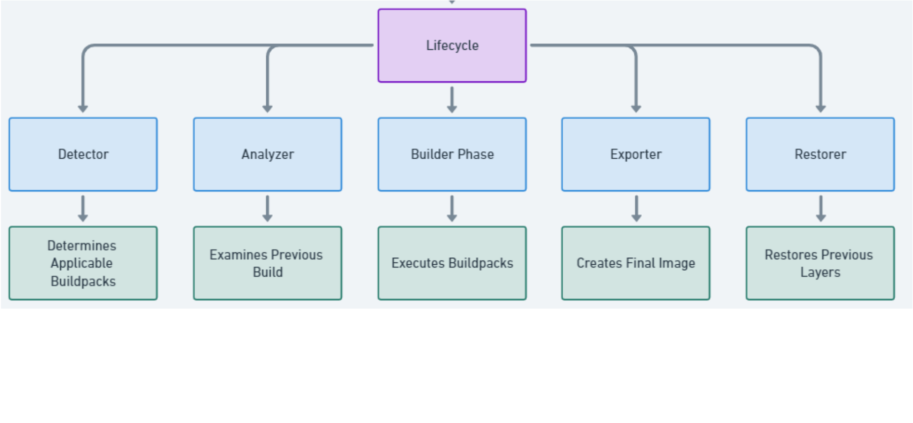

Container images are a popular and standard format to package applications. Container images bundle a program and its dependencies into a single artifact under a root filesystem. Container images are created according to the [Container Image Format (CIF)](https://github.com/opencontainers/image-spec/blob/main/spec.md) specification created by the Open Container Initiative (OCI). CIF is the container image format used by Docker, Kubernetes, and other container orchestration platforms.

A DockerFile is the most popular mechanism for building container images. It is a combination of the Dockerfile format and the Dockerfile syntax. Dockerfile is a text file that describes how to build a container image. It specifies a base image along with a series of instructions to execute on top of it. The instructions are written in a simple language that is similar to shell commands. The docker build engine processes  the docker file to produce container images that adhere to the OCI specification.

## DockerFile Challenges
However there are issues with using a Dockerfile to generate container images. The primary ones are

1. Each development team creates their own Dockerfile for each deployable unit. The base images and included frameworks are different for each image. This makes it difficult to manage and maintain.
2. Non standard docker files can create non reproducible builds. Examples are using the latest tag or using apt-get to install packages.
3. The image may not be optimized.
4. The image may not be secure. Security patches issued by vendors for CVE's are not automatically applied to the image.
5. The docker engine used to generate the image is susceptible to vulnerabilities.
6. Operational concerns bleed into the development loop which is not ideal for the development team.
7. Human errors from manually creating Docker files.

A simple example of the problem with development teams creating container images using docker files is below.

Each container above is a separate image. The images package a node based application on linux. Each image uses different linux distributions and different versions of linux distributions. The images also use different versions of the applications dependencies such as node. There is no standardization of the images. The images are not optimized for performance, they are not reproducible, they are not secure and the images are not optimized for operational concerns. A security vulnerability (CVE) in any of the base images or its dependencies will need the operations and the development teams to check all images for vulnerabilities and apply patches manually. This does not scale well and is prone to errors and issues.

## Cloudnative Buildpacks

A bunch of solutions emerged to help solve the issues above. [Cloud Native Buildpacks](https://buildpacks.io/) is one such solution.  Cloud native Buildpacks are the evolution of Heroku's Buildpacks released in 2011. Heroku and Pivotal collaborated together to create the Cloud Native BuildPacks solution. Cloud Native Buildpacks are a set of tools that are used to build container images. It addresses the above issues by creating a standardized and automated process to build container images. Cloud Native Buildpacks produce container images that adhere to the OCI image specification and can run on any container platform. The images are optimized for performance, reproducibility , security and optimized for operational concerns. Cloud Native Buildpacks optimize packaging applications into container images, providing access to best-practice container image tooling with a streamlined developer experience.

Buildpacks provide a higher-level of abstraction compared to Dockerfiles. It removes the need for the development teams to manually create container images using a Dockerfile. Cloud Native Buildpacks analyze the applications source code to determine the best buildpack to use and automatically produce a container image. It is language agnostic and can be used to build container images for applications developed using Java, .NET Core, Ruby, Node.js, Go, Python and others. Development teams can focus on the application and not worry about the details of the container image. It allows the platform operators to focus on runtime support and day 2 operations while developers can focus on the application code. It reduces the container construction burden allowing development teams to focus on code velocity. It provides the secops teams a simplified path to security and compliance at scale. Buildpacks provide the following benefits

1. Removes the need for the development teams to manually create container images using a Dockerfile.
2. It is language agnostic and can be used to build container images for applications developed using Java, .NET Core, Ruby, Node.js, Go, Python and others.
3. Standardize and automate the process of creating container images.
4. Improve security best practices at scale and runs unprivileged containers.
5. Reproducible image builds.
6. Faster build times due to caching.
7. Produces a Software Bill of Materials (SBOM) that can be used to track the software dependencies and versioning.

## What are Cloud Native Buildpacks?

Cloud Native Buildpacks was initiated by Pivotal and Heroku as a CNCF sandbox project in 2018. Google, Microsoft and others have also contributed to the project. The major components of Cloud Native Buildpacks are Platform, Lifecycle, Stacks and Buildpacks. It provides a well defined set of specifications for these components to enable an ecosystem of platforms and modular buildpacks. These specifications enable multiple implementations of the platform and the buildpack contract to take source code and produce OCI compliant container images.

The Buildpack API defines the contract that should be implemented by any BuildPack. The Cloud Native Buildpack project itself does not implement any buildpacks. The buildpacks are developed and maintained by the community primarily led by Paketo, Heroku, Google Cloud Platform and others.

The platform makes Buildpack functionality available to end users and is generally used as a CLI tool, cloud platform component or as part of a build pipeline. End users interact with the platform to use Buildpacks. The Pack CLI is a reference implementation of the platform API. It is used to create and manage buildpacks.  Pack, Kpack, Tekton templates etc implement the Platform API to coordinate the execution of buildpacks using the lifecycle.

The lifecycle orchestrates the buildpacks and produces the final image.

### Builder Component

The builder consists of components needed to execute a build process. It is an image that bundles all the bits and information needed to build and create an image. The builder component consists of

1. Buildpacks
2. Lifecycle
3. Stack 

#### Buildpacks

A buildpack is a program that turns source code into a container image. A buildpack encapsulates all the toolchain necessary to create container images for a language ecosystem. There are buildpacks for Java, .NET Core, Ruby, Node.js, Go, Python and others. The buildpack contains scripts to identify the language and build the image. The buildpack is responsible for creating the container image. Buildpacks are grouped into collections called builders. Each buildpack in a builder will analyze the source code and determine if it should participate in the build process. The buildpack will be executed in the order in which it is listed in the builder.

A buildpack consists of four parts

1. buildpack.toml - The buildpack configuration file providing metadata about the buildpack.
2. package.toml - An optional configuration file that is ued to package the buildpack as a docker image.
3. detect - A script that is run to test if the buildpack should be used to build the application. If the tests pass the buildpack is selected and is used to build the application in the next step.
4. build - A script that builds the container image. The script sets environmental variables, creates a layer containing the necessary binaries and adds application dependencies to the container image.

#### Lifecycle

The lifecycle orchestrates buildpack execution. It then assembles the container image from the layers created by the buildpacks. The lifecycle consists of the following steps

1. Detect - This stage tests each group of buildpacks against the source. Finds an ordered group of buildpacks to use for the build step when the tests pass. The buildpacks are executed in the order in which they are listed in the builder. For e.g the Node buildpack may test for the existence of a package.json file, while the yarn buildpack may test for the existence of a yarn.lock file.
2. Restore - Restores any previously cached dependencies to optimize the build and export steps. The cache is local to the platform.
3. Analyze - Gathers metadata about previously built image. It is used during the export phase to avoid re-uploading unchanged layers.
4. Build - Builds the container image by executing the build function from each of the buildpacks selected in the detect phase.
5. Export - Creates the OCI image by assembling the layers created by the buildpacks. The layers are created in the order in which the buildpacks are executed.It combines information from the analyze phase to ensure that only changed layers are updated.
6. Cache - Caches the layers created by the buildpacks. These layers are retrieved during the restore phase of the next build.

#### Stack

The stack provides the build-time and the run-time environments in the form of images. A stack consists of the following components

1. Build image - The build image provides the base image from which the build environment is constructed.
2. Run image - The run image provides the base image from which the application images are built.

### Platform

The role of the platform is to execute each lifecycle phase in order. Examples of platforms are Pack, Kpack, Tekton templates etc.