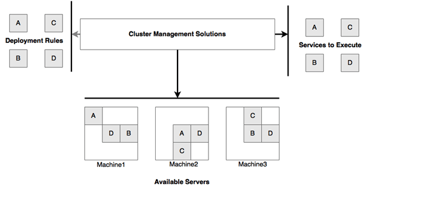

A single container provides application isolation and mobility. However, a container by itself doesn’t improve the quality of your service—for example, in terms of load balancing or failover. This is where multi-container solutions come into play. However managing a handful of containers is completely different from managing production-scale containers, which may number from hundreds to thousands. To support container management, we need an easy way of deploying and handling these containers at scale. This is where container orchestration. comes into play.

Container orchestration tools provide a layer of abstraction for developers and infrastructure teams to deal with large-scale containerized deployments. A container Orchestration system provides services such as provisioning, discovery, resource management, monitoring, and deployments.

### Container Orchestration Capabilities

A Container Orchestration system allows you to

- Automate activities such as allocation of containers in a transparent manner.
- Provide a layer of abstraction for deployment hiding details about the underlying machine and network infrastructure.
- Provide an option to set deployment rules and constraints.
- Provide a minimal management overhead.
- Maximize utilization of resources dynamically.

The key capabilities of the container orchestration software are

- Cluster management
- Deployments
- Scalability
- Health
- Infrastructure abstraction
- Resource optimizations
- Resource allocations
- Service availability
- Isolation

### Container Orchestration Tools

There are some well-known container orchestration tools available on the market, such as

- Docker swarm
- Apache Mesos/Marathon
- DC/OS
- Kubernetes

These orchestration tools enable us to connect multiple containers together. This usually involves service lookup using logical names via DNS. If multiple physical hosts are used, the framework resolves IP addresses over these nodes. Ideally an application running in a container just connects to an external system using a logical service name that is resolved by the container orchestration. The framework also provides for container configuration by dynamically injecting files or environment variables .Container orchestration makes it possible to increase the workload by scaling up the number of container instances.Developers can increase the configured number of container replicas dynamically and the orchestration framework implements this change by starting more container instances.

[Kubernetes](https://pradeeploganathan.com/kubernetes/kubernetes-concepts-pods/) is the most popular container orchestration product.. It is deployed as a service in most public cloud services, such as in Azure, GCP and AWS. In general, it provides the following features:

- Automated container placement: Automatically place containers on container hosts, to best spread the load between them.
- Pulling the images from the repository and instantiating the containers.
- Health monitoring of the containers.
- Self-healing: For failed containers, restarting them in a proper way.
- Horizontal scaling: Automated horizontal scaling (up and down) based on the load.
- Providing networking between containers so that they can access each other on different hosts
- Service discovery and load balancing: By providing IP-addresses to containers and managing DNS registrations.
- Rollout and rollback: Automated rollout and rollback for containers, which provides another self-healing feature as updated containers that are newly rolled-out are just rolled back if something goes wrong.
- Configuration management: By updating secrets and configurations without the need to fully rebuild the container itself.

## Cattle versus pets

The cattle versus pet analogy is generally attributed to [Jeffrey Snover](https://en.wikipedia.org/wiki/Jeffrey_Snover), ( Microsoft technical fellow). It generally implies that the Devops mindset should be focussed towards managing infrastructure as replaceable cattle rather than pets. Earlier, when systems were small, each server had a name. Developers and users knew exactly what software was running on each machine. Servers were treated like beloved pets. The servers had to be taken care of lovingly and diligently. If a server crashed or went down all hell broke loose. This does not scale well. In the Devops world, where you have a tens or hundreds of servers, you must start treating them like cattle. Container Orchestrators take the cattle approach to the extreme and deploy highly disposable containers across hundreds of nodes. This encourages you to think of infrastructure in the collective and not individually.

>   
> Photo by [Manuel Nägeli](https://unsplash.com/photos/7CcPLtywRso?utm_source=unsplash&utm_medium=referral&utm_content=creditCopyText) on [Unsplash](https://unsplash.com/search/photos/orchestra?utm_source=unsplash&utm_medium=referral&utm_content=creditCopyText)
