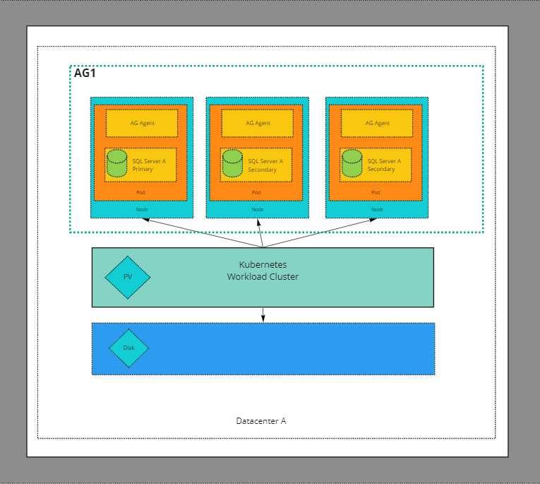
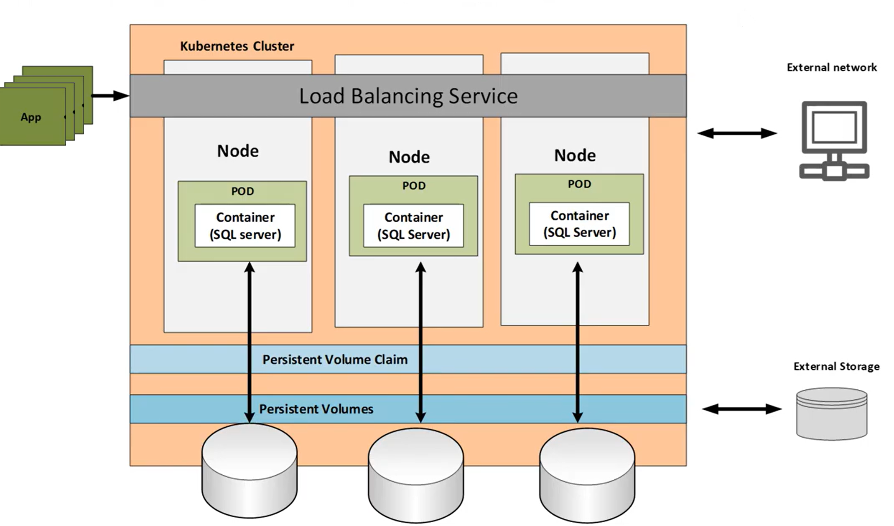

## Always On Availability Group

SQL Server Always On Availability Groups provide a flexible option for achieving high availability and fault tolerance at the database level. It provides options to recover from disasters and allows for greater access to data. Before SQL Server 2017, an Always On Availability Group required [Windows Server Failover Clustering (WSFC)](https://docs.microsoft.com/en-us/sql/sql-server/failover-clusters/windows/windows-server-failover-clustering-wsfc-with-sql-server?view=sql-server-ver15) when running on Windows and [Pacemaker](https://github.com/ClusterLabs/pacemaker)/[Corosync](https://github.com/corosync/corosync) when running on Linux. WSFC and Pacemaker are cluster managers which provide HA capabilities to the cluster where SQL server is deployed. On Windows clusters, WSFC monitors applications and resources. It automatically identifies and recovers from failure conditions. This capability provides great flexibility in managing the workload within a cluster and improves the overall availability of the system. WSFC has specific hardware and software compatibility requirements. Pacemaker and corosync are the most widely used clustering solution on Linux clusters. Corosync is a group communication system which provides specific guarantees about the total ordering of messages. It is responsible for messaging between nodes and ensures a consistent cluster state. Pacemaker is responsible for managing the resources on top of this cluster state. This is a highly scalable solution for high availability and disaster recovery on Linux.

## Read scale out

However, all of this complexity is unnecessary when the architecture demands read scale workloads. In read scale workloads, the availability of the database is not a primary concern. This enables us to not worry about the cluster failover and other requirements for HA and DR. Read-Scale-Out utilizes the additional capacity of read-only replicas instead of sharing the read-write or primary replica. This ensures that read-only workloads like reports, long-running queries, API queries etc, are isolated from the main read-write workload. It also provides a great opportunity for the database to scale out and scale in. It does provide limited DR capabilities using manual failover when the read-only replicas are configured using synchronous commit mode.

## Read Scale Availability Group

SQL Server 2017 introduced Read Scale Availability groups which can be deployed without the need for a cluster manager. This architecture provides read-scale only. It doesn’t provide high availability. A Read Scale AG consists of one or more databases that are replicated to one or more SQL Servers and are a unit of failover. The SQL Server where transactions originate is called a primary replica. A SQL Server receiving changes is called a secondary replica. The primary replica is the one that is used to store read/write data. The secondary replica is used to provide read-only access to the data. The primary replica is also used to store logs and other system data. SQL Server will capture transaction log changes on a Primary and transmit them over a separate communication channel (called a database mirroring endpoint) to the Secondary replica. On the Secondary replica, the changes are first hardened to the local transaction log and then separately any necessary redo recovery operations are applied. Failover from a primary server to a secondary server can be performed manually when required.A Read-Only AG can be used to load-balance read workloads, for maintenance jobs such as backups, and consistency checks on the secondary databases.

## Synchronization Options

Availability Groups offer two synchronization options to synchronize the secondary replicas with the primary replica.

1. Synchronous Commit mode : In Synchronous commit mode, a transaction on the primary replica will wait for the transaction to commit on the primary and for log records associated with the transaction to be hardened on the secondary replica.

2. Asynchronous Commit mode : In Asynchronous commit mode, a transaction on the primary replica will only wait for the transaction to be committed on the primary. It does not wait for transactions to be hardened on the secondary replica.

## SQL Server Availability Group buildout
 
We can build a SQL Server Availability Group on a Kubernetes cluster. The overall design of the build out is below. We are deploying 3 instances of sql server with one instance as primary with read/write and two secondaries as read replicas for read scale out. One of the replicas is synchronized concurrently with the primary replica. The other replica is asynchronously synchronized with the primary replica.


## Persistent Storage

Since we are deploying a stateful workload on kubernetes we need to define the necessary storage structures. The cluster needs to provision storage, the pods need to mount the storage provisioned as volumes and a request for the storage should be defined in the manifest as a persistent volume claim. We would need to create these before we can deploy SQL Server on kubernetes.

### Storage Class

Storage classes are the foundation for dynamic provisioning of storage. We need to setup a storage class to define the type of storage that the persistent volumes will use. The PersistentVolume provisioner will use the storage class defined  and provision storage accordingly. I am deploying the cluster on Tanzu Kubernetes Grid (TKG) and defining the corresponding storage class. The storage class definition is as follows:

```yaml
kind: StorageClass
apiVersion: storage.k8s.io/v1
metadata:
  name: sqlserver-sc-csi
  annotations:
    storageclass.kubernetes.io/is-default-class: "true"
provisioner: csi.vsphere.vmware.com
parameters:
  datastoreurl: "ds:///vmfs/volumes/619fcf62-6b2914d8-21ee-000e1e535170/"
```

We can now create this storage class in the kubernetes cluster as below.

```shell
kubectl apply -f storageclass.yaml
```

### Persistent Volumes

We need to create persistent volumes and persistent volume claims for the primary and secondary SQL Servers. The persistent volume will be created in the datastore that we have configured in the storage class. The size of the persistent volume in this example will be 8Gi. The persistent volume can be created in the namespace where the SQL Server is deployed. We need to create 3 persistent volumes for the primary and secondary SQL Servers as below.

The PVC for the primary SQL server can be created as below

```yaml
kind: PersistentVolumeClaim
apiVersion: v1
metadata:
  name: mssql-primary
  annotations:
    volume.beta.kubernetes.io/storage-class: sqlserver-sc-csi
spec:
  accessModes:
  - ReadWriteOnce
  resources:
    requests:
      storage: 8Gi
```

The PVC for the secondary SQL servers can be created as below

```yaml
kind: PersistentVolumeClaim
apiVersion: v1
metadata:
  name: mssql-secondary1
  annotations:
    volume.beta.kubernetes.io/storage-class: sqlserver-sc-csi
spec:
  accessModes:
  - ReadWriteOnce
  resources:
    requests:
      storage: 8Gi
```

The PVC for the additional secondary replica is below

```yaml
kind: PersistentVolumeClaim
apiVersion: v1
metadata:
  name: mssql-secondary2
  annotations:
    volume.beta.kubernetes.io/storage-class: sqlserver-sc-csi
spec:
  accessModes:
  - ReadWriteOnce
  resources:
    requests:
      storage: 8Gi
```

We can now create these persistent volume claims in the kubernetes cluster as below.

```shell
kubectl apply -f pvcprimary.yaml
kubectl apply -f pvcsecondary-one.yaml
kubectl apply -f pvcsecondary-two.yaml
```

We can confirm that the necessary persistent volumes have been created by using ```kubectl get pv```. I get the below output from ```kubectl get pv```

```shell
NAME                                       CAPACITY   ACCESS MODES   RECLAIM POLICY   STATUS   CLAIM                      STORAGECLASS       REASON   AGE
pvc-441cf08e-1d3d-41d6-b7ff-ab92c631a83d   8Gi        RWO            Delete           Bound    default/mssql-secondary2   sqlserver-sc-csi            2m1s
pvc-52a51d31-9aad-4885-8f23-5dfd25b997d5   8Gi        RWO            Delete           Bound    default/mssql-secondary1   sqlserver-sc-csi            6s
pvc-9cbe6b05-eaf0-45a2-b2c3-4038448e470c   8Gi        RWO            Delete           Bound    default/mssql-primary      sqlserver-sc-csi            4m40s
```

We can also confirm that the necessary persistent volume claims have been created by using ```kubectl get pvc```. I get the below output from ```kubectl get pvc```

```shell
NAME               STATUS   VOLUME                                     CAPACITY   ACCESS MODES   STORAGECLASS       AGE
mssql-primary      Bound    pvc-9cbe6b05-eaf0-45a2-b2c3-4038448e470c   8Gi        RWO            sqlserver-sc-csi   5m11s
mssql-secondary1   Bound    pvc-52a51d31-9aad-4885-8f23-5dfd25b997d5   8Gi        RWO            sqlserver-sc-csi   35s
mssql-secondary2   Bound    pvc-441cf08e-1d3d-41d6-b7ff-ab92c631a83d   8Gi        RWO            sqlserver-sc-csi   2m30s
```

## Secrets

The SQL Server credentials are stored as Kubernetes secrets. The secret is stored in the cluster and is referenced by the Sql Server deployment. This also ensures that the secret is not part of the deployment manifest. The secrets can be created in the namespace where the SQL Server is deployed. The secrets are created as below.

```shell
kubectl create secret generic mssql-secret --from-literal=SA_PASSWORD="MySQLP@ssw0rdF0rSQL"
```

We have now created all the necessary prerequisites for the SQL Server deployment. We can now deploy the SQL Server in the kubernetes cluster. We need to deploy a SQL Server instance configured as primary and two SQL Server instances configured as secondary read only replicas.

## Kubernetes deployments

### Primary SQL Server

We deploy the primary instance of SQL server as a kubernetes deployment and expose it using a Kubernetes service. The deployment manifest is below. I have highlighted the critical parts of the manifest.


apiVersion: apps/v1
kind: Deployment
metadata:
  name: mssqlag-primary-deployment
spec:
  replicas: 1
  selector:
    matchLabels:
      app: mssql-primary
  strategy:
    type: Recreate
  template:
    metadata:
      labels:
        app: mssql-primary
    spec:
      terminationGracePeriodSeconds: 10
      securityContext:
        fsGroup: 10001
      hostname: mssql-primary
      containers:
      - name: mssql-primary
        image: mcr.microsoft.com/mssql/server:2019-CU15-ubuntu-20.04
        ports:
         - containerPort: 1433
        env:
        - name: ACCEPT_EULA
          value: "Y"
        - name: MSSQL_PID
          value: "Developer"
        - name: MSSQL_ENABLE_HADR
          value: "1"
        - name: MSSQL_AGENT_ENABLED
          value: "true"
        - name: MSSQL_SA_PASSWORD
          valueFrom:
            secretKeyRef:
              name: mssql-secret
              key: SA_PASSWORD
        resources:
          limits:
            memory: 4G
        volumeMounts:
        - name: mssqldb
          mountPath: /var/opt/mssql
      volumes:
      - name: mssqldb
        persistentVolumeClaim:
          claimName: mssql-primary  
---
 # Create the load balancing service
apiVersion: v1
kind: Service
metadata:
  name: mssql-primary
spec:
  selector:
    app: mssql-primary
  ports:
    - name: sqlserver
      port: 1433
      targetPort: 1433
    - name: endpoint
      port: 5022
      targetPort: 5022
  type: LoadBalancer  



The key parts of this deployment manifest are

* On line 10, we specify the strategy type as recreate. This ensures that when we perform an upgrade Kubernetes will scale down the current version to zero before creating new pods and replicaset with the new version. This is essential since SQL Server maintains exclusive locks on files. This would cause the new pods to fail to start if the old pods were still using the files.
* On line 18, we specify the security context. The ```spec.securityContext.fsGroup``` property defines the group ID that will be configured as the group owner for any filesystem mounts in the pod.
* On line 20, we set the ```template.pod.spec.hostname``` property to ensure that we can set a persistent server name. If this is not set , the sql server instance will have a name with the structure DeploymentName-PodTemplateHash-PodID.
* On line 23, we specify the image to use. In this case we are deploying the 2019-CU15-ubuntu-20.04 image of SQL Server.
* On line 43, We are specifying a persistent volume at /var/opt/mssql. This is where the SQL Server database files will be stored. The volume is created using a persistent volume claim created earlier.

### Secondary SQl Servers

We are deploying two secondary replicas. The replicas are configured as read only replicas. The deployment is as below.

```yaml
apiVersion: apps/v1
kind: Deployment
metadata:
  name: mssqlag-secondary1-deployment
spec:
  replicas: 1
  selector:
    matchLabels:
      app: mssql-secondary1
  strategy:
    type: Recreate
  template:
    metadata:
      labels:
        app: mssql-secondary1
    spec:
      terminationGracePeriodSeconds: 30
      hostname: mssql-secondary1
      securityContext:
        fsGroup: 10001
      containers:
      - name: mssql-secondary1
        image: mcr.microsoft.com/mssql/server:2019-latest
        ports:
         - containerPort: 1433
        env:
        - name: ACCEPT_EULA
          value: "Y"
        - name: MSSQL_PID
          value: "Developer"
        - name: MSSQL_ENABLE_HADR
          value: "1"
        - name: MSSQL_AGENT_ENABLED
          value: "true"
        - name: MSSQL_SA_PASSWORD
          valueFrom:
            secretKeyRef:
              name: mssql-secret
              key: SA_PASSWORD  
        resources:
          limits:
            memory: 4G
        volumeMounts:
        - name: mssqldb
          mountPath: /var/opt/mssql
      volumes:
      - name: mssqldb
        persistentVolumeClaim:
          claimName: mssql-secondary1  
---
apiVersion: v1
kind: Service
metadata:
  name: mssql-secondary1
spec:
  selector:
    app: mssql-secondary1
  ports:
    - name: sqlserver
      port: 1433
      targetPort: 1433
    - name: endpoint
      port: 5022
      targetPort: 5022  
  type: LoadBalancer
```

The other read-ony replica is deployed as below

```yaml

apiVersion: apps/v1
kind: Deployment
metadata:
  name: mssqlag-secondary2-deployment
spec:
  replicas: 1
  selector:
    matchLabels:
      app: mssql-secondary2
  strategy:
    type: Recreate
  template:
    metadata:
      labels:
        app: mssql-secondary2
    spec:
      terminationGracePeriodSeconds: 10
      hostname: mssql-secondary2
      securityContext:
        fsGroup: 10001
      containers:
      - name: mssql-secondary2
        image: mcr.microsoft.com/mssql/server:2019-latest
        ports:
         - containerPort: 1433
        env:
        - name: ACCEPT_EULA
          value: "Y"
        - name: MSSQL_PID
          value: "Developer"
        - name: MSSQL_ENABLE_HADR
          value: "1"
        - name: MSSQL_AGENT_ENABLED
          value: "true"
        - name: MSSQL_SA_PASSWORD
          valueFrom:
            secretKeyRef:
              name: mssql-secret
              key: SA_PASSWORD
        resources:
          limits:
            memory: 4G
        volumeMounts:
        - name: mssqldb
          mountPath: /var/opt/mssql
      volumes:
      - name: mssqldb
        persistentVolumeClaim:
          claimName: mssql-secondary2  
---
apiVersion: v1
kind: Service
metadata:
  name: mssql-secondary2
spec:
  selector:
    app: mssql-secondary2
  ports:
    - name: sqlserver
      port: 1433
      targetPort: 1433
    - name: endpoint
      port: 5022
      targetPort: 5022
  type: LoadBalancer    

```

We have now created 3 instances of SQl Server configured with the necessary storage and security. We have also created a load balancer service to expose the necessary ports and endpoints. We are now ready to configure the deployed SQl Servers to form a read scale availability group.

We can confirm the overall cluster status using the tanzu command as below
```shell
$ tanzu cluster list
NAME           NAMESPACE  STATUS   CONTROLPLANE  WORKERS  KUBERNETES        ROLES   PLAN  
tkg-cluster-1  default    running  1/1           3/3      v1.20.5+vmware.2  <none>  dev 
```

This confirms that the cluster is running and has 3 nodes. We can also see that is is running Kubernetes version 1.20. We can also get information about the nodes, pods and services created.

```shell
# Get the status of the nodes, pods and service
$kubectl get all
NAME                                                 READY   STATUS    RESTARTS   AGE
pod/mssqlag-primary-deployment-77b8974bb9-666jb      1/1     Running   0          5m35s
pod/mssqlag-secondary1-deployment-74695cf469-bp24w   1/1     Running   0          3m52s
pod/mssqlag-secondary2-deployment-5ff7f7cfc7-k7wmk   1/1     Running   0          2m7s

NAME                       TYPE           CLUSTER-IP       EXTERNAL-IP     PORT(S)                         AGE
service/kubernetes         ClusterIP      100.64.0.1       <none>          443/TCP                         73d
service/mssql-primary      LoadBalancer   100.68.57.227    10.212.155.7    1433:30560/TCP,5022:31107/TCP   5m36s
service/mssql-secondary1   LoadBalancer   100.64.197.92    10.212.155.9    1433:31694/TCP,5022:31966/TCP   3m52s
service/mssql-secondary2   LoadBalancer   100.67.125.230   10.212.155.10   1433:32079/TCP,5022:31416/TCP   2m7s

NAME                                            READY   UP-TO-DATE   AVAILABLE   AGE
deployment.apps/mssqlag-primary-deployment      1/1     1            1           5m36s
deployment.apps/mssqlag-secondary1-deployment   1/1     1            1           3m52s
deployment.apps/mssqlag-secondary2-deployment   1/1     1            1           2m7s

NAME                                                       DESIRED   CURRENT   READY   AGE
replicaset.apps/mssqlag-primary-deployment-77b8974bb9      1         1         1       5m35s
replicaset.apps/mssqlag-secondary1-deployment-74695cf469   1         1         1       3m52s
replicaset.apps/mssqlag-secondary2-deployment-5ff7f7cfc7   1         1         1       2m7s

```

A graphical representation of the cluster with the persistent volumes and volume claims is shown below


## Configuring the Read Scale Availability Group

### Configuring the Primary SQL Server

We can now get started on creating the Availability group. To create an availability group named K8sAG, We need to perform the following steps on the sql server instance that we plan to use as the primary.

1. Create a database in full AG mode
2. The next step is to take a full backup of all databases that will be part of the availability group. We will not be able to add them to an Availability Group until this has been done.
3. Create logins for AG members.
4. Create a master key and certificate.
5. Copy the master key and certificate to the same directory on secondary replicas.
6. Create AG endpoint on port 5022 for data mirroring and specify the certificate for authentication.
7. Create Availability Group with name K8sAG , cluster type as none and specify the members of the Availability group.
8. Add database created above to the AG

The SQl script to perform all these steps is below

```sql
-- Create AG test database
USE [master]
GO
CREATE DATABASE SQLTestAG
GO
USE [SQLTestAG]
GO
CREATE TABLE Customers([CustomerID] int NOT NULL, [CustomerName] varchar(30) NOT NULL)
GO
INSERT INTO Customers (CustomerID, CustomerName) VALUES ((30,'Petstore CO'),(90,'adatum corp'),(130,'adventureworks'))


-- Change DB recovery model to Full and take full backup
ALTER DATABASE [SQLTestAG] SET RECOVERY FULL ;
GO
BACKUP DATABASE [SQLTestAG] TO  DISK = N'/var/opt/mssql/backup/SQLTestAG.bak' WITH NOFORMAT, NOINIT,  NAME = N'SQLTestAG-Full Database Backup', SKIP, NOREWIND, NOUNLOAD,  STATS = 10
GO
USE [master]
GO


--create logins for AG
CREATE LOGIN ag_login WITH PASSWORD = 'Welcome@0001234567';
CREATE USER ag_user FOR LOGIN ag_login;


-- Create a master key and certificate
CREATE MASTER KEY ENCRYPTION BY PASSWORD = 'Welcome@0001234567';
GO
CREATE CERTIFICATE ag_certificate WITH SUBJECT = 'ag_certificate';


-- Copy these two files to the same directory on secondary replicas
BACKUP CERTIFICATE ag_certificate
TO FILE = '/var/opt/mssql/ag_certificate.cert'
WITH PRIVATE KEY (
        FILE = '/var/opt/mssql/ag_certificate.key',
        ENCRYPTION BY PASSWORD = 'Welcome@0001234567'
    );
GO


-- Create AG endpoint on port 5022
CREATE ENDPOINT [AG_endpoint]
STATE=STARTED
AS TCP (
    LISTENER_PORT = 5022,
    LISTENER_IP = ALL
)
FOR DATA_MIRRORING (
    ROLE = ALL,
    AUTHENTICATION = CERTIFICATE ag_certificate,
    ENCRYPTION = REQUIRED ALGORITHM AES
)


--Create AG primary replica
CREATE AVAILABILITY GROUP [K8sAG]
WITH (
    CLUSTER_TYPE = NONE
)
FOR REPLICA ON
N'mssql-primary' WITH
(
    ENDPOINT_URL = N'tcp://mssql-primary:5022',
    AVAILABILITY_MODE = SYNCHRONOUS_COMMIT,
    SEEDING_MODE = AUTOMATIC,
    FAILOVER_MODE = MANUAL,
    SECONDARY_ROLE (ALLOW_CONNECTIONS = ALL)
),
N'mssql-secondary1' WITH
(
    ENDPOINT_URL = N'tcp://mssql-secondary1:5022',
    AVAILABILITY_MODE = SYNCHRONOUS_COMMIT,
    SEEDING_MODE = AUTOMATIC,
    FAILOVER_MODE = MANUAL,
    SECONDARY_ROLE (ALLOW_CONNECTIONS = ALL)
),
N'mssql-secondary2' WITH
(
    ENDPOINT_URL = N'tcp://mssql-secondary2:5022',
    AVAILABILITY_MODE = ASYNCHRONOUS_COMMIT,
    SEEDING_MODE = AUTOMATIC,
    FAILOVER_MODE = MANUAL,
    SECONDARY_ROLE (ALLOW_CONNECTIONS = ALL)
);

-- Add database to AG
USE [master]
GO
ALTER AVAILABILITY GROUP [K8sAG] ADD DATABASE [SQLTestAG]
GO
```

This sets up the Availability Group and links together all the SQL servers in the Availability group.We need to copy the certificate and the key to the secondary instances. We can use the kubectl to copy the files to the secondary instances as below

```shell
# save the pod names for primary, secondary-one & secondary-two in variables
podagp=$(kubectl get pods -l app=mssql-primary -o json | jq -r '.items[0].metadata.name')
podags1=$(kubectl get pods -l app=mssql-secondary1 -o json | jq -r '.items[0].metadata.name')
podags2=$(kubectl get pods -l app=mssql-secondary2 -o json | jq -r '.items[0].metadata.name')

#set the paths to the certificate and the key yo a variable
PathToCopyCert=${podagp}":var/opt/mssql/ag_certificate.cert"
PathToCopyCertKey=${podagp}":var/opt/mssql/ag_certificate.key"

# First copy to local
kubectl cp $PathToCopyCert ag_certificate.cert
kubectl cp $PathToCopyCertKey ag_certificate.key

# Copy the certificate from local host to secondary1

kubectl cp ag_certificate.cert  $podags1:var/opt/mssql
kubectl cp ag_certificate.key  $podags1:var/opt/mssql

# Next copy to secondary2

kubectl cp ag_certificate.cert $podags2:var/opt/mssql
kubectl cp ag_certificate.key $podags2:var/opt/mssql
```

This copies the certificate and the key to the secondary instances.

### Configuring the Secondary SQL Servers

Now that we have configured the primary replica, we need to configure the secondary replicas. We need to perform the following steps on the secondary replicas.

1. Create login for AG. It should match the password from the primary script 
2. Create the certificate using the certificate file created in the primary node
3. Create AG endpoint
4. Add node to the availability group

The below SQL script performs all these steps on one of the secondary replica.

```sql
--Add_Secondary1
USE [master]
GO


--Create login for AG
-- It should match the password from the primary script
CREATE LOGIN ag_login WITH PASSWORD = 'Welcome@0001234567';
CREATE USER ag_user FOR LOGIN ag_login;


-- Create the certificate using the certificate file created in the primary node
CREATE MASTER KEY ENCRYPTION BY PASSWORD = 'Welcome@0001234567';
GO
-- Create from copied cert - the password must match the primary 
CREATE CERTIFICATE ag_certificate
    AUTHORIZATION ag_user
    FROM FILE = '/var/opt/mssql/ag_certificate.cert'
    WITH PRIVATE KEY (
    FILE = '/var/opt/mssql/ag_certificate.key',
    DECRYPTION BY PASSWORD = 'Welcome@0001234567'
)
GO


--create HADR endpoint
CREATE ENDPOINT [AG_endpoint]
STATE=STARTED
AS TCP (
    LISTENER_PORT = 5022,
    LISTENER_IP = ALL
)
FOR DATA_MIRRORING (
    ROLE = ALL,
    AUTHENTICATION = CERTIFICATE ag_certificate,
    ENCRYPTION = REQUIRED ALGORITHM AES
)
GRANT CONNECT ON ENDPOINT::AG_endpoint TO [ag_login];
GO


--add current node to the availability group
ALTER AVAILABILITY GROUP [K8sAG] JOIN WITH (CLUSTER_TYPE = NONE)
ALTER AVAILABILITY GROUP [K8sAG] GRANT CREATE ANY DATABASE
GO
```
We need to perform the same steps as above on the other secondary replica.

```sql
--Add_Secondary2
USE [master]
GO


--Create login for AG
-- it should match the password from the primary script
CREATE LOGIN ag_login WITH PASSWORD = 'Welcome@0001234567';
CREATE USER ag_user FOR LOGIN ag_login;
-- create certificate
-- this time, create the certificate using the certificate file created in the primary node
CREATE MASTER KEY ENCRYPTION BY PASSWORD = 'Welcome@0001234567';
GO
-- Create the certificate using the certificate file created in the primary node
CREATE CERTIFICATE ag_certificate
    AUTHORIZATION ag_user
    FROM FILE = '/var/opt/mssql/ag_certificate.cert'
    WITH PRIVATE KEY (
    FILE = '/var/opt/mssql/ag_certificate.key',
    DECRYPTION BY PASSWORD = 'Welcome@0001234567'
)
GO


--create HADR endpoint
CREATE ENDPOINT [AG_endpoint]
STATE=STARTED
AS TCP (
    LISTENER_PORT = 5022,
    LISTENER_IP = ALL
)
FOR DATA_MIRRORING (
    ROLE = ALL,
    AUTHENTICATION = CERTIFICATE ag_certificate,
    ENCRYPTION = REQUIRED ALGORITHM AES
)
GRANT CONNECT ON ENDPOINT::AG_endpoint TO [ag_login];
GO


--add current node to the availability group
ALTER AVAILABILITY GROUP [K8sAG] JOIN WITH (CLUSTER_TYPE = NONE)
ALTER AVAILABILITY GROUP [K8sAG] GRANT CREATE ANY DATABASE
GO
```

This setups up the Availability group on the sql server instances and links them all together in a synchronous commit mode with manual failover.

I used sqlcmd utility to connect and run the above sql scripts.

```shell
# Connect to primary and create the AG
sqlcmd  -S $ip1 -U sa -P "MySQLP@ssw0rdF0rSQL"-i AG1-Primary-CreateandAdd.sql

# Associate the AG on one of the secondary instances
sqlcmd -S $ip2 -U sa -P "MySQLP@ssw0rdF0rSQL" -i AG2-Secondary-CreateandAdd.sql

# Perform the above steps on the other instance of the secondary
sqlcmd -S $ip3 -U sa -P "MySQLP@ssw0rdF0rSQL" -i AG3-Secondary-CreateandAdd.sql
```

## Availability Group Verification

The above steps created 3 instances of SQl Server in a Kubernetes cluster and configured them to be part of an availability group. We can now verify that the instances are part of the same availability group by querying the ```sys.dm_hadr_availability_replica_cluster_nodes``` dynamic management view (DMV).

```sql
sqlcmd -S $ip1 -U sa -P "MySQLP@ssw0rdF0r@zure" -Q "select * from sys.dm_hadr_availability_replica_cluster_nodes" -y 30 -Y 30
```

This DMV returns a row for every availability replica of the AlwaysOn availability group. The output of this command is below


group_name                     replica_server_name            node_name                     
------------------------------ ------------------------------ ------------------------------
K8sAG                          mssql-primary                  mssql-primary                 
K8sAG                          mssql-secondary1               mssql-secondary1              
K8sAG                          mssql-secondary2               mssql-secondary2    


This confirms that we have crated an availability group named K8sAG which has 3 replicas mssql-primary, mssql-secondary1 and mssql-secondary2. Any data inserted into the primary replica will be replicated to the other two replicas. We can confirm that the replica state of the database on primary by querying the ```sys.dm_hadr_database_replica_states``` DMV.

```sql
/*    Collect local database replica states    */
SELECT cs.[database_name], 'database_replica', rs.synchronization_health
FROM sys.dm_hadr_database_replica_states rs
join sys.dm_hadr_database_replica_cluster_states cs ON rs.replica_id = cs.replica_id and rs.group_database_id = cs.group_database_id
WHERE rs.is_local = 1
```

This query confirms the synchronization health of a database on the primary across the secondaries and produces the following output indicating that the primary is replicated to 2 replicas as configured.

```sql
----------------------------------------------------------------------------------------------------------------------
database_name	(No column name)	synchronization_health
SQLTestAG	    database_replica	2
```

We can also query the overall synchronization health of the availability group K8sAG by querying the ```sys.dm_hadr_availability_group_states``` DMV.

```sql
SELECT ag.[name], 'availability_group', gs.synchronization_health
FROM sys.dm_hadr_availability_group_states gs
join sys.availability_groups_cluster ag ON gs.group_id = ag.group_id
WHERE gs.primary_replica = 'mssql-primary'
```

This query produces the below output indicating that the AG named K8sAG is replicated to 2 replicas as configured.

```sql
----------------------------------------------------------------------------------------------------------------------
name	  (No column name)	  synchronization_health
K8sAG    availability_group	   2
```

We can also query the ```sys.availability_replicas``` table for information about the replicas configured

```sql
Select replica_server_name, endpoint_url, availability_mode_desc from sys.availability_replicas
replica_server_name	  endpoint_url	              availability_mode_desc
----------------------------------------------------------------------------------------------------------------------
mssql-primary	        tcp://mssql-primary:5022	  SYNCHRONOUS_COMMIT
mssql-secondary1	    tcp://mssql-secondary1:5022	SYNCHRONOUS_COMMIT
mssql-secondary2	    tcp://mssql-secondary2:5022	ASYNCHRONOUS_COMMIT
```
## Data Synchronization

We now have a fully configured read scale availability group setup on a Kubernetes cluster. We can now insert data into the primary replica and verify that it is replicated to the secondaries. Let us create a table on the primary replica and insert some data.

```sql
#Insert 10000 records into the table
INSERT INTO AG_Test
(
 ID,
 RandomData
)
VALUES
(
 NEWID(),
 CONVERT(VARCHAR(50), NEWID())
);
GO 10000
```

We inserted 10,000 records in the AG_Test table in the primary replica. We can now verify that the data is replicated to the secondaries by querying the count of records on the table in the secondaries.

```sql
#in Secondary one records are synced
Select count(*) from AG_Test
(No column name)
10000

#in Secondary two records are synced
Select count(*) from AG_Test
(No column name)
10000
```

Additionally we can also confirm that the secondary replicas are readonly by trying to insert records into the secondary replicas.

```sql
## secondaries are readonly
INSERT INTO AG_Test
(
 ID,
 RandomData
)
VALUES
(
 NEWID(),
 CONVERT(VARCHAR(50), NEWID())
);
Started executing query at Line 39
Msg 3906, Level 16, State 2, Line 1
Failed to update database "SQLTestAG" because the database is read-only.
Total execution time: 00:00:00.021
```

This confirms that any data inserted into the primary replica is replicated to the secondaries.

## Synchronous commit performance

Since we have setup the Availability group for synchronous commit any transaction on the primary will wait on the synchronized secondary databases to harden the log before it is committed to the primary. This wait type is expected for synchronous-commit Availability Groups and indicates the time to send, write, and acknowledge log commit to the secondary databases. We can query the ```sys.dm_os_wait_stats``` DMV to get metrics on the wait time.

```sql
# waiting_tasks_count and wait_time_ms. Both columns represent the number of commands and the wait time respectively taken to commit on secondary and acknowledge on the primary.
sqlcmd -S $ip1 -U sa -P "MySQLP@ssw0rdF0rSQL" -Q "SELECT * FROM sys.dm_os_wait_stats WHERE wait_type = 'HADR_SYNC_COMMIT';" -y 30 -Y 30
wait_type                      waiting_tasks_count  wait_time_ms         max_wait_time_ms     signal_wait_time_ms 
------------------------------ -------------------- -------------------- -------------------- --------------------
HADR_SYNC_COMMIT                                 56                  679                  207                   12
```

The average wait time for sync commit is wait_time_ms/waiting_tasks_count and can be calculated as below

```shell
$sqlcmd -S $ip1 -U sa -P "MySQLP@ssw0rdF0rSQL" -Q "select 679/56 as 'average wait time'"
average wait time
-----------------
    12
```

## Availability Group failover

We need to first check if the secondary replica is ready for failover using the below sql command. The ```sys.dm_hadr_database_replica_cluster_states``` DMV returns information about the health of the availability databases in the always on availability group. If the ```is_failover_ready``` bit is set to 1 then the secondary is synchronized and ready to failover.

```sql
SELECT is_failover_ready
FROM sys.dm_hadr_database_replica_cluster_states
WHERE replica_id = (SELECT replica_id FROM sys.availability_replicas WHERE replica_server_name = 'mssql-secondary1')

is_failover_ready
------------------
1
```

We can failover from the primary replica to the secondary replica by issuing the following command.

```sql
ALTER AVAILABILITY GROUP K8sAG  FORCE_FAILOVER_ALLOW_DATA_LOSS
----------------------------------------------------------------------------------------------------------------------
10:59:58 AMStarted executing query at Line 9
Commands completed successfully.
Total execution time: 00:00:00.282
```

Now the failover is complete and the primary replica is no longer available. We can confirm this by running the query that we ran earlier to confirm that the primary was up and synchronizing with the secondaries

```sql
SELECT ag.[name], 'availability_group', gs.synchronization_health
FROM sys.dm_hadr_availability_group_states gs
join sys.availability_groups_cluster ag ON gs.group_id = ag.group_id
WHERE gs.primary_replica = 'mssql-primary'
```

This query returns empty indicating that the primary is down and not synchronizing.  However if we run this query for the secondary we can see that the secondary is up but not synchronizing.

```sql
name    (No column name)    synchronization_health
K8sAG   availability_group  0
```

The secondary is also now in read/write mode.

```sql
## secondaries are readonly
INSERT INTO AG_Test
(
 ID,
 RandomData
)
VALUES
(
 NEWID(),
 CONVERT(VARCHAR(50), NEWID())
);
--------------------------------------------------
11:46:30 AMStarted executing query at Line 52
(1 row affected)
Total execution time: 00:00:00.190
```


## Conclusion

 

 In this post we have run through the steps required to setup a read scale an availability group on a Kubernetes cluster. We have ensured that the availability group synchronizes data and the secondary replicas can be used to scale reads. This enables the primary to perform better since the read load is distributed across the secondaries. A lot of workloads perform multiple reads and few writes and this is a huge performance boost for any workload. We have also completed a failover to a secondary and ensured that the data integrity is maintained. 