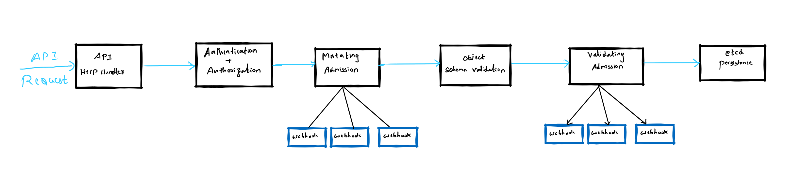

The Kubernetes API server is the gateway to the Kubernetes cluster. The Kubernetes API server implements a RESTful API over HTTP. It performs all API operations and is responsible for storing API objects into a persistent backend store (etcd). All communications and operations between external clients, such as kubectl and the control plane components are translated into RESTful API calls handled by the API server. All interactions between the control plane components also occur through the API server. The API server is stateless and designed to scale horizontally.

## Kubernetes HTTP Request flow



The above diagram depicts a simplified Kubernetes API request lifecycle. When the API server is called the request goes through the Authentication, Authorization and Admission control stages.  
The authentication components are responsible for authenticating the client sending the request. The API server supports different authentication methods such as HTTP basic auth, bearer token, client certificates etc. Authentication has plugin extensions that can support different authentication providers such as Azure AD, OIDC etc. If authentication is successful, the request is passed along to the authorization components. The authorization components determine if the user has the necessary privileges to perform the requested action. This determines, for example, if the user can create deployments, list pods etc. Authorization is also pluggable and multiple authorization modules can be configured. However, if any authorization module approves or denies the request the response is returned immediately to the caller. If the request is authenticated and authorized successfully, it is passed on to the admission controllers.

## Admission Controllers

Admission controllers provide extension points that augment Kubernetes functionality. Admission controllers determine if the request is well-formed and approve or reject the API request. The admission controllers can potentially apply modifications to the request before it is processed. Admission controllers simply accept or deny Kubernetes resource API requests. It is important to know that they only act on create, update, delete, or proxy requests. These controllers cannot mutate or change requests to list resources. Several admission controllers are built into the Kubernetes API server. These are compiled and shipped with the kube-apiserver binary and can be enabled selectively by administrators. The list of built-in admission controllers is in the Kubernetes documentation [here.](https://kubernetes.io/docs/reference/access-authn-authz/admission-controllers/#what-does-each-admission-controller-do) These admission controllers perform specific actions on specific object types. For example, the [LimitRanger](https://kubernetes.io/docs/concepts/policy/limit-range/) admission controller sets default limits for Pods that do not have specified limits based on the constraints specified in the LimitRange object of the namespace. Another example is the [AlwaysPullImages](https://kubernetes.io/docs/reference/access-authn-authz/admission-controllers/#alwayspullimages) admission controller, which sets the ImagePullPolicy of every pod to AlwaysPullImages. These built-in admission controllers may be enabled or disabled depending on the Kubernetes version. Cloud providers such as AWS, Azure and Google may also enable or disable some of these admission controllers on their managed Kubernetes offerings. Admission controllers can be enabled by the cluster administrator using –admission-control-config-file or the –enable-admission-plugins parameters.

```shell
> kube-apiserver --enable-admission-plugins
```

Admission controllers follow a two-step process. The first phase is the mutating phase, where changes are made to the resource requests. The second phase is the validating phase where the resource requests are validated. If a request is disallowed during the validating phase the entire request gets rejected and error messages are generated to indicate the cause of the failure.

## Types of admission controllers

There are two types of admission controllers

* Mutating admission controllers.
* Validating admission controllers.

Let us take a look at them in detail.

### Mutating admission controllers

Mutating admission controllers take in Kubernetes resource specifications and return an updated resource specification. They modify the resource attributes before they are passed into subsequent phases. They also perform side-effect calculations or make external calls (in the case of custom admission controllers).

An example of a mutating admission controller is the [ServiceAccount](https://kubernetes.io/docs/reference/access-authn-authz/service-accounts-admin/) admission controller. This admission controller acts whenever a request to create or update a pod is submitted. If the pod does not have a service account, it adds the field and sets it to the default service account for the namespace. It adds imagepullsecrets and a volume mounted at /var/run/secrets/kubernetes.io/serviceaccount to allow the pod to access its service account token.

#### Using a mutating admission controller

Let us add a mutating admission controller to the pipeline and mutate an incoming request. As described earlier, we can see how the AlwaysPullImages admission controller modifies an incoming request to specify that the image should always be pulled. To demonstrate this, we can create a kind cluster and add the necessary admission controllers in addition to the default. I have used the enable-admission-plugins section to specify the admission controllers that would be needed. The kind cluster definition is below

```yaml
kind: Cluster
apiVersion: kind.x-k8s.io/v1alpha4
name: pradeepl-cluster
nodes:
- role: control-plane
  kubeadmConfigPatches:
  - |
    kind: ClusterConfiguration
    apiServer:
        extraArgs:
          enable-admission-plugins: AlwaysPullImages,NamespaceLifecycle,LimitRanger,ServiceAccount,DefaultStorageClass,DefaultTolerationSeconds,MutatingAdmissionWebhook,ValidatingAdmissionWebhook,ResourceQuota
- role: worker
- role: worker
```

We can use the above cluster definition to create a cluster. The cluster created will have the admission controllers we specified.

```shell
> kind create cluster --config Kind-cluster.yaml
Creating cluster "pradeepl-cluster" ...
 ✓ Ensuring node image (kindest/node:v1.21.1) 🖼 
 ✓ Preparing nodes 📦 📦 📦  
 ✓ Writing configuration 📜 
 ✓ Starting control-plane 🕹️ 
 ✓ Installing CNI 🔌 
 ✓ Installing StorageClass 💾 
 ✓ Joining worker nodes 🚜 
Set kubectl context to "kind-pradeepl-cluster"
You can now use your cluster with:

kubectl cluster-info --context kind-pradeepl-cluster

Not sure what to do next? 😅  Check out https://kind.sigs.k8s.io/docs/user/quick-start/
```

Now, let us create a pod specification and use the ngnix image to create containers. More importantly let us specify the imagePullPolicy as “IfNotPresent”. The Pod spec is below.

```yaml
apiVersion: v1
kind: Pod
metadata:
  name: test-image-pull-policy
spec:
  containers:
    - name: nginx
      image: nginx:1.21.4
      imagePullPolicy: IfNotPresent
```

We can now create the necessary namespace and apply the pod manifest.

```shell
> kubectl create ns testimgpullpolicy-ns 

namespace/testimgpullpolicy-ns created

> kubectl apply -f PodManifest.yaml -n testimgpullpolicy-ns
pod/test-image-pull-policy created
```

The AlwaysPullImages admission controller should mutate the above pod definition to always pull images rather than pull only if not present. We can check if the pod spec was mutated to apply this by printing the persisted pod specification.

```shell
> kubectl get po -n testimgpullpolicy-ns -o yaml
```

I am listing only a fragment of the persisted pod specification below. We can see that the imagePullPolicy has been changed to Always.

```yaml
apiVersion: v1
items:
- apiVersion: v1
  kind: Pod
  metadata:
    annotations:
      kubectl.kubernetes.io/last-applied-configuration: |
        {"apiVersion":"v1","kind":"Pod","metadata":{"annotations":{},"name":"test-image-pull-policy","namespace":"testimgpullpolicy-ns"},"spec":{"containers":[{"image":"nginx:1.21.4","imagePullPolicy":"IfNotPresent","name":"nginx"}]}}
    creationTimestamp: "2021-12-21T21:12:40Z"
    name: test-image-pull-policy
    namespace: testimgpullpolicy-ns
    resourceVersion: "995"
    uid: 59b1b27e-6f43-4951-9764-0a68a9ee33f8
  spec:
    containers:
    - image: nginx:1.21.4
      imagePullPolicy: Always
      name: nginx
      resources: {}
```

Mutating admission controllers ensure that operational policies are implemented on any new object creation or object update requests. This ensures that configuration drift can be controlled using an automated process.

### Validating admission controllers

Validating controllers admit or reject a request. They do not modify a request. E.g., the [NamespaceLifeCycle](https://kubernetes.io/docs/reference/access-authn-authz/admission-controllers/#namespacelifecycle) admission controller ensures new object creation requests cannot be made in a namespace that is terminating or non-existent. It also ensures that Kubernetes native namespaces cannot be deleted.

#### Using a validating admission controller

Let us see how we can use a validating admission controller to validate and accept or reject object creation/update requests. The LimitRanges admission controller can be used to set the maximum and minimum limits on CPU, RAM and storage requests within a namespace at the object level. Let us create a LimitRange that defines a minimum and maximum memory allocation. Let us specify a minimum limit of 256 MB and a maximum limit of 512 MB using the below yaml definition.

```yaml
apiVersion: v1
kind: LimitRange
metadata:
  name: mem-limit-range
spec:
  limits:
  - max:
      memory: 512Mi
    min:
      memory: 256Mi
    type: Container
```

We can apply this limit to a specific namespace. Let us create a namespace and apply the above limit to the namespace.

```shell
> kubectl create namespace default-mem-example
namespace/default-mem-example created

> kubectl apply -f memory-default.yaml --namespace=default-mem-example
limitrange/mem-limit-range created
```

If we now, try to create a pod with memory size of more than the maximum limit or less than the minimum limit the request will be rejected. Let us try this by creating a pod definition as below

```yaml
apiVersion: v1
kind: Pod
metadata:
  name: default-mem-demo-2
spec:
  containers:
  - name: default-mem-demo-2-ctr
    image: nginx
    resources:
      limits:
        memory: "2Gi"
```

The above pod definition tries to create a pod with a memory request size of 2 GB which is above the maximum limits specified. If we try and create this pod , the LimitRanges admission controller will validate the request and reject it as below

```shell
> kubectl apply -f memory-default-2gi.yaml --namespace=default-mem-example
Error from server (Forbidden): error when creating "memory-default-2gi.yaml": pods"default-mem-demo-2" is forbidden: maximum memory usage per Container is 512Mi, but limit is 2Gi
```

As expected, the LimitRanges admission controller prevented the creation of this pod as its memory requirements violated the memory limits set for the namespace.

## Why use Admission Controllers

Admission controllers are a key component of the Kubernetes request lifecycle. They offer several advantages

* Admission controllers evaluate requests and enforce fine-grained rules. RBAC based authentication and authorization controls operate on identities and actions. Admission controllers offer controls at the object and namespace level.
* Admission controllers can be used to inject sidecars into pods dynamically. These sidecars can be used for logging, secrets management, providing service mesh capabilities etc.
* Admission controllers can be used to validate configuration and prevent configuration drift. This helps in preventing resource misconfiguration and resource management.
* Admission controllers enable policy-based security rules. It can be used to disallow containers from running with root privileges, prevent containers from pulling images from unauthorized sources etc.

## Dynamic Admission Controllers

Admission controllers are compiled and distributed with the Kubernetes API server. Kubernetes provides a bunch of admission controllers out of the box. However, they do not provide all the necessary functionality that organizations may need to implement custom policies. They could only be configured when the API server was started either through the –enable-admission-plugins flag or the –admission-control-config-file. Cluster admins did not have an option to add or remove controllers dynamically at a later point in time. Dynamic admission controllers were built to solve this problem. They were released in version 1.17. A dynamic admission controller is an HTTP application that processes admissions requests. It can be deployed as a service in the cluster or can be deployed outside the cluster. Some cloud providers host dynamic admission controllers in their Function-As-A-Service(FAAS) offering. The API server connects to it through the Kubernetes service object or an arbitrary URL.

The current default set of admission controllers includes two dynamic admission controllers namely, [validating admission webhook](https://kubernetes.io/docs/reference/access-authn-authz/admission-controllers/#validatingadmissionwebhook) and [mutating admission webhook](https://kubernetes.io/docs/reference/access-authn-authz/admission-controllers/#mutatingadmissionwebhook). These allow developers to customize admission logic on create, update, and delete actions performed on any resource. They can be developed as extensions and run as webhooks which can be configured at runtime. Mutating admission webhooks are invoked first and can modify requests. After all, modifications are complete, the validating admission webhooks are invoked to either accept or reject the request. We will look at building dynamic admission controllers in a subsequent post.

## Conclusion

Admission controllers are a key component of the admission process performed by the Kubernetes API server. They enable fine-grained control over the object creation, update, and deletion process. They are extensible using admission webhooks enabling developers to build custom admission logic.
