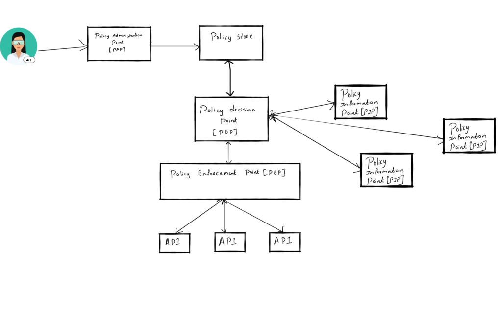
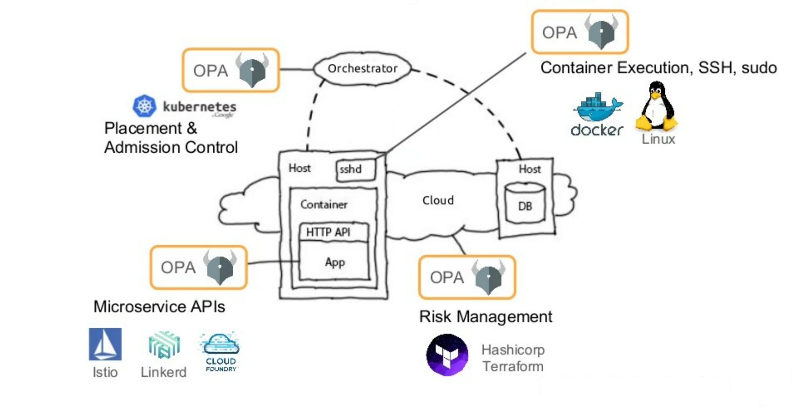
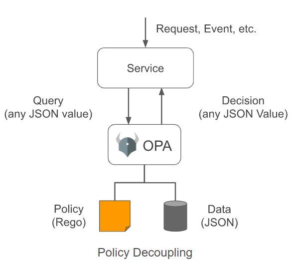

The [Open Policy Agent (OPA)](https://www.cncf.io/projects/open-policy-agent-opa/) is an open-source engine to author declarative policies as code and use those policies as a component of the decision-making process. OPA started off in 2016 as an open-source project by Styra, with the goal of unifying policy enforcement across heterogeneous technology stacks. OPA provides a high-level declarative language ‘Rego’ to author policy as code. Declaring policies as code allows us to persist them in source control and version them.

A policy is used to enforce and audit an organization’s rules and standards. Policies provide the means to ensure that all resources are compliant and remain compliant with the organizations’ rules throughout their life cycle. Rules and policy enforcement are essential for every Kubernetes cluster. Policies are used to define the range of behaviors allowed on a cluster and are essential in securing a cluster. Traditionally, applications define policies that can only be enforced and administered by proprietary mechanisms. Any new requirements, customizations or modifications to the authorization model would require an update to the code by the application’s developers. With multiple applications in an enterprise, the administration of these proprietary authorization policies tends to become time-consuming and error prone. It is difficult, in some cases impossible to audit and report against user entitlements across all these applications. Government regulations such as Sarbanes-Oxley mandate the ability to report and review user entitlements across an enterprise.

A modern approach to resolve this is to enable entitlement externalization. Entitlement externalization separates the authorization logic from the business logic within an application. This enables authorization policies to change without any change to the application code. The following services enable externalization of authorization entitlement.

1. Policy Administration Point (PAP) – Administrators use the PAP to author policies. This is a design-time activity.
2. Policy Enforcement Point (PEP) – The PEP triggers entitlement policy decisions.
3. Policy Decision Point (PDP) – The PDP provides the actual entitlement decision. The PDP applies a set of policies to the request to determine an allow or deny outcome.
4. Policy Information Point (PIP) – The PIP supplies additional data and information to the PDP to make entitlement decisions.



Entitlement Externalization – Services

OPA follows a similar architecture. OPA accepts structured data as input (JSON) and returns either a decision (true/false) or arbitrary structured data as output. The calling application can utilize OPA by receiving the result and deciding the way to proceed (making a policy decision). OPA is agnostic to API and data schemas. OPA can dynamically evaluate JSON-formatted data from any source.

OPA can be used to define and enforce policies across microservices components, CI/CD pipelines, API gateways et al. OPA is utilized for several use cases like authorizing terraform based infrastructure changes, REST API authorization etc. OPA is additionally used for Kubernetes policy enforcement as an Admission Controller. Many enterprises use OPA to fulfil the above use cases. Chef uses OPA to bake in IAM capabilities in their [Chef automate product](https://www.youtube.com/watch?v=jrrW855xL3s). Netflix uses OPA to regulate access to its API resources. Other than Netflix, Cloudflare, Pinterest, Intuit, Capital One, State Street, and many others use OPA as a policy definition and enforcement tool. OPA became a CNCF sandbox project in 2018 and graduated from CMCF in February 2021.



Add fine grained policy management to multiple projects

## Benefits of OPA

Using OPA provides the following benefits

* Authoring policies as code enables the enforcement of standard development lifecycle with PRs, CI, etc. for policies.
* It allows policies to be managed in a source code repository providing versioning and history.
* It allows for unit testing parts of the policy allowing for faster iterative policy development.
* OPA works with JSON input. This allows it to integrate with any tool that produces JSON.
* OPA integrates with many provides across the eco system enabling standardization of the policy ecosystem across many toolsets.

## OPA Architecture



Image source : <https://www.openpolicyagent.org/docs/>

OPA is comprised of three components – the HTTP listener, the policy engine, and the database. The database used by OPA is in memory and ephemeral. It doesn’t persist information used to make policy decisions. On the one hand, this makes OPA very scalable since it is an authorization microservice. On the other hand, this means that every instance of OPA must be maintained on its own and must be kept coordinated with authoritative data

Now that we have a very high-level understanding of the OPA architecture, let us jump into install it and run it through its paces.

## Installing OPA

OPA can be installed by downloading the latest release from their [github page](https://github.com/open-policy-agent/opa/) as below. I move it to my path as it makes it easier to use it.

```console
#download opa
❯ curl -L -o opa https://github.com/open-policy-agent/opa/releases/download/v0.35.0/opa_linux_amd64
% Total    % Received % Xferd  Average Speed   Time    Time     Time  Current
                                     Dload  Upload   Total   Spent    Left  Speed
100   652  100   652    0     0   1852      0 --:--:-- --:--:-- --:--:--  1847
100 46.2M  100 46.2M    0     0  6275k      0  0:00:07  0:00:07 --:--:-- 10.4M
#change mode to execute permisson
❯ sudo chmod +x ./opa 
#move to path
❯ sudo mv ./opa /usr/local/bin/opa 
```

You can now check to see if OPA is installed by checking its version

```console
#check opa version
❯ opa version
Version: 0.35.0
Build Commit: a54537a
Build Timestamp: 2021-12-01T02:11:19Z
Build Hostname: 7e15c2339707
Go Version: go1.17.3
WebAssembly: available
```

The latest build as of writing this blog was 0.35.0

## Running OPA

OPA can be used either in an interactive shell mode or can be run as a server. OPA run will start an interactive shell. We can use this interactive shell to experiment and build prototypes.

```console
 ❯ opa run
 OPA 0.35.0 (commit a54537a, built at 2021-12-01T02:11:19Z)
 
 Run 'help' to see a list of commands and check for updates.
 
 > true
 true
 > RamanujanRadical := 2.747
 Rule 'RamanujanRadical' defined in package repl. Type 'show' to see rules.
 > show
 package repl
 
 RamanujanRadical := 2.747
 >
 ```

We can run OPA as a server using the –server flag as below.

```console
#run opa in server mode which runs it in the browser
> opa run --server
{"addrs":[":8181"],"diagnostic-addrs":[],"level":"info","msg":"Initializing server.","time":"2021-12-13T10:23:4310:00"}
{"client_addr":"[::1]:55636","level":"info","msg":"Received request.","req_id":1,"req_method":"GET","req_path":"/",time":"2021-12-13T10:23:58+10:00"}
{"client_addr":"[::1]:55636","level":"info","msg":"Sent response.","req_id":1,"req_method":"GET","req_path":"/",resp_bytes":1391,"resp_duration":1.520571,"resp_status":200,"time":"2021-12-13T10:23:58+10:00"}
{"client_addr":"[::1]:55636","level":"info","msg":"Received request.","req_id":2,"req_method":"GET","req_path":"/avicon.ico","time":"2021-12-13T10:23:58+10:00"}
{"client_addr":"[::1]:55636","level":"info","msg":"Sent response.","req_id":2,"req_method":"GET","req_path":"/avicon.ico","resp_bytes":19,"resp_duration":0.15327,"resp_status":404,"time":"2021-12-13T10:23:58+10:00"}
```

This starts a server which runs by default at port 8181. We can use this to build policies and test them.


## OPA Server

You can also run OPA in a docker container as below

```console
#run opa in a docker container
❯ docker run -p 8181:8181 openpolicyagent/opa run --server --log-level debug
Unable to find image 'openpolicyagent/opa:latest' locally
latest: Pulling from openpolicyagent/opa
e8614d09b7be: Pull complete
c6f4d1a13b69: Pull complete
a1f1879bb7de: Pull complete
a05d3ed52cd6: Pull complete
Digest: sha256:785532b5ffa4073e24322c5d2d2067ba01ceed6a31934bb1c7f7af9d257dd415
Status: Downloaded newer image for openpolicyagent/opa:latest
{"addrs":[":8181"],"diagnostic-addrs":[],"level":"info","msg":"Initializing server.","time":"2021-12-13T00:54:49Z"}
{"level":"debug","msg":"maxprocs: Leaving GOMAXPROCS=4: CPU quota undefined","time":"2021-12-13T00:54:49Z"}
{"headers":{"Content-Type":["application/json"],"User-Agent":["Open Policy Agent/0.35.0 (linux, amd64)"]},level":"debug","method":"POST","msg":"Sending request.","time":"2021-12-13T00:54:49Z","url":"https://telemetry.openpolicyagent.org/v1/version"}
```

This runs the OPA server in the docker container..

```console
❯ curl http://localhost:8181

 \_\_\_\_\_\_\_\_      \_\_\_\_\_\_\_\_    \_\_\_\_\_\_\_\_
|\\   \_\_  \\    |\\   \_\_  \\  |\\   \_\_  \\
\\ \\  \\|\\  \\   \\ \\  \\|\\  \\ \\ \\  \\|\\  \\
 \\ \\  \\\\\\  \\   \\ \\   \_\_\_\_\\ \\ \\   \_\_  \\
  \\ \\  \\\\\\  \\   \\ \\  \\\_\_\_|  \\ \\  \\ \\  \\
   \\ \\\_\_\_\_\_\_\_\\   \\ \\\_\_\\      \\ \\\_\_\\ \\\_\_\\
    \\|\_\_\_\_\_\_\_|    \\|\_\_|       \\|\_\_|\\|\_\_|

Open Policy Agent – An open source project to policy-enable your service.  
Version: 0.35.0  
Build Commit: a54537a  
Build Timestamp: 2021-12-01T02:11:19Z  
Build Hostname: 7e15c2339707  
Query:  
Input Data (JSON):  
Submit
```

## REGO

Rego is the declarative query language used by Open Policy Agent. It is a Domain Specific Language (DSL) created specifically for OPA and is used as the policy language in the OPA engine. Rego is not designed to be a general-purpose programming language. Rego is designed to evaluate policy and is streamlined for this specific purpose. It is highly specialized for querying and performing logic operations over data structures. This approach results in a lean syntax but can be difficult to start with for beginners.

## OPA Hello World Policy

Let us now create a simple hello world policy to put OPA through its paces. Let us assume we have a http authorization policy on a website. This policy demands that users can only access their own home page on a website. Access to the home page is indicated by the http method Get on the /home/<profile\_id> path. We can implement this by checking if the profile\_id in the http path is the same as the logged in user when a HTTP GET is executed. This can be expressed as a simple policy in a rego file as below.

```console
package http.authz

default allow = false

allow {
    some profile_id
    input.method = "GET"
    input.path = ["home", profile_id]
    input.user == profile_id
}
```

In the above rego file we declare a package http.authz. We default the policy to return a false. We then check the profile\_id in the input path against the user passed in. The corresponding json which will be input to this policy is

```json
{
    "user" : "pradeep",
    "method" : "GET",
    "path" : [
        "home",
        "pradeep"
    ]
}
```

Now we can evaluate the input json against the defined policy using OPA as below

```console
#evaluate with input json. Input json specifies that pradeep is trying access his home page which is valid
❯ opa eval --data helloworld.rego --input input.json "data.http.authz.allow"
{
  "result": [
    {
      "expressions": [
        {
          "value": true,
          "text": "data.http.authz.allow",
          "location": {
            "row": 1,
            "col": 1
          }
        }
      ]
    }
  ]
}
```

This evaluates to true as can be seen above since the user and the profile\_id in the path is the same. Now, let us change the logged in user to Bob and see what happens when Bob tries to access /home/pradeep. Let us change the input json as below

```json
{
    "user" : "bob",
    "method" : "GET",
    "path" : [
        "home",
        "pradeep"
    ]
}
```

When we run OPA to evaluate the input json against the policy now, it will evaluate to false as below. OPA evaluates that policy that Bob should not be able to access the home page of another user and returns the appropriate response. How this policy will be enforced is not OPA’s concern.

```console
#evaluate with input json. Input json specifies that bob is trying access the home page of a different user which s not valid
❯ opa eval --data helloworld.rego --input input.json "data.http.authz.allow"
{
  "result": [
    {
      "expressions": [
        {
          "value": false,
          "text": "data.http.authz.allow",
          "location": {
            "row": 1,
            "col": 1
          }
        }
      ]
    }
  ]
}
```

We can also pretty print the above output by using the –format pretty flag. This is an example of a remarkably simple OPA policy being used to check a HTTP request. More complex policies can be built and also against any tooling that generates JSON output.

## Unit Testing

OPA allows for expressing policies as code. We can now source control policies and implement Continuous integration to allow for rapid iterative development. As part of CI/CD OPA allows for creating unit tests. OPA has first class support for Unit testing via the OPA test command.

Let us create a simple test for the policy that we created above to ensure that it returns true when the policies conditions are met and returns false otherwise. To create a test, we need to author a Rego file with a series of rules prefixed with test\_. Each rule starting with that prefix defines a separate test

```javascript
package http.authz

test_get_user_allowed {
    allow with input as {"user": "pradeep", "method": "GET", "path":["home", "pradeep"] }
}

test_get_another_user_denied {
    not allow with input as {"user": "bob", "method": "GET", "path":["home", "pradeep"] }
}
```

We have defined two unit tests above. The first test runs through a positive test case and the second one runs through a negative test case. In the first test the user pradeep is accessing his home page and should be allowed as indicated by the allow keyword. In the second test case user bob is trying to access pradeep’s home page and the policy should not allow the operation as indicated by the not allow keyword. We can run the above tests to see if OPA enforces the policies as designed.

```console
❯ opa test . -v
data.http.authz.test_get_user_allowed: PASS (380ns)
data.http.authz.test_get_another_user_denied: PASS (247ns)
--------------------------------------------------------------------------------
PASS: 2/2
```

As we can see both the tests above pass as they are valid. Thus, OPA provides the ability to create policies as code, source control policies, unit test them etc.

## OPA in Kubernetes

In the Kubernetes world OPA is used along with Gatekeeper to author, implement, enforce, and audit policies. OPA fits well in the Kubernetes ecosystem as a lightweight authorization engine. While OPA was not primarily targeted at the Kubernetes ecosystem, it has a strong place in the ecosystem now. OPA is an amazing tool to build dynamic admission controllers and there are extensive resources and existing policies that can be used to start your policy library. OPA has a strong partner in the Gatekeeper project to amplify its effectiveness. As an example, the OPA policy below is used to prevent Kubernetes services being created with a NodePort.

```yaml
apiVersion: templates.gatekeeper.sh/v1beta1
kind: ConstraintTemplate
metadata:
  name: k8sblocknodeport
  annotations:
    description: >-
      Disallows all Services with type NodePort.
      https://kubernetes.io/docs/concepts/services-networking/service/#nodeport
spec:
  crd:
    spec:
      names:
        kind: K8sBlockNodePort
  targets:
    - target: admission.k8s.gatekeeper.sh
      rego: |
        package k8sblocknodeport
        violation[{"msg": msg}] {
          input.review.kind.kind == "Service"
          input.review.object.spec.type == "NodePort"
          msg := "User is not allowed to create service of type NodePort"
        }
```

The code for this blog post is on GitHub [here](https://github.com/PradeepLoganathan/opa_hello_world)

The above is part of the OPA Gatekeeper project which hosts a community-owned library of policies. In the [next post]() let’s take a quick tour of gatekeeper and its integration with OPA.
