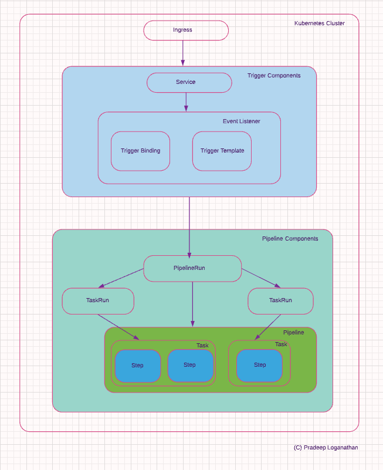
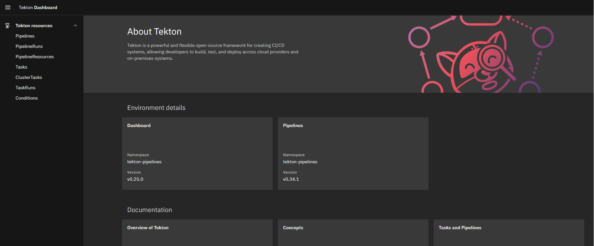

Tekton provides a cloud-native, standardized set of building blocks for CI/CD systems. It is an [open-source project](https://github.com/tektoncd) and is part of the [Continuous Delivery Foundation](https://cd.foundation/projects/) set of projects. It runs natively on Kubernetes and can target any platform, language, or cloud. It extends the Kubernetes API and provides custom resources to create CI/CD pipelines. Since it uses Kubernetes native CRD's , we can use familiar tools to create, manage and monitor tekton pipelines. Tekton aims to make it easier and faster to build, test, and package up your source code. It allows developers to build, test, and deploy cloud-native, containerized applications across multiple Kubernetes providers, build and deploy immutable images, version control IaC etc. Tekton can be used to perform advanced Kubernetes deployment/rollback strategies such as blue-green deployment, canary deployment, rolling updates etc.

Tekton was originally the build system for the Knative serverless workload platform. It was converted to a standalone project implementing a general-purpose CI/CD platform. It was donated to the Continuous Delivery Foundation in March 2019.

This diagram depicts the various components of tekton and their interactions.



## Tekton Components

Tekton uses  a pipeline architecture composed of pipelines, tasks , steps and workspaces to provide a highly configurable continuous delivery mechanism. The github repo for Tekton pipelines is [here](https://github.com/tektoncd/pipeline). Tekton uses Tekton triggers to enable continuous integration to automatically invoke pipelines based on events. These events could be code being checked into specific branches, PR's being merged etc. The github repo for Tekton triggers is [here](https://github.com/tektoncd/triggers). Tekton also provides a CLI to interact with these components. The project is hosted on github [here](https://github.com/tektoncd/cli). Let us take a look at these components in detail.

Tekton uses Kubernetes Custom Resource Definitions (CRD) to define the building blocks used to assemble CI/CD pipelines.The CRD's defined by Tekton for continuous delivery are below.

### Step

Steps are the most basic units used to create a pipeline. A step represents a single atomic operation that is part of the larger CI/CD pipeline. Each step defines the command or tool to be executed (e.g., Checkout code from a git branch, building a container image) and the container image that contains the command or tool. Each step runs in a container with a specific image, defining the command to be executed once the container starts. This ensures that the step is reproducible and immutable. A step should ideally perform a single action. If a step has multiple actions then it should ideally be refactored to a Task. Steps are used to create a task.

### Task

A Task is a collection of steps that should be executed in a specific order. It is composed of several reusable, loosely coupled steps that perform a specific function. Steps in a task are generally related to each other. A task contains a minimum of one step while complex tasks can have many steps. A task is the basic unit of execution in Tekton. Tasks get executed as Kubernetes pods while steps in a Task map to containers. A Task is run in a single pod, enabling steps to share a common volume and resources. Tekton steps execute in a pod specifically created for the task. Tekton tasks are therefore isolated from one another and from the rest of the cluster. Tasks are usually designed to be independent of the data they operate on. Parameters can be used to customize the resources and behavior associated with a Task.

The [Tekton catalog](https://github.com/tektoncd/catalog) contains a catalog of reusable task resources for everyday operations such as [Kubernetes actions](https://github.com/tektoncd/catalog/tree/main/task/kubernetes-actions), [GIT operations](https://github.com/tektoncd/catalog/tree/main/task/git-cli/0.3) etc. Tasks are generally stitched together to create a pipeline.

A simple hello world task is defined below. This task has two steps named hello-one and hello-two referenced by ``spec.steps.name``. The steps use the ubuntu image to create a container and print a text message.

```yaml
apiVersion: tekton.dev/v1beta1
kind: Task
metadata:
  name: hello-world-task
spec:
  steps:
    - name: hello-one
      image: ubuntu
      command:
        - /bin/bash
      args: ['-c', 'echo from step one']
    - name: hello-two
      image: ubuntu
      command:
        - /bin/bash
      args: ['-c', 'echo from step two']
```

### TaskRun

A TaskRun is used to execute a task. A TaskRun will execute all the steps defined in the task. It will also contain the status of the task's execution and the status of the execution of each step. The TaskRun will execute until all the steps have been marked as successful. This taskrun definition can be used to execute the hello-world-task defined above.

```yaml
apiVersion: tekton.dev/v1beta1
kind: TaskRun
metadata:
 name: hello-world-task-run
spec:
 taskRef:
  name: hello-world-task
```

### Pipeline

A Pipeline defines a workflow composed of a set of tasks to be executed in a specific order. A pipeline consists of one or more tasks, each of which may include several steps. The pipeline is composed of tasks that define the various parts of the workflow ( e.g. build, test, manage artifact etc.) and these tasks are executed either sequentially, concurrently or as a directed acyclic graph. Some tasks may declare other tasks as dependencies and need to be run after the dependent task is complete. These tasks are run sequentially. Some tasks may not have any dependencies and are run concurrently. Pipelines are stateless, reusable, and parameterized. Tekton creates several pods based on the task and ensures all pods execute successfully. Pipelines can execute tasks on different Kubernetes nodes.

A sample pipeline is defined below. This pipeline has two tasks which are referenced by ``tasks.taskref.name``. This pipeline executes the tasks.

```yaml
apiVersion: tekton.dev/v1beta1
kind: Pipeline
metadata:
 name: hello-world-pipeline
spec:
 tasks:
 - name: hello-world
   taskRef:
    name: hello-world-task
 - name: hello-universe
   runAfter:
    - hello-world
   taskRef:
    name: hello-universe-task
```

### PipelineRun

A pipelinerun is used to execute a pipeline.A pipelinerun creates a Taskrun for each task in the pipeline. The tasks are executed in the order defined in the pipeline. The pipelinerun monitors the execution of the pipeline and reports on the progress and completion of the pipeline. This pipelinerun definition can be used to execute the hello-world-pipeline defined above.

```yaml
apiVersion: tekton.dev/v1beta1
kind: PipelineRun
metadata:
 generateName: run-hello-pipeline
spec:
 pipelineRef:
  name: hello-pipeline
```

### Workspace

A Workspace is a shared volume used by tasks and pipelines. It allows artifact data to be shared as input/output by tasks and pipelines. A workspace can be created as a ConfigMap, PersistenceVolumeChain, Secrets, etc. A workspace can be used as a build cache to speed up the CI/CD process. It can also be used to access application configuration, credentials, etc.

## Tekton Triggers

Tekton triggers provide continuous integration functionality. The custom resource definitions detailed above provide the functionality necessary for continuous delivery. Tekton Pipelines and Tasks are declarative. They need to be manually triggered to perform a build and deploy. We would need to use kubectl or Tekton CLI to execute a Tekton pipeline. Triggers provide the necessary functionality to declaratively create PipelineRun objects in response to external events. Triggers have no knowledge of what is in the pipeline declaration itself. This design allows for separation of concerns between the two areas. Tekton triggers introduces new custom resources to automate your CI/CD pipelines further. The CRD's are Trigger templates, Trigger bindings and Event listeners. Let us understand these CRD's in a bit more detail.

### TriggerTemplates

A Trigger template defines a blueprint for the resources that the trigger will create. The trigger template defines the pipelinerun or taskrun that should be triggered and the parameters the need to be passed. It attaches an event listener to the pipelinerun defined in the template and passes the corresponding parameters to it. A sample trigger template which triggers a pipelinerun is below. The  template passes the url of the git repo and the gitrevision as parameters to the pipelinerun.

```yaml
apiVersion: triggers.tekton.dev/v1alpha1
kind: TriggerTemplate
metadata:
  name: staging-trigger-template
spec:
  params:
   - name: gitrevision
     description: The git revision
     default: master
   - name: giturl
     description: The git repository url
  resourceTemplates:
   - apiVersion: tekton.dev/v1beta1
     kind: PipelineRun
     metadata:
      generateName: simple-pipeline-run-
     spec:
      pipelineRef:
       name: hello-world-pipeline
      params: # The params are passed to the pipeline
       - name: gitrevision
         value: $gitrevision
       - name: giturl
         value: $giturl
```

### TriggerBindings

Trigger binding transforms the incoming event data for consumption by the trigger template. It transforms fields from the incoming event data into parameters. It then passes the parameters to the trigger template. A sample trigger binding is below. It uses Jsonpath expressions to extract the gitrevision and giturl from the incoming event data. The trigger binding passes the gitrevision and giturl parameters to the trigger template.

```yaml
apiVersion: triggers.tekton.dev/v1alpha1
kind: TriggerBinding
metadata:
  name: deploy-pipeline-binding
spec:
  params:  
    - name: giturl
      value: $(body.repository.url)
    - name: gitrevision
      value: $(body.head_commit.id)
```

### EventListeners

An event listener listens for incoming HTTP requests at a specific port and invokes a trigger template. The event listener links the trigger template and the trigger binding by extracting information defined in the trigger binding from incoming event data. It then invokes the trigger templates passing in the extracted data as parameters. This allows the trigger template to instantiate and pass parameters to the pipelinerun and taskrun objects.
This is an extract of an yaml definition of an event listener

```yaml
apiVersion: triggers.tekton.dev/v1alpha1
kind: EventListener
metadata:
  name: hello-listener
spec:
  triggers:
    - name: staging-trigger
      bindings:
        - ref: deploy-pipeline-binding # The trigger binding to use
      template:
        ref: staging-trigger-template # The trigger template to use
```

## Tekton CLI

Tekton CLI provides a command line interface to interact with Tekton. It provides a set of commands to interact with Tekton resources. It can be used to create, delete, list, describe, and update all Tekton resources such as pipelines, eventlisteners, template bindings, trigger templates, etc. It is available for all platforms and can be installed from [here.](https://github.com/tektoncd/cli/releases)

## Tekton Dashboard

Tekton dashboard provides a web based UI to manage and view Tekton resources. It can be installed directly into the kubernetes cluster. The github repo for tekton dashboard is [here.](https://github.com/tektoncd/dashboard)



All of the above are the major components of Tekton and cover all aspects of continuous integration and deployment. In the next blog post, we will look at deploying tekton to a kubernetes cluster and creating a CI/CD pipeline.
