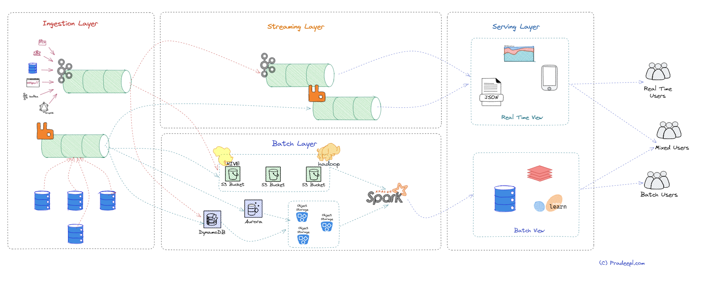

Data engineering is the process of designing, building, and maintaining data pipelines that can handle large volumes of data efficiently and effectively. Data engineers face many challenges in dealing with big data, such as scalability, fault tolerance, latency, and complexity. Traditionally, big data processing has been done using a batch processing system where data is processed in large batches at regular intervals. Batch processing is well-suited for data processing tasks that do not require real-time processing, such as running periodic reports or updating databases. The delay between data collection and processing is not critical, and the processing time can be scheduled during off-peak hours. However, this approach has its limitations, especially when it comes to processing real-time data. This is where lambda architecture comes in. One of the solutions that can be used to address these challenges is the Lambda Architecture, a data processing architecture that combines batch and stream processing methods to provide a comprehensive and robust data pipeline for big data scenarios.

## Lambda Architecture

Lambda architecture is a data processing architecture designed to handle large amounts of data by combining batch processing with real-time stream processing. It was introduced by James Warren and Nathan Marz in the book ["Big Data: Principles and best practices of scalable real-time data systems"](https://www.amazon.com.au/Big-Data-Principles-practices-scalable/dp/1617290343) published in 2015. It has since become a popular approach in big data processing. Lambda architecture provides a way to handle both real-time and batch processing in a single architecture. It allows for efficient processing of large amounts of data, as well as the ability to handle real-time data streams. However, it also adds complexity to the data processing pipeline and requires additional tools and technologies to manage. The key idea behind Lambda architecture is to split the data processing into two different paths: a batch layer and a streaming layer. The streaming layer is also termed as speed layer. By separating the processing of data into these layers, Lambda architecture provides a way to handle both real-time and batch data processing, while providing accurate and low-latency views of the data. The batch layer provides accuracy and completeness, while the streaming layer provides low-latency processing of real-time data. The batch layer holds immutable master data records and computes views of this data for various downstream applications. A serving layer provides a unified view of the data that combines the accuracy of the batch layer with the low latency of the streaming layer. Let us look at each of these layers in detail.

### Batch Layer

The batch layer is one of the three main layers of the Lambda architecture. The batch layer is responsible for processing large volumes of data in batches and computing pre-aggregated batch views. This layer is designed to handle the entire data set, including historical and incremental data, and to provide a complete and accurate view of the data. The batch layer is slow but accurate, and it provides a reliable and consistent view of the data that can be used as a baseline for comparison with real-time data. Batch processing jobs are usually designed to be idempotent, which means that they can be rerun without changing the result. This makes batch processing a robust and fault-tolerant approach to processing large volumes of data. It also allows for efficient use of resources. Because the data is processed in batches, the system can optimize the use of processing resources such as CPUs and memory, which can help to reduce the overall processing time and cost. The batch layer typically uses a distributed processing system, such as Apache Hadoop or Spark, to process data in parallel. This allows the batch layer to process large amounts of data quickly and efficiently. The batch layer typically stores the results of its processing in a data warehouse or data lake. This allows users to access the data for analysis and reporting. The batch layer is responsible for precomputing batch views, which are essentially summaries of the data that can be queried efficiently. It is responsible for processing and analyzing large volumes of historical data in batches. The batch layer is typically used to provide pre-computed views and insights over a large dataset, and it is particularly useful for generating reports and performing complex analytics tasks.

Here are some key characteristics of the batch layer:

1. Data storage: The batch layer typically uses distributed file systems, such as Apache Hadoop HDFS or Amazon S3, to store large volumes of data. These systems provide fault tolerance and scalability, allowing the batch layer to handle massive amounts of data.

2. Batch processing: The batch layer processes data in batch mode, which means that data is collected over a period of time and then processed all at once. Batch processing is usually slower than real-time processing, but it allows for more complex computations and analysis over a larger dataset.

3. Computation: The batch layer uses distributed computing frameworks, such as Apache Spark, Apache Flink, or Apache Hadoop MapReduce, to process large volumes of data. These frameworks can be used to perform a wide range of operations, such as filtering, aggregating, and joining data.

4. Pre-computed views: The batch layer is typically used to generate pre-computed views over the data, such as daily, weekly, or monthly aggregations. These views are stored in a separate data store, such as Apache HBase or Apache Cassandra, and are used to support ad-hoc queries or real-time analytics.

5. Latency: The batch layer is not designed for real-time processing and may have higher latency compared to the speed layer. However, it provides a more comprehensive view of historical data and supports more complex analysis.

Overall, the batch layer is an essential component of the Lambda architecture, as it provides valuable insights into historical data and supports complex analytics tasks. It is particularly useful for generating pre-computed views that can be used to support real-time queries and analytics.

### Streaming Layer

The streaming layer is responsible for processing and analyzing real-time data streams in a continuous manner. The streaming layer processes incoming data in real-time using stream processing technologies such as Spark Streaming or Apache Storm. This layer is responsible for computing real-time views, which are essentially incremental updates to the batch views. This layer is designed to handle data as it arrives, providing low-latency responses to queries and allowing for alerting and real-time decision-making. The streaming layer typically stores the results of its processing in a message broker, such as Kafka or RabbitMQ. This allows users to access the data for analysis and reporting. The streaming layer is fast but may not be as accurate as the batch layer, as it only considers a portion of the data. The streaming layer is particularly useful for handling high-throughput, time-sensitive data streams, such as those generated by IoT devices, social media feeds, or financial transactions.

The key characteristics of the streaming layer are:

1. Data ingestion: The streaming layer ingests and processes real-time data streams in near real-time. This requires a messaging system, such as Apache Kafka, RabbitMQ, or Amazon Kinesis, to buffer and distribute incoming data streams.

2. Real-time processing: The streaming layer processes data in real-time, which means that it provides low latency and supports continuous analysis over a data stream. Streaming frameworks, such as Apache Flink, Apache Spark Streaming, or Apache Storm, can be used to process incoming data streams and provide real-time analytics.

3. Event-driven architecture: The streaming layer is based on an event-driven architecture, which means that it processes events as they occur. This allows for timely and context-aware processing of data streams.

4. Stateful processing: The streaming layer can maintain state over time, allowing for more complex processing and analysis of data streams. This requires the use of a stateful streaming framework, such as Apache Flink or Apache Samza, which can handle stateful computations over a data stream.

5. Fault tolerance: The streaming layer is designed to handle failures and ensure fault tolerance. Streaming frameworks typically provide mechanisms for fault tolerance, such as checkpointing and state replication, to ensure that data is not lost in case of failures.

Overall, the streaming layer provides real-time insights into data streams and supports timely and context-aware processing of data. It is particularly useful for handling high-throughput data streams and providing real-time analytics for applications that require low latency and continuous processing of data.

### Serving Layer

The serving layer is responsible for serving pre-computed views and insights over a large dataset, generated by the batch layer, as well as real-time views and insights generated by the speed layer. The serving layer combines the results from both the batch and speed layers and makes them available to end-users through query APIs. This layer is designed to provide a unified view of the data, combining the accuracy of the batch layer with the low latency of the speed layer. The serving layer is where end-users can query the data, visualize it, and make informed decisions based on it. The serving layer is typically used to support ad-hoc queries, data exploration, and real-time analytics for end-users. It may also use a distributed cache, such as Redis or Memcached for storing frequently accessed data and a query engine for answering user queries. This allows the serving layer to deliver data to users quickly and efficiently.

Here are some key characteristics of the serving layer:

1. Data storage: The serving layer typically uses a distributed database or key-value store, such as Apache Cassandra, Apache HBase, or Apache Accumulo, to store pre-computed views and insights generated by the batch layer, as well as real-time views and insights generated by the speed layer. These databases provide low-latency access to data, high availability, and scalability.

2. Query processing: The serving layer supports ad-hoc queries and data exploration over the pre-computed views and insights generated by the batch layer, as well as real-time views and insights generated by the speed layer. Query processing can be performed using SQL or NoSQL query languages, depending on the database used.

3. API layer: The serving layer typically includes an API layer that exposes the pre-computed views and insights to end-users, as well as real-time views and insights generated by the speed layer. This allows end-users to interact with the data and perform ad-hoc queries and analytics.

4. Caching: The serving layer may include a caching layer, such as Apache Ignite, Apache Geode, or Redis, to improve query performance and reduce latency. Caching can be used to store frequently accessed data in memory, reducing the number of queries that need to be performed against the database.

5. Load balancing: The serving layer may include a load balancing layer, such as Apache ZooKeeper or Consul, to distribute incoming queries and traffic across multiple nodes in the database cluster. This improves scalability and availability of the serving layer.

Overall, the serving layer provides low-latency access to pre-computed views and insights over a large dataset, as well as real-time views and insights generated by the speed layer. It supports ad-hoc queries, data exploration, and real-time analytics for end-users, and provides a scalable and fault-tolerant architecture for serving data to applications and users.

## Pros and Cons

The Lambda Architecture offers several benefits for data engineering, such as:

- Scalability: The Lambda Architecture can handle massive quantities of data by taking advantage of both batch and stream-processing methods. It can scale horizontally by adding more nodes to the cluster without affecting the performance.

- Fault tolerance: The Lambda Architecture can tolerate failures by using immutable and append-only data structures. It can recover from errors by reprocessing the data from scratch or from checkpoints.

- Real-time processing: The Lambda Architecture can provide near-real-time processing of incoming data by using the streaming layer. It can support applications that require low-latency responses or real-time analytics.

- Flexibility: The Lambda Architecture can support various types of data sources and formats by using different tools and frameworks for each layer. It can also support different types of queries and analyses by using different query engines for the serving layer.

- Data integrity: The Lambda Architecture can ensure data integrity by using the batch layer to correct any errors or inconsistencies that may occur in the speed layer. It can also provide a single source of truth by combining the batch views and the real-time views in the serving layer.

The Lambda Architecture also has some challenges, such as:

- Complexity: The Lambda Architecture can be complex to implement and maintain, as it requires managing two separate code bases for batch and stream processing, as well as ensuring consistency between them. It also requires tuning various parameters and configurations for each layer.

- Latency trade-off: The Lambda Architecture can still have some latency issues, as it depends on the frequency of batch processing and the accuracy of stream processing. It may not be suitable for applications that require very low latency or very high accuracy.

- Resource consumption: The Lambda Architecture can consume a lot of resources, such as storage space, network bandwidth, memory, CPU, etc., as it processes the same data twice through both layers. It may also incur higher costs for cloud-based solutions.

In summary, lambda architecture is a powerful and popular way of designing a data pipeline that can handle both batch and stream processing. However, it also comes with trade-offs and challenges that need to be considered carefully. In my next post, I will show you how to implement a lambda architecture using some of the most popular tools and frameworks in the data engineering space. Stay tuned!
