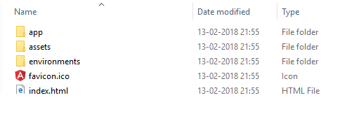

One of the most common tasks in software development is to define specific environments and manage them to develop, test, promote and deploy code. This is essential to use different values for various resources such as API's or databases in different environments. For e.g. you may use a low powered SQL Lite instance for local development but use a large instance in staging and production. Similarly, you may use a local instance of an API in development and a different instance in production. Generally, frameworks provide environment management patterns to enable switching resources based on the environment.

Angular CLI provides a simple file-based pattern to manage resources and variables based on environments. You can define custom environments based on your needs. I generally end up defining Development, staging, performance, and production as environments. Sometimes I end up defining more environments based on needs.

When you create a project using the Angular CLI, it creates an environment folder with two files namely environment.ts and environment.prod.ts.

environment.ts contains the default settings

This sets the production variable to false whereas the environment.production.ts file sets it to true. Now when you build you can use the environment option to specify the environment that will get picked up. if you use  
ng build --environment=production it will use the variables configured in envrionment.production.ts. To use variables declared within the environment files you need to import the file and use the constants declared within them.

If you want to define additional environments, you can do so by configuring them in the. angular-cli.json file. This file is hidden by the cli but can be edited. The. angular-cli.json file in my project folder contains the below entries

Here I am defining an additional environment called stage and pointing it to the file environments/environment.stage.ts. Now i can build for staging environment by specifying stage as an environment in my ng build using the command

> **ng build –environment=stage**

Thus, we can define and manage multiple environments using the angular CLI and integrate the same in our Devops process to control and promote releases.
