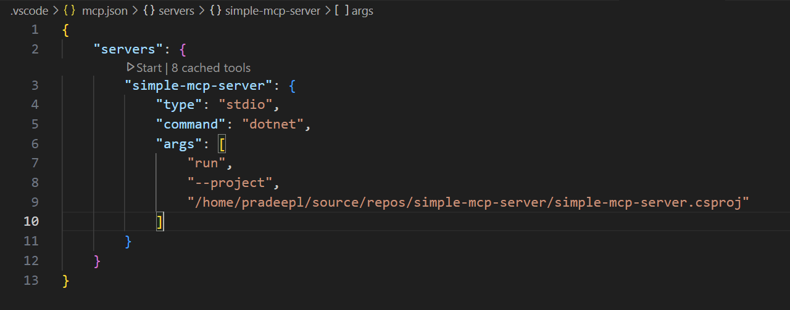
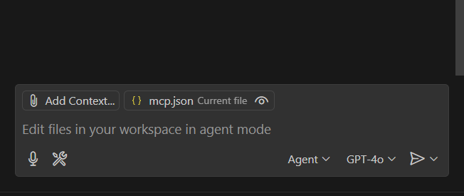
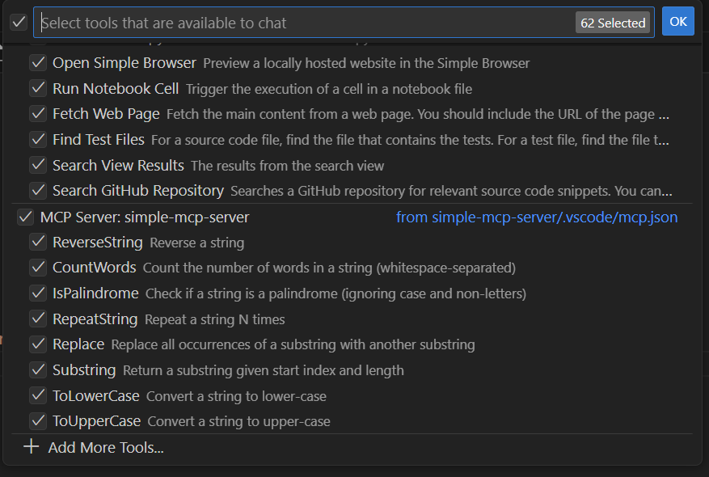

## Introduction

In parts [one](https://pradeepl.com/blog/model-context-protocol/introduction-to-model-context-protocol/) and [two](https://pradeepl.com/blog/model-context-protocol/mcp-protocol-mechanics-and-architecture/) of this [series](), we explored what Model Context Protocol (MCP) is, why it matters, and how it works under the hood. Now it's time to get practical: in this post, we'll walk through building a simple MCP server step-by-step, from scratch.

We'll use a straightforward example that provides text manipulation tools, such as reversing strings, counting words, checking palindromes, and more. The code for this MCP server is available [here](https://github.com/PradeepLoganathan/simple-mcp-server)

## What You'll Build

We'll create an MCP server in C# (.NET) that provides the following string manipulation tools. The MCP server will use STDIO server transport for communication. We will integrate this MCP server into Github Copilot within Visual Studio Code.

## Prerequisites

Before we start, ensure you have:

-   [.NET 8 SDK](https://dotnet.microsoft.com/download/dotnet/8.0) installed.
-   [Visual Studio Code](https://code.visualstudio.com/) or your preferred IDE.
-   The [GitHub Copilot](https://marketplace.visualstudio.com/items?itemName=GitHub.copilot) extension installed and enabled in Visual Studio Code to seamlessly integrate and test your MCP tools.


## Step 1: Setting up your MCP Project

To get started lets Create a new directory for your MCP server and initialize it as a .NET consoleproject:

```bash
dotnet new console -o simple-mcp-server
cd simple-mcp-server
```

Then add the necessary MCP NuGet package:

```bash
dotnet add package ModelContextProtocol --prerelease
dotnet add package Microsoft.Extensions.Hosting
```

The package `ModelContextProtocol` provides the core MCP libraries, types, and classes needed to build an MCP server in .NET. It includes the attributes and server infrastructure (`McpServerToolType`, `McpServerTool`, etc.) that help your C# methods become discoverable tools for MCP clients, such as LLMs or developer tools. We use the `Microsoft.Extensions.Hosting` nuget package to provide a lightweight hosting framework for your MCP server. It simplifies running background services, configuring dependency injection, and managing the server lifecycle.

## Step 2: Implementing Your Tools


Create a new file `MyTools.cs` in your project directory and paste the provided tools implementation. I am creating a bunch os string manipulation tools that can be used by the LLM.

```csharp
using System.ComponentModel;
using System.Linq;
using ModelContextProtocol.Server;

namespace SimpleTools;

[McpServerToolType]
public class MyTools
{
    [McpServerTool, Description("Reverse a string")]
    public string ReverseString(string input)
    {
        if (input is null) return string.Empty;

        var chars = input.ToCharArray();
        System.Array.Reverse(chars);
        return new string(chars);
    }

    [McpServerTool, Description("Convert a string to upper-case")]
    public string ToUpperCase(string input) => input?.ToUpperInvariant() ?? string.Empty;

    [McpServerTool, Description("Convert a string to lower-case")]
    public string ToLowerCase(string input) => input?.ToLowerInvariant() ?? string.Empty;

    [McpServerTool, Description("Check if a string is a palindrome (ignoring case and non-letters)")]
    public bool IsPalindrome(string input)
    {
        if (string.IsNullOrWhiteSpace(input)) return true;

        var filtered = new string(input
            .ToLowerInvariant()
            .Where(char.IsLetterOrDigit)
            .ToArray());

        return filtered.SequenceEqual(filtered.Reverse());
    }

    [McpServerTool, Description("Count the number of words in a string (whitespace-separated)")]
    public int CountWords(string input)
    {
        if (string.IsNullOrWhiteSpace(input)) return 0;

        return input.Split((char[])null, StringSplitOptions.RemoveEmptyEntries).Length;
    }

    [McpServerTool, Description("Repeat a string N times")]
    public string RepeatString(string input, int count)
    {
        if (input is null || count <= 0) return string.Empty;

        return string.Concat(Enumerable.Repeat(input, count));
    }

    [McpServerTool, Description("Return a substring given start index and length")]
    public string Substring(string input, int startIndex, int length)
    {
        if (string.IsNullOrEmpty(input)) return string.Empty;
        if (startIndex < 0 || startIndex >= input.Length) return string.Empty;

        return input.Substring(startIndex, Math.Min(length, input.Length - startIndex));
    }

    [McpServerTool, Description("Replace all occurrences of a substring with another substring")]
    public string Replace(string input, string oldValue, string newValue)
    {
        if (input is null) return string.Empty;

        return input.Replace(oldValue ?? string.Empty, newValue ?? string.Empty);
    }
}

```

The above code provides a bunch of string manipulation tools. But how does this C# class and its methods become a discoverable and usable set of tools for an MCP client like GitHub Copilot? The magic lies in a few key attributes from the `ModelContextProtocol.Server` namespace and `System.ComponentModel`:

-   **`[McpServerToolType]`**: This attribute, placed above the `MyTools` class, signals to the MCP SDK that this class is a container for MCP tools. When the server starts, it knows to look inside classes marked this way.
-   **`McpServerTool`**: Applied to each public method within `MyTools` (like `ReverseString`, `ToUpperCase`, etc.), this attribute designates that specific method as an individual, callable MCP tool.
-   **`Description`**: This standard.NET attribute is crucial. It provides a human-readable, and more importantly, an LLM-readable description of what each tool does and what kind of input it expects. As we discussed in the earlier parts of this series, this descriptive metadata is what allows an AI model like GitHub Copilot to understand the purpose of each tool and decide when it's appropriate to use it to fulfill a user's request. Clear descriptions are fundamental to the 'why it matters' aspect of MCP -- they enable effective tool discovery and utilization by the AI.

These attributes work together to declaratively define your server's capabilities, making your C# code accessible and understandable within the Model Context Protocol ecosystem

## Step 3: Integrating Tools into MCP Server Host


Modify your `Program.cs` file to host your MCP tools:

```csharp
using Microsoft.Extensions.Hosting;
using ModelContextProtocol.Server;

var builder = Host.CreateEmptyApplicationBuilder(settings: null);
builder.Services
    .AddMcpServer()
    .WithStdioServerTransport()
    .WithTools<MyTools>();

await builder.Build().RunAsync();
```

Let's examine the key lines in this setup:

-  **`var builder = Host.CreateEmptyApplicationBuilder(settings: null);`**: This initializes a minimal generic host without reading configuration or command-line arguments. It's well-suited for lightweight tools and test scenarios, like this simple MCP server, where full configuration infrastructure is not required.
-  **`builder.Services.AddMcpServer()`**: This extension method, provided by the `ModelContextProtocol` NuGet package, registers the essential MCP server services with the application's dependency injection container. This is the starting point for configuring an MCP server.
-  **`.WithStdioServerTransport()`**: This chained extension method configures the server to use Standard Input/Output (STDIO) for communication. STDIO is a simple and effective transport mechanism when the MCP client (like the MCP Inspector or a local AI agent) runs the server as a child process and communicates with it via its standard input and output streams. It's ideal for local development and testing as it doesn't require network port configuration or deal with firewall issues. This choice deliberately lowers the barrier to entry for getting started with MCP server development locally.
-  **`.WithTools<MyTools>()`**: This method registers a class that contains your tool implementations. Each public method in `MyTools` decorated with `[McpServerTool]` becomes a callable tool for MCP clients. This enables modular tool development and allows easy expansion of server capabilities without modifying core server logic.

The fluent configuration API (e.g., `AddMcpServer().WithStdioServerTransport().WithTools<MyTools>()`) provides a clean, readable, and declarative way to set up the server. This adheres to common builder patterns found in.NET, making the initialization process intuitive for developers familiar with the ecosystem.

## Step 4: Integrating with Github Copilot in VS Code 

Integrating MCP servers directly within Visual Studio Code enhances your development experience, particularly when using AI-assisted tools like GitHub Copilot Chat.

### A. Configuring Your MCP Server with `mcp.json`

VS Code uses a dedicated configuration file called `mcp.json` to manage and run MCP servers. This file can be placed either in the `.vscode` directory of your project (for project-specific servers) or in your user settings (for globally available servers).

Here's an example of a minimal `.vscode/mcp.json` file configured for the MCP server we've built in this tutorial:

```json
//.vscode/mcp.json
{
    "servers": {
        "simple-mcp-server": {
            "type": "stdio",
            "command": "dotnet",
            "args": [
                "run",
                "--project",
                "${workspaceFolder}/simple-mcp-server.csproj"
            ]
        }
    }
}
```

Key fields in this configuration include :

-   **`"type": "stdio"`**: Specifies the transport protocol. (standard input/output)
-   **`"command": "dotnet"`**: The executable to run the server.
-   **`"args": [...]`**: Arguments to pass to the command. Here, it tells `dotnet` to run the project. 

This standardizes how MCP servers are integrated within VS Code, making it language-agnostic and easy to manage. This `mcp.json` configuration standardizes how different MCP servers, regardless of their implementation language (C#, Python, Node.js, etc.), are declared and launched by client applications like VS Code. The IDE doesn't need to know the specifics of how each server is built; it just needs this configuration to manage and communicate with them.

### B. Benefits of VS Code Integration

Configuring an MCP server this way allows VS Code features, notably Copilot Chat when in "agent mode," to discover and utilize the tools provided by the custom server directly within the editor. This can significantly streamline development workflows by augmenting the AI assistant with domain-specific or project-specific tools. This direct support within VS Code signals a strategic effort to make MCP a fundamental part of the local developer environment, potentially fostering the creation of many small, specialized MCP servers.

### C.  Quick Start: Using Your MCP Server with GitHub Copilot

After creating the `.vscode/mcp.json` file and restarting or reloading VS Code if necessary, you will see an option to start the server as in the screen shot below.


Once the server has started and discovered the tools available in this MCP server.. you can follow the steps below.
1.  Open the Chat view (e.g., with GitHub Copilot).
2.  Switch to "Agent mode" (if available and supported by the Chat extension).

3.  There should be an option to select or view available tools, where "simple-mcp-server" and its tools (`ReverseString`, `CountWords`) would appear.

4.  One could then interact with Copilot Chat, and it might choose to use these custom tools if relevant to the prompt.
5. The below video is a simple example of using the MCP server we built with copilot chat in agent mode in Visual Studio Code.



This brief overview introduces the powerful capabilities of MCP integration with GitHub Copilot in VS Code, laying the groundwork for you to leverage custom tools in your everyday development tasks.

## What's Next?

You now have a working MCP server with a set of string manipulation tools, ready for integration with clients like GitHub Copilot. This is a fantastic starting point! But the Model Context Protocol and its C# SDK offer much more depth for building sophisticated AI-powered applications. As you think about building more complex servers, here are some areas to explore:

-  **Dependency Injection for Richer Tools:** Our simple string tools were self-contained. However, real-world tools often need to interact with other services -- think databases, external APIs (like a weather service), or other business logic components. The MCP C# SDK supports dependency injection, allowing your tools to access these services. Even if tool methods are defined as `static`, you can inject services as parameters into these methods. For example, you could register an `HttpClient` or a custom `WeatherService` in your `Program.cs` and then have your MCP tool method accept it as an argument. The MCP runtime will resolve these dependencies from the configured dependency injection container when the tool is called.

-  **Exploring Other Transport Protocols (Beyond STDIO):** We used Standard Input/Output (STDIO) for our server, which is excellent for local development and tools run as child processes (like with the MCP Inspector or VS Code integration). However, for a server you want to deploy (like an Azure Function) or make accessible over a network, you'll need different transport protocols. Server-Sent Events (SSE) over HTTP is a common alternative supported by the MCP C# SDK. This is well-suited for web-based servers or scenarios where a single server instance needs to be accessible by multiple or remote clients, which aligns perfectly with hosting in environments like Azure Functions.

-  **Implementing Robust Error Handling:** As your tools become more complex and interact with external systems (which can sometimes fail or return unexpected data), robust error handling becomes critical. Your tool methods should use `try-catch` blocks to gracefully handle potential exceptions. The MCP C# SDK will typically translate unhandled exceptions thrown from your tool methods into standard JSON-RPC error responses, which the client can then interpret. Providing clear error messages helps in debugging and makes your server more reliable.

-  **Leveraging More MCP Concepts -- Resources and Prompts:** So far, we've focused on "Tools," which are invokable functions. The Model Context Protocol also defines other ways for servers to provide context to LLMs:

    -  **Resources:** These are application-controlled data sources that an MCP server can expose. Think of these as data an LLM can read and use, like files, database content, or the current weather conditions from your planned weather provider, without necessarily performing a computational action.
    -  **Prompts:** These are server-provided templates or workflows that can guide the LLM in how to best use the available tools or resources for specific tasks. Exploring these can allow you to build even richer and more context-aware interactions with AI models.
-  **Publishing and Deploying Your Server:** Once you've built a more complex server, like your weather provider, you'll want to deploy it. The.NET SDK offers capabilities for publishing your application, including containerization (e.g., using `dotnet publish /t:PublishContainer`), which can be useful for various hosting environments, including Azure Functions or other cloud services.

By diving into these areas, you can build increasingly powerful and versatile MCP servers, truly unlocking the potential of connecting AI models to your specific data and capabilities. The journey from a simple string utility to a cloud-hosted weather information provider for LLMs is well within reach!

## Conclusion

In this three-part series, we've explored the power and flexibility of the Model Context Protocol. You've learned what MCP is, its underlying architecture, and now how to build your own MCP server. With these foundational skills, you're ready to unlock endless possibilities by connecting powerful AI models to the rich contexts they need.