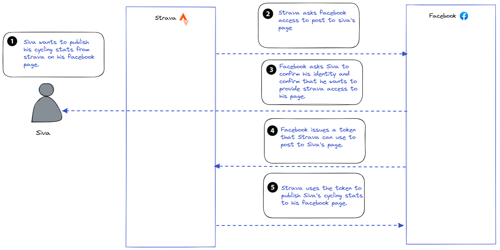

In todays digital world users expect applications to work with each other seamlessly. They may want to post a picture from the camera application on their mobile phone to a social media website, tweet about a product purchased on amazon to their twitter timeline or import their facebook contacts into linkedin. Users expect these applications to interact seamlessly and share information securely. They expect to be in control of information that is shared and to be able to revoke permissions if necessary. OAuth is not the first attempt at simplifying identity and authorization or using claims based authorization. Frameworks such as WS-Federation and SAML have also provided functionality for the same but OAuth has seen wider adoption. OAuth 2.0 is already the de facto standard for authorization and is supported by leading organizations including Facebook, Google, Microsoft, PayPal, Instagram, Foursquare, and many others.

OAuth 2 is an open authorization standard designed to provide an authorization protocol for the web. It is a protocol that provides a framework to exchange authorization information between applications and services. This protocol lets users grant limited access to some of their own content stored on other websites in a standardized and open manner without having to share credentials. Access to this protected content can be requested by an external application or service on behalf of the user. For Example, an application can obtain an user’s consent to call an API on their behalf, without needing the user’s credentials for API access. An application can also obtain authorization to call an API on its own behalf if it owns the content to be accessed. Access is generally granted by issuing a token which the external application can use to access the protected content. It removes the need for a user to hand over their credentials to the external application, which gives the user control over their data. The OAuth 2.0 framework was originally published in 2012. Several RFC's have been published since 2012 which patched and extended the original protocol. A new version OAuth 2.1 is currently in progress to consolidate and simplify commonly used features. It is not yet a final standard, but a draft was published on August 2022 [here](https://datatracker.ietf.org/doc/html/draft-ietf-oauth-v2-1-07).

## OAuth end user flow

To understand how OAuth2 works from an end users perspective, let us work through an example scenario. Siva tracks his cycling workouts on Strava. He wants to share his cycling stats with his friends on facebook. He uses the strava app to share his workout to facebook. Strava then proceeds to ask facebook access to Siva's facebook page. The Facebook app on his phone checks with Siva who is logged in to confirm that he would indeed like Strava to be able to post to his page. Once Siva confirms that he indeed would like to provide Strava access to his page, Facebook issues a token to Strava with the necessary authorization to post to his page. Strava can now use this token to post to Siva's Facebook page. During this whole process Siva never had to provide his facebook credentials to Strava. He can also revoke Strava's access to facebook at any time.

<!-- From a user's point of view, the OAuth2 flow is as follows:

- The user selects the provider with whom they wish to sign into the client app.
- The user is redirected to the provider's website (with a URL that includes the client app ID) where they are asked to give permission to the client app.
- The user signs in from the OAuth2 service provider and accepts the permissions requested by the third-party application.
- The user is redirected to the client app with a request code.
- In the background, the client app sends the grant code to the provider, who sends back an authentication token.
- The client app uses the access token to make authorized requests to the provider, such as to get user information or wall posts.

 A simple analogy for OAuth2 is using a valet parking service. If you use a valet parking service you the resource owner ( in this case the car being the resource ) need to give a token ( the car keys ) to a client ( in this case the driver ) authorizing him to drive your car , ideally to park it on your behalf. -->

In order to understand OAuth better we need to understand the various OAuth roles, flows, client profiles and other concepts.

## OAuth Roles

The various roles and parties involved in an OAuth 2.0 flow are

1. Resource server - A service hosting protected resources that need to be accessed by an external application. This is typically an API provider that holds and protects data such as photos, videos, calendars, or contacts. In the above example the resource server is facebook.
2. Resource owner - The entity who owns the protected resource, typically the user of an application. In the above example the resource owner is Siva.
3. Resource - The entity that is getting protected from unintended access and usage. In the above example the resource is Siva's facebook page.
4. Client - An system trying to access the protected resource on the resource server on behalf of the resource owner or on its own behalf. The client can be any device, IoT sensor, web application, desktop application or a mobile application.
5. Authorization Server: This service grants access to a client to the resource. This is the server that hosts the secure token service and issues tokens to the client after successfully authenticating the resource owner and obtaining permissions from the resource owner or their behalf. This is the server that provides the OAuth service. It publishes various endpoints that implement the OAuth protocol. In the above example this would be the facebook authorization server implementation.

<!-- A basic oAuth flow between these actors is as below -->

<!--  -->

## OAuth Grant Types

A grant type defines how a client can obtain an authorization grant from a resource owner to access a resource on their behalf

OAuth 2.0 provides four types of grant flows.

1. Client credentials
2. Implicit
3. Authorization code
4. Resource owner password credentials

Implementing OAuth prevents issues with Credential sharing and Credential replays, thus preventing credential frauds and many other associated problems.