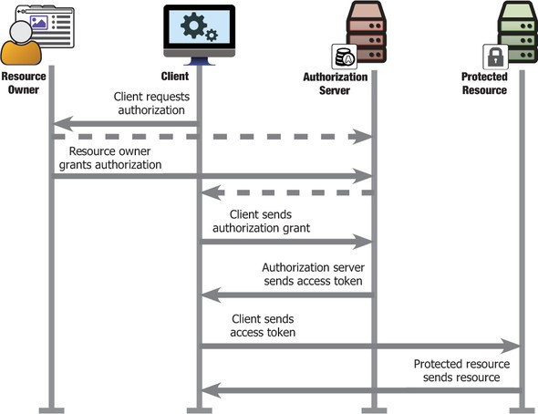

OAuth 2.0 is an open authorization standard designed to provide an authentication and authorization protocol for the web. It is a protocol that provides a framework to exchange authorization and authentication information between a range of web-enabled applications and services. This protocol was created with the intention of providing a way to grant limited access to protected content hosted by third-party services in a standardized and open manner. This protected content can be requested on behalf of either a resource owner or an external application or service.

A simple analogy for OAuth 2.0 is using a valet parking service. If you use a valet parking service you the resource owner ( in this case the car being the resource ) need to give a token ( the car keys ) to a client ( in this case the driver ) authorizing him to drive your car , ideally to park it on your behalf.

From a user's point of view, the OAuth2 flow is as follows:

- The user selects the provider with whom they wish to sign into the client app.
- The user is redirected to the provider's website (with a URL that includes the client app ID) where they are asked to give permission to the client app.
- The user signs in from the OAuth2 service provider and accepts the permissions requested by the third-party application.
- The user is redirected to the client app with a request code.
- In the background, the client app sends the grant code to the provider, who sends back an authentication token.
- The client app uses the access token to make authorized requests to the provider, such as to get user information or wall posts.

OAuth 2.0 is already the de facto standard for API security and is widely used across  
leading web sites including Facebook, Google, LinkedIn, Microsoft (MSN, Live), PayPal, Instagram, Foursquare, GitHub, Yammer, Meetup, and many more.

The various roles and parties involved in an oAuth 2.0 process are

1. Resource owner: The entity who owns the specified resource, typically the user of an application.
2. Resource server: The server hosting user-owned resources that are protected by OAuth. This is typically an API provider that holds and protects data such as photos, videos, calendars, or contacts.
3. Resource: The entity that is getting protected from unintended access and usage.
4. Client: The client is the application trying to access the protected resource on behalf of the resource owner.
5. Authorization Server: This is the server that hosts the secure token service and issues tokens to the client after successfully authenticating the resource owner and obtaining permissions from the resource owner or their behalf. This is the server that provides the OAuth service.

A basic oAuth flow between these actors is as below

## Auth 2.0 Grant Types

A grant type defines how a client can obtain an authorization grant from a resource owner to access a resource on their behalf

OAuth 2.0 provides four types of grant flows.

1. Client credentials
2. Implicit
3. Authorization code
4. Resource owner password credentials

Implementing OAuth prevents issues with Credential sharing and Credential replays, thus preventing credential frauds and many other associated problems.

[In the next post](https://pradeeploganathan.com/security/oauth2-tokens/) we will delve in detail on OAuth concepts such as tokens, claims and scopes.

Photo by [Daryn Bartlett](http://unsplash.com/photos/sZmIT85cV84?utm_source=unsplash&utm_medium=referral&utm_content=creditCopyText) on [Unsplash](https://unsplash.com/?utm_source=unsplash&utm_medium=referral&utm_content=creditCopyText)
