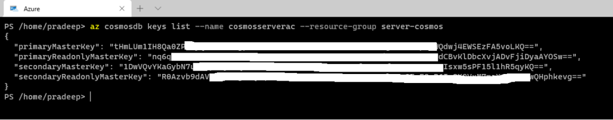

### Creating Cosmos Db Infrastructure

The azure Cosmos DB team provides SQL API SDK's for various languages. At the time of writing this post the NuGet package for .NET core is at version 4 preview 3. The GitHub repo for this NuGet package is [here](https://github.com/Azure/azure-cosmos-dotnet-v3/blob/v4/changelog.md). To get started we can use the Cosmo Db emulator locally or create a Cosmos Account on Azure. We can log onto Azure portal to create a Cosmos Account or use Azure CLI. I am using the below Azure CLI command to create a Cosmos DB account. This command creates a Cosmos DB Account named eCommerceDb-AC in the eCommerce-RG resource group.

```shell
az cosmosdb create \
    --name eCommerceDb-AC \
    --kind GlobalDocumentDB \
    --resource-group eCommerceDb-RG
```

Create Cosmos Db Account

Creating a Cosmos Db account also provisions an endpoint URI with both read only and read-write keys needed to connect to the account. We can get the keys for the account create above using the below cli command



Retrieve Cosmos Db Keys

Now that we have provisioned the Cosmos Db account and have the necessary keys to connect we have all the prerequisites needed to get started with the code solution.

### CosmosClient

We start off by creating a console application. We can now install the NuGet package using the below command.

```shell
dotnet add package Azure.Cosmos --version 4.0.0-preview3
```

This NuGet package provides the CosmosClient object which is used to connect to Cosmos DB. The CosmosClient object manages connections to Cosmos Db in an efficient way and is thread safe. It is ideal to create an instance of the CosmosClient object as a singleton. The CosmosClient object allows further configuration of the connection through the CosmosClientOptions parameter. In the below code sample, I am configuring a CosmosClient object to connect to a Cosmos DB by specifying the endpoint, the primary key, and a host of other options.

```csharp
public static class CosmosDbConnection
{
        private const string EndpointUri = "https://localhost:8081";
        private const string PrimaryKey = "yourprimarykey==";
        private static CosmosClient _instance = null;
        private static readonly CosmosClientOptions CosmosClientOptions = new CosmosClientOptions()
        {
            ConnectionMode = ConnectionMode.Direct,
            ApplicationName = "CosmosStarter"            
        };


        public static CosmosClient Instance => _instance ??= new CosmosClient(EndpointUri, PrimaryKey, CosmosClientOptions);
}
```

The CosmosClient class can also be created using a fluent api provided by the CosmosClientBuilder class.

```csharp
CosmosClient cosmosClient = new CosmosClientBuilder("https://localhost:8081", "key")
                .WithConnectionModeDirect()
                .WithApplicationName("CosmosStarter")
                .Build();
```

### Creating a Cosmos Db Database

Now that we can establish a connection using the CosmosClient instance, we can check and create the database using the CreateDatabaseIfNotExistAsync method as below.

```csharp
private readonly CosmosClient _cosmosClient;
private CosmosDatabase _database;
private CosmosContainer _container;

private readonly string _databaseId = "thetaDb";
private readonly string _containerId = "CustomerContainer";

public CosmosDriver()
{
    _cosmosClient = CosmosDbConnection.Instance;
}

public async Task CreateDatabaseAsync()
{
	  try
	  {
		this._database = await this._cosmosClient.CreateDatabaseIfNotExistsAsync(_databaseId);
	  }
	  catch (Exception e)
	  {
		Console.WriteLine(e);
		throw;
	  }
}
```

### Creating a Container

A Cosmos DB container is a collection of items. The primary decision that needs to be made when creating a container is selecting a partition key. The partition key plays a crucial role in defining the performance characteristics as well as determining the RU usage. We can use the CreateContainerIfNotExistAsync method to check and create the container.

```csharp
public async Task CreateContainerAsync()
{
    ContainerProperties containerProperties = new ContainerProperties()
    {
        Id = Guid.NewGuid().ToString(),
        PartitionKeyPath = "/CustomerId",
        IndexingPolicy = new IndexingPolicy()
        {
            Automatic = false,
            IndexingMode = IndexingMode.Lazy,
        }
    };
    
    this._container = await this._database.CreateContainerIfNotExistsAsync(containerProperties);
}
```

The container can also be created using the Fluent API surface as below

```csharp
CosmosContainerResponse container = await this._database.DefineContainer("CustomerContainer", "/CustomerId")
   .CreateAsync(5000); 
```

### Inserting Documents

Now that we have created a Cosmos DB account, a database, and a container we can insert documents into the container. To insert a document, we use the CreateItemAsync method, passing it the json object and the partition key. In the below gist I am adding a Customer object and a collection of Order objects to the same container. The objects are deserialized and inserted as json documents into the Cosmos DB container.

```csharp
public async Task AddCustomer(Customer customer)
{
    try
    {
      ItemResponse<Customer> customerResponse = await this._container.CreateItemAsync<Customer>(customer, new PartitionKey(customer.CustomerId));
    }
    catch (CosmosException ex) 
    {
      Console.WriteLine("Exception occured in AddCustomer: Message body is {0}.\n", ex.Message);
      throw;
    }

}

public async Task AddOrders(List<Order> orders, string CustomerId)
{
    try
    {
      foreach (var order in orders)
      {
        ItemResponse<Order> orderResponse = await this._container.CreateItemAsync<Order>(order, new PartitionKey(CustomerId));
      }

    }
    catch (CosmosException ex) 
    {
      Console.WriteLine("Exception occured in AddCustomer: Message body is {0}.\n", ex.Message);
      throw;
    }
}
```

Inserting two different types into a container

### Querying Documents

There are two primary ways to query documents in Cosmos Db using the SQL API namely Point reads and SQL Queries.

- Point Reads -Point reads are used to do a key value lookup of a single item using its Identifier and partition key. Point reads do not use the query engine. They are faster and cheaper to perform.
- SQL Query - To query documents with complex search criteria we can use SQL Queries. SQL queries use the query engine. They are more expensive and have higher & variable latency depending on the SQL query.

The below query uses point read to read an item using an Id and partition key.

```csharp
public async Task<Customer> GetCustomer(string customerId)
{
  try
  {
    var customerResponse = await this._container.ReadItemAsync<Customer>(customerId, new PartitionKey(customerId));
    return customerResponse;
  }
  catch (CosmosException ex) 
  {
    Console.WriteLine("Exception occured in GetCustomer: {0} Message body is {1}.\n", ex.Message,ex.ResponseBody);
    throw ;
   }
}
```

Querying for an Item using an ID and Partition Key

The below code uses a SQL query. It creates a query definition to construct a query with specific parameters to filter and sort the result as below.

```csharp
public async Task<List<Order>> GetOrders(string customerId)
{
      try
      {
            var sqlQueryText = "SELECT * FROM c WHERE c.CustomerId = @customerid";
            Console.WriteLine("Running query: {0}\n", sqlQueryText);
            QueryDefinition queryDefinition = new QueryDefinition(sqlQueryText).WithParameter("@customerid", "CU7-36-8183" );
            FeedIterator<Order> queryResultSetIterator = this._container.GetItemQueryIterator<Order>(queryDefinition);

            List<Order> orders = new List<Order>();

            while (queryResultSetIterator.HasMoreResults)
            {
              FeedResponse<Order> currentResultSet = await queryResultSetIterator.ReadNextAsync();
              foreach (Order order in currentResultSet)
              {
                  orders.Add(order);
                  Console.WriteLine("\tRead {0}\n", order.OrderId);
               }
            }

        return orders;
    }
    catch (CosmosException ex) 
    {
      Console.WriteLine("Exception occured in GetCustomer: {0} Message body is {1}.\n", ex.Message,ex.ResponseBody);
      throw ;
    }
}
```

We can also use a combination of point reads and custom SQL queries to construct rich and powerful query functionality.

### Deleting Documents

The SDK provides the DeleteItemAsync method to enable deleting documents from a container. This method takes the document identifier and the partition to locate and delete the document.

```csharp
public async Task DeleteCustomer(Customer customer)
{
    try
    {
      await this._cosmosDbContext.CustomerContainer.DeleteItemAsync<Customer>(customer.customerId, new PartitionKey(customer.customerId) );
    }
    catch (CosmosException ex)
    {
      Console.WriteLine("Exception occured in DeleteCustomer: Message body is {0}.\n", ex.Message);
      throw;
     }
}
```

### Updating Documents

There are two strategies to update documents in Cosmos Db. The first one is to replace the document using the ReplaceItemAsync method. This method replaces the document with the item identifier if it exists and fails if it does not. The second option is to use UpsertitemAsync which updates the document if it exists or creates a new document if it does not exist.

### Bulk Operations

Bulk operations refers to operations which require a high degree of throughput, for e.g., inserting a large batch of documents. Bulk operations have been simplified extensively in V4 of the SDK. To perform bulk operations, we need to create a list of tasks representing actions in the batch and execute them concurrently against the container.

```csharp
 public async Task AddOrders(List<Order> orders, string customerId)
 {
  var ordersToInsert = new List<KeyValuePair<PartitionKey, Stream>>();
  foreach (var order in orders)
  {
    var stream = new MemoryStream();
    await JsonSerializer.SerializeAsync(stream, order);
    ordersToInsert.Add(new KeyValuePair<PartitionKey, Stream>(new PartitionKey(order.CustomerId), stream)); 
  }

  var parallelTasks = new List<Task>();

  foreach (var (key, value) in ordersToInsert)
  {
      parallelTasks.Add(this._cosmosDbContext.OrdersContainer.CreateItemStreamAsync(value, key)
      .ContinueWith(x =>
      {
        var response = x.Result;
        Console.WriteLine($"Bulk insert {response.ClientRequestId} has status {response.Status} with message {response}");
       }));
  }
  await Task.WhenAll(parallelTasks);
}
```

Cosmos Db - Bulk Operations

The above code executes a bulk operation to insert orders into the Orders container. The code makes it look like we are executing a list of threads running the CreateItemStreamAsync concurrently, However the Cosmos SDK does a lot more work in the background to enable and optimize bulk operations. The SDK creates batches in the background and allocates concurrent operations to these batches grouped by the partition key. Multiple batches are created and dispatched concurrently. A batch is dispatched based on a timer or if the batch is full. The timer ensures that even if batch is not full it can be dispatched. The maximum size for a batch is 100 operations per batch or 2 MB and the timer ensures that a batch is dispatched at 1 second.

We now have a fully functioning console application connecting to a Cosmos DB instance to perform CRUD operations on documents. This is a quick sample to demonstrate using the SQL API on Cosmos DB and does not have any production optimizations or best practices. Use at your own discretion.

> Photo by [Benjamin Voros](https://unsplash.com/@vorosbenisop?utm_source=unsplash&utm_medium=referral&utm_content=creditCopyText) on [Unsplash](https://unsplash.com/s/photos/cosmos?utm_source=unsplash&utm_medium=referral&utm_content=creditCopyText)
