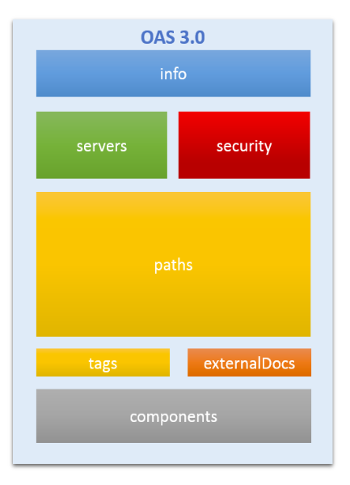

The key to building a successful API is to allow developers and consumers understand the functionality offered by the API in a standard, consistent and easy way. Building an amazing API providing key functionality is challenging. Lowering the barriers to allow for easy consumption of the API is key to ensure that consumers can be easily onboarded to consume the API.  The Open API specification defines a standard, language-agnostic interface for REST APIs, allowing both humans and computers to discover and understand the capabilities of the service without access to source code.

## OpenAPI Specification

The OpenAPI specification, generally known by its former name Swagger, is a schema that is used to construct a JSON or YAML definition of a restful API. The OpenAPI specification acts as a documentation tool allowing developers to easily describe their public APIs in a format that is widely known, understood, and supported. The OpenAPI spec is language agnostic. The APIs defined by the spec can be constructed in any language with any tool or framework. This specification is detailed [here.](https://www.openapis.org/).

## Swagger vs Open API Specification

The terms Swagger and OpenAPI are used interchangeably. Swagger began in 2011 as a set of tools that allowed developers to represent API as code, to automatically generate documentation and client SDKs. The rights to Swagger were bought by SmartBear Software, who donated the rights of the specification format to the Linux Foundation, under the OpenAPI Initiative. The need for standardization when expressing API functionality in a platform, transport, and programming language agnostic way emerged as the OpenAPI Specification. On 1 January 2016, the Swagger specification was renamed to the OpenAPI Specification (OAS). Since then, a newer version, 3.0.0 of OAS, has been released. The [Swagger website](https://swagger.io/) now focuses on tooling around the OpenAPI Specification, including ways to author an API specification and generate client- and server-side stubs (Swagger Editor, Codegen, and UI) to help developers consume the resulting API more easily. Thus, OpenAPI is the specification language itself, while Swagger is a set of tools that work with and around an OpenAPI specification.

The Open-API specification is defined [here](http://spec.openapis.org/oas/v3.0.3). Some of the tooling supporting version 3 of OAS is listed [here](https://github.com/OAI/OpenAPI-Specification/blob/master/IMPLEMENTATIONS.md)

## Open API Specification file structure

An Open API file allows you to describe your entire API, including the following:

- Available endpoints
- Endpoint operations (GET, PUT, DELETE, and so on)
- Input and output parameters for each operation
- Authentication methods
- Contact information, license, terms of use, and other information.

The structure of an Open API file version 3.0 is below



OAS 3.0 File structure

Let us now look at the details of the OAS 3.0 schema objects in the OAS file structure

### Info

The info object provides metadata about the API. The object has the following properties:

- openapi (string): This specifies the OpenAPI specification version in use. The structure of OAS documents evolve from one version to another. Parsers use the openapi version to parse the document accordingly.
- info (object): Metadata about the API.
  - version (string): The version of the API identified by the specification. This is the version of the API itself, not the OpenAPI Specification.
  - title (string): The name of your API.
  - description (string): A brief description of your API.
  - contact (object): Support contact for the API.
    - name (string): The name of the contact.
    - url (string): A URL pointing to a page with contact information.
    - email (string): The contact email address.
  - termsOfService (string): A valid URL pointing to the Terms of Service for the API.
  - license (object): License information of the API.

A sample info object for OAS 3.0 is shown below

```json
"openapi": "3.0.1",
  "info": {
    "title": "theta-CandidateAPI",
    "description": "Candidate API for thetalentbot.com",
    "contact": {
      "name": "development@thetalentbot.com",
      "url": "https://thetalentbot.com/developers/contact"
    },
    "license": {
      "name": "Not for any public or commercial use",
      "url": "https://thetalentbot.com/developers/license"
    },
    "version": "v1"
  },
```

### Servers

The servers array is used to specify the list of servers hosting the API and has the below structure

- servers (array of objects): A list of servers hosting the API.
  - url (string): A valid URL to the target host. This may be a relative URL, relative from the location at which the OpenAPI specification is being served.
  - description (string): A short description of the host. This is useful for distinguishing between different hosts if multiple are specified.

A sample servers array for OAS 3.0 is shown below

```json
{
"servers": [
    {
      "url": "https://development.thetalenbot.com/v1",
      "description": "Development environment"
    },
    {
      "url": "https://staging.thetalenbot.com/v1",
      "description": "Staging server"
    },
    {
      "url": "https://api.thetalenbot.com/v1",
      "description": "Production server"
    }
  ]
}
```

### Paths

The paths object represents all paths and operations exposed by the API. The path represents a REST resource. This can be used to describe the resource.  The paths object is a dictionary of paths and path item Objects. A path item object is a dictionary of HTTP verbs and Operation Objects. A single path can support multiple operations such as get , post , put etc. The Operation Object defines the behavior of the endpoint, such as what parameters it accepts and the type of responses it emits.

```json
"paths": {
    "/api/candidates": {
      "post": {
        "tags": [
          "Candidates"
        ],
        "description": "Create a new candidate.. Add more description to the operation.Markdown can be used for rich representation",
        "requestBody": {
          "content": {
            "application/json": {
              "schema": {
                "$ref": "#/components/schemas/theta.JobSeeker.Models.Core.Candidate"
              }
            },
            "text/json": {
              "schema": {
                "$ref": "#/components/schemas/theta.JobSeeker.Models.Core.Candidate"
              }
            },
            "application/*+json": {
              "schema": {
                "$ref": "#/components/schemas/theta.JobSeeker.Models.Core.Candidate"
              }
            }
          }
        },
        "responses": {
          "200": {
            "description": "Success"
          }
        }
      },
      "get": {
        "tags": [
          "Candidates"
        ],
        "responses": {
          "200": {
            "description": "Success",
            "content": {
              "text/plain": {
                "schema": {
                  "type": "array",
                  "items": {
                    "$ref": "#/components/schemas/theta.JobSeeker.Repository.Core.Candidate"
                  }
                }
              },
              "application/json": {
                "schema": {
                  "type": "array",
                  "items": {
                    "$ref": "#/components/schemas/theta.JobSeeker.Repository.Core.Candidate"
                  }
                }
              },
              "text/json": {
                "schema": {
                  "type": "array",
                  "items": {
                    "$ref": "#/components/schemas/theta.JobSeeker.Repository.Core.Candidate"
                  }
                }
              },
              "application/xml": {
                "schema": {
                  "type": "array",
                  "items": {
                    "$ref": "#/components/schemas/theta.JobSeeker.Repository.Core.Candidate"
                  }
                }
              },
              "text/xml": {
                "schema": {
                  "type": "array",
                  "items": {
                    "$ref": "#/components/schemas/theta.JobSeeker.Repository.Core.Candidate"
                  }
                }
              }
            }
          }
        }
      }
    },
```

### Components

Components holds a set of reusable objects. Components are used to minimize duplication within the specification. For example, if multiple endpoints may return a 401 Unauthorized error with the message "The Authorization header must be set", we can define a component called AuthHeaderNotSet, and reuse this object in place of the response definition. Components must be explicitly referenced from other parts of the specification using JSON references ($ref). Data types/schema, parameters, responses, request bodies, headers, security schemes, links, and callbacks can be defined as components.

### Security

A list of Security Requirement Objects used by the API. The Security Requirement Object is a dictionary of security schemes that are common across different operations. For example, we require that the client provides a valid token on many endpoints; therefore, we can define that requirement here, and apply it in a DRY manner within each definition. For endpoints that do not require a token, we can override this requirement on an individual basis. The Security Requirement Object is a dictionary of security schemes that must be satisfied for a request to be authorized. If multiple schemes are specified, then each scheme must be satisfied. The following example shows a Security Requirement Object that requires a token on a endpoint

```json
"security": [
  {
    "bearerAuth": []
  }
  {
    "theta.JobSeeker.Models.Core.Candidate": [
      "read",
      "write"
    ]
  }
]
```

A complete overview of the OAS 3.0.3 specification is provided [here](https://swagger.io/specification/). An understanding of this spec is key to helping developers use an API effectively.

> Photo by <a href="https://unsplash.com/@claybanks?utm_source=unsplash&utm_medium=referral&utm_content=creditCopyText">Clay Banks</a> on <a href="https://unsplash.com/s/photos/connect?utm_source=unsplash&utm_medium=referral&utm_content=creditCopyText">Unsplash</a>