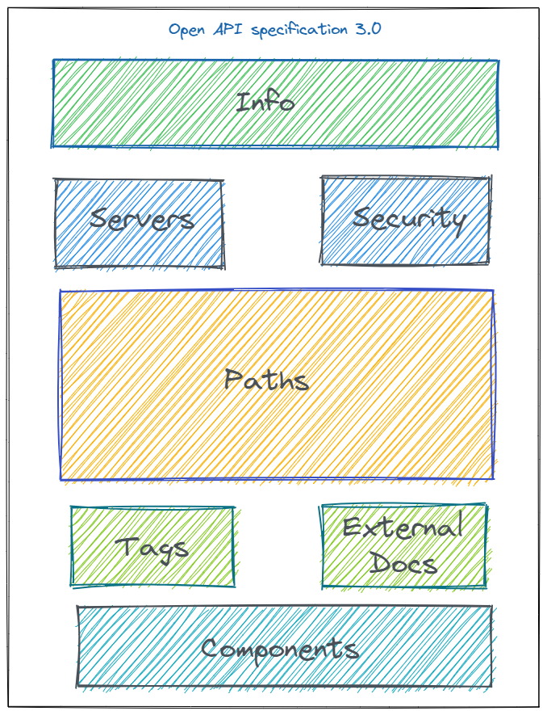

APIs form the building blocks of a connected digital world, enabling applications to collaborate, data to flow seamlessly, and innovation to flourish. In todays digital landscape, Application Programming Interfaces (APIs) serve as the connective tissue that empowers diverse software systems to interact and collaborate seamlessly.  The key to building a successful API is to allow developers and consumers understand the functionality offered by the API in a standard, consistent and easy way. Building an amazing API providing key functionality is challenging. Lowering the barriers to allow for easy consumption of the API is key to ensure that consumers can be easily onboarded to consume the API. Well-structured API documentation eliminates confusion, reduces the learning curve, and accelerates the adoption of your API. Developers should be able to understand how to authenticate, make requests, handle responses, and troubleshoot potential issues effortlessly. By investing in thorough and comprehensible API documentation, you not only empower your users but also establish a solid foundation for building strong developer relationships and driving the success of your API in the competitive digital landscape.
The Open API specification defines a standard, language-agnostic interface for REST APIs, allowing both humans and computers to discover and understand the capabilities of the service without access to source code.

## OpenAPI Specification

The OpenAPI Specification (OAS) is an open-source framework that allows developers to define and document APIs in a format that is both human and machine readable. Originating from the Swagger framework, OAS has become the industry standard for API specification, offering a common language that ensures both clarity and functionality across different API services. It enables developers to describe the entire API, including available endpoints, operation parameters, authentication methods, and contact information, providing a blueprint for building consistent and secure APIs. The APIs defined by the spec can be constructed in any language with any tool or framework. This specification is detailed [here.](https://www.openapis.org/).

The key features of the OpenAPI Specification include:

1. **Machine-Readable Format:** The specification is written in JSON or YAML, which allows both humans and computers to easily parse and understand the API's structure and capabilities.

2. **Endpoint Definitions:** The specification outlines each API endpoint, including its URL path, supported HTTP methods (such as GET, POST, PUT, DELETE), input parameters, and expected responses.

3. **Data Models:** It describes the data structures used in requests and responses, making it clear what data should be provided and what can be expected in return.

4. **Authentication and Security:** The specification can include information about how authentication and security mechanisms are implemented within the API, ensuring that developers understand how to secure their interactions.

5. **Response Formats:** It defines the possible response formats, including status codes and example payloads, helping developers handle and process the API's outputs effectively.

6. **Error Handling:** The specification can detail error responses and codes, providing developers with insights into potential issues and their meanings.

7. **Interactive Documentation:** Tools like Swagger UI or Redoc can generate interactive documentation from an OpenAPI Specification. This documentation allows developers to explore and test endpoints directly from a web interface.

8. **Code Generation:** The specification can be used to generate client libraries and server stubs in various programming languages, streamlining the development process.

9. **Versioning and Compatibility:** By defining the API's structure and behaviors clearly, the specification aids in versioning and maintaining backward compatibility as the API evolves.

10. **Standardization:** The OpenAPI Specification sets a common standard for API documentation, promoting better understanding and collaboration among developers, consumers, and stakeholders.

## Swagger vs Open API Specification

The terms Swagger and OpenAPI are used interchangeably. Swagger began in 2011 as a set of tools that allowed developers to represent API as code, to automatically generate documentation and client SDKs. The rights to Swagger were bought by SmartBear Software, who donated the rights of the specification format to the [Linux Foundation](https://www.linuxfoundation.org/), under the OpenAPI Initiative. The need for standardization when expressing API functionality in a platform, transport, and programming language agnostic way emerged as the OpenAPI Specification. On 1 January 2016, the Swagger specification was renamed to the OpenAPI Specification (OAS). Since then, a newer version, 3.0.0 of OAS, has been released. The [Swagger website](https://swagger.io/) now focuses on tooling around the OpenAPI Specification, including ways to author an API specification and generate client- and server-side stubs. Tools such as Swagger Editor, Codegen, and others built by Swagger help developers create API specifications and consume the resulting API more easily. Thus, OpenAPI is the specification language itself, while Swagger is a set of tools that work with and around an OpenAPI specification.

The Open-API specification is defined [here](http://spec.openapis.org/oas/v3.0.3). Some of the tooling supporting version 3.0 of OAS is listed [here](https://github.com/OAI/OpenAPI-Specification/blob/master/IMPLEMENTATIONS.md). A complete overview of the OAS 3.0.3 specification is provided [here](https://swagger.io/specification/). OAS 3.0 aims to simplify the structure and also increase reusability of components, such as parameters, headers, examples, and security schemes. An understanding of this spec is key to helping developers use an API effectively.

## Generating Client Libraries

There is tooling to read in an Open API specification and generate SDKs (client libraries). A good place to find a list of available tools is [OpenAPI.tools](https://openapi.tools/). One tool which is open source and has an optional paid cloud service is [Fern](https://buildwithfern.com/?utm_source=PradeepLoganathan/openapi-specification-swagger/clients). Using Fern, you can generate SDKs in Node.js/Typescript, Python, Go, Java, C#, and Ruby. Plus, you can publish the outputted clients to GitHub and package managers like npm and PyPI. 

## Generating API Documentation 

There is tooling to read in an Open API specification and generate API docs. Again, check out [OpenAPI.tools](https://openapi.tools/). One tool that makes it easy to get started building documentation within 5 minutes is [Fern](https://buildwithfern.com/?utm_source=PradeepLoganathan/openapi-specification-swagger/docs). In addition to your API reference, can add arbitrary pages by writing markdown and keep your documentation versioned next to your code.

## Open API Specification file structure

An Open API file allows you to describe your entire API, including the following:

- Available endpoints
- Endpoint operations (GET, PUT, DELETE, and so on)
- Input and output parameters for each operation
- Authentication methods
- Contact information, license, terms of use, and other information.

The structure of an Open API file version 3.0 is below



OAS 3.0 File structure

Let us now look at the details of the OAS 3.0 schema objects in the OAS file structure

### Info

The info object provides essential metadata about the API, including its title, description, version, contact information, license, and terms of service. This information helps users understand the purpose and usage of the API and provides a foundation for comprehensive API documentation. This object has the following properties:

- openapi (string): This specifies the OpenAPI specification version in use. The structure of OAS documents evolve from one version to another. Parsers use the openapi version to parse the document accordingly.
- info (object): Metadata about the API.
  - version (string): The version of the API identified by the specification. This is the version of the API itself, not the OpenAPI Specification.
  - title (string): The name of your API.
  - description (string): A brief description of your API.
  - contact (object): Support contact for the API.
    - name (string): The name of the contact.
    - url (string): A URL pointing to a page with contact information.
    - email (string): The contact email address.
  - termsOfService (string): A valid URL pointing to the Terms of Service for the API.
  - license (object): License information of the API.

A sample info object for OAS 3.0.1 is shown below

```json
"openapi": "3.0.1",
  "info": {
    "title": "theta-CandidateAPI",
    "description": "Candidate API for thetalentbot.com",
    "contact": {
      "name": "development@thetalentbot.com",
      "url": "https://thetalentbot.com/developers/contact",
      "email": "contact@theta.com"
    },
    "license": {
      "name": "Apache 2.0",
      "url": "https://thetalentbot.com/developers/license"
    },
    "version": "1.0.0"
  },
```

### Servers

The servers array is used to specify the list of servers hosting the API. APIs can be hosted on various servers for different environments (e.g., development, staging, production), and the servers object helps define these server locations and their associated properties. The servers object is particularly useful because it allows developers, consumers, and automated tools to understand where the API is hosted and how to make requests to it. It's common to have multiple servers defined to accommodate different environments, such as development, testing, and production. This object has the below structure

- servers (array of objects): A list of servers hosting the API.
  - url (string): A valid URL to the target host. This may be a relative URL, relative from the location at which the OpenAPI specification is being served.
  - description (string): A short description of the host. This is useful for distinguishing between different hosts if multiple are specified.

A sample servers array for OAS 3.0 is shown below

```json
{
"servers": [
    {
      "url": "https://development.thetalenbot.com/v1",
      "description": "Development environment"
    },
    {
      "url": "https://staging.thetalenbot.com/v1",
      "description": "Staging server"
    },
    {
      "url": "https://api.thetalenbot.com/v1",
      "description": "Production server"
    }
  ]
}
```

### Paths

The Paths object is a fundamental component that defines the individual API endpoints, their operations (HTTP methods), and the parameters and responses associated with those operations. The paths object is located within the root level of the OpenAPI document and forms the core of the API definition..  The paths object is a dictionary of paths and path item Objects. A path item object is a dictionary of HTTP verbs and Operation Objects. A single path can support multiple operations such as get , post , put etc. The Operation Object defines the behavior of the endpoint, such as what parameters it accepts and the type of responses it emits.

```json
"paths": {
    "/api/candidates": {
      "post": {
        "tags": [
          "Candidates"
        ],
        "description": "Create a new candidate.. Add more description to the operation.Markdown can be used for rich representation",
        "requestBody": {
          "content": {
            "application/json": {
              "schema": {
                "$ref": "#/components/schemas/theta.JobSeeker.Models.Core.Candidate"
              }
            },
            "text/json": {
              "schema": {
                "$ref": "#/components/schemas/theta.JobSeeker.Models.Core.Candidate"
              }
            },
            "application/*+json": {
              "schema": {
                "$ref": "#/components/schemas/theta.JobSeeker.Models.Core.Candidate"
              }
            }
          }
        },
        "responses": {
          "200": {
            "description": "Success"
          }
        }
      },
      "get": {
        "tags": [
          "Candidates"
        ],
        "responses": {
          "200": {
            "description": "Success",
            "content": {
              "text/plain": {
                "schema": {
                  "type": "array",
                  "items": {
                    "$ref": "#/components/schemas/theta.JobSeeker.Repository.Core.Candidate"
                  }
                }
              },
              "application/json": {
                "schema": {
                  "type": "array",
                  "items": {
                    "$ref": "#/components/schemas/theta.JobSeeker.Repository.Core.Candidate"
                  }
                }
              },
              "text/json": {
                "schema": {
                  "type": "array",
                  "items": {
                    "$ref": "#/components/schemas/theta.JobSeeker.Repository.Core.Candidate"
                  }
                }
              },
              "application/xml": {
                "schema": {
                  "type": "array",
                  "items": {
                    "$ref": "#/components/schemas/theta.JobSeeker.Repository.Core.Candidate"
                  }
                }
              },
              "text/xml": {
                "schema": {
                  "type": "array",
                  "items": {
                    "$ref": "#/components/schemas/theta.JobSeeker.Repository.Core.Candidate"
                  }
                }
              }
            }
          }
        }
      }
    },
```

### Components

Components holds a set of reusable objects. Components are used to minimize duplication within the specification. For example, if multiple endpoints may return a 401 Unauthorized error with the message "The Authorization header must be set", we can define a component called AuthHeaderNotSet, and reuse this object in place of the response definition. Components must be explicitly referenced from other parts of the specification using JSON references ($ref). Data types/schema, parameters, responses, request bodies, headers, security schemes, links, and callbacks can be defined as components.

### Security

The security object is used to define the list of Security Requirement Objects used by the API. The Security Requirement Object is a dictionary of security schemes that are common across different operations. For example, we require that the client provides a valid token on many endpoints; therefore, we can define that requirement here, and apply it in a DRY manner within each definition. For endpoints that do not require a token, we can override this requirement on an individual basis. The Security Requirement Object is a dictionary of security schemes that must be satisfied for a request to be authorized. If multiple schemes are specified, then each scheme must be satisfied. The following example shows a Security Requirement Object that requires a token on a endpoint

```json
"security": [
  {
    "bearerAuth": []
  }
  {
    "theta.JobSeeker.Models.Core.Candidate": [
      "read",
      "write"
    ]
  }
]
```

### Common Challenges in Implementing OAS

Implementing the OAS spec can be challenging. some of the common pain areas are

- Complexity in Large APIs: As APIs grow, keeping the OAS document organized and maintainable can be challenging.
- Versioning: Properly managing changes and versioning of the API can lead to inconsistencies if not handled carefully.
- Tooling Compatibility: Ensuring that the OAS is compatible with all the necessary tools across the API lifecycle is crucial.
- Security Specifications: Accurately defining security schemes in OAS can be complex, especially for APIs with multiple authentication methods.
- Keeping Documentation Up-to-Date: As APIs evolve, it's essential to reflect those changes in the OAS document promptly to avoid miscommunication with API consumers."

### Conclusion

Creating an Open API specification that captures all the necessary details and descriptions of an API is key to successful API management. The specification can then be used in Swagger UI to create interactive documentation. It can also be used by API gateways and other tools which optimize the API development and management lifecycle. OAS 3.1.0 makes it easier to define API specs and to consume API's using standardized tooling and frameworks. The [next blog post]() provides details on securing the swagger endpoint so that it can be consumed in a safe and secure manner.
