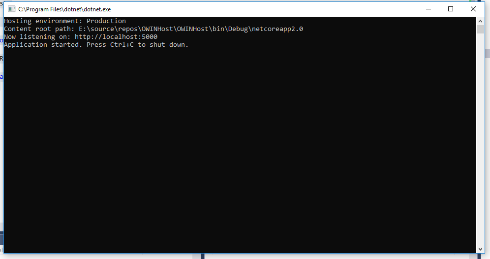

## OWIN

The Open Web Interface for .NET (OWIN) is a standard that defines an interface between .NET servers and web applications. It is a [community-driven specification](http://owin.org/) published under the Creative Commons license  that aims to decouple the host, the server and the application framework from each other, effectively eliminating environmental dependencies from the application. Ruby on Rails(RoR) has a similar specification called RACK which was a minimal contract between the server and the RoR application.

OWIN provides three main benefits

1. It decouples applications and web servers allowing more independence for both, so they can evolve independently.
2. This abstraction allows applications to be more portable, usable in various execution environments (hosting environments) and even on different technological platforms.
3. It encourages the development of simpler modules for .NET web development which can be composed together to form a powerful web application.

OWIN, thus allows .NET web applications to be run outside of the traditional IIS environment and even on non-windows platforms such as Linux,  since the host, server, and web application are completely decoupled.

The OWIN standard distinguishes five main agents that make up the chain of responsibilities needed to process requests coming from a client. Each suggests the possibilities for modularization proposed by this specification:

1. **Host -** The process on which the server and the application are executed.
2. **Server -** When executed on a host, opens a port and remains listening to communicate with the clients, processing the requests using the “protocol” defined by OWIN. Sometimes the server needs to have adaptors available that are capable of translating data into OWIN semantics. It is also possible to find software components that act at the same time as a server and the host of an application.
3. **Middleware -** Transverse components installed between the server and the application, capable of examining, directing, or modifying requests and responses to obtain a result. Normally, here we find very specialized modules that perform specific tasks such as routing requests to the appropriate component, managing security, and so on.
4. **Web framework -** A special type of middleware that is much more complex and reaches further than modules, because its mission is to provide an API, tools, and functionalities that simplify the process of building applications, which can be used to process requests with a higher level of abstraction. Sometimes these frameworks need adaptors to understand the information received from the server using the OWIN specification.
5. **Web application -** Usually built on a framework and in charge of the final processing of requests.

OWIN describes a way of building software modules (called middleware components) that can process HTTP requests and responses. It also describes a way in which those modules can be composed in a processing pipeline and defines how that pipeline can be hosted without relying on any specific web server or host or the features of a particular development stack. The same web application can be hosted on any compliant web server, regardless of the system platform provided it implements the host interface.

## OWIN Implementation

OWIN defines the interface used to communicate between each part of the pipeline. This is a uniform interface that all parts of the pipeline implement. These pipeline components are called middleware. The web framework also implements the interface. The web server communicates with the pipeline through the interface. By implementing a uniform interface, you can compose a pipeline as you like. You can put more middleware into it, you can take pieces out, or you can swap them around. Because they all use the same interface, they can be rearranged as needed.

The central idea of OWIN interface specification can be expressed in two core data structures, a dictionary and a Function delegate commonly referred to as an App Func.

At any instant, the state of an HTTP transaction and the server-side processing of it is represented by a dictionary commonly known as the environment dictionary represented by an IDictionary<string, object="">. The environment dictionary acts as a store for all requests, response, and state data, and it’s the responsibility of an OWIN-compatible server to populate it with relevant data which can then be consumed by the applications. Some of the required dictionary keys are owin.RequestBody, owin.RequestHeaders, owin.RequestMethod, owin.RequestPath etc.

The AppFunc delegate Func<IDictionary<string, object>, Task> takes the environment dictionary and returns a task object. This allows us the chain actions on the dictionary. All applications should implement this delegate to be OWIN compliant.

A detailed post on the architecture and design of the ASP.Net core middleware is [available here.]()

## Katana

[Project Katana](https://github.com/aspnet/AspNetKatana) is an implementation of OWIN by the .Net foundation. It is the code name for a set of Microsoft’s .NET 4.5–based components that utilize the OWIN specification to implement various functionalities in ASP.NET 4.6. Katana uses a layered architecture that consists of four layers: Host, Server, Middleware, and Application similar to the layers in the OWIN specification.

1. **Host Layer -** The host layer is the layer that hosts the application in a process on the operating system. The host is also responsible for setting up a server layer and  
    constructing the OWIN pipeline. Katana support three different hosting scenarios namely IIS/ASP.NET, OwinHost.exe, and custom host.
2. **Server Layer -** The server layer is the layer that opens a network socket, listens as requests come in, and sends the request through the OWIN pipeline. There are two implementations of this layer namely SystemWeb and HttpListener. The former is used by the IIS/ASP.NET hosts while the later is used both by OwinHost and the custom host.
3. **Middleware Layer -** The middleware layer is the layer that has one or more middleware components, which are invoked sequentially in the order that they were added to the OWIN pipeline.
4. **Application Layer -** The application layer, which is the actual application that is supported by all the underlying layers. It implements the logic to configure and compose the middleware components.

## Kestrel

[Kestrel](https://github.com/aspnet/KestrelHttpServer) is a lightweight cross-platform web server that supports .NET Core and runs on multiple platforms such as Linux, macOS, and Windows. Kestrel is fully written in .Net core. It is based on libuv which is a multi-platform asynchronous eventing library. Libuv is also at the heart of Node.js. Another hosting option is WebListener or HTTP.sys which is windows only. HTTPSys offers better performance than Kestrel as it is fully optimized and targetted for Windows OS.

Technically speaking Kestrel provides an implementation of IServer defined in Microsoft.Aspnetcore.Hosting. The IServer interface is defined by a Start method and a Features property. The implementation of the Start method is responsible for configuring and starting the server. It creates the HTTPContext , sets up the Request and Response properties and calls the configure method. The Features property indicates the features supported by the server. The behavior exposed by the HTTPContext class is internally implemented by the supported features. For e.g the Request, Response and Session objects exposed by HTTPConext are obtained by implementing IHttpRequestFeature, IHttpResponseFeature, and ISessionFeature respectively. A server needs to minimally support the IHttpRequestFeature and the IHTTPResponseFeature. The definition of these features can be seen at Github [here.](https://github.com/aspnet/HttpAbstractions/tree/87cd79d6fc54bb4abf07c1e380cd7a9498a78612/src/Microsoft.AspNetCore.Http.Features)

Kestrel isn’t a full-featured web server, it’s a small, fast web server geared toward serving dynamic content from ASP.NET Core. It is designed to run behind a proxy like IIS on windows or NGINX on Linux/MacOS , and should not be used to directly host ASP.NET Core or any other application in production environments. Kestrel is packaged as a [NuGet library](https://www.nuget.org/packages/Microsoft.AspNetCore.Server.Kestrel/) and can easily be run on the command line to listen and respond to web requests from a specified port (default 5004). Kestrel does not support buffering, Web-sockets, HTTP2 or direct file transmission.

In code, we can start Kestrel as shown below. The main method in program.cs sets up webhostbulder to use kestrel. It also specifies the startup class to be used. The startup class uses the convention based configure method to return a string in the response body.

```csharp
using System.IO;
using Microsoft.AspNetCore.Hosting;


namespace OWINHost
{
    class Program
    {
        static void Main(string[] args)
        {
            var host = new WebHostBuilder()
                 .UseKestrel()
                 .UseContentRoot(Directory.GetCurrentDirectory())
                 .UseStartup<Startup>()
                 .Build();

            host.Run();
                
        }
    }
}
```

```csharp
using Microsoft.AspNetCore.Http;
using Microsoft.AspNetCore.Builder;


namespace OWINHost
{
    public class Startup
    {
        public void Configure(IApplicationBuilder app)
        {
            app.Run(async (context) =>
            {
                await context.Response.WriteAsync("<h1>Hello from the owin host</h1>");
            });
        }
    }
}
```

When the application is executed, kestrel prints the port it is listening on.



 We can now point a browser at this URL to get the output as shown below.


Now we have a console based web host which can serve web apps.
