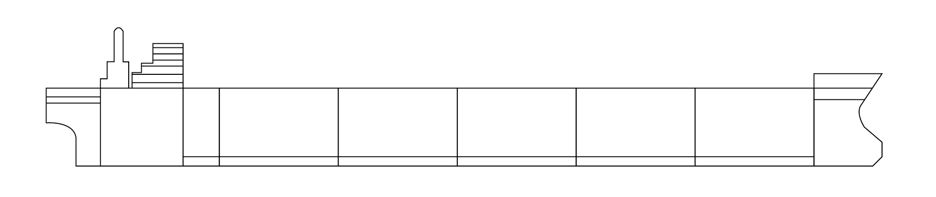
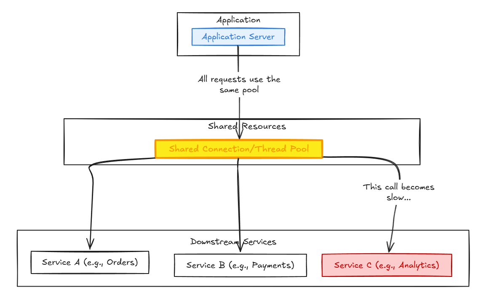
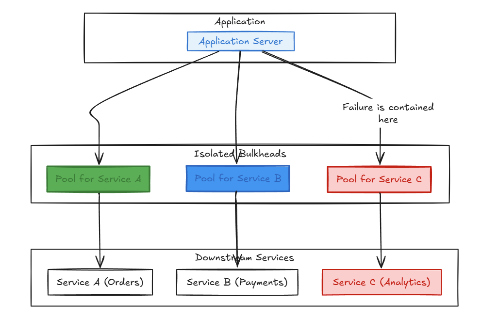

In the world of microservices and distributed systems, one of the  biggest concerns is a chain reaction failure. How a small issue in one non-critical component can bring down an entire application? This phenomenon, known as a **cascading failure**, is a common and dangerous problem. Thankfully, there are design patterns to protect against such failures.

One such pattern is the **Bulkhead Pattern**, a simple but powerful technique for building fault-tolerant and resilient applications.

## **The Analogy: A Ship's Hull**

The pattern's name comes from a brilliant piece of naval engineering. A ship's hull is divided into separate, watertight compartments called bulkheads. If the hull is breached—say, by hitting an iceberg—only the damaged compartment floods. The bulkheads contain the water, preventing the entire ship from sinking and giving the crew time to manage the crisis.



The Bulkhead pattern applies this exact same principle to software design: **isolate resources to contain failure.**

## **The Problem: Cascading Failures**

Imagine a typical application that relies on several backend services. Let's say it has one central thread pool (or connection pool) to handle all outgoing requests.



Now, what happens if Service C, a less critical service (perhaps for analytics), becomes extremely slow or unresponsive?

1. Requests to Service C start to pile up.  
2. Each waiting request holds onto a connection or thread from the shared pool.  
3. Very quickly, all available resources are consumed by requests waiting for Service C.  
4. When a user tries to access a critical feature that calls Service A or Service B, there are no available resources. The application can't process their request.

The entire application grinds to a halt, all because one service failed. The failure has cascaded across the system.

## **The Solution: Partitioning Resources**

The Bulkhead pattern solves this by partitioning resources. Instead of one giant, shared connection pool, we create separate, smaller pools for each service or group of services.


Now, if Service C fails, it only consumes resources from its own dedicated pool. The pools for Service A and Service B are completely unaffected. Critical features of the application remain available, and the system can continue to function, albeit in a slightly degraded state. We've successfully contained the failure.

## **How to Implement Bulkheads**

The concept of "resource partitioning" can be applied at several levels:

1. **Connection Pools:** As in our example, maintain separate connection pools for calls to different microservices. This is one of the most common implementations.  
2. **Thread Pools:** Allocate separate thread pools for different features or tasks. If a set of tasks becomes resource-intensive, it won't starve other critical tasks of CPU time.  
3. **Process-Level Isolation:** The most robust form of bulkhead is to deploy services as separate processes. This is the foundation of containerization with tools like Docker and Kubernetes. Each container has its own CPU and memory limits, creating a strong barrier that prevents a faulty service from consuming all the host's resources.

Here’s a conceptual Java example using the popular **Resilience4j** library to create bulkheads.

```java
import io.github.resilience4j.bulkhead.Bulkhead;  
import io.github.resilience4j.bulkhead.BulkheadConfig;  
import io.github.resilience4j.bulkhead.BulkheadRegistry;  
import java.time.Duration;  
import java.util.function.Supplier;

public class BulkheadExample {

    // Assume these methods make network calls to different services  
    public String callOrderService() {  
        // ... logic to call the critical order service  
        System.out.println("Making a call to the Order Service...");  
        return "Order #12345";  
    }

    public String callRecommendationService() {  
        // ... logic to call the non-critical recommendation service  
        try {  
            // Simulate a slow service  
            Thread.sleep(2000);  
        } catch (InterruptedException e) {  }  
        System.out.println("Making a call to the Recommendation Service...");  
        return "You might also like...";  
    }

    public static void main(String[] args) {  
        BulkheadExample services = new BulkheadExample();

        // 1. Create separate bulkhead configurations  
        BulkheadConfig orderBulkheadConfig = BulkheadConfig.custom()  
                .maxConcurrentCalls(10) // More resources for the critical service  
                .maxWaitDuration(Duration.ofMillis(500)) // Don't wait too long  
                .build();

        BulkheadConfig recommendationBulkheadConfig = BulkheadConfig.custom()  
                .maxConcurrentCalls(3) // Fewer resources for the non-critical service  
                .maxWaitDuration(Duration.ofMillis(100))  
                .build();

        // 2. Create a registry and add the bulkheads  
        BulkheadRegistry registry = BulkheadRegistry.ofDefaults();  
        Bulkhead orderBulkhead = registry.bulkhead("orderService", orderBulkheadConfig);  
        Bulkhead recommendationBulkhead = registry.bulkhead("recommendationService", recommendationBulkheadConfig);

        // 3. Decorate service calls with their respective bulkheads  
        Supplier<String> orderSupplier = Bulkhead.decorateSupplier(orderBulkhead, services::callOrderService);  
        Supplier<String> recommendationSupplier = Bulkhead.decorateSupplier(recommendationBulkhead, services::callRecommendationService);

        // 4. Simulate traffic  
        // Critical order service calls succeed because their bulkhead is separate  
        for (int i = 0; i < 10; i++) {  
            try {  
                System.out.println("Order result: " + orderSupplier.get());  
            } catch (Exception e) {  
                System.err.println("Order call failed: " + e.getMessage());  
            }  
        }

        // Non-critical recommendation service calls will fail fast if they  
        // exceed their smaller bulkhead, protecting the rest of the app.  
        for (int i = 0; i < 10; i++) {  
             new Thread(() -> {  
                try {  
                    System.out.println("Recommendation result: " + recommendationSupplier.get());  
                } catch (Exception e) {  
                    System.err.println("Recommendation call failed: " + e.getMessage());  
                }  
            }).start();  
        }  
    }  
}
```

This Java code snippet demonstrates the Bulkhead Pattern implementation using the Resilience4j library to prevent cascading failures between services with different criticality levels. The pattern is implemented by creating two distinct bulkhead configurations with different resource allocations: the critical Order Service gets a generous bulkhead with 10 concurrent calls and 500ms wait time, while the non-critical Recommendation Service is constrained to only 3 concurrent calls with a 100ms wait time. Each service method is wrapped using `Bulkhead.decorateSupplier()`, which transforms the original service calls into bulkhead-protected suppliers that enforce these resource limits at runtime.

The implementation's effectiveness is demonstrated through the traffic simulation in the main method, where 10 sequential order service calls succeed due to the fast response time and adequate resource allocation, while 10 concurrent recommendation service calls (each taking 2 seconds due to the simulated delay) result in only the first 3 executing successfully. The remaining 7 recommendation calls fail fast with bulkhead exceptions rather than consuming system resources or blocking other operations. This approach ensures that the slow, non-critical recommendation service cannot monopolize system resources or impact the critical order service, effectively compartmentalizing failures and maintaining overall system stability even when individual services experience performance degradation.

## **Benefits of the Bulkhead Pattern**

1. **Fault Isolation:** Prevents a failure in one part of the system from bringing everything down. This is its primary purpose.  
2. **Increased Resilience:** The application can gracefully degrade instead of failing completely, improving the user experience.  
3. **Prevents Resource Starvation:** Ensures critical services always have a share of resources and can't be starved by a misbehaving service.  
4. **Customized Configurations:** Allows you to fine-tune resource allocation (like timeouts and pool sizes) for each specific downstream service.

## **Drawbacks and Considerations**

1. **Increased Complexity:** Managing multiple resource pools is inherently more complex than managing a single one.  
2. **Resource Overhead:** Partitioning can lead to some resources sitting idle. A portion of the connection pool for a rarely used service might be wasted, whereas a single large pool might have used those connections more efficiently (at the risk of cascading failure).  
3. **Configuration Tuning:** Sizing the bulkheads requires careful thought. If a pool is too small, it might be overwhelmed by normal traffic spikes. If it's too large, it wastes resources.

## **When Should You Use It?**

The Bulkhead pattern is highly recommended when:

* Your application consumes a set of services with varying levels of criticality or stability.  
* You need to protect your application from failures in third-party APIs that are outside of your control.  
* You are building a system where high availability is crucial, and the ability to gracefully degrade is a requirement.

## **Conclusion**

The Bulkhead pattern is a fundamental tool for building robust, cloud-native applications. By thoughtfully isolating resources, we can contain failures, prevent them from cascading, and create systems that are far more resilient. Just like the engineers who designed the first watertight ships, we can design our software to withstand unexpected damage and keep sailing smoothly.