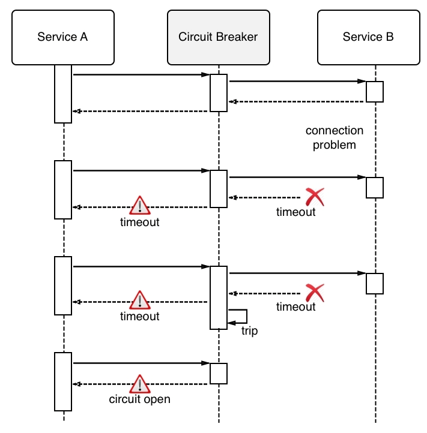

In a microservices based distributed system each service is interdependent on other services. Each service provides a specific piece of functionality and interacts with other services to complete a end user request or command. The failure of one service can lead to other services failing throughout the application. If these failures are not isolated it can lead to a single failure bringing the whole system down. To manage this problem and prevent a cascading service failure, we can use a resilience pattern called **circuit breaker**. This pattern is used to avoid a distributed application going down due to cascading failure of certain essential components. Circuit breakers help to avoid one failing component tearing down other dependent services in a domino effect. The key idea is for a service to fail fast if a dependent resource is not available, as opposed to waiting for a timeout/error for each service invocation during the period in which the dependent resource is down.

This not only benefits the caller by insulating it from the faulty service but also has the effect of reducing the load on the struggling service, giving it some time to recover. It would also be possible to monitor such occurrences and reinforce the resources for the overwhelmed service in response to the increased load. When the service has had some time to recuperate, the circuit breaker should snap back into a half-closed state in which some requests are sent in order to test whether the service is back in shape. If not, then the circuit breaker can trip again immediately; otherwise, it closes automatically and resumes normal operations.

A circuit breaker is used to isolate a faulty service. A Circuit breaker is used to wrap a fragile function call (or an integration point with an external service) in a special (circuit breaker) object, which monitors for failures. Once the failures reach a certain threshold, the circuit breaker trips, and all further calls to the circuit breaker return with an error, without the protected call being made at all. In the diagram below a circuit breaker is used to wrap calls to Service B and is designed to trip whenever Service B reaches a failure threshold.

Circuit Breaker

## Circuit Breaker - States

A circuit breaker operates as a state machine with three distinct states that govern its behavior.


stateDiagram-v2
    %% Define the states
    state "Closed" as Closed
    state "Open" as Open
    state "Half-Open" as HalfOpen

    %% Define the behavior inside states
    Closed: Requests flow normally\nFailures are counted
    Open: Blocks all requests\nFails fast\nReset timer active
    HalfOpen: Trial request allowed

    %% Initial state
    [*] --> Closed

    %% Transitions
    Closed --> Open: Failure threshold exceeded
    Open --> HalfOpen: Reset timeout expires
    HalfOpen --> Closed: Trial request succeeds
    HalfOpen --> Open: Trial request fails

    note right of HalfOpen
      Reset timer elapsed
      Test a single request
    end note


-   **`Closed`**: This is the default, healthy state. Like a closed electrical circuit, requests flow freely from the consumer to the dependency. The circuit breaker is passively monitoring for failures (e.g., exceptions, HTTP 5xx errors, or excessive latency). Each failure increments a counter. If this counter exceeds a configured threshold within a specific time window, the breaker transitions to the `Open` state.

- **`Open`**: When the circuit is open, the connection is broken. All calls to the dependency are immediately blocked without any attempt to execute them. Instead of waiting for a timeout, the breaker returns an error or a fallback response instantly. This is the "fail-fast" principle in action. The breaker remains in this state for a configured "reset timeout" period. This timeout prevents the consumer from hammering the potentially overloaded dependency, giving it time to recover.

- **`Half-Open`**: After the reset timeout expires, the circuit breaker moves to the `Half-Open` state. This is a cautious, probing state. The breaker allows a single, trial request to pass through to the dependency.

  - **If this trial request succeeds**, the breaker assumes the dependency has recovered and transitions back to the `Closed` state, restoring the normal flow of requests. The failure count is reset.
  - **If the trial request fails**, the breaker concludes the dependency is still unavailable. It immediately transitions back to the `Open` state and starts the reset timer again, preventing another full-scale assault on the struggling service.

### The Strategic Advantages: Beyond Fault Tolerance

The benefits of the Circuit Breaker pattern extend far beyond a simple "if-error-then-stop" logic.

- **Prevents Resource Exhaustion:** This is perhaps the most critical benefit. A slow or failing service can cause "request queueing" in the calling service. Threads get blocked, connection pools are exhausted, and memory usage spikes. The circuit breaker prevents this by failing fast, releasing those resources immediately so the calling service can remain healthy and serve other requests.

- **Enables Graceful Degradation and Fallbacks:** When a circuit is open, you aren't forced to return a raw error. This is your opportunity to implement a fallback strategy. For example, if a product recommendation service is down, you could:

  - Return a cached, slightly stale list of recommendations.
  - Return a generic, top-10 bestseller list.
  - Return an empty list with a message like, "We're having trouble fetching recommendations right now." This turns a hard failure into a degraded, but still functional, user experience.
- **Enhanced Observability:** The state changes of a circuit breaker are powerful operational signals. A circuit transitioning to `Open` is a high-fidelity alert that a dependency is in serious trouble. By monitoring the state of your circuit breakers, you gain immediate, actionable insight into the health of your distributed system, often faster than traditional health checks.

- **Self-Healing Systems:** By automatically testing the waters in the `Half-Open` state and closing the circuit upon success, the pattern facilitates automatic recovery without manual intervention. This reduces operational overhead and improves the Mean Time to Recovery (MTTR).

### The Hard Part: Configuration and Nuance

Implementing a circuit breaker is easy; configuring it correctly is hard. The effectiveness of the pattern hinges on tuning its parameters, which are highly context-dependent:

- **Failure Threshold:** How many failures trigger the breaker? Is it a raw count (e.g., 20 failures) or a percentage (e.g., 50% of requests)? A threshold that's too low will cause the circuit to trip on transient glitches. Too high, and it won't trip in time to prevent resource exhaustion.
- **Time Window:** Over what period are failures counted? A short window is sensitive to bursts of errors, while a long window is better for detecting sustained, low-level problems. Most modern implementations use a "sliding window" for more accurate, real-time metrics.
- **Reset Timeout:** How long should the breaker stay `Open` before moving to `Half-Open`? Too short, and you don't give the downstream service enough time to recover. Too long, and you prolong the outage for your users unnecessarily.

These values are not "set-and-forget." They should be determined through load testing and refined over time by observing the system's real-world behavior.

### The Circuit Breaker in the Resilience Ecosystem

The Circuit Breaker pattern doesn't live in a vacuum. It works best as part of a comprehensive resilience strategy, often in conjunction with other patterns:

-   **Retry Pattern:** Retries are for transient, short-lived errors (e.g., a brief network blip). A good strategy is to retry a few times quickly, but to have a circuit breaker wrap the retry logic. This prevents a "retry storm"---endlessly retrying a call against a service that is fundamentally broken, which only makes the problem worse.
-   **Bulkhead Pattern:** While a circuit breaker protects against a failing dependency, a bulkhead isolates resources (like thread pools) for *different* dependencies. This ensures that a failure in Service A (which trips its circuit breaker) doesn't consume all the resources needed to call the healthy Service B.
-   **Fallback Pattern:** As mentioned, this is the action taken when the circuit is `Open`. It is the "what to do instead" part of the equation.

## Modern Implementations

While you can implement a circuit breaker from scratch, it's almost always better to use a battle-tested library.

- **Legacy:** **Netflix Hystrix** was the pioneering library in the Java world that popularized this pattern. While it's now in maintenance mode, its influence is undeniable.
- **Modern Libraries:**
  - **Java:** [**Resilience4j**](https://resilience4j.readme.io/) is the de-facto standard, offering a lightweight, modular approach.
  - **.NET:** [**Polly**](https://www.google.com/search?q=http://www.thepollyproject.org/) is an incredibly powerful and expressive resilience framework.
  - **Python:** [**pybreaker**](https://www.google.com/search?q=https://pybreaker.readthedocs.io/en/latest/) is a solid and straightforward implementation.
- **Service Meshes:** In modern cloud-native architectures, circuit breaking is often handled at the infrastructure layer by a **service mesh** like [**Istio**](https://istio.io/) or [**Linkerd**](https://linkerd.io/). They can enforce circuit breaking policies transparently, without any changes to the application code. This decouples resilience logic from business logic, which is a powerful architectural advantage.

## Conclusion

The Circuit Breaker pattern is a fundamental building block for creating distributed systems that are robust, resilient, and user-friendly. By failing fast, preventing resource exhaustion, and enabling graceful degradation, it transforms inevitable failures from system-wide catastrophes into manageable, isolated events. Understanding not just *how* it works, but *why* it's so strategic, is key to moving from simply writing code to architecting truly resilient applications.