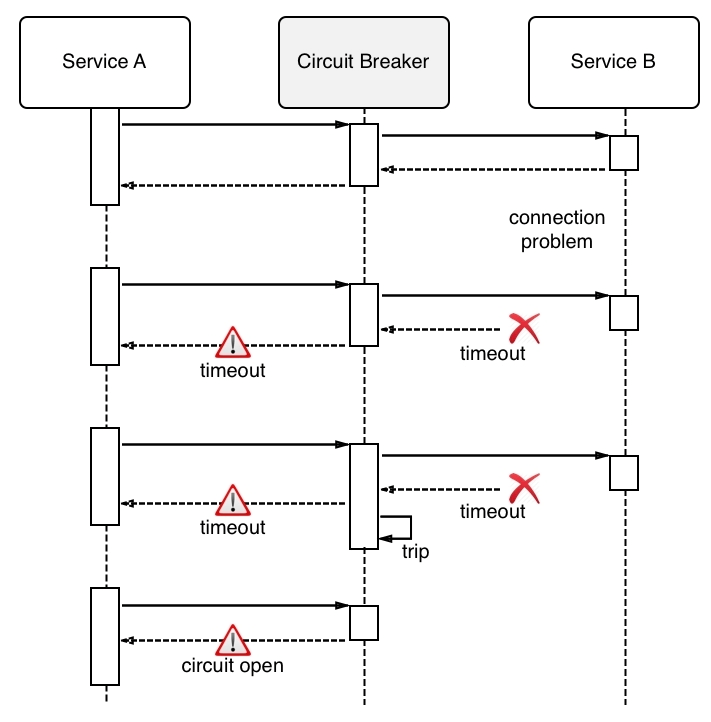

In a microservices based distributed system each service is interdependent on other services. Each service provides a specific piece of functionality and interacts with other services to complete a end user request or command. The failure of one service can lead to other services failing throughout the application. If these failures are not isolated it can lead to a single failure bringing the whole system down. To manage this problem and prevent a cascading service failure, we can use a resilience pattern called circuit breaker. This pattern is used to avoid a distributed application going down due to cascading failure of certain essential components. Circuit breakers help to avoid one failing component tearing down other dependent services in a domino effect. The key idea is for a service to fail fast if a dependent resource is not available, as opposed to waiting for a timeout/error for each service invocation during the period in which the dependent resource is down.

This not only benefits the caller by insulating it from the faulty service but also has the effect of reducing the load on the struggling service, giving it some time to recover. It would also be possible to monitor such occurrences and reinforce the resources for the overwhelmed service in response to the increased load. When the service has had some time to recuperate, the circuit breaker should snap back into a half-closed state in which some requests are sent in order to test whether the service is back in shape. If not, then the circuit breaker can trip again immediately; otherwise, it closes automatically and resumes normal operations.

A circuit breaker is used to isolate a faulty service. A Circuit breaker is used to wrap a fragile function call (or an integration point with an external service) in a special (circuit breaker) object, which monitors for failures. Once the failures reach a certain threshold, the circuit breaker trips, and all further calls to the circuit breaker return with an error, without the protected call being made at all. In the diagram below a circuit breaker is used to wrap calls to Service B and is designed to trip whenever Service B reaches a failure threshold.

Circuit Breaker

## Advantages

* _Monitoring_ -  The circuit breaker is valuable for monitoring. If a service goes down, it should be monitored, properly logged somewhere, and recovered from a failure state.

* _Fault-tolerance_ -  When you test various states in your circuit breaker, this helps you add logic to create a fault-tolerant system. For example, if a service is unavailable, then we can add logic to fetch to retrieve information from a cache.

* _Reduced load_ - If a service is slow or down, a circuit breaker can handle this situation by serving a cached page or a timeout page. This helps the impacted services to recover by reducing their load.

## Circuit Breaker - States

* _Closed_ -  In the closed state operations that involve the dependency can happen normally. At this time, all the calls are being made successfully to the service, and we are getting proper responses. We can add a threshold number for errors before the circuit breaker gets into the open state. When requests start to fail for a dependent service within a time window, the failure count is incremented to keep count of the number of failures. If the failures are greater than the threshold, the circuit for that dependency is moved to the Open state.

* _Open_ - As the name suggests, the circuit is open or we are in an error state, so none of the calls will be made to the service being called. Whenever a failure has been detected, the circuit opens, making sure that the service short-circuits requests involving the dependency and responds immediately. Periodically, after some configured amount of time, a single request is let through and the circuit moves to the Half-Open state.

* _Half-Open_ - Once our circuit goes into the open state, the circuit breaker will keep a check on the service being called to make sure things work normally once the service is healthy again. To do so, the circuit breaker gets into the half-open state after staying for a predefined period in the open state. In the half-open state, the circuit breaker will try calling the end service again; if the call succeeds, the circuit will go back to the closed state; otherwise, it will go into the open state again.

The Circuit Breaker is available as part of resiliency libraries such as pybreaker, Hystrix, Jrugged etc.
