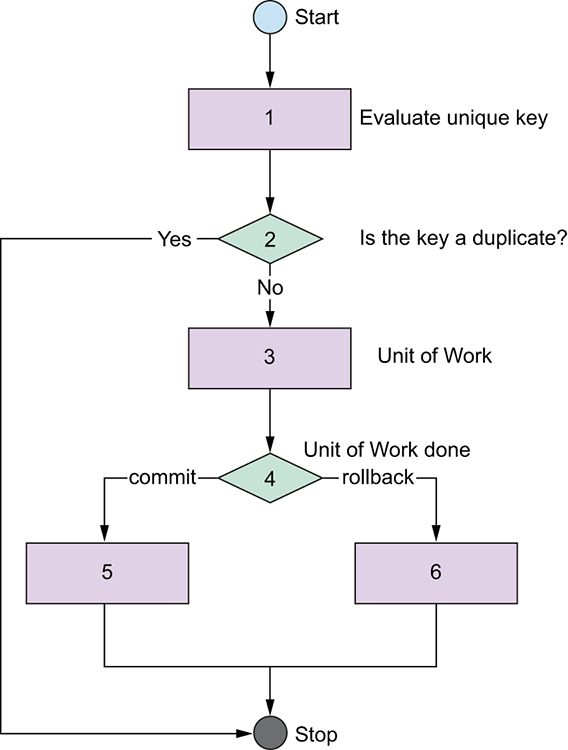

[Event-Driven architecture](https://pradeepl.com/blog/architecture/event-driven-architecture/) is itself a distributed system, a field renowned for being difficult, particularly when things go wrong. The fallacies of distributed computing always lurk around the corner. One of the fallacies is that the network is unreliable. This necessitates planning for retries in case of failures.

One issue with this is that retries can result in duplicate processing, and this can cause very real problems. Taking a payment twice from someone’s account will lead to an incorrect balance and an irate user.

To avoid processing the event multiple times, we would need Exactly once semantics to be applied. Exactly once processing is impossible to guarantee without some sort of cooperation between the broker and the consumer. If the broker uses acknowledgements to producers for publishing message, each message must have unique IDs for the broker to deduplicate retires. On the consumer side, deduplication can be used to ensure that duplicate messages are not processed. The consumption logic needs to be made _idempotent_.

Essentially, being idempotent means that when the same event/message is received multiple times, there is no change to the actor’s state. Here are some approaches:

- De-duplicate incoming messages by recognizing duplicate messages by identity.
- Design state transitioning messages to cause the same impact each time they are received.
- Allow the state transition to eliminate or negate the effect of duplicate messages.

The Idempotent Consumer pattern provides the necessary safeguards to allows logic wrapped by it to be executed only once. Two elements are needed to implement this:

- A unique identifier for each message. This can be a single identifier or a combination of multiple identifiers e.g. Message Id & Timestamp.
- An idempotent repository. Idempotent repositories store message identifiers durably across restarts. They can be implemented in database tables, files etc.

When an event arrives, the consumer needs to uniquely identify it using an event key assigned to the event. The idempotent repository is checked to see whether it contains the key, and if it does not, the logic wrapped by it is executed, otherwise it is skipped.

Idempotent Consumer Pattern - Steps

The incoming message identifier needs to be updated in the idempotent repository. There are two options to update the incoming message identifier

- Eagerly - The message identifier is updated in the idempotent repository before the logic encapsulated by the consumer is executed. If execution of the consumer logic results in an exception, then the message identifier needs to be removed from the repository to allow for message reprocessing.
- Lazily - The message identifier is updated in the idempotent repository after the logic encapsulated by the consumer is executed. If the consumer crashes and fails to update the message identifier, we run the risk of duplicate processing.

Many messaging systems, such as Apache ActiveMQ, Apache Kafka, Apache Camel have capabilities to eliminate duplicate messages. The Idempotent consumer pattern is used to provide this functionality in these systems.

> Photo by [DDP](https://unsplash.com/@moino007?utm_source=unsplash&utm_medium=referral&utm_content=creditCopyText) on [Unsplash](https://unsplash.com/search/photos/buttons?utm_source=unsplash&utm_medium=referral&utm_content=creditCopyText)
