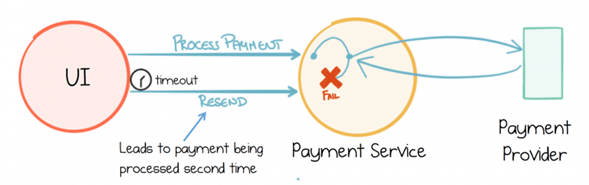

## Introduction

[Event-Driven architecture]( "Event driven architecture") is itself a distributed system, a field renowned for being difficult, particularly when things go wrong. The fallacies of distributed computing always lurk around the corner. One of the fallacies is that the network is unreliable. This necessitates planning for retries in case of failures.

One issue with this is that retries can result in duplicate processing, and this can cause very real problems. Taking a payment twice from someone’s account will lead to an incorrect balance and an irate user. Processing the same message multiple times can lead to inconsistent data and other errors.

To avoid processing the event multiple times, we would need Exactly once semantics to be applied. Exactly once processing is impossible to guarantee without some sort of cooperation between the broker and the consumer. If the broker uses acknowledgements to producers for publishing message, each message must have unique IDs for the broker to deduplicate retires. On the consumer side, deduplication can be used to ensure that duplicate messages are not processed. The consumption logic needs to be made _idempotent_.

## Idempotency

Essentially, being idempotent means that when the same event/message is received multiple times, there is no change to the actor’s state. An idempotent operation is one where the effect of performing the same operation multiple times is the same as performing it once. For example, setting a variable to a particular value is an idempotent operation because no matter how many times you set the variable to that value, the end result is the same. This concept is especially important in the design of reliable and fault-tolerant distributed systems, ensuring that if an operation is repeated (e.g., due to a retry of an unacknowledged request), it does not have unintended side effects. Idempotency is a key concept in areas such as API design, database transactions, and distributed systems, ensuring predictability and consistency in operations. Some approaches to implementing idempotency in systems are :

- De-duplicate incoming messages by recognizing duplicate messages by identity.
- Design state transitioning messages to cause the same impact each time they are received.
- Allow the state transition to eliminate or negate the effect of duplicate messages.

The idempotent consumer pattern is used to implement idempotency in message handlers.

## Idempotent Consumer Pattern

The Idempotent Consumer pattern provides the necessary safeguards to allows logic wrapped by it to be executed only once. Two elements are needed to implement this:

- A unique identifier for each message. This can be a single identifier or a combination of multiple identifiers e.g. Message Id & Timestamp.
- An idempotent repository. Idempotent repositories store message identifiers durably across restarts. They can be implemented in database tables, files etc.

When an event arrives, the consumer needs to uniquely identify it using an event key assigned to the event. The idempotent repository is checked to see whether it contains the key, and if it does not, the logic wrapped by it is executed, otherwise it is skipped. 


sequenceDiagram
  
    title: Idempotent Consumer Pattern Sequence
    participant P as Producer
    participant P as Producer
    participant C as Consumer
    participant S as Idempotent Repository

    P->>C: Send Message with unique ID
    C->>S: Check if ID exists
    alt ID exists
        S->>C: ID Found (Duplicate)
        C->>P: Acknowledge (ignore message)
    else ID not found
        S->>C: ID Not Found
        C->>S: Store ID
        S->>C: ID Stored
        C->>C: Process Message
        C->>P: Acknowledge (message processed)
    end



## Implementation Considerations

There are a few key considerations when implementing this pattern. You need a mechanism to store and quickly check the unique identifiers of processed messages. The check for duplicates should be efficient to avoid performance bottlenecks. The solution should scale as the number of messages increases. Over time, the list of processed message IDs can grow. Mechanisms to clean up old entries are important. This pattern is generally implemented in conjunction with the [transactional outbox pattern]({{ <ref "/patterns/transactional-outbox-pattern/"> }})

The incoming unique message identifier needs to be updated in the idempotent repository. There are two considerations to update the incoming message identifier

- Eagerly - The message identifier is updated in the idempotent repository before the logic encapsulated by the consumer is executed. If execution of the consumer logic results in an exception, then the message identifier needs to be removed from the repository to allow for message reprocessing.
- Lazily - The message identifier is updated in the idempotent repository after the logic encapsulated by the consumer is executed. If the consumer crashes and fails to update the message identifier, we run the risk of duplicate processing.

# Messaging systems and Message Brokers

Many messaging systems, message brokers and service buses such as Apache Kafka, Amazon SQS have capabilities to help eliminate duplicate messages and some provide exactly-once semantics too. Apache Camel: Apache Camel offers an idempotent consumer component that stores the keys of processed messages to prevent reprocessing. Apache Kafka provides exactly-once semantics which can prevent the processing of duplicate messages. This is achieved through its transactional API, which ensures that messages are written and read exactly once. Amazon SQS offers deduplication functionality for FIFO (First-In-First-Out) queues. It assigns a deduplication ID to each message, ensuring that duplicates sent within a 5-minute interval are not reprocessed. RabbitMQ can be configured for idempotency at the application level. It does not inherently deduplicate messages, but applications can implement deduplication logic using message properties like message IDs.

In some cases, especially with message brokers that don’t offer native deduplication, you may need to implement idempotency at the application level. Deduplication features can impact performance. For example, using FIFO queues in Amazon SQS may reduce the throughput compared to standard queues. While many messaging systems and service buses offer features to handle duplicate messages, the approach and effectiveness can vary. It's important to understand the capabilities and configurations of the specific technology being used to ensure effective deduplication in your application architecture.

> Photo by [DDP](https://unsplash.com/@moino007?utm_source=unsplash&utm_medium=referral&utm_content=creditCopyText) on [Unsplash](https://unsplash.com/search/photos/buttons?utm_source=unsplash&utm_medium=referral&utm_content=creditCopyText)
