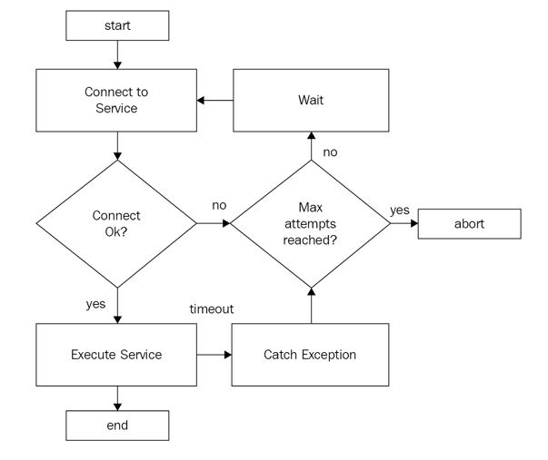

The retry pattern is an extremely important pattern to make applications and services more resilient to transient failures. A transient failure is a common type of failure in a cloud-based distributed architecture. This is often due to the nature of the network itself (loss of connectivity, timeout on requests, and so on). Transient faults occur when services are hosted separately and communicate over the wire, most likely over a HTTP protocol. These faults are expected to be short-lived. Repeating such a request that has previously failed could succeed on a subsequent attempt.  

Retry Logic

## Retry Strategies

The different retry strategies are

**_Retry -_** The source application can immediately retry to send the request to the service. If the specific fault is unusual or rare, the probability of success when repeating the request is very high.

**_Retry after a delay -_** The source application can retry to send the request to the cloud service after a period of time (that normally increases exponentially). This is a common practice when the failure event is due to reasons such as cloud service busy and so on.If the fault is caused by one of the more commonplace connectivity or busy failures, then the application has to wait for some time and try again.

**_Sliding Retry -_** The source application will retry repeatedly based on schedule and keeps adding an incremental delay in subsequent tries. For example, the retry logic may multiply the waiting period of 60 seconds by increment a try count from 1 to the number of tries and so on. This helps in reducing the overall number of retries.

**_Retry With Jitter -_** The sliding retry and the exponential backoff retry add a predictable sequence in their retry and backoff timelines. If there are multiple calls to the service at the same time and the same retry policy is applied then all the calls will retry and back off at the same time. To prevent this we need to add a certain randomness to the retry logic. This can be one by introducing a jitter to the retry policy. The jitter is a random calculation that results in different retry and backoff timelines for various calls.

**_Cancel -_** The source application can cancel the request to the cloud service and throw an exception. This is a common practice when the failure is not transient or is likely to be unsuccessful if repeated.

A real world example of policies based on retry strategy is at [this Azure guidance](https://docs.microsoft.com/en-us/azure/architecture/best-practices/retry-service-specific).

[Polly](https://github.com/App-vNext/Polly) is an example of a library which provides retry policies in .Net core. I will be writing a future blog post using polly to demonstrate both retry and [circuit breaker patterns](https://pradeeploganathan.com/patterns/circuit-breaker-pattern/).

Photo by [Juliana](https://unsplash.com/photos/8Xt1O_SalCE?utm_source=unsplash&utm_medium=referral&utm_content=creditCopyText) on [Unsplash](https://unsplash.com/search/photos/try?utm_source=unsplash&utm_medium=referral&utm_content=creditCopyText)
