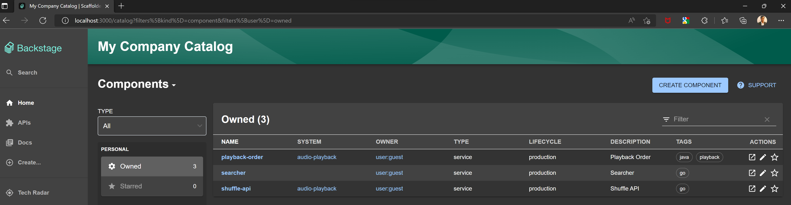
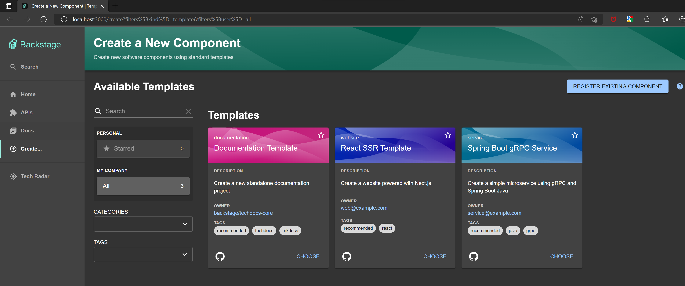

## Internal Developer Platforms (IDP)

An Internal Developer Platform (IDP) is a set of self-service tools, processes and services that help accelerate development velocity and reduce time to market. An IDP provides a standardized way for development teams to configure and deploy applications and application infrastructure. It is a self-service layer allowing developers to self-serve infrastructure requirements without having to worry about container orchestration, storage provisioning etc. IDPs support a range of infrastructure and hosting options such as public cloud, private cloud and on-premises environments. Development teams can self-serve infrastructure provisioning, application deployment or create new services thus reducing the load on platform teams. IDPs streamline infrastructure decisions and integrate with existing build and deploy pipelines while providing role-based access control to developers without the need for working through a wall of YAML files.

For example, a developer creating a new microservice would start by creating a repository in SCM. They would then raise a ticket to add the necessary collaborators to the repo and provide them with the right access. They would then raise one or more tickets to create a Kubernetes cluster, storage, a database, CI/CD pipelines, configure DNS etc. An IDP can automate this process and make it frictionless. It would also remove key person dependencies and improve developer UX.

IDPs provide key features such as Infrastructure orchestration, Environment management, Deployment management, Application configuration management, and role-based access control. They promote automation, enhance integration, improve security and improve collaboration.

## Backstage

Backstage is an open source platform for building developer portals. It improves the overall developer experience by delivering the core features of a developer portal, such as Software Catalogs, templates, and documentation. It helps build self-service internal tooling to enable teams to create workloads that meet compliance, regulatory and engineering requirements. It unifies tooling, services, apps, data, and docs into a single UI that allows developers to create, manage, and explore services and components. It thus brings together all aspects of a service such as its codebase, documentation, environments, infrastructure and the people who build them.  It's functionality can be extended with third-party plugins such as [kubernetes](https://backstage.io/docs/features/kubernetes/installation), [Argo CD](https://github.com/RoadieHQ/roadie-backstage-plugins), [github](https://github.com/backstage/backstage/tree/master/plugins/github-actions), [Harbor](https://github.com/BESTSELLER/backstage-plugin-harbor) and many others.

Backstage was originally developed at Spotify as an internal developer portal. It was open sourced as a CNCF sandbox project in September 2020. It became a [CNCF incubating project](https://www.cncf.io/blog/2022/03/15/backstage-project-joins-the-cncf-incubator/) in March 2022. Backstage's [vision](https://backstage.io/docs/overview/vision) is to "to provide engineers with the best developer experience in the world.". Backstage is a react based framework providing an extensible plugin architecture. It uses the Yarn package manager. It also uses the Lerna monorepo library for managing multi-package repositories.

## Developer Platform ?


## Deploying Backstage

Backstage requires an LTS version of node and Yarn installed as prerequisites. Backstage consists of the scaffolding tools and the Backstage plugin library to create a new frontend deployment of the Backstage console. We can deploy it using npx as below.  npx runs code built with Node.js and published through the npm registry. It allows you to run and execute packages without having to install them locally or globally.

```shell
npx @backstage/create-app
```

I am choosing sqlite as the backend database for this sample deployment. PostgresSQL is the preferred database for production deployments.

```? Enter a name for the app [required]
>> Please enter a name for the app
? Enter a name for the app [required] pradeep-backstage-app
? Select database for the backend [required] SQLite

Creating the app...

 Checking if the directory is available:
  checking      pradeep-backstage-app ✔

 Creating a temporary app directory:
  creating      temporary directory ✔

 Preparing files:
  copying       .dockerignore ✔
  templating    .eslintrc.js.hbs ✔
  templating    .gitignore.hbs ✔
  copying       .prettierignore ✔
  copying       README.md ✔
  copying       app-config.production.yaml ✔
  templating    app-config.yaml.hbs ✔
  templating    backstage.json.hbs ✔
  templating    catalog-info.yaml.hbs ✔
  copying       lerna.json ✔
  templating    package.json.hbs ✔
  copying       tsconfig.json ✔
  copying       README.md ✔
  copying       README.md ✔
  templating    .eslintrc.js.hbs ✔
  copying       Dockerfile ✔
  copying       README.md ✔
  templating    package.json.hbs ✔
  copying       index.test.ts ✔
  copying       index.ts ✔
  copying       types.ts ✔
  copying       app.ts ✔
  copying       auth.ts ✔
  copying       catalog.ts ✔
  copying       proxy.ts ✔
  copying       scaffolder.ts ✔
  templating    search.ts.hbs ✔
  copying       techdocs.ts ✔
  templating    .eslintrc.js.hbs ✔
  copying       cypress.json ✔
  templating    package.json.hbs ✔
  copying       android-chrome-192x192.png ✔
  copying       apple-touch-icon.png ✔
  copying       favicon-16x16.png ✔
  copying       favicon-32x32.png ✔
  copying       favicon.ico ✔
  copying       index.html ✔
  copying       manifest.json ✔
  copying       robots.txt ✔
  copying       safari-pinned-tab.svg ✔
  copying       .eslintrc.json ✔
  copying       app.js ✔
  copying       App.test.tsx ✔
  copying       App.tsx ✔
  copying       apis.ts ✔
  copying       index.tsx ✔
  copying       setupTests.ts ✔
  copying       LogoFull.tsx ✔
  copying       index.ts ✔
  copying       Root.tsx ✔
  copying       LogoIcon.tsx ✔
  copying       EntityPage.tsx ✔
  copying       SearchPage.tsx ✔

 Moving to final location:
  moving        pradeep-backstage-app ✔

 Building the app:
  executing     yarn install ✔
  executing     yarn tsc ✔

🥇  Successfully created pradeep-backstage-app


 All set! Now you might want to:
  Run the app: cd pradeep-backstage-app && yarn dev
  Set up the software catalog: https://backstage.io/docs/features/software-catalog/configuration
  Add authentication: https://backstage.io/docs/auth/
```

This generates the code for the Backstage app. The code can be run using yarn as below.

```shell
yarn dev                                                                                                                                                               ✔
yarn run v1.22.18
$ concurrently "yarn start" "yarn start-backend"
$ yarn workspace app start
$ yarn workspace backend start
$ backstage-cli package start
$ backstage-cli package start
......
......
......
```

This starts as a development server running on port 3000.



### Service Catalog

A Service Catalog enables enterprise teams to create an organized and curated collection of all software assets within an organization.The service catalog also stores a range of metadata, including documentation,  ownership, programming language, source code, current version, previous updates etc.

### Templates



### Documentation

### Plugins

The plugin library allows you to extend Backstage with third-party plugins. The plugin library is a collection of plugins that can be installed and configured to extend Backstage. 