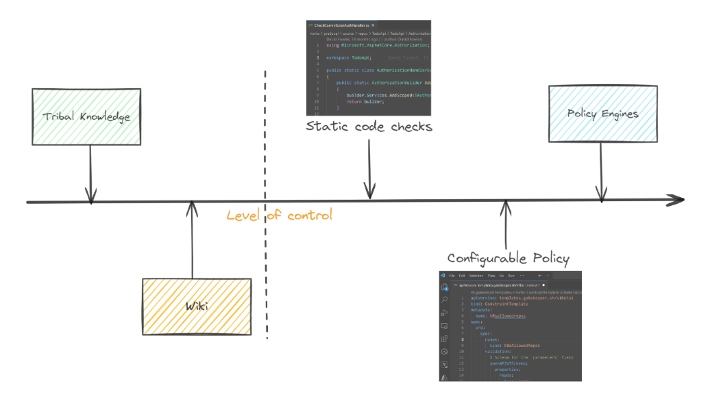

# Policy

We all interact with various policies on a daily basis, often without even realizing it. They are a set of principles, guidelines or rules that guide our decisions and actions to achieve rational outcomes. Policies are established by organizations, governments, or other entities to ensure consistent and efficient operations. They ensure compliance with laws and regulations, and guide decision-making processes. These could be Government policies, Workplace policies, educational policies, and others. For instance, a company might have a policy about expense management which employees need to follow every day. Similarly, a government's environmental policy shapes how businesses and individuals interact with the environment on a daily basis.

Organizations are governed by standards and controls established by statutory authorities. Organizational policies are setup to enforce these standards and controls. They are generally setup by Governance, Risk and Compliance (GRC) teams within an organization. For e.g the GRC team may work with the platform engineering team to ensure that sensitive data is encrypted in transit in order to adhere to industry standards. Policies governing IT infrastructure and projects are crucial for ensuring that information technology resources are built & used effectively, securely, and in alignment with an organization's standards and controls. These could be Security policies, Disaster recovery policies, Privacy policies, Software development policies, and many others. 

# From Manual to Automated: The Shift in Policy Management

Organizations generally start off with naive policy implementation processes. It is predominantly a manual and often cumbersome process. It starts off with tribal or personalized knowledge. It evolves to extensive documentation of this personalized knowledge( wiki based or document based), rigorous manual reviews, and a significant amount of human intervention. This approach, while straightforward, is fraught with challenges. Policy management processes which depend on static documents and manual enforcement create bottlenecks, breed errors, and leave security gaps wide open. It is not only time-consuming but also prone to errors and inconsistencies. As long as IT environments are relatively simple and changes less frequently, this method, despite its drawbacks, is manageable. As IT environments become more complex these policies are hard coded and automated. Any updates or enhancements to policies requires code changes that can be extensive and require multiple levels of reviews.

This landscape began to shift with the advent of automation in IT operations. The concept of [Infrastructure as Code (IaC)]() emerged as a game-changer, allowing teams to manage and provision infrastructure through code rather than manual processes. This evolution marked a significant step towards more agile and consistent IT operations, setting the stage for similar transformations in policy management. Polices became configurable and dynamic. Engines which could interpret machine based polices and apply constraints played a key role in ensuring consistency across multiple dynamically provisioned environments. This allowed for a better degree of control in agile operations.

# The Emergence of Policy as Code

Policy as Code (PaC), is a revolutionary approach that is reshaping how organizations author, enforce, manage, and understand the policies governing their IT environments. At its core, Policy as Code is the idea of writing code to manage and automate policies. This approach allows policies, which could range from security guidelines to operational best practices, to be treated just like any other codebase. Policies are version-controlled, reviewed, and automated, ensuring consistency, transparency, and speed in implementation. Think of it as a shift from manual policy reviews, manual paper trials and enforcement to a world where policies are integrated directly into the software development and deployment processes. From security guidelines to disaster recovery plans, PaC empowers us to manage all IT policies with the same agility and precision as code.

With the rapid adoption of cloud computing and the ever-growing complexity of IT infrastructure, managing policies through traditional, manual processes is becoming increasingly untenable, leading to 'Policy lag'. Policy as Code not only streamlines compliance and governance but also embeds these crucial aspects into the continuous integration and deployment (CI/CD) pipeline, ensuring that they are an integral part of the development lifecycle, not an afterthought.

# Policy as Code: A Natural Progression

Policy as Code arose as a natural progression from Infrastructure as Code. As organizations started automating their infrastructure, the need to embed compliance and governance into these automated processes became apparent. This led to the evolution of Policy as Code, where policies were no longer static documents but dynamic code snippets integrated into the IT lifecycle. This shift meant that policies could be version-controlled, tested, and deployed just like application code, ensuring greater consistency and compliance.

Today, Policy as Code is an integral part of DevOps practices. It aligns with the philosophies of continuous integration and continuous deployment (CI/CD), enabling teams to enforce policies consistently across all stages of development and operations. This integration has not only streamlined compliance but also brought about a cultural shift where policy compliance is a collective responsibility, rather than a bottleneck or an afterthought.

The journey from manual policy management to Policy as Code reflects the broader trends in IT towards automation, consistency, and speed. As we continue to embrace cloud-native technologies and microservices architectures, the role of Policy as Code is becoming increasingly central, evolving continuously to meet the demands of modern IT landscapes.

# Core Principles of Policy as Code

Policy as Code (PaC) is built upon a set of core principles that guide its implementation and ensure its effectiveness. These principles are not just technical guidelines, but fundamental philosophies that shape the entire approach to policy management. Here are some of the key principles of PaC:

## Declarative Policy Language

At the heart of Policy as Code lies the principle of translating policies - traditionally documented in lengthy, often ambiguous text - into clear, concise code. Policies are treated as code, written in human-readable languages like YAML or JSON. This code can then be executed within IT environments to enforce and validate policies automatically. By using languages like Rego for Open Policy Agent (OPA) or HCL for HashiCorp Sentinel, policies become more precise and less prone to misinterpretation. This ensures that policies become an integral part of the software development lifecycle, not separate documents.

## Version Control and Collaboration

PaC facilitates iterative policy updates and feedback loops, enabling rapid adaptation to changing needs and threats.This fosters a culture of continuous improvement, ensuring policies remain effective and relevant over time. Just like application code, policy code benefits from version control systems like Git. This practice enables tracking changes, reviewing policy updates, and maintaining a history of policy modifications. It facilitates collaboration among team members, allowing for peer reviews and discussions before policies are implemented.

Policies are managed in a central repository, providing a single source of truth and simplifying audits. Visibility into policy enforcement decisions improves security posture and compliance audits. This centralized approach facilitates collaboration and policy harmonization across teams and environments.

## Automation and Integration

Automation is a cornerstone of Policy as Code. Automated enforcement and real-time checks enhance security posture by proactively preventing policy violations and vulnerabilities. By integrating policy enforcement into CI/CD pipelines, organizations ensure that compliance checks occur automatically at various stages of software delivery. This integration enables immediate feedback and remediation, making compliance an ongoing process rather than a final hurdle. Changes to policies are deployed alongside code updates, ensuring constant compliance and rapid adaptation.

## Testing and Validation

Policy as Code allows for the implementation of automated testing frameworks. These frameworks validate policies against predefined conditions, ensuring that policies work as intended before being deployed. This approach reduces the risk of policy violations and enhances overall security and compliance posture.

These core principles guide the design and implementation of PaC, paving the way for a more efficient, secure, and adaptable approach to IT governance.

# Key Technologies and Tools in Policy as Code

Policy as Code can be implemented using various tools and technologies to enforce, manage, and automate policies. Understanding these tools is crucial for effectively implementing Policy as Code in any organization.

**Open Policy Agent (OPA):**  OPA is a general-purpose policy engine that unifies policy enforcement across the stack. It is an open-source, policy engine that decouples policy decision-making from policy enforcement. It uses a high-level, declarative language called Rego for policy definition, making it versatile for various use cases from Kubernetes admission control to microservices authorization. [My blog post here]() is a good place to get started on understanding Rego and OPA.

**Kubernetes Gatekeeper:** An extension of OPA for Kubernetes, Gatekeeper is used for enforcing custom policies on Kubernetes clusters. It provides a way to validate and mutate resource configurations, ensuring that the cluster state complies with the defined policies. [This blog post here]()helps you to get started with Gatekeeper on kubernetes.

**HashiCorp Sentinel:** An embedded policy-as-code framework integrated into the HashiCorp suite, enabling fine-grained, logic-based policy decisions.

**Terraform:** While primarily an infrastructure-as-code tool, Terraform can be used in conjunction with OPA and Sentinel for enforcing policies related to infrastructure provisioning. [This blog post here]() helps with getting started with Terraform.

The integration of these tools into the software development and deployment process ensures that policies are consistently applied and enforced. By leveraging these technologies, organizations can automate policy enforcement, reduce manual overhead, and enhance security and compliance in their IT environments.

# Best Practices for Implementing Policy as Code

Implementing Policy as Code is not just about choosing the right tools; it's about adopting practices that ensure effective policy management and compliance. Here are some best practices

__Start with Clear Policy Goals:__ Understand your organization's compliance requirements and operational constraints. Establish a clear policy framework that aligns with your business objectives and regulatory landscape. Select tools and frameworks aligned with your technical expertise, infrastructure, and policy complexity. Equip teams with the skills and knowledge to write, test, and implement PaC effectively.

__Iterative Development:__ Begin with pilot projects to gain experience and confidence before scaling PaC across the entire infrastructure. Treat policy code like application code. Start small, test your policies thoroughly, and expand coverage iteratively. This approach helps in identifying issues early and adjusting policies to fit your environment better. Prioritize essential policies to start with, like access control, security rules, and compliance requirements.

__Automated Testing and Validation:__ Implement automated testing to validate policies against different scenarios and identify potential errors or conflicts. This helps ensure that policies perform as intended and reduces the risk of violations. 

__Integration with CI/CD Pipelines:__ Embed policy checks into your continuous integration and continuous deployment (CI/CD) pipelines. This ensures that policy compliance is part of the development lifecycle, not an afterthought.

__Collaborative Policy Creation:__ Involve stakeholders from compliance, security, and operations to develop policies that balance agility and control. Align PaC initiatives with specific business goals and objectives to demonstrate tangible benefits. Keep stakeholders informed about PaC initiatives and ensure collaboration between policy owners and technical teams. Encourage teams to take ownership of policies and participate actively in the PaC process.

__Continuous Monitoring and Updating:__ Regularly review and update policies to adapt to new threats, compliance requirements, and changes in the IT landscape. Continuously monitor policy performance and effectiveness, adapting and refining them as needed.

__Documentation and Education:__  Ensure that team members understand the importance of policy compliance and are trained in using Policy as Code tools. An educated team is critical in maintaining and enhancing the policy compliance framework. Maintain clear documentation for policies and educate team members about the importance and impact of these policies.

PaC is not a one-size-fits-all solution. Carefully consider your specific needs and adapt these practices to create a successful PaC strategy for your organization.

# Conclusion

As we've explored, Policy as Code is more than just a technical shift; it's a strategic transformation aligning IT governance with the dynamic demands of modern infrastructure. By transcending traditional, manual policy management, it offers agility, consistency, and enhanced compliance in an increasingly complex digital world. From its roots in Infrastructure as Code to its integration with tools like OPA and Kubernetes Gatekeeper, Policy as Code is evolving to meet future challenges in IT governance. As you integrate these practices and tools into your workflows, remember that the journey towards effective Policy as Code is continuous, involving regular updates, collaboration, and education. Looking ahead, Policy as Code stands as a pivotal element in the ongoing evolution of IT, promising a more secure, compliant, and agile future.

As you continue to explore the nuances of Policy as Code, I recommend delving into specific tools and implementations. My posts on '[Introduction to Open Policy Agent (OPA)](),' '[Kubernetes Gatekeeper: An Introduction](),' and '[Deploying Gatekeeper and Defining Constraints]()' offer deeper insights into these tools, particularly in the context of Kubernetes and cloud environments. 

