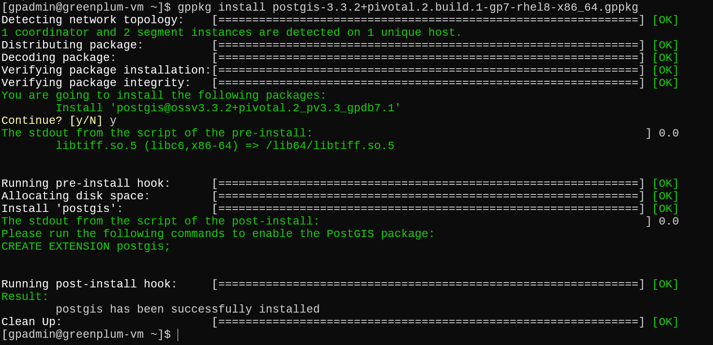
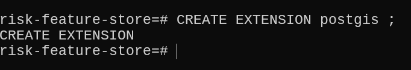
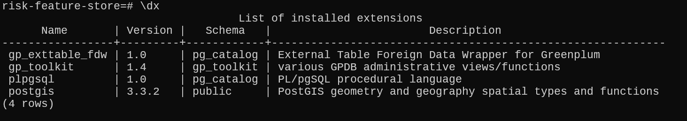
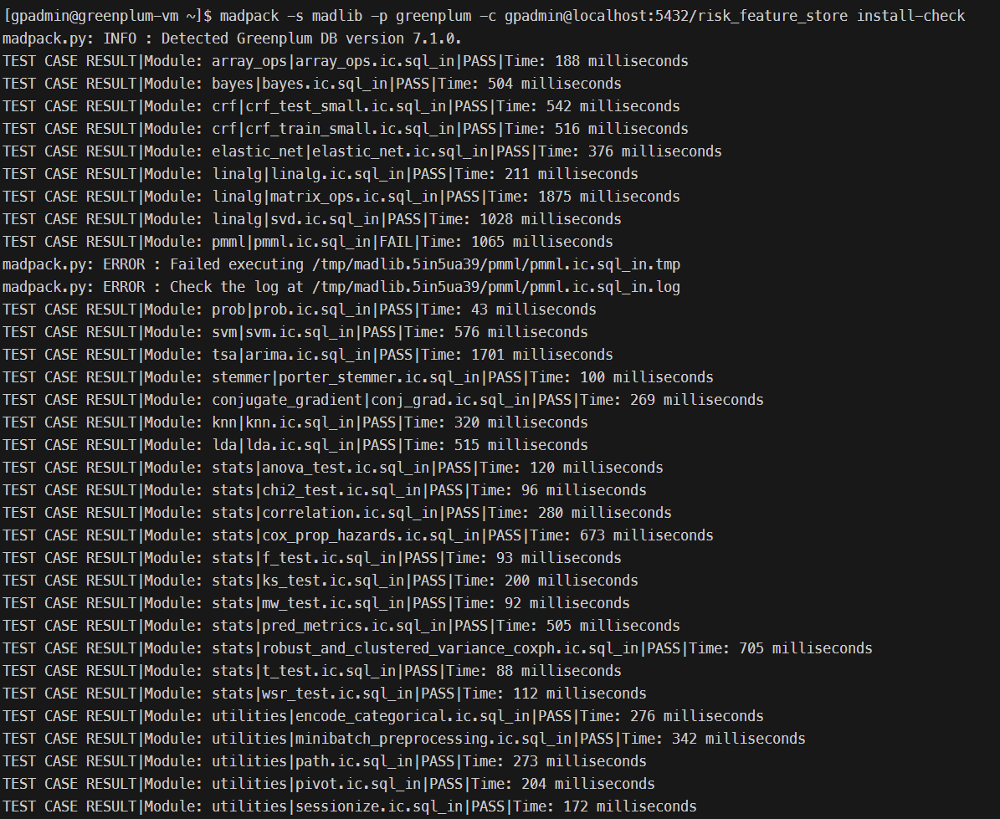
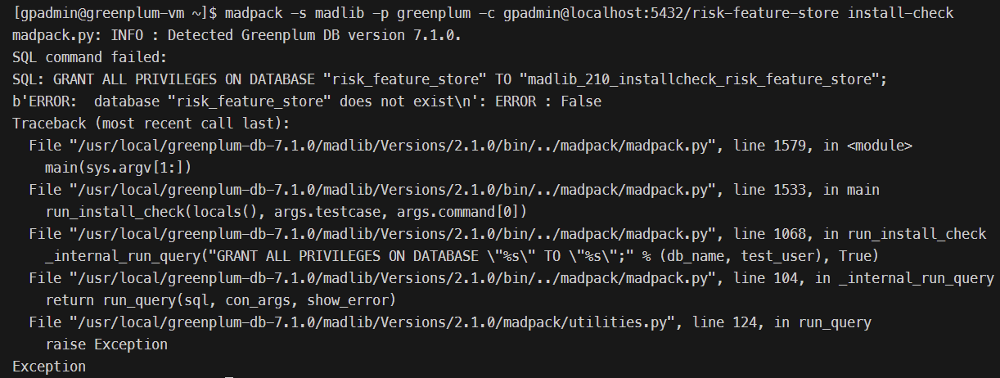
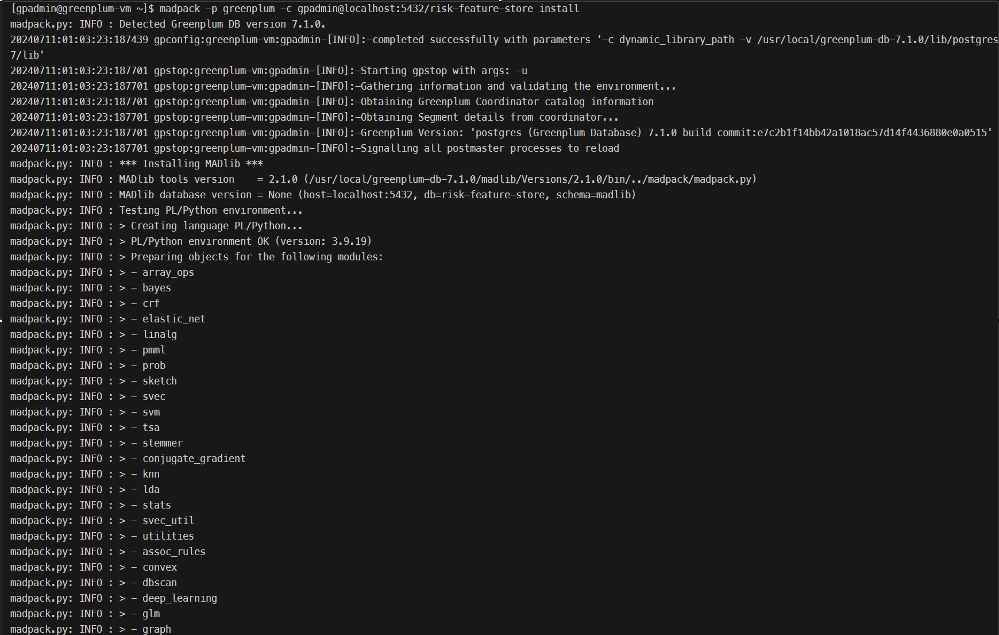

# Understanding MADlib Logistic Regression Output Tables

When you run the `madlib.logregr_train` function in MADlib, it creates several tables to store various stages of the model training process and its results. Here's a breakdown of the main tables and their purposes:

## Main Output Tables

1. **`loan_model`**:
   - This is the primary output table that stores the trained logistic regression model parameters.
   - Contains information like the coefficients of the model, the intercept, and other relevant metadata.

2. **`loan_model_summary`**:
   - Stores a summary of the logistic regression model training, including statistics like R-squared, adjusted R-squared, p-values, and other diagnostic information.
   - Useful for evaluating the model's performance and statistical significance.

## Intermediate Tables

MADlib may create several intermediate tables during the training process to facilitate computations. These tables are usually temporary and are cleaned up after the process is completed, but sometimes they might persist if there are errors or if you are debugging the process.

## Inspecting the Tables

You can inspect the created tables to understand the details of the model training:

1. **Inspect the `loan_model` Table**:

   ```sql
   SELECT * FROM loan_model;
   ```

   - This will show you the coefficients for each feature, the intercept, and possibly other model parameters.

2. **Inspect the `loan_model_summary` Table**:

   ```sql
   SELECT * FROM loan_model_summary;
   ```

   - This will give you a summary of the model's performance and other diagnostic metrics.

## Example of Inspecting Model Tables

Here's how you can inspect the created tables to understand the details of the model:

```sql
-- Inspect the trained model parameters
SELECT * FROM loan_model;

-- Inspect the model summary
SELECT * FROM loan_model_summary;
```

## Understanding the Tables

1. **`loan_model` Table**:
   - **coefficients**: This column contains the coefficients for each feature in the feature vector.
   - **intercept**: The intercept term for the logistic regression model.
   - **odds_ratios**: If included, this column will have the odds ratios corresponding to the coefficients.

2. **`loan_model_summary` Table**:
   - **r_squared**: R-squared value indicating the proportion of the variance in the dependent variable that is predictable from the independent variables.
   - **adj_r_squared**: Adjusted R-squared value.
   - **p_values**: P-values for the significance of each coefficient.
   - **std_err**: Standard error of the coefficients.
   - **z_stats**: Z-statistics for the coefficients.
   - **aic**: Akaike Information Criterion for the model.
   - **bic**: Bayesian Information Criterion for the model.

## Example Data from Tables

To give you an idea, here's an example of what you might find in these tables:

**`loan_model` Table**:
| Feature        | Coefficient | Intercept |
|----------------|-------------|-----------|
| age            | 0.005       | 0.2       |
| income         | 0.0003      |           |
| loan_amount    | -0.001      |           |
| ...            | ...         | ...       |

**`loan_model_summary` Table**:
| Metric          | Value    |
|-----------------|----------|
| r_squared       | 0.85     |
| adj_r_squared   | 0.84     |
| p_value_age     | 0.01     |
| p_value_income  | 0.05     |
| ...             | ...      |

By inspecting these tables, you can gain insights into the effectiveness and significance of your trained logistic regression model.


# Using MADlib and pgvector for Loan Application Approval

## Understanding pgvector and MADlib

### pgvector

* **What it is:** A PostgreSQL extension for efficient vector data handling.
* **Why it's important:** Enables similarity search, recommendation systems, anomaly detection, etc.
* **Key Features:** Vector data type, specialized indexes, distance metrics, operator support.

### MADlib

* **What it is:** An open-source library for scalable in-database analytics.
* **Why it's important:** Performs advanced analytics within the database, improving performance and enabling real-time analysis.
* **Key Features:** Machine learning algorithms, statistical functions, graph analysis, SQL integration.

### Combining pgvector and MADlib

1. **Feature Engineering:**
   * Prepare and clean data.
   * Extract features and vectorize them using pgvector.

2. **Model Training:**
   * Store feature vectors in a PostgreSQL table.
   * Choose a MADlib algorithm (e.g., logistic regression).
   * Train the model on the feature vectors.

3. **Model Evaluation:**
   * Assess model performance using relevant metrics.
   * Optimize hyperparameters if needed.

4. **Prediction:**
   * Extract features and create vectors for new applications.
   * Apply the trained model to get predicted probabilities.
   * Classify applications based on a threshold.


## Working with MADlib Tables

**Tables Created by `madlib.logregr_train`:**

* **loan_model:** Stores the trained model coefficients and metadata.
* **loan_model_summary:** (Optional) Provides a summary of the training process.
* **pg_temp.\_\_madlib_temp_...:** Temporary tables used during training (can be ignored or dropped).

**Inspecting and Using the Model:**

```sql
-- Get coefficients
SELECT * FROM loan_model;

-- Make predictions
SELECT madlib.logregr_predict(
  array[23, 93857.78, 124763.49, ...], -- New feature vector
  'loan_model'                         -- Model table
) AS probability; 
