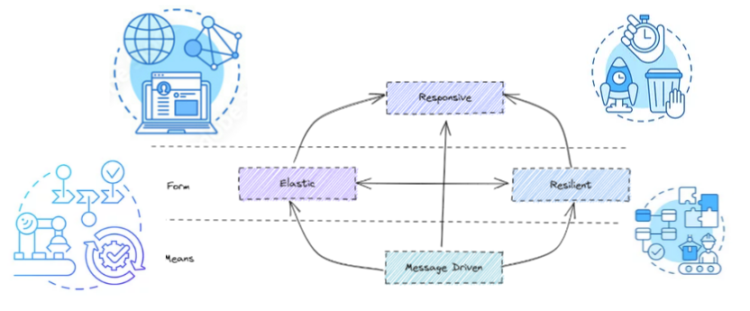
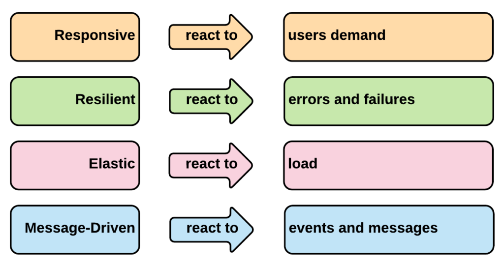

The design for Cloud native applications need to factor in the distributed nature of cloud based services. Cloud native applications face a lot of uncertainty. They need to factor in the usual concerns around network partitioning, network failures, hardware failures etc but also need to design for quota restrictions, cost, service availability and other factors. Cloud infrastructure mitigates a lot of these aspects. However, cloud native applications need to be designed to take advantage of the functionality offered by hyper-scaled infrastructure. If the application architecture is not designed to take advantage of this functionality,  Reactive architectures are well suited for cloud based and distributed systems. Systems built using reactive architectural principles are called reactive systems.

Reactive systems are responsive, resilient, elastic, and message driven. Reactive Systems are more Reliable, flexible, loosely coupled, scalable and resilient. This makes them easier to develop and easier to change. They are significantly more tolerant of failure and when failure does occur, they meet it with elegance rather than disaster. They handle requests adequately even when under load or facing failures. They communicate asynchronously and can scale individually.

The Reactive Manifesto describes how to design and architect Reactive systems according to your needs. It describes the four traits of Reactive systems. The Reactive Manifesto is currently at v.2.0, which was initially published on September 16, 2014. The manifesto is published at GitHub [here](https://github.com/reactivemanifesto/reactivemanifesto).  

Reactive Stream

This diagram is from the Reactive Manifesto. These are design and architectural principles of reactive systems. They are also known as the Four tenants of Reactive Streams.

## Principles of Reactive systems

Reactive Systems are:

### Responsive

The system responds in a timely manner if at all possible. Responsiveness is the cornerstone of usability and utility. In a Reactive World, not giving response to users when needed and not giving any response to users at all are one and the same. Responsiveness means that problems may be detected quickly and dealt with effectively. Responsive systems focus on providing rapid and consistent response times, establishing reliable upper bounds so they deliver a consistent quality of service. This consistent behavior in turn simplifies error handling, builds end user confidence, and encourages further interaction.

### Resilient

A resilient system stays responsive in the face of failure. Resilience can be achieved by various strategies such as replication , containment, isolation and delegation. When failures occur , they are contained within each component. This can be achieved by isolating components from each other and ensuring that parts of the system can fail and recover without compromising the system as a whole.

This applies not only to highly-available, mission critical systems—any system that is not resilient will be unresponsive after a failure.

1. Replication: Running the same component in more than one place, so that if one fails, another could handle it and the application can function in a normal fashion.
2. Containment/isolation: Issues of a particular component are contained and isolated within that component and don't interfere with other components or other similar components spun up as part of replication.
3. Delegation: In the case of an issue in a component, without much deliberation, the control is transferred to another similar component that is running in a completely different context.

Resilience means a Reactive system should respond to users even in the event of failures, by recovering itself. This is possible by isolating the failure handling to a different component. Recovery of each component is delegated to another (external) component and high-availability is ensured by replication where necessary. The client of a component is not burdened with handling its failures.

### Elastic

Reactive systems are responsive under varying workload. Reactive Systems can react to changes in the input rate by increasing or decreasing the resources allocated to service these inputs. This implies designs that have no contention points or central bottlenecks, resulting in the ability to shard or replicate components and distribute inputs among them. Reactive Systems support predictive, as well as Reactive, scaling algorithms by providing relevant live performance measures. They achieve elasticity in a cost-effective way on commodity hardware and software platforms.

The system should be able to shard or replicate components and distribute inputs among them. A system should have the ability to spawn new instances for downstream and upstream services for client service requests as and when needed. There should be an efficient service discovery process to aid elastic scaling.

Elasticity = Scale up/down + Scaleout/in  

1\. Scale up: When the load increases, a Reactive system should be able to easily upgrade it with more and more powerful resources (for instance, more CPU Cores) automatically, based on the demand.  
2\. Scale down: When the load decreases, a Reactive system should be able to easily degrade it by removing some resources (for instance, CPU Cores) automatically, based on demand.  
3\. Scale out: When the load increases, a Reactive system should be able to easily extend it by adding some new nodes or servers automatically, based on the demand.  
4\. Scale in: When the load decreases, a Reactive system should be able to easily sink it by removing some nodes or servers automatically, based on the demand.

### Message Driven

Asynchronous message passing is the base of reactive systems. Reactive Systems rely on asynchronous message--passing to establish a boundary between components that ensures loose coupling, isolation, and location transparency . This boundary also provides the means to delegate failures as messages. Employing explicit message-passing enables load management, elasticity, and flow control by shaping and monitoring the message queues in the system and applying back-pressure when necessary. Location transparent messaging as a means of communication makes it possible for the management of failure to work with the same constructs and semantics across a cluster or within a single host. Non-blocking communication allows recipients to only consume resources while active, leading to less system overhead.

The Message-Driven approach gives us the following benefits:

1. Messages are immutable by design .
2. They share nothing, so are thread-safe by design.
3. They provide loose coupling between system components.
4. They can work across the network, so they support Location Transparency.
5. They support scalability.
6. They support Resilience because they avoid single-point-of-failure using partitioning and replication techniques.

