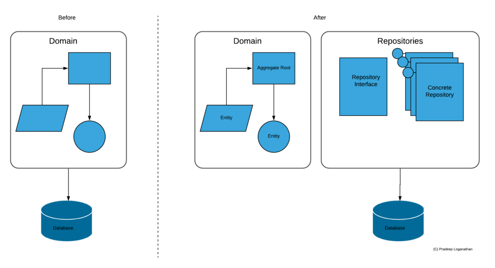
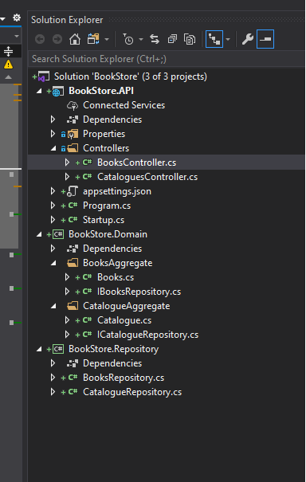
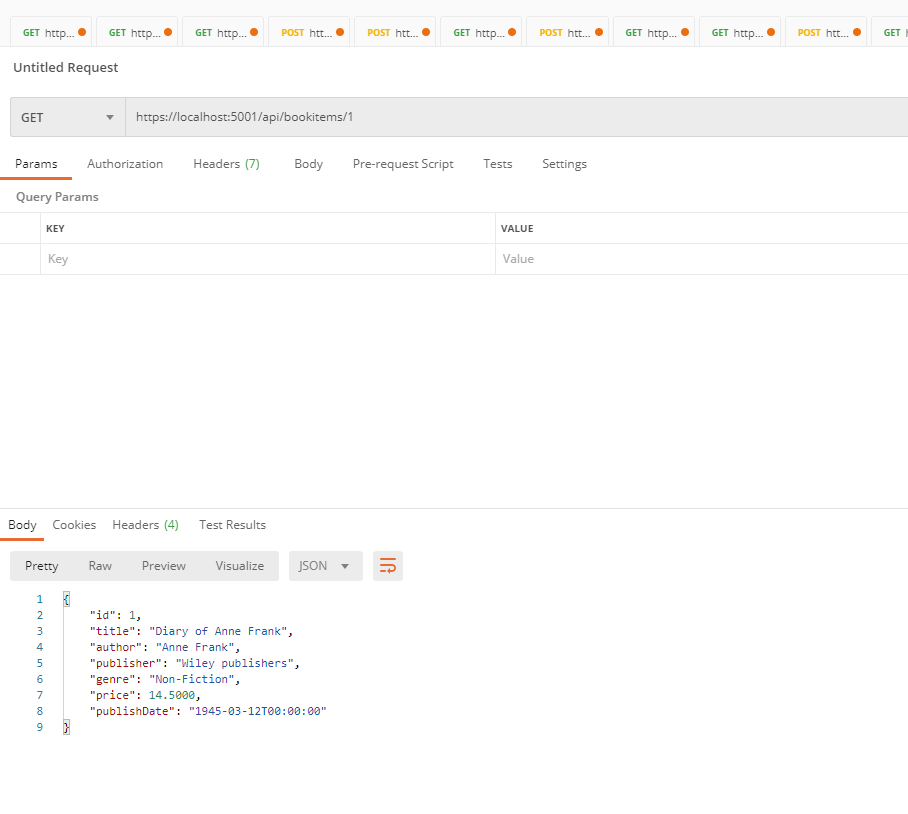

### Source Code

If you wish to follow along with the code used in this post, you can find it [on GitHub here](https://github.com/PradeepLoganathan/Repository-UOW-Sample).

### Repository Pattern

A Repository is used to manage aggregate persistence and retrieval. The repository mediates between the data-access layer and the domain. It decouples the domain layer from the data layer effectively. It does so by providing collection-like access to the underlying data. The repository offers a collection interface by providing methods to add, modify, remove, and fetch domain objects. This enables the domain to remain agnostic of the underlying persistence mechanism. This allows both these layers to evolve independently maintaining high cohesion with low coupling.



Applying Repository Pattern to Domain design

### Pros

The repository pattern abstracts the underlying technology and architecture of the persistence layer. Even though this abstraction is highly desirable, reality is that the choice of the persistence technology does influence the rest of the stack in some ways. Typically, each repository is responsible for persisting an aggregate root.

The repository pattern makes data retrieval explicit by using named query methods and limiting access to the aggregate level. It does not offer an open interface into the data model. This makes it easy to express the intent of the operation explicit in terms of the domain model. It also makes it easy to tune the queries as they are contained to the repository alone. Using the Specification pattern makes authoring named queries explicit and highly maintainable.

Implementing the Repository pattern breaks the repository layer into smaller units of easily testable code. Since the domain layer depends on the repository interface rather than the concrete implementation, it makes unit testing easier by injecting mock repositories during testing.

### Is it an Antipattern?

Some folks consider the repository pattern as an antipattern as it abstracts away the underlying persistence technology. The argument is that this abstraction does not enable the other layers to make use of the power of the persistence technology. This may be true in cases where the codebase is small. However, as the complexity of the code base increases the benefits of the repository kicks in to reduce coupling and increase cohesion. This makes the code more maintainable and testable. It also prevents the infrastructure concerns from leaking into the domain allowing it to be purely concerned with business rules.

### Implementing Repository pattern

Let us now jump into code to setup a sample API which uses the repository pattern to persist domain aggregates. The code for this post is [here on GitHub](https://github.com/PradeepLoganathan/Repository-UOW-Sample). I am creating a sample Bookstore API which is used to manage books and book catalogues. The solution has an API project and two library projects implementing the domain and the repository layer as below. The API project is responsible for REST concerns, the domain project represents the domain layer with the necessary business logic and the Repository layer represents the persistence aspects. To keep things simple the domain layer contains two aggregates (Books and Catalogue) with an entity each. The solution is setup as below



Solution structure

The BookStore.Domain project represents the domain layer. I am keeping it quite simple as described above.

```csharp
namespace BookStore.Domain.BooksAggregate
{
  public class Book
  {
        public int Id { get; set; }
        public string Title { get; set; }
        public string Author { get; set; }
        public string Publisher { get; set; }
        public string Genre { get; set; }
        public int Price { get; set; }
  }
}
```

Book Aggregate Root

```csharp
using System.Collections.Generic;
using BookStore.Domain.BooksAggregate;

namespace BookStore.Domain.CatalogueAggregate
{
    public class Catalogue
    {
        public int CatalogueId { get; set; }
        public string Name { get; set; }
        public List<Book> Books { get; set; }
    }
}
```

Catalogue Aggregate Root

#### Repository Interfaces

The above two entities represent a book and a catalogue domain object. The catalogue entity represents a collection of books that form a catalogue. The catalogue & the book entities also represent an aggregate root within this bounded context. Each aggregate root has its own repository interface IBooksRepository and ICatalogueRepository which it uses to save and retrieve its persistent state from the database. I prefer to create the Repository interfaces in the same location as the aggregate roots as it reinforces the boundary that the aggregate root implies. The initial design of the repository interfaces is below

```csharp
public interface IBooksRepository
{
  Task<Book> Get(int id);
  Task<IEnumerable<Book>> GetAll();
  Task<int> Add(Book entity);
  Task<bool> Delete(int id);
  Task<bool> Update(Book bookEntity);        
}
```

IBooksRepository

```csharp
public interface ICatalogueRepository
{
  Task<Catalogue> Get(int id);
  Task<IEnumerable<Catalogue>> GetAll();
  Task<int> Add(Catalogue entity);
  Task<bool> Delete(int id);
  Task<bool> Update(Catalogue catalogueEntity);        
}
```

ICatalogueRepository

As you can see both the repository interfaces are exactly similar except for the entity type that they manage. We can refactor these interfaces to use a generic repository interface as below.

#### Generic Repository interface

The refactored interface representing a generic repository is as below.

```csharp

public interface IGenericRepository<T> where T : class
{
  Task<T> Get(int id);
  Task<IEnumerable<T>> GetAll();
  Task<int> Add(T entity);
  Task<int> Delete(int id);
  Task<int> Update(T entity); 
}
```

Generic Repository interface

Now the other two Repository interfaces can be refactored to use the generic repository interface as below

```csharp
public interface IBooksRepository:IGenericRepository<Book>
{

}
```

Books repository Interface

```csharp
public interface ICatalogueRepository:IGenericRepository<Catalogue>
{

}
```

Catalogue repository interface

#### Concrete Repository classes

The repository layer implements the interfaces defined in each aggregate root. This allows the repository implementation to be abstracted away from the domain layer. The domain layer only deals with the abstract repositories and does not concern itself with the concrete implementation of the repository. The concrete implementation of the repository can switch between any persistence layer without impacting the domain as the interface guarantees consistency. The Repository instance uses EFCore to connect to a SQL Server instance and perform database actions. To use EFCore we need to install the below nuget packages into the BookStore.Repository project.

```shell
dotnet add package Microsoft.EntityFrameworkCore
dotnet add package Microsoft.EntityFrameworkCore.SqlServer
```

Before we can create our Concrete repository classes we need to implement a DbContext class to connect to the database. The DbContext implementation is a representation of a session between the repository and the database. It is used to query and save instances of the entities into our data source. It also provides additional functionality such as transaction control, change tracking etc.

```csharp
public class BookStoreDbContext : DbContext
{
  public BookStoreDbContext(DbContextOptions<BookStoreDbContext> options) : base(options)
  { }

  public DbSet<Book> BookItems { get; set; }
}
```

BookStoreDbContext class

Now that we have the DbContext class representing a connection to the database we can create the necessary concrete implementations of the Repository used by the two aggregate root entities Books and Catalogue. The concrete repository classes are below

```csharp

using System.Collections.Generic;
using System.Threading.Tasks;
using BookStore.Domain.CatalogueAggregate;
using Microsoft.EntityFrameworkCore;

namespace BookStore.Repository
{
    class CatalogueRepository : ICatalogueRepository
    {
        private readonly BookStoreDbContext _context;
        public CatalogueRepository(BookStoreDbContext context)
        {
            _context = context;
        }
        public async Task<int> Add(Catalogue entity)
        {
            await _context.Catalogues.AddAsync(entity);
            return 1;
        }

        public async Task<int> Delete(int id)
        {
            var catalogue = await _context.Catalogues.FindAsync(id);
            _context.Catalogues.Remove(catalogue);
            return 1;
        }

        public async Task<Catalogue> Get(int id)
        {
            return await _context.Catalogues.FindAsync(id);
        }

        public async Task<IEnumerable<Catalogue>> GetAll()
        {
            return await _context.Catalogues.ToListAsync();
        }

        public async Task<int> Update(Catalogue entity)
        {            
            var catalogue = await _context.Catalogues.FindAsync(entity);
            this._context.Entry(catalogue).CurrentValues.SetValues(entity);
            return 1;
        }
    }
}
```

Repository implementation

#### Generic Concrete Repository implementation

The Repository class for Books is also exactly similar to the catalogue repository class. We can refactor them to create a generic implementation of a concrete repository class. This generic implementation can be an abstract class and will have methods needed to perform all CRUD operations on the underlying set. The Generic repository class is below.

```csharp
public abstract class GenericRepository<T> : IGenericRepository<T> where T : class
{
        protected readonly BookStoreDbContext _context;
        public GenericRepository(BookStoreDbContext context)
        {
            _context = context;
        }

        public async Task<T> Get(int id)
        {
            return await _context.Set<T>().FindAsync(id);
        }

        public async Task<IEnumerable<T>> GetAll()
        {
            return await _context.Set<T>().ToListAsync();
        }

        public async Task Add(T entity)
        {
            await _context.Set<T>().AddAsync(entity);
        }

        public void Delete(T entity)
        {
            _context.Set<T>().Remove(entity);
        }

        public void Update(T entity)
        {
            _context.Set<T>().Update(entity);
        }
}
```

Generic Repository implementation

The repository classes can now inherit from the generic abstract repository class and implement functionality which is specific to that entity. This is one of the best advantages of the repository pattern as we can now use named queries returning specific business data. The books repository is shown below post refactoring and adding the generic repository. We can also see the use of a name query method.

```csharp

public class BooksRepository:GenericRepository<Book>, IBooksRepository
{
        public BooksRepository(BookStoreDbContext context) : base(context)
        {
            
        }

        public IEnumerable<Book> GetBooksByGenre(string Genre)
        {
            return _context.Books.Where(x => x.Genre == Genre);
        }

}
```

Books Repository

#### Generic Repository vs Specific Repository

There is a long-standing debate about the efficacy of a specific repository per aggregate root vs a generic repository. This debate is as old as the repository pattern itself. A repository is an essential part of the domain being modelled. This is the primary reason the repository interfaces for the entities are in the domain layer. Each entity is unique and has unique characteristics that impacts its persistence behavior. For e.g. Some entities cannot be deleted, some entities cannot be added, and not every entity needs a repository. Queries vary wildly and are specific to each entity. The repository API becomes as unique as the entity itself. However, it is easier to setup a generic repository initially and refactor it to be specific as the design and requirements evolve. I usually end up creating Specific repositories but abstracting away common operations into a generic abstract base repository with overridable methods.

#### Injecting Repository and DbContext

To use the BookStoreDBContext and the repositories we need to be able to inject them into the dependency injection container. We can do that by creating an extension method in the repository layer as below. (I am taking a shortcut by explicitly specifying the connection string rather than adding it to the settings file)

```csharp

using BookStore.Domain.BooksAggregate;
using Microsoft.EntityFrameworkCore;
using Microsoft.Extensions.DependencyInjection;

namespace BookStore.Repository
{
    public static class DependencyInjection
    {
        public static IServiceCollection AddRepository(this IServiceCollection services)
        {
             services.AddTransient<IBooksRepository, BooksRepository>();
            services.AddTransient<ICatalogueRepository, CatalogueRepository>();
            services.AddTransient<IUnitOfWork, UnitOfWork>();
            
            services.AddDbContext<BookStoreDbContext>(opt => opt
                .UseSqlServer("Server=localhost,1433; Database=BooksDB;User Id=sa; Password=password_01;"));
            return services;
        }
    }
}
```

Injecting Repositories and DbContext

I can now add the call to AddRepository in the startup class of the API so that this method will be called on Startup. This pattern makes it much neater to add the necessary dependencies at the appropriate layer.

```csharp
public void ConfigureServices(IServiceCollection services)
{
  services.AddRepository();
  services.AddControllers();
}
```

Now that we have the repositories and the context in place and the necessary services being injected , it is time to switch context to introduce the Unit of work pattern and tie it up with the repository pattern.

### Unit of Work

The unit of work pattern keeps track of all changes to aggregates. Once all updates of the aggregates in a scope are completed, the tracked changes are played onto the database in a transaction so that the database reflects the desired changes. Thus, the unit of work pattern tracks a business transaction and translates it into a database transaction, wherein steps are collectively run as a single unit. To ensure that data integrity is not compromised, the transaction commits or is rolled back discretely, thus preventing indeterminate state.

#### Unit of Work interface design

The unit of work interface for our sample is below

```csharp
public interface IUnitOfWork : IDisposable
{
  IBooksRepository Books { get; }
  ICatalogueRepository Catalogues { get; }
  int Complete();
}
```

Unit of Work interface

#### Unit of Work concrete implementation

The concrete implementation of the Unit of Work interface is below

```csharp
public class UnitOfWork :IUnitOfWork
{
        private readonly BookStoreDbContext _context;
        public IBooksRepository Books { get; }

        public ICatalogueRepository Catalogues { get; }

        public UnitOfWork(BookStoreDbContext bookStoreDbContext, 
            IBooksRepository booksRepository, 
            ICatalogueRepository catalogueRepository)
        {
            this._context = bookStoreDbContext;
            this.Books = booksRepository;
            this.Catalogues = catalogueRepository;
        }
        public int Complete()
        {
            return _context.SaveChanges();
        }
        public void Dispose()
        {
            Dispose(true);
            GC.SuppressFinalize(this);
        }
        protected virtual void Dispose(bool disposing)
        {
            if (disposing)
            {
                _context.Dispose();
            }
        }
}
```

Concrete implementation of Unit of Work

The Unit of work ties up all the entities involved in a logical business process into a single transaction and either commits the transaction or rolls it back.

### Stringing it all together

Now we have implemented both the repository pattern and the Unit of work pattern with the appropriate abstractions and thier concrete implementations. We can now use this to both query and to perform transactional updates of the aggregate roots to the database. We have also wired up dependency injection to provide these services to the API layer. We can now inject the unit of work into our controllers where the magic finally happens.

In the below code, I am injecting the Unit of work interface into the Books controller. I am using the unit of work to retrieve the repository and use named queries in the get method of the controller. I am also using the interface to add a book and a corresponding catalog in a transaction in the post method. This will ensure that either the book and the catalog are written to the database or both are not written to the database.

```csharp
[Route("api/[controller]")]
[ApiController]
public class BooksController : ControllerBase
{
        private IUnitOfWork _unitOfWork;
        
        public BooksController(IUnitOfWork unitOfWork)
        {
            _unitOfWork = unitOfWork;
        }

        // GET: api/<Books>
        [HttpGet]
        public async Task<IEnumerable<Book>> Get()
        {
            return await _unitOfWork.Books.GetAll();
        }

        [HttpGet]
        public IEnumerable<Book> GetByGenre([FromQuery] string Genre)
        {
            return _unitOfWork.Books.GetBooksByGenre(Genre);
        }

        // GET api/<Books>/5
        [HttpGet("{id}")]
        public async Task<Book> Get(int id)
        {
            return await _unitOfWork.Books.Get(id);
        }

        // POST api/<Books>
        [HttpPost]
        public IActionResult Post()
        {
            var book = new Book
            {
                Id = 1,
                Genre = "Technology",
                Author = "Charles Petzold",
                Title = "Programming Windows 5th Edition",
                Price = 30,
                Publisher = "Microsoft Press"
            };

            var Catalog = new Catalogue
            {
                CatalogueId = 1,
                Name = "Programming Books",
                Description = "Books on Software development"
            };

            _unitOfWork.Books.Add(book);
            _unitOfWork.Catalogues.Add(Catalog);
            _unitOfWork.Complete();
            return Ok();
        }
}
```

Books Controller

### Firing up the API

With everything tied up, we can now run the project and fire up postman to submit a get request at the books endpoint. We can now operate the books resource at this end point.



Postman - Books API

The above sample project demonstrates how the Repository and the Unit of work pattern work together to ensure a clean design to hydrate and persist aggregate roots and entities to a database.

> Photo by [@canmandawe](https://unsplash.com/@canmandawe?utm_source=unsplash&utm_medium=referral&utm_content=creditCopyText) on [Unsplash](https://unsplash.com/?utm_source=unsplash&utm_medium=referral&utm_content=creditCopyText)
