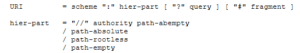

[CodeProject](http://pradeeploganathan.com)

### Identifying Resources

The key parts of a Resource oriented architecture (REST architecture) are resources, identifiers, representations, and the links between them. Designing a RESTful system starts with identifying resources. Resource identification is the most flexible aspect of designing a REST based system. There is no exact science to identifying resources and there is no right or wrong with resources identified. We can identify resources from domain nouns. A resource could be a document, a video, a business process or even a device. A resource is any entity that can be uniquely identified and manipulated. Other factors such as resource granularity, resource composition also play a key role in identifying resources.

Resources thus identified can be classified as documents, collections, and controllers. A document resource is a singular concept and is the base for all the other types of resource classifiers. Examples of document resource types are

[http://api.onlinestore.com/customer/1234](http://api.onlinestore.com/customer/1234http://api.onlinestore.com/order/o3576)

[http://api.onlinestore.com/order/o3576](http://api.onlinestore.com/customer/1234http://api.onlinestore.com/order/o3576)

A collection is a server managed set of resources. Clients can request addition, removal and modification of resources in the collection. The server can accept or deny such requests based on the domain/server logic employed. The collection also defines the identifiers for each resource in the collection. A collection resource can be used to retrieve a paginated list of contained resources. It can also be used to search and retrieve a filtered list of resources. A collection resource can be used as a factory to create member resources and perform bulk operations on them. Examples of collection resources are

> [http://api.ordermangement.com/orders](http://api.ordermangement.com/ordershttp://api.customermanagement.com/customers)

> [http://api.customermanagement.com/customers](http://api.ordermangement.com/ordershttp://api.customermanagement.com/customers)

A controller models a processing function or a procedural concept as a resource. Controllers provide separation of concern between the client and the server and allows the server to perform atomic operations. A controller is used to perform Domain specific actions that cannot be mapped to the standard CRUD operations. Examples of a controller resource types are

> http://api.ordermangement.com/customer/1234/sendmail

> http://api.customermanagement.com/pricingengine/order/o3576/calculateprice

Every resource thus identified exposes the same interface and works the same way. To get the value of a resource you send a GET request to that resource's URI. To delete the resource, you call Delete on the resource URI. The standard HTTP verbs described in  [Rest – Communicating with Verbs and status codes](http://pradeeploganathan.com/2016/09/20/rest-communicating-with-verbs-and-status-codes/) suffice for all interactions with these resources without the need to invent a new vocabulary.

### Designing Identifiers

REST uses URI to identify resources uniquely. URI's are opaque identifiers. They identify the name and the address of a resource. URI's ideally should be designed to logically convey the resource model to the client developers. URI's should enable intuitive identification of resources and every URI designates exactly one resource. This allows each resource to be addressable which is key in a resource-oriented architecture. The generic URI syntax defined by [RFC 3986](http://www.rfc-editor.org/rfc/rfc3986.txt) is below

In simpler terms it can be represented as URI = scheme "://" authority "/" path \[ "?" query \] \[ "#" fragment \]

The authority portion (authority Part) of the URI is used to identify the service owner of the API. The authority part is represented by the top-level domain and subdomain identifiers of the API.(e.g. http://azure.microsoft.com/api ).The rest of the URI path identifies the API’s resource model. Each forward slash separated path segment within the URI corresponds to a unique resource in the model’s hierarchy. It is also used to indicate a hierarchical relationship between resources. A trailing forward slash should not be used at the end of the URI since it adds no semantic value and my cause confusion. In fact, the forward slash is the only character mentioned in RFC 3986 as typically indicating a hierarchical relationship.

Technically an URI does not have any defined structure or organization. However, in reality an URI should have a defined structure and should vary in predictable ways. Some URI path segments can be static or variable. The static segments are specified by the API designer while the variable segments have identifiers which are initialized by the client during runtime. URI templates provide a way to parameterize URIs with variables that can be substituted at runtime. The URI Template syntax allows designers to clearly identify and name both the static and variable segments of the URI. A URI template includes variables that must be substituted before resolution. The mark-up in curly braces, {orderId}, provides an indication to client developers to “fill in the gaps” with sensible values. The URI template example below has three variables (customerId, orerId and productId):

http://api.ordermangement.com/customer/{customerId}/orders/{orderId}/products/{productId}

However, be warned that when used poorly, URI templates increase coupling between systems and lead to brittle integration.

The query component of a URI contains a set of parameters which corresponds to a variation or derivative of the resource that is hierarchically identified by the path component. The query component can provide clients with additional interaction capabilities such as ad hoc searching and filtering. A URI’s query portion is also a natural fit for supplying search criteria to a collection. Generally, the comma (,) and semicolon (;) characters are used to indicate non-hierarchical elements in the path portion of the URI. The ampersand (&) is used to separate parameters in the query portion of the URI.  These characters are valid in the path and query portion of the URIs. A REST API client should use the query component to paginate collection and store results with the pageSize and pageStartIndex parameters.

For example:  GET /orders?pageSize=10&pageStartIndex=1

As a rule, Query parameters are used to fetch multiple resources matching the query parameter. A single resource is identified using an exact URI by providing the path parameters. As an example, an exact URI can be used to get a collection resource such as invoices for a customer (e.g. http://myinvoices.com/cust1234/invoices) and query parameters can be used to further filter and sort. (e.g. http://myinvoices.com/cust1234/invoices?startnumber=0018&endnumber=0056)

URIs are the primary interface between the consumers and providers of the API and any change can be disruptive. URIs should be designed to be stable since clients depends on URIs to access resources predictably. This can be achieved by designing URIs based on stable concepts, identifiers, and information.
