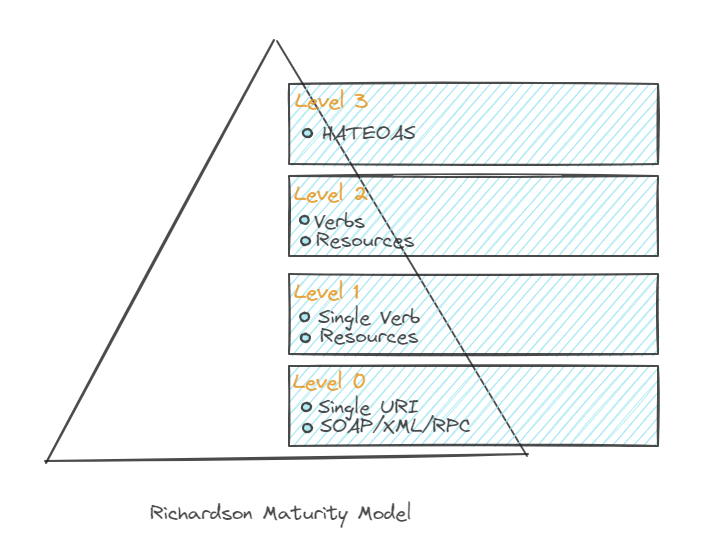

The Richardson Maturity Model was developed by [Leonard Richardson](https://web.archive.org/web/20180822201706/http://www.crummy.com/). It breaks down the journey towards building a truly RESTful API into levels, each adding more constraints and adhering more closely to REST principles. It does this by specifying a model to grade REST services according to their adherence to the REST constraints. Understanding this model is key for developers building web services, as it helps to guide them in creating APIs that are more maintainable, scalable, and consistent. This model identifies four levels of service maturity based on the service’s support for Resources, HTTP Verbs and Hypermedia.

**Level Zero Services** – Level zero services are characterized by services having only one URI and using a single request type mainly POST. The message contains both the operation to be performed and the data needed for that operation. At this level services do not have the concept of representations or resources that are uniquely identifiable.  It uses HTTP only as a transport system, usually for remote procedure calls (RPC). It also does not use the HTTP verbs and status codes for providing rich interaction between the client and the server. This is also called as swamp of POX (plain old XML) model. 

**Level One Services** – The first step towards a RESTful API is to introduce resources.  In this level, individual resources (like users, products, etc.) are identified on the server. The services expose multiple resources through unique URI’s. However, HTTP methods (GET, POST, etc.) are still not used properly – there might be a single URL that handles all interactions, regardless of the type of operation.

**Level Two Services** – Level two services host representations and resources at uniquely identifiable URI’s and use the gamut of HTTP verbs for communicating between the client and the server. The URI specifies the resource being operated on and the operation is performed using the standard HTTP verbs GET, POST, PUT, DELETE etc. It also uses the standard HTTP status codes such as 200 for success or 404 for not found and adheres to the Idempotency and safety principles of the HTTP verbs.

**Level Three Services** – Level three services implement the concept of Hypermedia as the engine of application state (HATEOAS). Representations hosted at unique URI’s contain URI links to other representations that may be of interest to the client or indicate a choice of actions that can be performed by the client. These choices of actions lead the client through the application resources causing state transitions to occur based on the action chosen by the client. This makes the API more discoverable and self-descriptive. It's akin to the way websites work, with hyperlinks guiding the user.

Each level of the model introduces additional constraints and discipline, but also provides more benefits in terms of scalability, flexibility, and maintainability. It's important to note that not all APIs need to reach Level 3 to be effective – the appropriate level depends on the specific needs and goals of the API. Services that are at Level three are truly RESTful and adhere to the REST principles as defined by Roy Fielding in his thesis.
