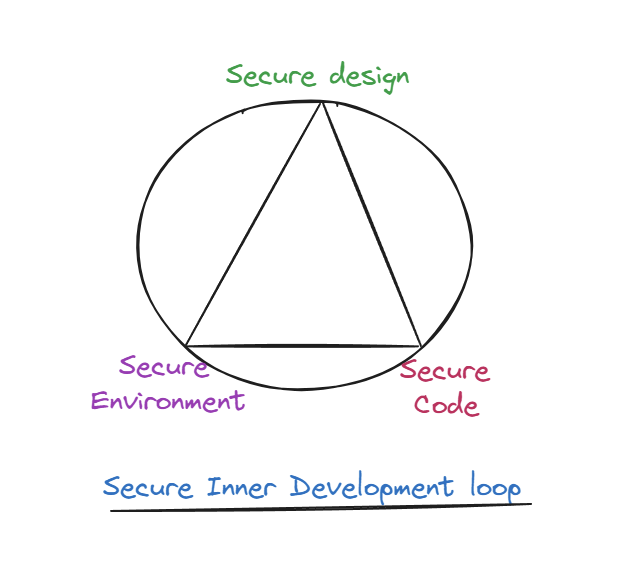

## Introduction

In today's digital landscape, software isn't just a collection of lines of code; it's the backbone of businesses, critical infrastructure, and our daily lives. But with this reliance comes a heightened risk. The modern software supply chain has become a complex web of interconnected components, including proprietary code, open-source libraries, third-party services, and cloud-based infrastructure. Each of these components introduces potential vulnerabilities that malicious actors can exploit. It more critical than ever to secure the entire supply chain from development to deployment.

In recent years, high-profile security breaches like the **SolarWinds attack** have demonstrated just how vulnerable software supply chains can be. Attackers can exploit even the smallest weakness to compromise not just a single piece of software, but an entire ecosystem of applications, potentially affecting thousands of organizations downstream. This interconnectedness amplifies the risks, requiring developers to be proactive in addressing security concerns at every stage of the software development lifecycle (SDLC).

As developers, we hold a unique position in this ecosystem. We are often the first line of defense, the gatekeepers of code quality and security. The choices we make, the tools we use, and the processes we follow have a direct impact on the overall security posture of the software we create. By adopting secure coding practices, integrating automated security checks into CI/CD pipelines, and managing third-party dependencies with care, we can help safeguard the software supply chain and ensure that our applications remain secure.

In this blog post, we’ll explore practical strategies for integrating security into every phase of the SDLC. We’ll discuss how to embrace security from the design phase (often referred to as “shifting left”), secure the use of open-source software (OSS) and third-party components, and implement robust CI/CD practices to automatically detect and mitigate vulnerabilities. Additionally, we’ll cover how Software Bill of Materials (SBOMs) and license management can help provide transparency and compliance in the modern development environment.

Hopefully this blog post will enable you to have a clear understanding of how to take ownership of the security of your software and contribute to building a more resilient and secure software supply chain. We will do this over three parts starting from shifting security left , building secure supply chains and the deep diving into the role of developers to maintain and enhance the security posture of thier software.

---

## Part I. Shifting Left: Embracing Security Early in Development

The adage "prevention is better than cure" rings especially true in software security. The earlier you address potential vulnerabilities in the development process, the easier and less costly it is to fix them. This proactive approach, often referred to as "shifting left," focuses on identifying and addressing security risks at the earliest stages of the development process, rather than waiting until the software is complete. By integrating security into the design, coding, and development environment stages, developers can minimize the attack surface and reduce the cost of fixing vulnerabilities later. Lets dive into the key aspects of shifting security left.

### 1. Secure Design: Start with Security in Mind

Building secure software starts with a secure design. Security needs to be a foundational part of the design process, not an afterthought. When developers begin with secure design principles, they create software that anticipates and mitigates potential security threats before they become issues. Before a single line of code is written, it's crucial to identify potential threats and vulnerabilities that could compromise your application. This is where threat modeling comes in.

- **Threat Modeling**: Threat modeling is a structured approach to identifying potential security risks during the design phase. Techniques like **STRIDE** (Spoofing, Tampering, Repudiation, Information Disclosure, Denial of Service, and Elevation of Privilege) or **PASTA** (Process for Attack Simulation and Threat Analysis) can help developers through a systematic analysis of your application's architecture, data flows, and potential attack vectors. This helps build defences early.

- **Secure Design Principles**: Beyond threat modeling, adhering to secure design principles is paramount. Core principles like **least privilege**, **defense in depth**, and **fail-safe defaults** should guide software architecture decisions:
  - **Least Privilege**: Each part of the system should only have the minimum level of access needed to perform its function.Grant users and processes only the minimum necessary permissions to perform their tasks. This limits the potential damage in case of a compromise.
  - **Defense in Depth**: Implement multiple layers of security controls, so that if one layer fails, others can still protect the system.
  - **Fail-Safe Defaults**: Design your system to default to a secure state, requiring explicit action to enable potentially risky features or configurations.

### 2. Secure Coding Practices: Implement Best Practices

Once you have a secure design in place, it's time to translate those principles into code.  Secure coding practices are essential to prevent the introduction of vulnerabilities that attackers can exploit. 

- **Secure Coding Standards**: Adopting coding standards like the **OWASP Top 10** or **CERT Secure Coding Standards** can help developers avoid common vulnerabilities such as **SQL injection**, **cross-site scripting (XSS)**, and **buffer overflows**. These standards provide guidelines for writing code that mitigates known attack vectors.

- **Understand and Prevent Common Vulnerabilities**: Familiarize yourself with common security pitfalls and learn how to mitigate them. For instance:

  - **SQL injection**: Prevent SQL injection by using parameterized queries or prepared statements.
  - **Cross-site scripting (XSS)**: Sanitize user input and encode output to prevent XSS attacks.
  - **Buffer overflows**: Use safe programming languages or libraries that provide bounds checking to avoid buffer overflows.

- **Leverage Static and Dynamic Analysis Tools**:  Integrate security testing into your development workflow using static and dynamic analysis tools.Using automated tools can drastically reduce the chances of introducing security flaws.
  - **Static Application Security Testing (SAST)** tools, like **Snyk Code**, **Coverity**, or **SonarQube**, scan your code for potential vulnerabilities without executing it. They can identify issues like insecure coding patterns, hardcoded credentials, and potential data leaks. Snyk Code, in particular, provides real-time feedback as you code, helping you catch and fix issues early in the development process.
  - **Dynamic Application Security Testing (DAST)** tools, like **Snyk IAST**, **OWASP ZAP**, or **Burp Suite**, analyze your application while it's running to identify vulnerabilities that might not be apparent from static code analysis alone. They can simulate attacks and identify weaknesses in your application's runtime behavior.

- **Peer Code Reviews**: In addition to automated testing, peer code reviews are invaluable for catching security issues that tools might miss. When conducting security-focused code reviews, developers should look for potential flaws such as insecure handling of user input, weak cryptographic implementations, or improper error handling. Encourage your team to adopt a collaborative approach to security, where everyone shares the responsibility of identifying and fixing potential issues.

By following secure coding practices and leveraging the right tools, you can significantly reduce the number of vulnerabilities that make it into your production code. Remember, security is an ongoing process. Stay informed about the latest threats and best practices, and continuously improve your coding skills to build more secure and resilient software.

### 3. Secure Development Environments

The environment in which you develop your software plays a crucial role in its overall security. Creating and maintaining a secure development environment is crucial to ensuring the integrity of the codebase. By securing the environment itself, developers can prevent unauthorized access and tampering.

- **Isolated Development Environments**: Isolate your development environment from production systems and other sensitive networks to minimize the potential impact of a compromise. Use **virtual machines**, **containers**, or dedicated development workstations to create separate, controlled environments for development activities. 
- **Access Control**: Implement strict access controls to limit who can access your development environment and what they can do. Developers must implement strict access control measures, such as **multi-factor authentication (MFA)** and **role-based access control (RBAC)**, to ensure that only authorized personnel have the necessary privileges.
- **Secure Version Control Systems**: Using secure version control systems, like **Git**, with proper access restrictions and **encryption** for repositories ensures that the source code is protected. Additionally, regularly backing up the codebase ensures that any accidental or malicious deletions can be recovered.
- **Secure Tooling**:  The tools you use for development can also introduce vulnerabilities. Keep your development tools (IDEs, compilers, build tools, etc.) up-to-date with the latest security patches and use security-focused plugins or extensions where available. Tools like Snyk can also be integrated into your development environment to scan container images and Infrastructure as Code (IaC) templates for vulnerabilities, helping you address potential issues early in the development process.

---

## Part II. Building a Secure Software Supply Chain: From Code to Deployment

Ensuring the security of your software doesn’t stop at writing secure code. A truly secure software supply chain requires vigilance across all stages, from the build process to artifact management and deployment. As developers, integrating security into these processes is critical to maintaining the integrity of your applications.  Let's explore how to fortify these stages.

### 1. Secure Build Processes
The build process, where your code is transformed into executable software, is a potential point of compromise. Attackers can inject malicious code or tamper with build artifacts if the process isn't adequately secured. Securing the build process ensures that your source code remains untampered throughout its journey from development to production. This involves securing the environment in which the code is compiled, managing dependencies, and ensuring that no malicious code is introduced during the build.

- **Harden the Build Environment**: The environment where you build your software should be as locked down as your production environment. Limit access, use strong authentication, and regularly update and patch the build tools and systems. Using isolated build environments, implementing strict access controls, and ensuring that build servers are secured and monitored can reduce risks.
  
- **Manage Dependencies Securely**: Many projects rely on third-party libraries and dependencies, which can introduce vulnerabilities if not properly managed.  Ensure that all third-party libraries and frameworks you use are from trusted sources and are regularly updated to address any known vulnerabilities.  CI/CD pipelines should automatically scan every new dependency and third-party package for vulnerabilities, ensuring that any issues are flagged and addressed before they reach production. Tools like **Snyk Open Source** can be integrated into your CI/CD pipeline to scan dependencies for known vulnerabilities and ensure you’re using secure versions of libraries.

- **Ensure Build Integrity**: To verify that your builds haven’t been tampered with, use integrity checks like **checksums** and **digital signatures** on your build artifacts. This ensures that what you are deploying is exactly what you intended to build, with no malicious modifications.

### 2. Extended Supply Chain: Using Open Source Software

Open-source software (OSS) is a cornerstone of modern development, offering a wealth of pre-built components and libraries that accelerate development.  OSS allows developers to leverage existing code, saving time and resources. It fosters collaboration and innovation within the software community. OSS components can contain vulnerabilities, and outdated or abandoned projects may not receive timely security updates. Additionally, there's a risk of dependency confusion, where malicious packages can mimic legitimate ones.

- **Regular Scanning for Vulnerabilities**: Using tools like **Snyk Open Source**, developers can continuously scan the OSS packages in use to identify and mitigate vulnerabilities. Integration with CI/CD pipelines allows this process to be automated, providing alerts when insecure packages are found.
  
- **Monitor Updates and Apply Security Patches**: Open-source projects often release security patches in response to newly discovered vulnerabilities. Keeping dependencies up to date with the latest patches is critical for maintaining security.
  
- **Trustworthy Repositories**: Always ensure that open-source components are sourced from trusted repositories and maintainers. Avoid using outdated or unmaintained libraries, as these pose a higher risk of vulnerabilities.

### 3. Secure Artifact Management

Once the build process is complete, the resulting software artifacts—compiled binaries, libraries, and other output files—must be securely stored and distributed. If attackers can modify or compromise these artifacts, they can potentially deploy malicious versions of your application. Secure artifact management ensures that these artifacts are stored, distributed, and accessed in a controlled and secure manner.

- **Secure Storage and Distribution**: Store your artifacts in a secure repository with access controls and encryption to prevent unauthorized access or tampering. Only authorized accounts should have the ability to upload, modify, or delete artifacts. Tools like **Artifactory** or **Nexus** offer secure artifact storage solutions. When distributing artifacts, use secure channels and verify their integrity using digital signatures and checksums.

- **Digital Signatures and Checksums**: Employ digital signatures to verify the authenticity and integrity of your artifacts. A digital signature, like a tamper-proof seal, ensures that the artifact hasn't been modified since it was signed. Checksums, or hash values, provide an additional layer of verification by generating a unique fingerprint for each artifact. Any changes to the artifact will result in a different checksum, indicating potential tampering.
  
- **Access Controls & Repository Management**: Implement strict access controls to your artifact repositories, ensuring that only authorized personnel can access and modify them. Use role-based access control (RBAC) to grant appropriate permissions based on user roles and responsibilities. Regularly audit access logs and monitor for any suspicious activity.

By implementing secure artifact management practices, you can protect your software from unauthorized modification, ensure its integrity, and maintain control over its distribution.

### 4. CI/CD Pipelines: Securing the Supply Chain

The CI/CD pipeline, the backbone of modern software development, automates the integration, testing, and deployment of code changes. While it streamlines the development process, it also introduces potential security risks if not adequately secured. Securing your CI/CD pipeline involves embedding security checks at every stage of the development process to ensure that vulnerabilities are caught before deployment.

- **Role of CI/CD pipelines**: CI/CD pipelines enable rapid and frequent software releases, but they can also become a conduit for vulnerabilities if security is not embedded at every stage.

- **Security gates within the pipeline**: Think of these as checkpoints where security scans and tests are performed to catch vulnerabilities early. Some essential gates include: 
  - **Automated static code analysis** to catch security issues at each build stage. Tools like Snyk Code can scan your code at each commit or build, identifying potential security issues before they propagate further. 
  - **Automated dynamic analysis** to detect vulnerabilities in running applications. These tools test your running application to uncover vulnerabilities that might not be apparent in static code analysis.
  - **Dependency scanning**: Continuously monitor and scan all third-party libraries and open-source dependencies for vulnerabilities. Tools like Snyk Open Source excel here, continuously checking for vulnerabilities in your project's third-party libraries and open-source components. They ensure compliance with security policies.
  
- **Best practices for securing CI/CD pipelines**:
  - Secure the **CI/CD environment** by enforcing access controls, especially on build agents.
  - Use **environment isolation** to prevent build-time secrets (like tokens and keys) from being leaked or misused.
  - Implement **reproducible builds** to ensure your pipelines produce consistent build outputs, allowing you to verify that the software hasn't been tampered with. This helps prevent tampering with the build process or artifacts.
  - Integrate **secret management tools** like HashiCorp Vault to ensure sensitive data isn’t hardcoded into code repositories or pipelines.
  - **End-to-end encryption**: Secure communication between different stages of the pipeline to prevent attacks.

- **DevSecOps** : Embrace **DevSecOps** practices to integrate security as a continuous process throughout your CI/CD pipeline. This approach integrates security practices into the DevOps culture, ensuring that security is everyone's responsibility and is considered throughout the development process.

By implementing these security measures in your CI/CD pipelines, you can significantly reduce the risk of vulnerabilities and ensure the integrity of your software throughout its journey from code to deployment.

### 5. Software Bill of Materials (SBOMs): Ensuring Transparency in the Supply Chain

The concept of a Software Bill of Materials (SBOM) has gained significant traction in recent years.  SBOMs are becoming increasingly important as organizations look for greater transparency and security in their software supply chains. An SBOM is essentially a list of ingredients for your software, detailing all the components, libraries, and dependencies it includes. It's like a nutritional label for your code, providing transparency into what's inside.

- **The Value of SBOMs**: SBOMs offer several benefits for developers and organizations:
  - **Identify Vulnerabilities**: By knowing the exact components in your software, you can quickly identify if any of them have known vulnerabilities and take action to mitigate the risk.
  - **Manage Dependencies**: SBOMs help you understand the complex web of dependencies in your software, making it easier to manage updates and patches.
  - **License Compliance**: Ensure that you're using open-source components in compliance with their licenses, avoiding legal and reputational risks.
  - **Transparency and Trust**: Sharing SBOMs with customers and stakeholders demonstrates your commitment to security and builds trust in your software.

- **Generating SBOMs**: Several tools are available to help you generate SBOMs automatically, such as CycloneDX and SPDX. These tools can integrate into your build process, creating SBOMs for each release.

- **Sharing SBOMs**: Once generated, SBOMs can be shared in various ways:
  - Directly with customers or stakeholders
  - Embedded within the software itself
  - Published on a public or private repository

By embracing SBOMs, you can enhance transparency, improve vulnerability management, and build trust in your software supply chain. It's a powerful tool for developers to demonstrate their commitment to security and build more resilient applications.

### 6. License Management: Ensuring Legal Compliance

The use of open-source software (OSS) in your projects brings undeniable benefits, but it’s crucial to manage licenses effectively to avoid legal issues. Not all licenses are permissive, and failing to comply with the terms of a license can result in litigation or the forced removal of critical software components.

 - **The Importance of License Management**: OSS licenses grant you the right to use, modify, and distribute the software, but they often come with conditions. Failing to comply with these conditions can lead to legal disputes, reputational damage, and even the forced removal of your software from the market.  Some licenses, like **GPL**, can have stricter requirements that may not align with your project’s goals. Automated tools can help flag high-risk licenses, allowing developers to make informed decisions about which dependencies to use.
  
 - **Automated License Compliance Tools**:  Thankfully, you don't have to manually track and manage licenses for every OSS component you use. Automated license compliance tools like **FOSSA** , **Snyk License Management** etc can scan your project's dependencies, identify their licenses, and alert you to any potential conflicts or restrictions.

 - **Developer Awareness**:  As a developer, it's your responsibility to be aware of the licenses associated with the OSS components you use. Understand the terms and conditions of each license and ensure they align with your project's goals and distribution model. Avoid using incompatible or restrictive licenses that could limit your ability to commercialize or distribute your software.

 - **Integration into CI/CD**:  Make license management an integral part of your CI/CD pipeline. Configure your pipeline to trigger alerts or even fail builds if a new dependency introduces license conflicts or restrictions. This proactive approach helps you catch potential issues early and avoid costly legal complications down the line. 

By diligently managing OSS licenses, you can ensure legal compliance, protect your intellectual property, and maintain the freedom to distribute and commercialize your software. It's a crucial step in building a sustainable and trustworthy software supply chain.

### 7. Secure Deployment and Operations

Once the code has passed through the development, build, and artifact management stages, it’s essential to ensure that security remains a priority during deployment and ongoing operations. Security during deployment is critical because vulnerabilities in the production environment can be exploited, even if the software itself is secure. This section covers best practices for deploying software securely and maintaining security throughout the operations phase.

- **Secure Deployment**: The production environment should be hardened and configured securely. Some key deployment security practices include:

  - **Secure configuration management**: Ensuring that production environments are securely configured is critical. Misconfigurations are a leading cause of security breaches. Follow security baselines and best practices for system hardening (e.g., **CIS Benchmarks**) to ensure that systems are not vulnerable due to insecure settings. Use **Infrastructure as Code (IaC)** tools like **Terraform** or **Ansible** to automate the provisioning of secure infrastructure with consistent and repeatable configurations. Implement **configuration management tools** like **Puppet** or **Chef** to manage and enforce security configurations across multiple environments.
  
  - **Vulnerability scanning**: It is essential to scan your production environment regularly for vulnerabilities. These scans can identify weaknesses in the operating system, network, or application components. Utilize tools like **Nessus** or **OpenVAS** to scan for vulnerabilities in the infrastructure and applications. Conduct **container vulnerability scanning** (e.g., with **Snyk Container** or **Clair**) to identify vulnerabilities in containerized environments.
  
  - **Penetration testing**: Regularly perform **penetration testing** to simulate real-world attacks and identify vulnerabilities that may not be detected through automated scanning tools. Penetration testing provides an additional layer of assurance that your application and infrastructure are secure. Employ both internal security teams and external security firms to perform **black-box** and **white-box** testing. Ensure that testing covers the full scope of your application, including APIs, network services, and external integrations.

- **Continuous Monitoring and Incident Response**: The threat landscape is constantly evolving, so it's essential to continuously monitor your production environment for any signs of compromise. Security doesn’t end once the application is deployed. Ongoing monitoring and having a robust incident response plan in place are essential for identifying and responding to potential threats in real-time. 
  
  - **Continuous Monitoring for Vulnerabilities**: Even after deployment, new vulnerabilities can be discovered in your environment or application. Continuous monitoring ensures that these vulnerabilities are identified and addressed before they can be exploited. Utilize **SIEM (Security Information and Event Management)** systems like **Splunk** or **ELK** to monitor logs, detect anomalies, and trigger alerts for suspicious activity. Integrate **real-time monitoring** tools like **Prometheus** or **Datadog** to keep track of application performance and detect unusual behavior that could indicate a security breach.
  
  - **Incident Response Plans**: No system is 100% secure, so it’s essential to have an **incident response plan** in place to quickly address any security issues that arise. Develop and document a clear incident response process that outlines how to identify, assess, and mitigate incidents. Conduct regular **incident response drills** to ensure that all stakeholders, including developers, security teams, and operations teams, are familiar with their roles during an incident. Use tools like **PagerDuty** to automate incident management and response processes.

- **Automation and Continuous Improvement**: Automation and continuous monitoring play a critical role in maintaining a secure and resilient software supply chain.Leverage automation to streamline your deployment and operations processes, reducing the risk of human error and ensuring consistency. Continuously monitor and analyze your security posture, and strive for continuous improvement by incorporating lessons learned from security incidents and audits.

  - **Automating Security Tasks**: Use tools like **Snyk** to automate security testing and vulnerability scanning within your CI/CD pipeline. Automated security checks can help catch vulnerabilities early, reducing the risk of deploying insecure software. Automate patch management processes to ensure that vulnerabilities are patched as soon as updates become available. Integrate **infrastructure monitoring** tools like **Nagios** or **Zabbix** to automate alerts for issues like system misconfigurations, suspicious network activity, or unauthorized access attempts.
  
  - **Continuous Monitoring**: Security is a continuous process, and ongoing monitoring helps detect and respond to potential threats in real-time. Ensure that all systems, applications, and networks are continuously monitored for security events. Implement **continuous compliance monitoring** to ensure that your systems adhere to regulatory and internal security standards.  Use **behavioral analytics tools** to detect abnormal user or system behavior that could indicate a breach.

By prioritizing security in your deployment and operations practices, you can ensure that your software remains resilient in the face of evolving threats and that your users' data and privacy are protected.

---

## Part III. Developer's Role in Supply Chain Security

The responsibility for a secure software supply chain doesn't fall solely on security professionals. Developers play a central role in ensuring that security is integrated throughout the software supply chain. Beyond writing secure code, developers need to maintain a proactive approach to security, stay informed about emerging threats, and collaborate effectively with security and operations teams. This section outlines the key responsibilities that developers should embrace to secure the supply chain.

### 1. Continuous Learning
The world of cybersecurity is constantly evolving, with new threats and vulnerabilities emerging regularly. As a developer, it's crucial to stay ahead of the curve by continuously learning and updating your knowledge.

  - **Stay Updated on Security Trends**: Developers should actively follow security blogs, forums, and threat intelligence platforms to stay informed about the latest vulnerabilities and threats. This will help you stay abreast of the latest security trends, vulnerabilities, and mitigation techniques.

  - **Security conferences**: Attending conferences like Black Hat, DEF CON, and SANS Institute training can help developers learn about emerging threats and best practices.

  - **Participate in Security Training**: Continuous security training, such as secure coding workshops, penetration testing exercises, and courses on DevSecOps practices, can help developers sharpen their skills.

By investing in your cybersecurity education, you not only enhance your skills but also contribute to building a more secure software supply chain.

### 2. Collaboration and Communication
Security is a team effort. Effective collaboration and communication between developers, security teams, and other stakeholders are essential for integrating security throughout the SDLC.

  - **Work Closely with Security Teams**: Establish open lines of communication with your security team. Share your security concerns, seek their guidance on best practices, and collaborate on threat modeling and vulnerability assessments.
  - **Proactive Communication**: Don't wait for security issues to arise. Proactively communicate potential risks and vulnerabilities to your team and work together to address them.
  - **Shared Responsibility**: Embrace a culture of shared responsibility for security. Everyone on the team, from developers to project managers, should understand the importance of security and their role in maintaining it.

By fostering a collaborative and communicative environment, you can ensure that security is integrated into every aspect of the development process, leading to more secure and resilient software.

### 3. Responsibility and Accountability

As a developer, you have a responsibility to take ownership of the security of the code and components you contribute.

  - **Secure Coding Practices**: Follow secure coding standards and best practices to prevent the introduction of vulnerabilities. Conduct thorough testing and address any identified issues promptly.
  - **Proactive Vulnerability Management**: Stay informed about vulnerabilities in the libraries and frameworks you use. Use tools like Snyk to identify and remediate vulnerabilities in your dependencies.
  - **Ownership Mindset**: Take pride in the security of your code. View security as an integral part of your development process, not an afterthought.

By taking responsibility for security, you become an active participant in building a more secure software supply chain. Your commitment to security will not only protect your organization and its users but also enhance your reputation as a developer.

---

## Conclusion

The security of the software supply chain is a shared responsibility that demands the active participation of every stakeholder, but developers are uniquely positioned to make a substantial impact. By embracing a "shift left" mentality, prioritizing secure coding practices, and diligently managing dependencies and build processes, developers can significantly reduce the risk of vulnerabilities and attacks.

The integration of security into the CI/CD pipeline, coupled with the use of SBOMs and robust license management, further strengthens the software supply chain. Remember, security is not a one-time task but an ongoing process that requires continuous learning, collaboration, and a sense of ownership.

As we’ve explored over the three parts of this guide, shifting left by incorporating security early in the development process, managing third-party dependencies carefully, and following best practices for secure deployment and operations are all critical components of a robust software security strategy. By prioritizing security in your everyday development practices, developers can contribute to a more secure and resilient software ecosystem, safeguarding your organization, its users, and the digital world at large. The tools and techniques discussed in this blog post empower you to take proactive steps towards building software that's not just functional but also fortified against the ever-evolving threat landscape. By making security a central part of your development process, developers can help create a more resilient software ecosystem—one that protects not only your application but also your organization and users from potential threats.

---

