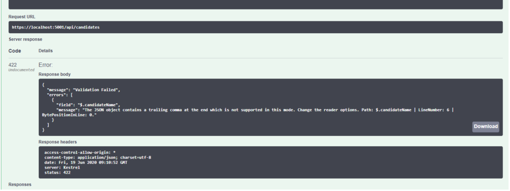

Creating API's has a certain rigor to it right from the design phase which is different from a UI based Web application. One of the areas where this is very apparent is communicating exceptions to the client. In a web application exception are communicated to the client using the UI with the most common being a 404 page. This page has been elevated to an art form now. The image below is a 404 page on Pixar's website.


In an API since there is no UI and the client and the API provider work on a contract, exceptions are communicated through the API response in the appropriate media format such as JSON or XML. There are multiple ways of returning exceptions back to the client. I generally prefer to implement a custom exception handling middleware. Implementing a middleware component is simpler and it can be added to the OWIN request/response processing pipeline. It makes the context of the middleware much more explicit by limiting it to handling and communicating exceptions to the client. It is in some ways a cross cutting concern which should be abstracted away from the domain code.

If you are new to the pipeline architecture of .NET core, I would suggest you read [this post]({{ < ref "/blog/owin-katana-kestrel/" > }}) before moving ahead.

A middleware component is a request delegate that processes the request/response and then invokes the next component in the pipeline. The next request delegate is resolved by dependency injection.

A middleware component has three key parts

- A read-only field to hold the reference to the next RequestDelegate.
- A constructor that expects the next RequestDelegate as a parameter.
- An Invoke method that takes an HttpContext object to operate on and then pass it along to the next middleware.

### Creating the Middleware component

I have created a simple exception handling middleware component as below. Note that the invoke method also has the environment injected into it, allowing us to provide more information in case of non-production environments for debugging purposes.

```csharp
using System;
using System.Net;
using System.Threading.Tasks;
using Newtonsoft.Json;
using Microsoft.AspNetCore.Http;
using Microsoft.AspNetCore.Hosting;

namespace thetalentbot.JobSeeker.Exceptions
{
    public class ExceptionHandler
    {
        private readonly RequestDelegate _next;

        public ExceptionHandler(RequestDelegate next)
        {
            this._next = next;
        }

        public async Task Invoke(HttpContext context, IHostingEnvironment env)
        {
            try
            {
                await _next(context);
            }
            catch (Exception ex)
            {
                await HandleExceptionAsync(context, env, ex);
            }
        }

        private static Task HandleExceptionAsync(HttpContext context, IHostingEnvironment env, Exception exception)
        {
            string result;
            var code = HttpStatusCode.InternalServerError;

            if (env.IsDevelopment())
            {
                var errorMessage = new
                {
                    error = exception.Message,
                    stack = exception.StackTrace,
                    innerException = exception.InnerException
                };
                
                result = JsonConvert.SerializeObject(errorMessage);
            }
            else
            {                
                var errorMessage = new
                {
                    error = exception.Message                    
                };
                
                result = JsonConvert.SerializeObject(errorMessage);
            }

            context.Response.ContentType = "application/json";
            context.Response.StatusCode = (int)code;
            return context.Response.WriteAsync(result);
        }

    }
}
```

### Middleware helper

Now we need to add this component to the pipeline. We can add this component to the pipeline by simply calling the app.UseMiddleware method in the startup class.  This will add it to the pipeline. It is important to add it before calling the app.UseMVC() method so that the middleware gets a crack at handling the exception post the MVC cycle. Conventionally adding a middleware is made even more easier by creating a helper similar to the UserMVC method. Let's create a helper method to add our middleware to the pipeline. We need to add a static helper class with a static method as below.

```csharp
using Microsoft.AspNetCore.Builder;

namespace thetalentbot.JobSeeker.Exceptions
{
    public static class ExceptionHandlerMiddleware
    {
        public static IApplicationBuilder UseExceptionHandlingMiddleware(this IApplicationBuilder builder)
        {
            return builder.UseMiddleware<ExceptionHandler>();
        }
    }
}
```

### Add to startup

We can now use this helper method in the startup class to add our ExceptionHandler component to the middleware pipeline. So in the startup class just call the method as below.

```csharp
public void Configure(IApplicationBuilder app, IHostingEnvironment env)
{
    app.UseCors("AllowAll");
    app.UseExceptionHandlingMiddleware();

    app.UseMvc();

    //app.UseExceptionHandler(appbuilder =>
    //{
    //    appbuilder.Run(async context =>
    //    {
    //        context.Response.StatusCode = 500;
    //        await context.Response.WriteAsync("An internal server occured. Try again later");
    //    });
    //});

}
```

Now we are all done. Whenever there is an exception, it will be handled by our custom middleware and transformed into a JSON object which will be returned to the client.



Photo by Pavan Trikutam on Unsplash
