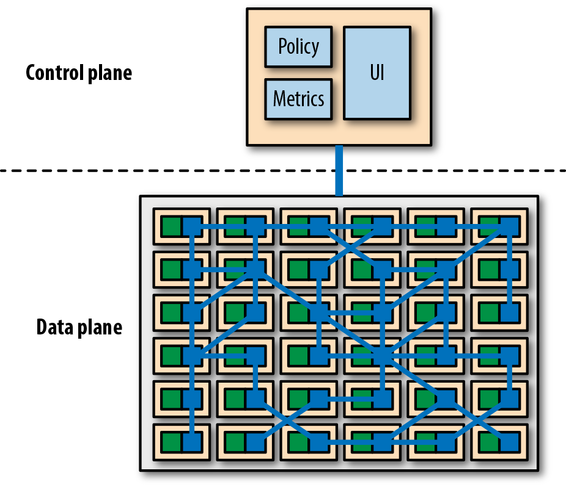

Service Mesh is a dedicated infrastructure layer for handling service-to-service communication in order to make it visible, manageable, and controlled. A Service Mesh adds capabilities like traffic control, service discovery, load balancing, resilience, observability, security in a transparent manner. A service mesh allows applications to offload these capabilities from application-level libraries and allow developers to focus on building business logic. A Service Mesh generally is implemented as a mesh of interconnected network proxies designed to better manage service traffic. The service mesh is used alongside most other service implementations as a sidecar. With a Service Mesh, microservices don't directly communicate with other microservices. Rather, all service-to-service communications take place on top of a software component called the Service Mesh proxy. This [sidecar](https://pradeeploganathan.com/patterns/sidecar) proxy layer is known as the Data Plane. All these [sidecar](https://pradeeploganathan.com/patterns/sidecar) proxies are controlled via a Control Plane. That is where all the configuration related to inter-service communications are applied.

Service mesh provides policy-based networking for microservices describing desired behavior of the network in the face of constantly changing conditions and network topology. At their core, service meshes provide a developer-driven, services-first network. This frees application developers from building network concerns into their application code. Service Mesh provides the built-in support for some network functions such as resiliency, service discovery, etc. For instance, developers need not worry about [circuit breaking](https://pradeeploganathan.com/patterns/circuit-breaker-pattern/) anymore when one microservice calls another service. That comes as part of the Service Mesh. Infact, Service mesh implementations have embedded resiliency-enablement patterns such as circuit breaker, retry, timeout, and throttling/rate limiting.

Service Mesh is language-agnostic. The microservice to Service Mesh proxy communication always happens over standard protocols such as HTTP1.x/2.x, gRPC, etc. You can write your microservices from any technology and they will still work with the Service Mesh.

A service mesh provides the following

- Traffic management (such as A/B testing and canary deployment)
- Security (such as TLS and key management)
- Observability (such as providing traffic visibility).

Service mesh platforms typically provide two separate components, the data plane and the control plane.

The data plane is a set of network proxies deployed as sidecars that are responsible for the runtime tasks, such as routing, load balancing, rate limiting, circuit breaking, authentication and security, and monitoring. In other words, the data plane's job is to translate, forward, and observe every network packet that goes in and out of the service instance.

The control plane decides how the data plane should perform its tasks. It provides policy and configuration for all the network proxies (data plane) that run in a service mesh. The control plane does not touch any packets/requests in the system, as it is never on the critical path.

There are four popular Service Mesh products, each with its own advantages:

- Linkerd (https://linkerd.io/)
- Envoy (https://www.envoyproxy.io/)
- Istio (https://istio.io/)
- Linkerd2, formerly Conduit (https://conduit.io/)

> Photo by [JJ Ying](https://unsplash.com/@jjying?utm_source=unsplash&utm_medium=referral&utm_content=creditCopyText) on [Unsplash](https://unsplash.com/search/photos/mesh?utm_source=unsplash&utm_medium=referral&utm_content=creditCopyText)
