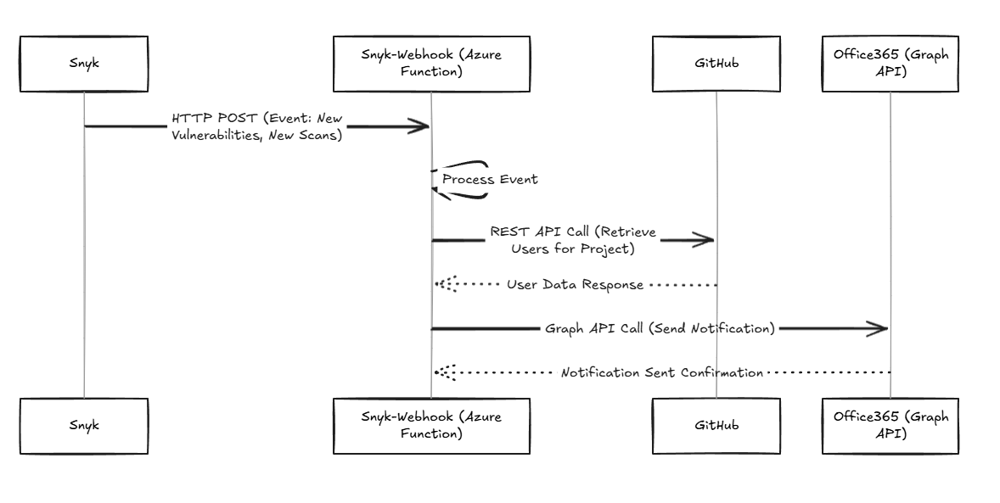

[Webhooks]() are a powerful way to get real-time notifications about what's happening in your applications and systems. Snyk, a developer security platform, offers webhooks that can be set up to alert you about various security events. These events include things like the discovery of new vulnerabilities, changes in license compliance, or updates to your projects. This article provides a complete guide to setting up Snyk webhooks, so you can stay informed and respond quickly to potential security issues.

## **Understanding Snyk Webhooks**

Snyk webhooks deliver event data as JSON payloads to a specific URL, which is where Snyk will send the notifications. This URL needs to be publicly accessible and able to receive HTTP POST requests. When an event happens in Snyk that matches your webhook configuration, Snyk sends an HTTP POST request to your URL with the event details included in the request.

### **Benefits of Using Snyk Webhooks**

Integrating Snyk webhooks into your workflow offers several benefits:

* **Real-time Notifications:** Receive instant alerts about security vulnerabilities, license issues, and other important events as they happen.  
* **Automated Workflows:** Trigger automated actions based on Snyk events, such as creating tickets in your issue tracking system, initiating CI/CD pipelines, or sending notifications to your team.  
* **Improved Response Time:** Respond to security threats and vulnerabilities more quickly by receiving timely notifications.  
* **Enhanced Security Posture:** Stay informed about the security status of your applications and take proactive measures to mitigate risks.

### **Types of Events Triggering Snyk Webhooks**

Snyk webhooks can be configured to trigger on a variety of events related to your projects and their security posture. Some common events include:

* **New vulnerabilities discovered:** Get notified immediately when Snyk identifies new vulnerabilities in your projects, allowing you to take prompt action to remediate them.  
* **Changes in license compliance:** Stay informed about any changes in the licensing of open-source components used in your projects, ensuring you remain compliant with licensing agreements.  
* **Project updates:** Receive notifications when changes are made to your projects in Snyk, such as adding new dependencies or modifying existing ones. This helps you keep track of project changes and their potential impact on security.

## The UseCase



* Call  ```GET /repos/{owner}/{repo}/collaborators``` to get all users
* Call ```GET /users/{username}``` to get the user profile which has the email id

example

```json
GET /scim/v2/Users

{
  "Resources": [
    {
      "userName": "johndoe",
      "emails": [
        {
          "value": "johndoe@example.com",
          "primary": true
        }
      ]
    }
  ]
}

```

```json
GET https://api.github.com/orgs/{org}/members
[
  {
    "login": "octocat",   // Username of the member
    "id": 1,              // Unique ID of the member
    "node_id": "MDQ6VXNlcjE=",
    "avatar_url": "https://github.com/images/error/octocat_happy.gif",
    "gravatar_id": "",
    "url": "https://api.github.com/users/octocat",
    "html_url": "https://github.com/octocat",  // Public GitHub profile
    "followers_url": "https://api.github.com/users/octocat/followers",
    "following_url": "https://api.github.com/users/octocat/following{/other_user}",
    "gists_url": "https://api.github.com/users/octocat/gists{/gist_id}",
    "starred_url": "https://api.github.com/users/octocat/starred{/owner}{/repo}",
    "subscriptions_url": "https://api.github.com/users/octocat/subscriptions",
    "organizations_url": "https://api.github.com/users/octocat/orgs",
    "repos_url": "https://api.github.com/users/octocat/repos",
    "events_url": "https://api.github.com/users/octocat/events{/privacy}",
    "received_events_url": "https://api.github.com/users/octocat/received_events",
    "type": "User",
    "site_admin": false
  },
  {
    "login": "hubot",   // Another member
    "id": 2,
    "node_id": "MDQ6VXNlcjE=",
    "avatar_url": "https://github.com/images/error/hubot_happy.gif",
    "gravatar_id": "",
    "url": "https://api.github.com/users/hubot",
    "html_url": "https://github.com/hubot",
    "followers_url": "https://api.github.com/users/hubot/followers",
    "following_url": "https://api.github.com/users/hubot/following{/other_user}",
    "gists_url": "https://api.github.com/users/hubot/gists{/gist_id}",
    "starred_url": "https://api.github.com/users/hubot/starred{/owner}{/repo}",
    "subscriptions_url": "https://api.github.com/users/hubot/subscriptions",
    "organizations_url": "https://api.github.com/users/hubot/orgs",
    "repos_url": "https://api.github.com/users/hubot/repos",
    "events_url": "https://api.github.com/users/hubot/events{/privacy}",
    "received_events_url": "https://api.github.com/users/hubot/received_events",
    "type": "User",
    "site_admin": false
  }
]

```

get commit user

```json
GET https://api.github.com/repos/{owner}/{repo}/commits

[
  {
    "commit": {
      "author": {
        "name": "John Doe",
        "email": "johndoe@example.com",
        "date": "2025-01-01T12:00:00Z"
      },
      "committer": {
        "name": "John Doe",
        "email": "johndoe@example.com",
        "date": "2025-01-01T12:00:00Z"
      },
      "message": "Initial commit"
    },
    "author": {
      "login": "johndoe",
      "id": 123456,
      "avatar_url": "https://avatars.githubusercontent.com/u/123456?v=4",
      "url": "https://api.github.com/users/johndoe"
    }
  }
]

```

## **Creating a Snyk Webhook**

To create a Snyk webhook, you'll need to use the Snyk API. Here's a step-by-step guide:

1. **Obtain Your Snyk API Token:** You can find your API token in your Snyk account settings.  
2. **Prepare the Webhook Request:** You'll need to send an HTTP POST request to the Snyk API endpoint for creating webhooks. The request should use POST https://api.snyk.io/api/v1/org/\<SNYK\_ORG\_ID\>/webhooks HTTP/1.1 with headers content-type: application/json and authorization: token \<SNYK\_API\_TOKEN\>. This includes the following information:  
   * **URL:** The URL where Snyk will send the notifications. This URL should be publicly accessible and able to receive HTTP POST requests.  
   * **Secret (optional):** A secret key for secure communication. This secret will be used to generate a signature for each webhook payload, allowing you to verify the authenticity of the request. Using a secret enhances the security of the integration by preventing unauthorized access to your webhook endpoint.  
3. **Send the Request:** You can use a tool like curl or the REST Client extension in VS Code to send the request to the Snyk API. Here's an example of the request body in JSON format:

JSON

`{`  
  `"url": "https://your-webhook-endpoint-url",`  
  `"secret": "your-signing-secret"`  
`}`

Replace the placeholders with your actual values.

4. **Verify the Webhook:** Once you've sent the request, you should receive a response from the Snyk API indicating whether the webhook was created successfully. You can also check the webhooks section in your Snyk account settings to confirm that the webhook is listed.

## **Configuring Your Webhook Endpoint**

Your webhook endpoint, the URL where Snyk sends notifications, should be able to receive HTTP POST requests and process the JSON payload sent by Snyk. Here are some key considerations for configuring your endpoint:

* **Security:** Ensure that your endpoint is secure and protected from unauthorized access. You can use authentication mechanisms like API keys or OAuth to secure your endpoint. For example, you can require an API key to be included in the header of the webhook request, and validate this key before processing the request.  
* **Error Handling:** Implement robust error handling to ensure that your endpoint can gracefully handle any errors that may occur during webhook processing. This might involve logging errors, sending alerts, or retrying failed requests.  
* **Payload Parsing:** Parse the JSON payload sent by Snyk to extract the relevant event data. This typically involves using a JSON parsing library to convert the JSON data into a usable format in your application.  
* **Action Execution:** Based on the event data, trigger the appropriate actions, such as creating tickets, sending notifications, or initiating CI/CD pipelines. This might involve integrating with other tools and services, such as Jira, Slack, or Jenkins.

For instance, if you're integrating with Jira, you would parse the vulnerability details from the Snyk webhook payload and use the Jira API to create a new ticket with the relevant information. Similarly, for Slack notifications, you would extract the key details and use the Slack API to send a message to the appropriate channel.

## **Example Use Cases**

Here are a few examples of how you can use Snyk webhooks to automate your security workflows:

* **Create Jira Tickets:** When a new vulnerability is discovered, automatically create a Jira ticket with the vulnerability details. This can be done by setting up a webhook that triggers a script to extract the vulnerability information from the Snyk payload and use the Jira API to create a new issue. The script can populate the Jira ticket with details like the vulnerability severity, affected package, and remediation steps.  
* **Trigger CI/CD Pipelines:** When a project is updated, trigger a CI/CD pipeline to rebuild and redeploy the application. This can help ensure that any security fixes or updates are automatically integrated into your application. For example, you can configure a webhook to trigger a Jenkins pipeline when a new vulnerability is found, which in turn initiates a build process, runs tests, and deploys the updated application.  
* **Send Slack Notifications:** Send notifications to your team's Slack channel when a critical vulnerability is found. This allows your team to be immediately aware of critical security issues and take prompt action. You can configure a webhook to send a message to a specific Slack channel with details like the vulnerability severity, affected package, and a link to the Snyk vulnerability report.  
* **Update a Security Dashboard:** Update your security dashboard with the latest vulnerability and license compliance information. This provides a centralized view of your security posture and helps you track progress in addressing security issues. You can set up a webhook to send data to your security dashboard whenever a new vulnerability is found or a license compliance issue is detected.

## **Conclusion**

Snyk webhooks are a powerful way to integrate Snyk into your development workflow and automate your security processes. By configuring webhooks to receive real-time notifications about security events, you can improve your response time, enhance your security posture, and streamline your development operations. Setting up Snyk webhooks involves obtaining your API token, preparing and sending an HTTP POST request to the Snyk API, and configuring your webhook endpoint to securely receive and process the event data. By leveraging Snyk webhooks, you can proactively address security concerns and maintain a strong security posture in your applications.