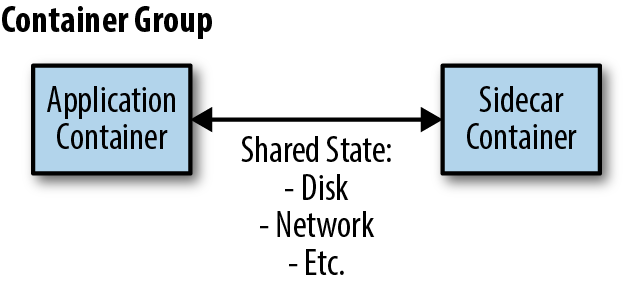

Sidecar pattern is a single-node pattern made up of two containers. It involves co-locating another container in a node/pod along with the main application container. The application container contains the core logic for the application. The role of the sidecar is to augment and improve the application container, often without the application container’s knowledge.

In its simplest form, a sidecar container can be used to add functionality to a container that might otherwise be difficult to add. In addition to being co-located on the same machine, the application container and sidecar container share several resources, including parts of the filesystem, hostname and network, and many other namespaces. The sidecar can be plugged and unplugged from the main application, since it is isolated and cannot impact the application in case it starts misbehaving.

This pattern is also used when we want to segregate cross-cutting concerns such as monitoring, logging, routing, security, authentication, authorization, into a modular component. The logic for cross-cutting concerns are placed in their own process or container (known as a sidecar container) and then attached to the primary application. It is another proxy that is located outside of the process. Generally, the sidecar has the same life cycle as the application container and does essential peripheral tasks.

In some designs the sidecar pattern can be used for more than adaptation and modularization. It can also be used to implement the core logic of the application in a simple, reusable, and modular manner. By achieving modular reuse, sidecars can dramatically speed up development of the application.

Generic sidecar pattern

The advantages of using a sidecar pattern are

- Independence from its primary application in terms of runtime and programming language, thus enabling reuse
- Locality: Results in reduced communication latency as well as efficient sharing of resources, such as files
- Resiliency: Any sidecar that goes down does not bring down the main application
- Modularity and reuse of the components used as sidecars.

A good example of using sidecar pattern is a central logging agent. The main container always logs to stdout. The sidecar container will then send all logs from stdout to a central logging service where they will be aggregated with the logs from the entire system. If you want to upgrade or change your central logging policy or switch to a totally new provider, you just need to update the sidecar container and deploy it. The main container does not undergo any change or redeployment.

The sidecar pattern can be further specialized into an Ambassador pattern, Adapter pattern and an Envoy pattern. The sidecar pattern is a fundamental enabler for other large scale patterns such as [Service Mesh](https://pradeeploganathan.com/containers/servicemesh/).

> Photo by [Joël in 't Veld](https://unsplash.com/@photographer_in_wheelchair?utm_source=unsplash&utm_medium=referral&utm_content=creditCopyText) on [Unsplash](https://unsplash.com/search/photos/sidecar?utm_source=unsplash&utm_medium=referral&utm_content=creditCopyText)

> Sidecar pattern image from O'Reilly website
