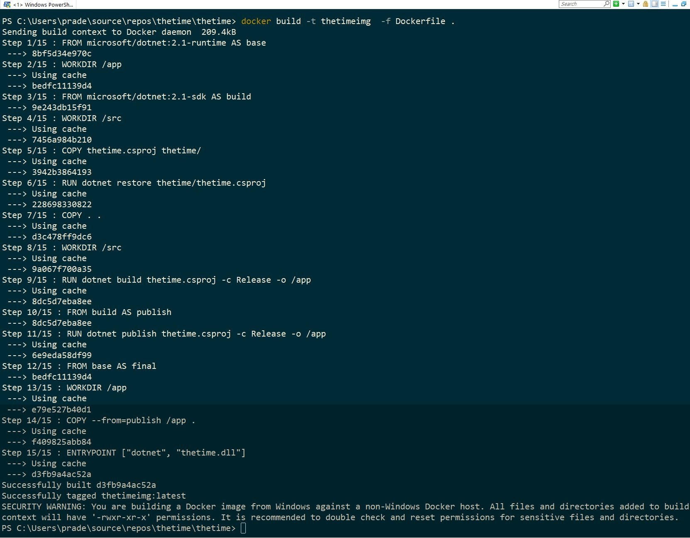

I have been working with multiple teams on containerizing their infrastructure using docker. A while back I needed to help a team understand Docker containers by getting them to dive in and get started rather than just talk and point to slide decks. We started by containerizing the simplest possible .net core console app.

The first app we built was a simple console app that used a timer and printed the date and time every 2 seconds. The code and the output for this program is below

The Output

The idea was to containerize this simple application and run it in a container using docker. Before starting this, we installed docker for windows and set it to use Linux containers. To containerize this console application, we created a dockerfile at the root of the project. We created the docker file below.

This docker file uses multi-stage build which means that the final image is built in multiple stages and the intermediate stages can be discarded, keeping the final image size low. Let's understand the docker file a bit later and see how we can now get this application built to run inside a container. I now use Docker build command to build an image from instructions in the docker file. The docker build command uses the instructions in the Dockerfile to build the image. I execute Docker build command passing it the -t flag indicating what name to tag the image, the path to the dockerfile using the -f  parameter and the . parameter to indicate the context for the command. Now let us look at the output.

Now Docker build has built an image based on instructions from the dockerfile. To list out the image we can use the docker image ls command as seen below

In the above screen shot we can see a listing of all images on my system and right at the top is the image we built tagged as thetimeimg based on our -t parameter to the docker build command. Now that we have an image, we can use this image to start a container which will also execute the dotnet console application within the container. We can do so by using the docker run command. 

Cool. Now we have a dotnet console application running on Linux inside a docker container using Docker for Windows on Windows 10 :-). We have used Docker run with the -I command to run the container interactively and hence the output is visible on the command line. The next step was to see how we can run a .Net Core 2.1 Web application in a docker container and expose it to the outside world. That is in the next post.

The Code for this series is at  [Docker-BlogSamples repository](https://github.com/PradeepLoganathan/Docker-BlogSamples)
