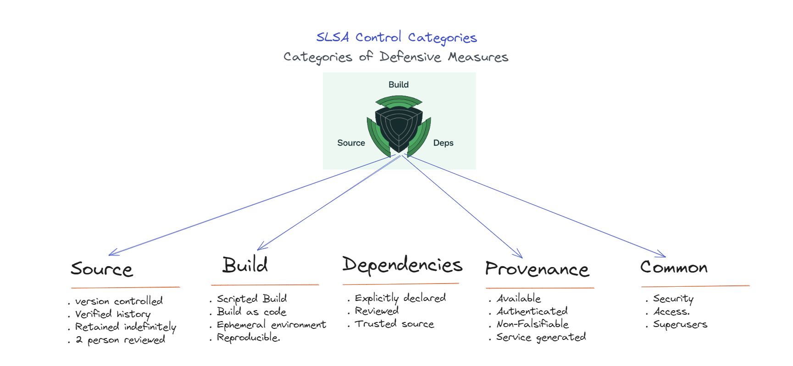
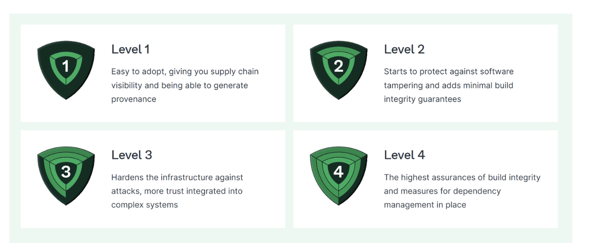
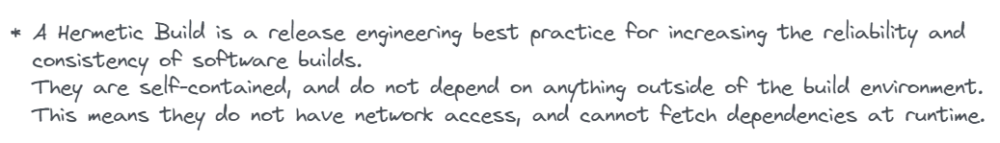

Modern software is often built using complex supply chains that incorporate code from numerous sources, including open-source libraries. This complexity can introduce security vulnerabilities. There has been a significant rise in supply chain attacks where adversaries inject malicious code into libraries or software build processes. As software development practices evolve, there's a greater reliance on automation. There is a growing need for verifiable provenance of software artifacts to ensure that the code originates from trusted sources and has not been tampered with. 

SLSA (Supply chain Levels for Software Artifacts) is a security framework designed to ensure the integrity and security of the software supply chain. It is a set of guidelines and best practices that aim to prevent tampering, improve integrity, and secure packages and infrastructure in software development and deployment. This is especially important in today's interconnected and automated world, where software dependencies are often pulled in dynamically and automatically from a variety of sources, making them vulnerable to various types of attacks, such as the insertion of malicious code. SLSA provides a framework that can scale with these practices while ensuring security. SLSA is uniquely focused on the software supply chain and provides actionable guidance for organizations to enhance their software security at a pace that suits their capabilities and resources. 

# SLSA Control Categories

The SLSA (Supply chain Levels for Software Artifacts) framework outlines a series of security controls, aimed at improving the integrity and security of software supply chains. These controls fall into several categories that address different aspects of the supply chain:

**Source**: Controls in this category ensure that the source code is protected against unauthorized changes, securely stored, and that its history is fully auditable. This includes using version control systems and ensuring that all changes are traceable to their origin.

**Build**: Build is the process of transforming source code into compiled binaries or deployable artifacts. Controls in this category focus on ensuring that the build process is fully scripted/automated and is reproducible, which means that it can be recreated exactly to verify its integrity.

**Dependencies**: The controls in this category address the security of third-party components included in the software. This involves ensuring that dependencies are explicitly declared, reviewed, and obtained from trusted sources.

**Provenance**: This category of controls focus on generating and maintaining accurate metadata about the origin and history of each software artifact, including the source, dependencies, build process, and so forth. The provenance information is intended to be comprehensive and tamper-resistant.

**Common**: These controls apply across the supply chain and include broader security measures such as access controls, auditability, and policy enforcement.

These categories help to structure the SLSA framework and guide organizations in implementing security measures at each step of the software development and deployment process. The intent is to build a secure, verifiable chain of custody for software artifacts that can defend against unauthorized alterations and other malicious activities.

# SLSA levels 

The SLSA framework is broken down into four levels to provide a progressive path towards improving supply chain security, making it easier for organizations to evolve their practices and adopt higher security standards over time. This tiered approach allows for incremental adoption through various phases of maturity. It allows for flexibility in determining the level to aim for based on an organizations capabilities and specific circumstances. This results in measurable progress over a period of time. It provides a common language for discussing the security of the software supply chain and helps in setting industry-wide benchmarks for software security. The levels act as a signifier of maturity in supply chain security. As organizations progress through the levels, it demonstrates their commitment to security and the maturity of their processes. Let us look at the various levels in detail.

## SLSA Level 1

This level focuses on basic source and build integrity. It ensures that the source and build platforms provide automation and that the provenance (origin and history) of the software is recorded. The focus at this level is on generating provenance, which is a record of the source, dependencies, and build platform. The controls are basic but essential for a minimal level of supply chain integrity. This level ensures the implementation of the below controls.

 - **Source**: Automated version control. The source must be tracked in version control systems to ensure a history of changes, which helps in auditing and reviewing the evolution of the code.
 - **Build**: Automated build process. The build process should be automated to minimize human error and variability. This means that anyone with the correct source and dependencies should be able to produce a binary that is bit-for-bit identical to the one produced by the build service. The build should occur on a build service that is not accessible to the public to reduce the risk of tampering. The build service must maintain a log of who performed the build and when.
 - **Provenance**: Generation of basic provenance. Provenance is metadata about how the artifact was built, including the source, build script, build platform, and top-level dependencies. At SLSA Level 1, the provenance is required to be available, but it doesn't need to be comprehensive or completely tamper-proof. The system must store the provenance securely so that it can be referenced or audited at a later time. The provenance generated should include:
   - Source Identifier: Information about the source repository and the exact version used for the build.
   - Build Invocation: The command or the series of commands that were used to invoke the build.
   - Build Type: The system should record whether the build was continuous (triggered automatically by source changes) or was manually invoked.

## SLSA Level 2

This level adds more rigorous controls to those established in SLSA 1, specifically around the build process and the security of the source and build platforms. Level 2 starts to address the possibility of malicious modifications and improves the traceability of artifacts, thereby enhancing the overall trustworthiness of the software. This provides improved audibility and control over the software development process. This level ensures the implementation of the below controls.

 - Source: Ensuring that source control is tamper-resistant. The source must be tracked in a version control system that enforces the integrity of the history. This typically involves using a secure, centralized platform that can track and manage changes to the codebase.
 - Build: Using a hosted build service that produces a verifiable build provenance. The build must occur on a build service that is resistant to tampering and unauthorized changes. The build service should have control over who can access and manage the build process. It should provide a secure environment that records an audit trail of all actions. The exact version of the source used to initiate the build must be referenced immutably, preventing retrospectively altering the version.The build script or instructions must be committed into the version control system along with the source code to ensure that they are subject to the same integrity and review processes as the source code itself. The build environment should be ephemeral, meaning that it is created fresh for each build and discarded after use. This reduces the risk of persistent attacks that carry over from one build to another.
 - Dependencies: Control over dependencies with a locked down dependency resolution. Dependencies used in the build process must be fetched over a secure channel and pinned, meaning they must reference an immutable version or a cryptographic hash to prevent unauthorized changes or man-in-the-middle attacks.
 - Provenance: Provision of more detailed provenance, including a list of dependencies. It must be generated automatically by the build service. At Level 2, this provenance must be detailed and accurate enough to facilitate the tracing of each artifact back to its source and build process. The provenance must be non-falsifiable and include a secure identifier for the build service, making it more difficult to create a false provenance.

## SLSA Level 3

SLSA Level 3 introduces more stringent controls that build upon the foundation set by Levels 1 and 2. These controls are designed to ensure greater trust in the software build process by enforcing stricter integrity and security measures. The key controls and requirements for SLSA Level 3:

 - Source: Changes to the source must be reviewed by two trusted persons prior to submission. The version control system must ensure the integrity of the change history (e.g., protection against rewriting history or deletion of commits).
 - Build: Builds must be hermetic, meaning they cannot download any new dependencies during the build process. All dependencies must be previously declared and fetched. The build environment must be isolated from the host and other builds. This prevents cross-build contamination and ensures that the build is not influenced by external state. The build process should produce bit-for-bit identical outputs from the same inputs on different build systems. This reproducibility adds confidence that the build system has not been tampered with.
 - Provenance: Provenance must be automatically generated by the build service. Provenance must capture all steps of the build process, including which builder (and which command) performed each step. The provenance must be stored in a non-falsifiable manner, typically by being signed by a trusted key that the build service protects.
 - Common: The source and build platforms must have stronger security controls in place to prevent unauthorized access and tampering. This can include multi-factor authentication, regular patching, intrusion detection systems, and more. The build service must meet specific standards for security, ensuring that only authorized users can initiate builds and access build outputs. It must also generate accurate and comprehensive provenance.

## SLSA Level 4

SLSA Level 4 represents the highest level of security and trust in the SLSA framework, intended for the most critical systems where complete software supply chain security is imperative. Controls at this level are designed to be comprehensive and significantly reduce the risk of tampering. It provides strong guarantees that no unauthorized changes have been made to the software at any point in its development or build process, and that the software can be trusted even in highly sensitive applications.

 - Source: Source is reviewed by two trusted persons and has a detailed history. Commits must be referenced immutably, ideally by cryptographic hash.
 - Build: The build process must be fully hermetic and reproducible, ensuring that builds are consistent and can be independently verified. The build environment must be completely isolated, and the build must be parameterized to allow for recreating the build in different environments. The build service itself must be hardened against attacks and be auditable to ensure that it has not been compromised.Individuals with direct commit access or the ability to affect the build process must pass background checks. Strict access controls must be in place to limit who can make changes to the build process or the source code.
 - Dependencies: Dependencies must be pinned and their integrity verified against a cryptographic hash. Dependencies themselves must be built to at least SLSA Level 4 standards, ensuring the integrity of the entire dependency graph.
 - Provenance: Provenance is fully detailed, capturing all aspects of the build process and guaranteeing that it has not been tampered with. It must be signed with a key that is securely stored and has a strong binding to the build service.

The mapping of these control categories across the SLSA levels is designed to create a progressive strengthening of security measures. As an organization moves up the levels, its software supply chain becomes more secure against a wider array of threats and risks. The SLSA framework is part of a broader initiative to improve software supply chain security, involving other standards and practices. It's being adopted by various organizations as a way to ensure that their software is secure and trustworthy, especially in critical infrastructure and high-trust environments.

## SLSA lightning talk

I did present a lightning talk on the SLSA framework at Cloud Native - Wellington in 2022. The talk is here



