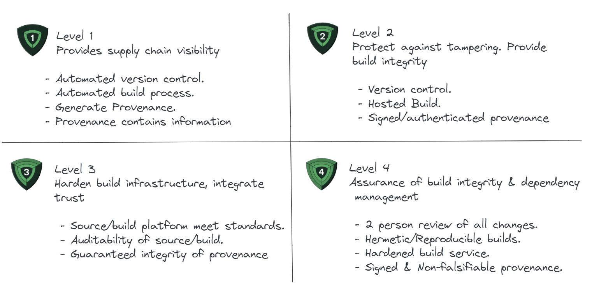

# Software Supply Chain
The software supply chain refers to the process and components involved in creating, distributing, and deploying software applications. This concept draws a parallel with physical supply chains, which manage the production and distribution of physical goods. In the context of software, the supply chain encompasses several key elements:

Source Code: The initial phase of the software supply chain involves the creation of source code. This code can be written by internal developers, or it can include open-source components from external sources.

Dependencies and Libraries: Modern software often relies on third-party libraries and dependencies. These are pre-written codes or modules that developers integrate into their software to add functionality or handle common tasks, such as data encryption or network communication.

Development Tools: These include the tools used for writing, testing, and building the software, like Integrated Development Environments (IDEs), compilers, and testing frameworks.

Version Control Systems: These systems track changes to the source code over time and are crucial for coordinating work among multiple developers.

Build and Integration Systems: These systems compile and assemble the source code into executable software. Continuous Integration/Continuous Deployment (CI/CD) pipelines automate these processes to ensure rapid and reliable software builds.

Artifact Repositories: After the software is built, it is often stored in repositories as artifacts, which can be anything from binary files, libraries, to containers.

Distribution Channels: This includes the mechanisms through which software is delivered to end-users, such as download sites, package managers, app stores, or direct deployment to servers or cloud environments.

Operational Environment: The final stage is where the software is deployed and run. This can be on users' personal devices, corporate servers, or cloud platforms.

Each stage in the software supply chain can introduce vulnerabilities if not properly managed and secured. For instance, dependencies might contain vulnerabilities, build processes can be tampered with, or distribution channels might be compromised to deliver malicious software. Therefore, securing the software supply chain is vital to ensure that the end software product is safe and reliable.

# Supply chain Levels for Software Artifacts

SLSA (Supply chain Levels for Software Artifacts) is a security framework designed to ensure the integrity and security of the software supply chain. It is a set of guidelines and best practices that aim to prevent tampering, improve integrity, and secure packages and infrastructure in software development and deployment. This is especially important in today's interconnected and automated world, where software dependencies are often pulled in dynamically and automatically from a variety of sources, making them vulnerable to various types of attacks, such as the insertion of malicious code.

# SLSA Control Categories

The SLSA (Supply chain Levels for Software Artifacts) framework outlines a series of security controls, aimed at improving the integrity and security of software supply chains. These controls fall into several categories that address different aspects of the supply chain:

Source: Controls in this category ensure that the source code is protected against unauthorized changes, securely stored, and that its history is fully auditable. This includes using version control systems and ensuring that all changes are traceable to their origin.

Build: Build is the process of transforming source code into compiled binaries or deployable artifacts. Controls in this category focus on ensuring that the build process is fully scripted/automated and is reproducible, which means that it can be recreated exactly to verify its integrity.

Dependencies: The controls in this category address the security of third-party components included in the software. This involves ensuring that dependencies are explicitly declared, reviewed, and obtained from trusted sources.

Provenance: This category of controls focus on generating and maintaining accurate metadata about the origin and history of each software artifact, including the source, dependencies, build process, and so forth. The provenance information is intended to be comprehensive and tamper-resistant.

Common: These controls apply across the supply chain and include broader security measures such as access controls, auditability, and policy enforcement.

These categories help to structure the SLSA framework and guide organizations in implementing security measures at each step of the software development and deployment process. The intent is to build a secure, verifiable chain of custody for software artifacts that can defend against unauthorized alterations and other malicious activities.

# SLSA levels 

The SLSA framework is broken down into four levels to provide a progressive path towards improving supply chain security, making it easier for organizations to evolve their practices and adopt higher security standards over time. This tiered approach allows for incremental adoption through various phases of maturity. It allows for flexibility in determining the level to aim for based on an organizations capabilities and specific circumstances. This results in measurable progress over a period of time. It provides a common language for discussing the security of the software supply chain and helps in setting industry-wide benchmarks for software security. The levels act as a signifier of maturity in supply chain security. As organizations progress through the levels, it demonstrates their commitment to security and the maturity of their processes. Let us look at the various levels in detail.

## SLSA Level 1

This level focuses on basic source and build integrity. It ensures that the source and build platforms provide automation and that the provenance (origin and history) of the software is recorded. The focus at this level is on generating provenance, which is a record of the source, dependencies, and build platform. The controls are basic but essential for a minimal level of supply chain integrity. This level ensures the implementation of the below controls.

 - Source: Automated version control. The source must be tracked in version control systems to ensure a history of changes, which helps in auditing and reviewing the evolution of the code.
 - Build: Automated build process. The build process should be automated to minimize human error and variability. This means that anyone with the correct source and dependencies should be able to produce a binary that is bit-for-bit identical to the one produced by the build service. The build should occur on a build service that is not accessible to the public to reduce the risk of tampering. The build service must maintain a log of who performed the build and when.
 - Provenance: Generation of basic provenance. Provenance is metadata about how the artifact was built, including the source, build script, build platform, and top-level dependencies. At SLSA Level 1, the provenance is required to be available, but it doesn't need to be comprehensive or completely tamper-proof. The system must store the provenance securely so that it can be referenced or audited at a later time. The provenance generated should include:
   - Source Identifier: Information about the source repository and the exact version used for the build.
   - Build Invocation: The command or the series of commands that were used to invoke the build.
   - Build Type: The system should record whether the build was continuous (triggered automatically by source changes) or was manually invoked.

## SLSA Level 2

This level adds more rigorous controls to those established in SLSA 1, specifically around the build process and the security of the source and build platforms. This provides improved audibility and control over the software development process. This level ensures the implementation of the below controls.

 - Source: Ensuring that source control is tamper-resistant.
 - Build: Using a hosted build service that produces a verifiable build provenance.
 - Dependencies: Control over dependencies with a locked down dependency resolution.
 - Provenance: Provision of more detailed provenance, including a list of dependencies.

## SLSA Level 3

This level introduces requirements for source and build platform integrity, such as hermetic builds, which are reproducible and isolated from host and network influences. At this level, the controls focus on ensuring the integrity and security of the build environment and the artifacts it produces.

 - Source: Requiring a two-person review of all changes and a history that is tamper-resistant and auditable.
 - Build: Ensuring that the build process is hermetic and reproducible, with stricter controls over the build environment.
 - Provenance: Enhanced provenance that captures the complete build process.

## SLSA Level 4

The highest level of security, it requires two-person reviewed changes, a hermetically sealed and reproducible build process, and a stronger, more comprehensive provenance.Represents the highest level of trust and security. Controls at this level are designed to be comprehensive and significantly reduce the risk of tampering.

 - Source: Source is reviewed by two trusted persons and has a detailed history.
 - Build: Build process is hermetic, reproducible, and requires two-person review, ensuring no unauthorized changes have occurred.
 - Dependencies: Dependencies are reviewed and have a secure chain of custody.
 - Provenance: Provenance is fully detailed, capturing all aspects of the build process and guaranteeing that it has not been tampered with.

The mapping of these control categories across the SLSA levels is designed to create a progressive strengthening of security measures. As an organization moves up the levels, its software supply chain becomes more secure against a wider array of threats and risks. The SLSA framework is part of a broader initiative to improve software supply chain security, involving other standards and practices. It's being adopted by various organizations as a way to ensure that their software is secure and trustworthy, especially in critical infrastructure and high-trust environments.

