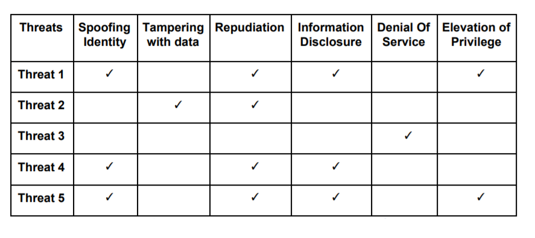
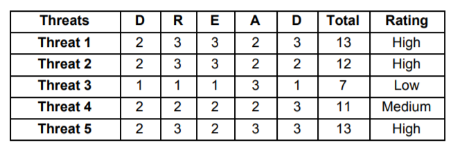

Threat modeling is an effective tool used to understand the threat landscape within an enterprise network. Threat modeling is a security practice for the team to identify threats, attacks, and risks based on the existing architecture design, and to mitigate these potential security risks. It is the process of looking at all the significant and likely potential threats to a scoped scenario, ranking their potential damage in a given time period, and figuring cost‐effective mitigations to defeat the highest‐priority threats. The threat modeling exercise enables organizations to get a better understanding of the threats targeting them. It enables them to be better prepared to prioritize strategies for reducing their attack surface. Threat modeling is very commonly used as a part of the software development life cycle. It enables all participants in the software development process to efficiently create and deliver secure software with a greater degree of confidence that all security flaws are understood and accounted for.

There are many frameworks for threat modeling such as STRIDE, PASTA, VAST, TRIKE, and OCTAVE. All threat models start with the concept of how much residual risk the owner is willing or able to accept, after all agreed upon mitigations are applied.

### Threat

A threat is any intentional (e.g., cybercrime) or accidental (e.g., natural disaster) course of action with the potential to adversely impact people, processes, or technology. Threats can be classified according to their types, such as:

- Physical damage (e.g., fire, water)
- Service impact (e.g., electrical, telecommunication)
- Information compromise (e.g., eavesdropping, media theft)
- Technical failures (e.g., software defects, performance, and capacity)
- Operational compromise (e.g., abuse of rights, denial of service)

Threats are realized via attacks. Intelligence and understanding of threats help build knowledge on styles of attack by adversaries. Threat data may represent lessons learned from previous attacks and may help reveal new attack patterns.

### STRIDE

The STRIDE threat model defines threats in six categories. This approach to threat modeling was defined by [Loren Kohnfelder](https://medium.com/@lorenkohnfelder) and Praerit Garg. They published this as part of an initiative taken by Microsoft in 1999 to harden its products against security vulnerabilities. This document can be found [here](https://adam.shostack.org/microsoft/The-Threats-To-Our-Products.docx). This framework and mnemonic were designed to help identify the types of attacks that software tends to experience. STRIDE stands for

- **S**poofing - Spoofing is the unauthorized use of identity markers, such as a username and password, to gain access to assets. Threats in the spoofing category also include an adversary creating and exploiting confusion about the identity of someone or something. Other examples of spoofing identity are forging an email address or the modification of header information in a request with the purpose of gaining unauthorized access to a software system.
- **T**ampering - Tampering involves an adversary making modifications to data in storage or in transit. Examples of tampering with data include modifying persisted data in a database, changing data as it travels over a network, and modifying data in files.
- **R**epudiation - Repudiation is the explicit denial of performing actions where proof cannot be otherwise obtained. It involves an adversary performing a certain action and then later denying having performed the action. Examples are executing unauthorized actions against asset. Nonrepudiation is the mitigating control where a record of actions is maintained. Strong authentication, accurate and thorough logging, and the use of digital certificates can be used to counter repudiation threats.
- **I**nformation disclosure - Information disclosure threats involve an adversary gaining unauthorized access to confidential information. The information obtained by the attacker could potentially be used for other types of attack. For example, an attacker can obtain system information (server OS version, application framework version etc.) to further craft a highly specialized attack vector.
- **D**enial of service (DOS) - A denial of service threat involves denying legitimate users' access to systems or components. An attacker can flood servers with packets to the point that the servers become unavailable or unusable. They can then be overloaded to a point such that they cannot fulfill legitimate requests.
- **E**levation of privilege - An elevation of privilege threat involves a user or a component being able to access data or programs for which they are not authorized. An attacker can gain elevated authorization for operations beyond what was originally granted. For example, an attacker can execute kernel-mode commands or run processes with additional permissions by elevating privileges.

STRIDE can be augmented by using a checklist or threat library lists, such as Common Attack Pattern Enumeration and Classification (CAPEC), or Adversarial Tactics, Techniques and Common Knowledge (ATT&CK) and CWE (https://cwe.mitre.org/data/index.html)

### DREAD

After the threats have been identified and classified, it is essential to rank and prioritize them. Higher priority threats must be addressed. The DREAD methodology can be effective in rating the threats. It provides a consistent way to classify, quantify, and prioritize the risk associated with each risk item. DREAD is an abbreviation for the following terms:

- **D**amage Potential - Damage potential measures how much injury can result from a risk.
- **R**eproducibility - Reproducibility can be measured by how likely it is to happen and how frequently it will occur.
- **E**xploitability - Exploitability focuses on the skills and hacker tooling that are needed to exploit the risk. It is an assessment of the effort, monetary investment, and expertise required to launch the exploit.
- **A**ffected users - The number of users that could be potentially affected by an attack.
- **D**iscoverability - The likelihood that a vulnerability can be taken advantage of. It is an assessment if the knowledge of the vulnerability requires inside knowledge of the system or can it be easily guessed.

The DREAD model for assessing risk works by assigning a number against each of the categories above. Then we can apply the formula

> Risk value = (Damage Potential x Reproducibility x Exploitability x Affected Users x Discoverability) / 5

using the numbers assigned to come up with a measure of the risk value. Threats can then be quantified, compared, and prioritized based on their risk value. Thus STRIDE and DREAD can be used in conjunction to produce an effective and actionable threat model.

### Threat Sharing and Community Support

Threat modeling, when combined with community sharing, provides an enterprise with holistic and near real-time view of the threat landscape. This allows for better mitigation strategies as well as faster time for the detection of security breach. This also strengthens the enterprise’s knowledge when performing threat forecasting.

There are a lot of commonalities in how threats are structured, how they work and their impact. There are various frameworks to categorize and classify threats so that they can be broadly shared with a bigger community. STIX and TAXII help to solve the problem of threat intelligence sharing by providing a platform that uses a common format to store and retrieve intelligence. They are protocols that were developed to allow for the communication of threat information so that secondary systems could anticipate a new attack vector. STIX is a structured language for cyber threat intelligence. It is a machine-readable format that allows organizations to share threat intelligence across various commercial and freeware threat intelligence aggregation platforms. Taxii is a transport mechanism for sharing cyber threat intelligence. TAXII is most commonly used as a transport mechanism for threat intelligence data including STIX as well as other similar projects. Infact, TAXII is the way that STIX is shared between entities or organizations.
