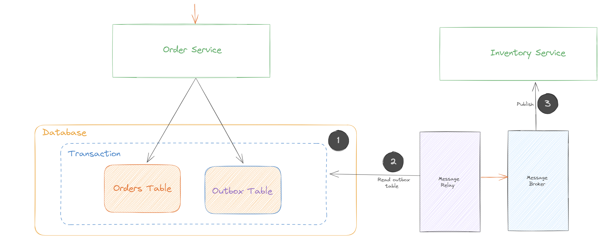

Services/software components often needs to publish messages or events as part of a transaction that updates the database. For instance, Integration events such as Order created, Customer created etc need to be published to external domains which maybe interested in these events. Both the database update and the sending of the message must happen within a transaction. A service might update the database and then crash, for example, before sending the message. If the service doesn’t perform these two operations atomically, a failure could leave the system in an inconsistent state.

The traditional solution is to use a [distributed transaction( 2PC)](http://geekswithblogs.net/Pradeepl/archive/2006/02/09/68808.aspx) that spans across the database and the message broker. However Distributed transactions create their own complexities and have performance issues. Additionally many modern messaging systems such as apache kafka do not support distributed transactions. As a result, an application must use a different mechanism to reliably publish messages.

# What does it solve for ?

Transactional Outbox pattern is used to ensure reliable messaging in distributed systems, especially when dealing with microservices. This pattern addresses the problem of maintaining atomicity between state changes in a database and sending messages/events to other parts of a distributed system. In scenarios where a service updates the database but fails to send the message due to a crash or network failure, the system can end up in an inconsistent state. The Transactional Outbox pattern avoids this by ensuring that the message is not lost even if the service fails after updating the database. The pattern ensures that messages are eventually delivered, even in the face of temporary failures. Since messages are stored in the database (in the 'outbox'), they can be retried until successful delivery is confirmed.By storing events in the order they are created in the database, the Transactional Outbox pattern can help maintain the correct order of events, which is often crucial in distributed systems for maintaining data consistency and integrity. This pattern can improve performance by decoupling the time-consuming process of message sending from the main business logic. The application writes the message to the outbox and immediately proceeds, while a separate process handles the actual message delivery. It allows for scaling the message sending mechanism independently of the application, providing flexibility and scalability in handling message delivery.

# How does it work ?



sequenceDiagram
    participant AS as Application Service
    participant DB as Application Database
    participant OT as Outbox Table
    participant MR as Message Relay Process
    participant MQ as Message Queue/Event Bus 
    participant MS as Destination Microservices

    AS->>DB: Perform Business Operation
    Note right of DB: Transaction Begins
    DB-->>OT: Store Message in Outbox
    Note right of DB: Transaction Commits
    loop Message Relay
        MR->>OT: Check for New Messages
        OT-->>MR: Provide New Messages
        alt Using Message Queue/Event Bus
            MR->>MQ: Send Message
            MQ->>MS: Deliver Message to Microservices
        else Direct Delivery
            MR->>MS: Deliver Message Directly
        end
    end



The process begins with the Application Service (AS) performing a business operation that needs to be recorded in the database. This could be any typical operation like creating, updating, or deleting data. This business operation initiates a database transaction. The transaction ensures that operations are processed in a way that either all succeed or none do, maintaining data integrity. Along with the business operation, a message corresponding to this operation is stored in the Outbox Table (OT) within the same database transaction. This message is meant for other parts of the system that need to be notified about this operation. The Outbox Table acts as a temporary storage for these messages. The database transaction is then committed. This means that both the business operation and the message storage happen atomically — they either both succeed or both fail. After the transaction, the Message Relay Process (MR) periodically checks (polls) the Outbox Table for new messages. When new messages are detected in the Outbox Table, the Message Relay Process retrieves them for further processing. At this stage, there are typically two paths for message delivery, either via a message queue/event bus or by directly calling the service without an intermediary. The Destination Microservices receive the messages and process them accordingly. This could involve updating their own state, triggering other operations, or even sending further messages.

# Components of Outbox pattern

## Application Service
This is the primary service or application that performs business operations. It's responsible for executing business logic, which often results in changes to the database. This component is where the need to send messages or events to other parts of the system originates.

## Application Database
The central data store used by the application service. It's where the business data is stored and managed. In the context of the Transactional Outbox pattern, the database plays a crucial role in ensuring transactional integrity.

## Outbox Table
The Transactional outbox pattern uses the primary persistance layer (database, either a SQL or NOSQl) as a temporary message queue. The service that sends messages has an OUTBOX database table. As part of the database transaction that creates, updates, and deletes entities, the service sends messages by inserting them into the OUTBOX table. Atomicity is guaranteed because this is a local ACID transaction. In the case of a NoSql database each aggregate stored as a document in the database has an attribute that is a collection of messages that need to be published. When a service updates an entity in the database, it appends a message to that list. This is atomic because it’s done with a single database operation. A MessageRelay component then reads the OUTBOX table or the outbox collection in the document and publishes the messages to a message broker.

## Message Relay
This is a separate process or service that monitors the Outbox table for new messages. Once it detects a new message, it retrieves it and handles the delivery to the appropriate destination, such as a message queue or another microservice. This process is responsible for ensuring that messages are sent even if the original application service fails after updating the database. The MessageRelay can be built either as a polling publisher or using the transaction log tailing pattern

### Polling Publisher
The polling publisher publishes messages by polling the outbox in the database. Polling the database works reasonably well at low scale, however frequently polling the database does not scale well. Additionally, this approach does not work well with NoSQl databases where the query pattern is more complex. In a NoSQL database the application must query documents containing the aggregates, and that may or may not be possible to do efficiently.

### Transaction log Tailing

Another pattern to implement MessageRelay is to tail the database transaction log (also called the commit log). Every committed update made by an application is represented as an entry in the database’s transaction log. A transaction log miner can read the transaction log and publish each change as a message to the message broker. The Transaction Log Miner reads the transaction log entries. It converts each relevant log entry corresponding to an inserted message into a message. The messages are then published to a message broker. This approach can be used to publish messages written to an OUTBOX table in an RDBMS. It can also be used to publish messages written to documents in a NoSQL database. The benefit with this pattern is that there is no change required at the application level, everything happens at the database level.

Azure CosmosDB implements transaction log tailing using 'Change feeds' mechanism. The Change feed works for inserts and updates. Delete operations can be handled by soft deletes. The most recent change of the document will be available in change feed and it appears only once for consumer processing. The changes are sorted by the modification time within a partition; sorting across partitions are not guaranteed. There is no fixed period for change retention. Multiple consumers can process changes in parallel and in chunks. One collection can have multiple change feeds.The change feed works seamlessly in the case of a failover.

AWS DynamoDB implements transaction log tailing using DynamoDB Streams, which captures the full event activity within a table. DynamoDB streams are an event-based notification system that can resemble traditional database triggers.  Once activated for a table, it provides a service endpoint where all the ordered table changes are recorded and persisted up to 24 hours. The streams can output information about each item that is being changed and we can configure the delivery of just the partition key, the old data in the table, the newly written data in the table, or both the new and the old data simultaneously.

In [Event driven architecture]() this pattern is used in conjunction with the [idempotent consumer pattern]() to provide eventual consistency.

## Destination Microservices
These are other microservices or external systems that need to receive the messages or events. They subscribe to the message queue or listen for events and act upon them as required.

## Message Queue/Event Bus

Messages from the Outbox table are sent to a message queue or event bus, which then delivers them to the intended microservices. This adds another layer of reliability and decoupling, as the message queue/event bus can manage message delivery retries, ordering, and distribution.

# Practical example of Outbox pattern

Now that we know the actors in the pattern, its sequence flow .. let us look at an example implementation of this pattern.

Imagine an e-commerce system where an order service handles customer orders. When an order is placed, the system needs to update the order database and notify the inventory service to update the stock. This is a classic case where we can apply the Transactional Outbox pattern.

The process flow is as follows

 - Place Order in Application Service: A customer places an order through the application. The Order Service (OS) processes this order.
 - Update Order Database: The Order Service updates the order database to record the new order. This includes details like customer information, items purchased, and order status.
 - Create Message for Inventory Update: Along with updating the order, the Order Service creates a message indicating that the inventory needs to be updated. This message is stored in the Outbox Table of the order database as part of the same database transaction.
 - Commit Transaction: The transaction involving both the order update and the message insertion into the outbox is committed to the database.
 - Message Relay Process Checks Outbox: A separate process, the Message Relay, periodically checks the Outbox Table for new messages.
 - Send Message to Inventory Service: Upon finding the new message, the Message Relay forwards it to the Inventory Service, either directly or via a message queue.
 - Inventory Service Updates Stock: The Inventory Service receives the message and updates the stock accordingly. 

The sequence diagram for this process flow is as follows


sequenceDiagram
    participant C as Customer
    participant OS as Order Service
    participant DB as Order Database
    participant OT as Order Outbox Table
    participant MR as Message Relay Process
    participant IS as Inventory Service

    C->>OS: Place Order
    OS->>DB: Update Order Data
    Note right of DB: Transaction Begins
    DB-->>OT: Store Inventory Update Message
    Note right of DB: Transaction Commits
    loop Message Relay
        MR->>OT: Check for New Messages
        OT-->>MR: Provide New Messages
        MR->>IS: Send Inventory Update Message
    end
    IS->>DB: Update Inventory



# Conclusion

The Transactional Outbox pattern is a key pattern in distributed systems. It is used to ensure reliable messaging in distributed systems in a simple and efficient manner. It is a key strategy for managing data consistency, reliability, and communication in a microservices architecture. It addresses several distributed systems challenges and is a vital tool in the toolbox of developers and architects working with such systems.

## References

> [NServicebus Outbox Pattern](http:// https://docs.particular.net/nservicebus/outbox/ )
> 
> [Debezium Outbox Pattern](https://debezium.io/blog/2019/02/19/reliable-microservices-data-exchange-with-the-outbox-pattern/)
> 
> [CosmosDB Change Feed](https://docs.microsoft.com/en-us/azure/cosmos-db/change-feed)
> 
> [DynamoDb Streams](https://docs.aws.amazon.com/amazondynamodb/latest/developerguide/Streams.html)
