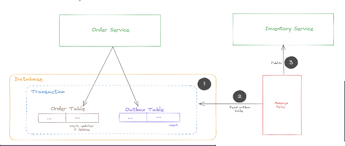
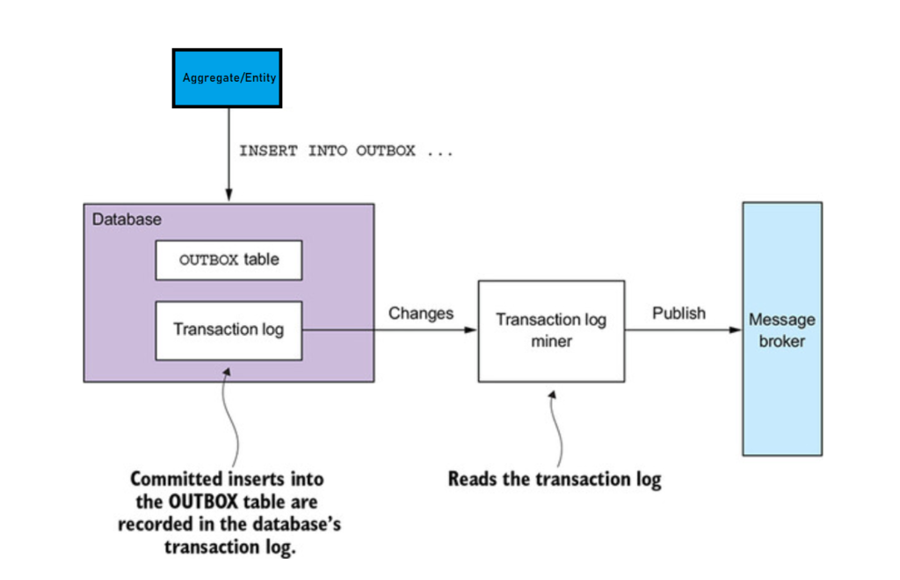

### Introduction

A microservice often needs to publish messages or events as part of a transaction that updates the database. For instance, Integration events such as Order created, Customer created etc need to be published to external domains which maybe intersted in these events. Both the database update and the sending of the message must happen within a transaction. A service might update the database and then crash, for example, before sending the message. If the service doesn’t perform these two operations atomically, a failure could leave the system in an inconsistent state.

The traditional solution is to use a [distributed transaction( 2PC)](http://geekswithblogs.net/Pradeepl/archive/2006/02/09/68808.aspx) that spans across the database and the message broker. However Distributed transactions create thier own complexities and have performance issues. Additionally many modern messaging systems such as apache kafka do not support distributed transactions. As a result, an application must use a different mechanism to reliably publish messages.

Transactional Outbox is a pattern to reliably publish messages without the use of distributed transactions. It has two parts , the Outbox and the message dispatcher which work togethar to reliably persist state and publish messages.

Transactional Outbox Pattern

### Outbox

The Transactional outbox pattern uses the primary persistance layer (database, either a SQL or NOSQl) as a temporary message queue. The service that sends messages has an OUTBOX database table. As part of the database transaction that creates, updates, and deletes entities, the service sends messages by inserting them into the OUTBOX table. Atomicity is guaranteed because this is a local ACID transaction. In the case of a NoSql database each aggregate stored as a document in the database has an attribute that is a collection of messages that need to be published. When a service updates an entity in the database, it appends a message to that list. This is atomic because it’s done with a single database operation. A MessageRelay component then reads the OUTBOX table or the outbox collection in the document and publishes the messages to a message broker.

### Message Relay

The MessageRelay publishes messages from the outbox to the message broker, sending one to its destination message channel. It deletes those messages from the OUTBOX table. The MessageRelay can be built either as a polling publisher or using the transaction log tailing pattern

#### Polling Publisher

The polling publisher publishes messages by polling the outbox in the database. Polling the database works reasonably well at low scale, however frequently polling the database does not scale well. Additionally, this approach does not work well with NoSQl databases where the query pattern is more complex. In a NoSQL database the application must query documents containing the aggregates, and that may or may not be possible to do efficiently.

#### Transaction log Tailing

Transaction Log Tailing

Another pattern to implement MessageRelay is to tail the database transaction log (also called the commit log). Every committed update made by an application is represented as an entry in the database’s transaction log. A transaction log miner can read the transaction log and publish each change as a message to the message broker. The Transaction Log Miner reads the transaction log entries. It converts each relevant log entry corresponding to an inserted message into a message. The messages are then published to a message broker. This approach can be used to publish messages written to an OUTBOX table in an RDBMS. It can also be used to publish messages written to documents in a NoSQL database. The benefit with this pattern is that there is no change required at the application level, everything happens at the database level.

Azure CosmosDB implements transaction log tailing using 'Change feeds' mechanism. The Change feed works for inserts and updates. Delete operations can be handled by soft deletes. The most recent change of the document will be available in change feed and it appears only once for consumer processing. The changes are sorted by the modification time within a partition; sorting across partitions are not guaranteed. There is no fixed period for change retention. Multiple consumers can process changes in parallel and in chunks. One collection can have multiple change feeds.The change feed works seamlessly in the case of failovers.

AWS DynamoDB implements transaction log tailing using DynamoDB Streams, which captures the full event activity within a table. DynamoDB streams are an event-based notification system that can resemble traditional database triggers.  Once activated for a table, it provides a service endpoint where all the ordered table changes are recorded and persisted up to 24 hours. The streams can output information about each item that is being changed and we can configure the delivery of just the partition key, the old data in the table, the newly written data in the table, or both the new and the old data simultaneously.

In [Event driven architecture](https://pradeeploganathan.com/architecture/event-driven-architecture/) this pattern is used in conjunction with the [idempotent consumer pattern](https://pradeeploganathan.com/patterns/idempotent-consumer-pattern/) to provide eventual consistency.

### References

> [NServicebus Outbox Pattern](http:// https://docs.particular.net/nservicebus/outbox/ )
> 
> [Debezium Outbox Pattern](https://debezium.io/blog/2019/02/19/reliable-microservices-data-exchange-with-the-outbox-pattern/)
> 
> [CosmosDB Change Feed](https://docs.microsoft.com/en-us/azure/cosmos-db/change-feed)
> 
> [DynamoDb Streams](https://docs.aws.amazon.com/amazondynamodb/latest/developerguide/Streams.html)
