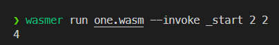
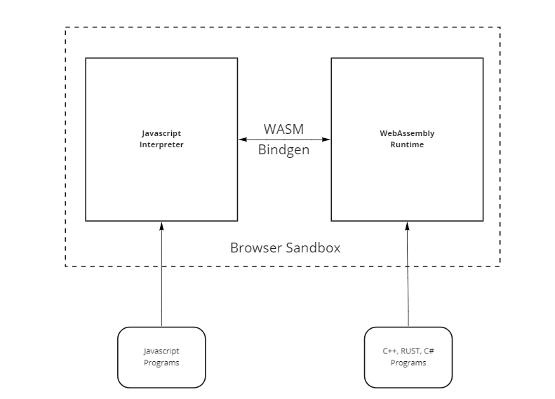
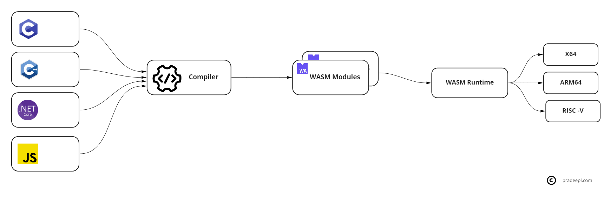

## What is WebAssembly?

WebAssembly(WASM) is a low-level assembly-like language that is designed for efficient execution and compact representation. WebAssembly is a binary-encoded instruction format or bytecode that runs on a stack-based virtual machine. WASM runs in a memory-safe and sandboxed environment. A WASM module does not have permission to access anything outside of that sandbox. It does not have access to API's and system calls on the host. WebAssembly modules can only access functionality that is explicitly provided by their hosting environments .WASM defines an import/export mechanism allowing for functionality to be safely exposed. The set of available imports is defined by the host environment. These imports can then be imported and used by the WASM module. Imports include Function, Table, Memory, or Global imports. A WASM module also defines an export section that holds a list of all items that will be available to the host environment once the module is instantiated. These are the parts of the module that the host environment can access. Exports can include Function, Table, Memory, or Global items.

WebAssembly is designed as a portable compilation target for programming languages. Programming languages such as C, C++, .Net, Rust, Python etc  can be compiled to produce WebAssembly modules using language-specific toolchains. Each WebAssembly file is an efficient, optimal, and self-sufficient module called a WebAssembly module (WASM). These modules use the .wasm file extension. It also defines a corresponding textual assembly language, called WebAssembly Text Format (WAT), which uses the .wat  extension. The WAT files make it easier to read and understand the WASM modules. The generated webassembly modules( WASM) can be executed on any WASM runtime.

The structure of a WASM module is as follows

```
module ::= {
    types vec<funcType>,
    funcs vec<func>,
    tables vec<table>,
    mems vec<mem>,
    globals vec<global>,
    elem vec<elem>,
    data vec<data>,
    start start,
    imports vec<import>,
    exports vec<export>
}
```

A simple WAT file containing webassembly instructions to add two numbers and return the result is below

```wasm
(module
  (func $addnumbers (param $lhs i32) (param $rhs i32) (result i32)
    local.get $lhs
    local.get $rhs
    i32.add)
  (export "_start" (func $addnumbers))
)
```

The above code defines a module. The function _start is exported and made available to the host. It can be invoked by using the wasmer runtime as follows ```wasmer run one.wasm --invoke _start 2 2```



## WebAssembly in the browser

WebAssembly was originally designed as a technology solution to speed up code execution inside web browsers. It was not intended to replace JavaScript, but work side-by-side with JavaScript. Wasm overcomes some of the performance limitations of javascript in the browser. WebAssembly’s universal acceptance on all major browsers meant non-JavaScript code can be compiled to run anywhere. This meant that applications written in C++ and other languages could be compiled to wasm making their transition from the desktop to the browser much smoother and perform better.



Figma is a very early example of a large C++ based application running in the browser by compiling it into webassembly. [This blog post](https://www.figma.com/blog/webassembly-cut-figmas-load-time-by-3x/) by [Figma](https://www.figma.com/) provides a lot of details about the WebAssembly usage by Figma. Similarly Adobe uses WebAssembly to run its flagship products such as Photoshop on the web. [This blog post](https://web.dev/ps-on-the-web/) provides some real good insights on  transition of Adobe Photoshop to the web. This youtube talk by the Adobe team provides insights into some of the aspects.



WASM at Adobe

### Blazor WebAssembly

[Blazor](https://dotnet.microsoft.com/en-us/apps/aspnet/web-apps/blazor) is an example of a WebAssembly based framework for running web applications in the browser. It was released in .Net core 3.1 and was updated as part of .Net 5.0. Blazor allows the creation of compelling real-time web experiences using the WebAssembly hosting model. It allows .Net developers to create client side Single page applications (SPA) using C#.


## WebAssembly in the Cloud

Wasm is based on an industry-wide collaborative effort. WASM is language, hardware, and platform-independent. WASM has fast startup times with no cold start issues. It has low resource overheads and is highly portable. It is secure and runs in a highly constrained sandbox. This makes it ideal to be deployed on the edge and for IoT devices which are resource constrained. It also makes it ideal for serverless workloads on the cloud.

The Cloud Native Computing Foundation (CNCF) is working on an effort to create an application development platform based on WASM. The [Bytecode Alliance](https://bytecodealliance.org/) comprising major players such as Arm, Intel, Google, Microsoft, Mozilla, Fastly and others was set up to create shared implementations of WebAssembly standards and make it easier to run WASM applications anywhere.

### WASI

WebAssembly has gained a lot of traction and support in non-browser applications. In the browser access to system resources is facilitated by the browser on behalf of the Wasm module. However, outside the browser for server-based and edge applications access to system resources is provided by the runtime. The runtime implementations of the system calls are varied across the different implementations resulting in portability issues. This led to the creation of the WebAssembly System Interface, or WASI, to ensure that there’s consistency in how hosts implement their interfaces. A system interface is an API that allows an application to access system resources in a consistent manner. It allows for interoperability across a range of operating systems.

WebAssembly systems interface (WASI) is a runtime specification and a standard for WebAssembly interaction with the operating system. WASI allows WebAssembly to use operating system resources such as access the filesystem, make system calls, network access etc in a safe , secure and platform-independent manner. WASI provides a set of modular system interfaces. It not only includes the low level system interfaces providing access to IO, network resources etc but also higher level interfaces such as cryptography etc. WASI defines a system interface called wasi-core, which can be implemented by hosts to provide network and filesystem access.

### WASM Runtime

The Wasm runtime is a stack-based virtual machine that can execute the WebAssembly instruction set, as described by the specification. It operates on the generated Wasm bytecode by pushing and popping data off the stack. The WASM runtime can be compared to the Java Virtual Machine(JVM). However, the JVM bytecode isn't universal (the JVM was initially designed to only support Java). Almost all the programming languages like C, C++, Rust, Golang, and JavaScript can be compiled into Wasm bytecode. WebAssembly was designed for rapid compilation time by implementing very simple validation rules compared to Java / JVM languages. WebAssembly was designed to be secure and simple, minimizing the overall attack surface. It runs in a memory-safe and sandboxed environment. WASM does not have permission to access anything outside of that sandbox.



Some of the well-known wasm runtimes are [Wasmer](https://wasmer.io/), [Wasmtime](https://wasmtime.dev/), [WasmEdge](https://wasmedge.org/) , [Wasm Micro Runtime](https://github.com/bytecodealliance/wasm-micro-runtime) and others.

## WebAssembly on Kubernetes

Containers are an ideal tool to host workloads in a safe and secure environment. Container runtimes restrict workloads from abusing sensitive kernel calls. However, a lot of effort is needed to lockdown a container environment and it also needs to be constantly patched as new CVE's are reported. Containers are also not small enough to run in environments with constrained resources ( CPU, memory etc) such as edge environments. Edge environments also operate in low network bandwidth environments where patching containers is not effective.  WASM provides an ideal alternative runtime environment for such workloads. WASM has low resource overheads and fast startup times. WASM's sandboxed environment and secure by default runtime model is ideal for such environments. WASI unlocks the ability to use WASM in these environments. Solomon Hykes, the founder of docker also tweeted about this potential some time back.



[Krustlet](https://krustlet.dev/) is a tool to run WebAssembly workloads natively on Kubernetes. Krustlet implements the Kubelet API. It acts as a node in the cluster. When the user schedules a pod with specific node tolerations , the Kubernetes API will schedule that pod to the Krustlet node. This node will fetch the module and run it.  

## Serverless using WebAssembly

In the serverless world , cloud providers manage infrastructure and allow for on-demand provisioning with greater agility. In this model, you provide the code and the cloud provider provisions and manages all resources ( containers, network, OS, app server etc) required to run it. The code runs on a server shared by many others and needs to be isolated to provide security and protect it from vulnerabilities that can be caused by other workloads. Since resources are provisioned dynamically on demand, workloads can suffer from cold start issues while resources are being provisioned due to startup from zero. WebAssembly is ideal under these circumstances due to their fast startup and isolated runtime model. Cloudflare's computing platform called [Workers](https://workers.cloudflare.com/) is a serverless runtime based on the Chrome V8 Javascript engine. It does not use containers or Virtual Machines. Workers hosts the WebAssembly runtime and can be used to deploy WASM modules as serverless functions. This model has significantly fast startup times and requires fewer resources. See this post [here](https://blog.cloudflare.com/cloud-computing-without-containers/) for more details.


## Conclusion

WebAssembly has a bright future. It has had a successful start in the browser ecosystem and is now headed for the cloud. It is a technology that augments other cloud native technologies and concepts such as Kubernetes, FaaS and Serverless.