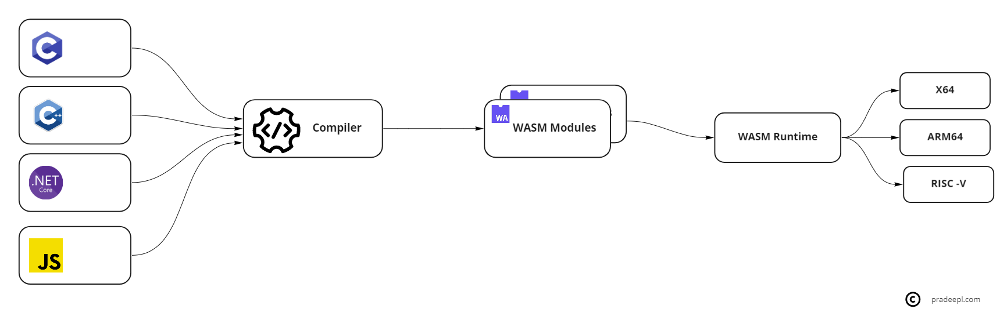

## What is WebAssembly?

WebAssembly is a low-level assembly-like language that is designed for efficient execution and compact representation. WebAssembly is a binary-encoded instruction format that runs on a stack-based virtual machine. It is an open standard defined by the World Wide Web Consortium (W3C). WebAssembly is designed as a portable compilation target for programming languages. Programming languages such as C, C++, .Net, Rust, Python etc  can be compiled to produce WebAssembly modules using language-specific toolchains. Each WebAssembly file is an efficient, optimal, and self-sufficient module called a WebAssembly module (WASM). These modules use the .wasm file extension. It also defines a corresponding textual assembly language, called WebAssembly Text Format (WAT), which uses the .wat  extension. The WAT files make it easier to read and understand the WASM modules. The generated webassembly modules( WASM) can be executed on any WASM runtime. WASM runs in a memory-safe and sandboxed environment. A WASM module does not have permission to access anything outside of that sandbox.

Wasm is based on an industry-wide collaborative effort. The Cloud Native Computing Foundation (CNCF)is working on an effort to create an application development platform based on WASM. The [Bytecode Alliance](https://bytecodealliance.org/) comprising major players such as Arm, Intel, Google, Microsoft, Mozilla, Fastly and others was set up to create shared implementations of WebAssembly standards and make it easier to run WASM applications anywhere. WASM is language, hardware, and platform-independent.

## WebAssembly in the browser

WebAssembly was originally designed as a technology solution to speed up code execution inside web browsers. It was not intended to replace JavaScript, but work side-by-side with JavaScript. Wasm overcomes some of the performance limitations of javascript in the browser. WebAssembly’s universal acceptance on all major browsers meant non-JavaScript code can be compiled to run anywhere. This meant that applications written in C++ and other languages could be compiled to wasm making their transition from the desktop to the browser much smoother and perform better.

Figma is a very early example of a large C++ based application running in the browser by compiling it into webassembly. [This blog post](https://www.figma.com/blog/webassembly-cut-figmas-load-time-by-3x/) by [Figma](https://www.figma.com/) provides a lot of details about the WebAssembly usage by Figma. Similarly Adobe uses WebAssembly to run its flagship products such as Photoshop on the web. [This blog post](https://web.dev/ps-on-the-web/) provides some real good insights on  transition of Adobe Photoshop to the web. This youtube talk by the Adobe team provides insights into some of the aspects.



WASM at Adobe

### Blazor WebAssembly

[Blazor](https://dotnet.microsoft.com/en-us/apps/aspnet/web-apps/blazor) is an example of a WebAssembly based framework for running web applications in the browser. It was released in .Net core 3.1 and was updated as part of .Net 5.0. Blazor allows the creation of compelling real-time web experiences using the WebAssembly hosting model. It allows .Net developers to create client side Single page applications (SPA) using C#.


## WebAssembly beyond the browser

WASM has fast startup times with no cold start issues. It has low resource overheads and is highly portable. This makes it ideal to be deployed on the edge and for IoT devices which are resource constrained. It alo makes it ideal for serverless workloads on the cloud.


## WASM Runtime

The Wasm runtime is a stack-based virtual machine that can execute the WebAssembly instruction set, as described by the specification. It operates on the generated Wasm bytecode by pushing and popping data off the stack. The WASM runtime can be compared to the Java Virtual Machine(JVM). However, the JVM bytecode isn't universal (the JVM was initially designed to only support Java). Almost all the programming languages like C, C++, Rust, Golang, and JavaScript can be compiled into Wasm bytecode. WebAssembly was designed for rapid compilation time by implementing very simple validation rules compared to Java / JVM languages. WebAssembly was designed to be secure and simple, minimizing the overall attack surface. It runs in a memory-safe and sandboxed environment. WASM does not have permission to access anything outside of that sandbox.



Some of the well-known wasm runtimes are [Wasmer](https://wasmer.io/), [Wasmtime](https://wasmtime.dev/), [WasmEdge](https://wasmedge.org/) , [Wasm Micro Runtime](https://github.com/bytecodealliance/wasm-micro-runtime) and others.

A simple WAT file containing webassembly instructions to add two numbers is below

```wasm
(module
  (func (export "addnumbers") (param i32 i32) (result i32)
    local.get 0
    local.get 1
    i32.add))
```

## WASI

WebAssembly systems integration (WASI) is a runtime specification and a standard for WebAssembly interaction with the operating system. WASI allows WebAssembly to use operating system resources such as access the filesystem, make system calls etc in a safe , secure and platform-independent manner. 



