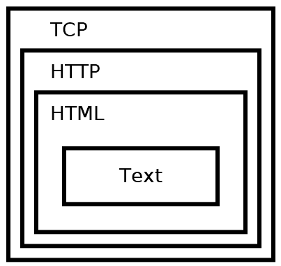
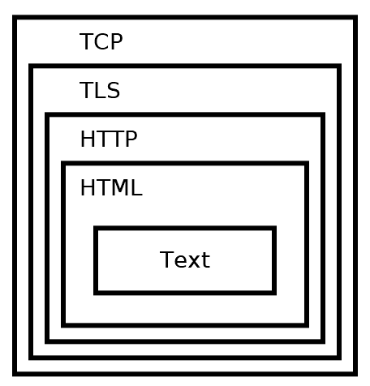
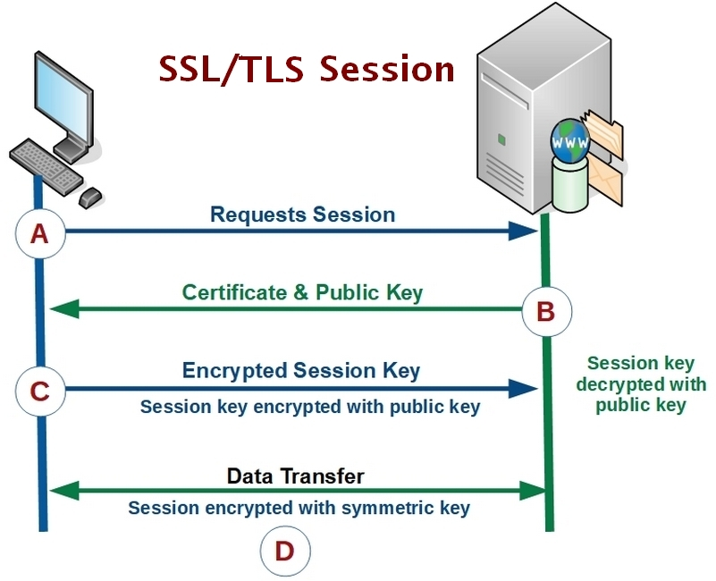

[HTTP](https://pradeepl.com/blog/what-is-http2/)(Hypertext transfer protocol) is a network protocol used to serve up web pages. HTTPS, or HTTP Secure, was designed to secure communications between a client and the HTTP server. It is a protocol that uses a secure connection to transfer data over the internet. This protocol encrypts HTTP traffic before sending it out on the network. Early versions of HTTPS used a protocol called Secure Socket Layer (SSL) to encrypt the HTTP traffic. Versions 1, 2, and 3 of SSL were discovered to have security flaws. The replacement of SSL 3 was a new protocol called Transport Layer Security (TLS). TLS 1.0 and 1.1 have also been found to have flaws. TLS 1.2 or TLS 1.3 fixed these flaws and should be used, except when legacy systems require the use of older protocols for backward compatibility.

HTTPS provides security to HTTP. HTTPS secures HTTP by using TLS over TCP on port 443. TLS is a protocol that can provide security to any TCP connection. Generally, establishing an HTTPS connection involves the client and server negotiating which protocol to use. The ideal outcome is that the client and server agree on the most secure, mutually supported protocol and cipher.

## HTTP over the wire

HTTP is most commonly used to transmit web pages. The text on a web page is first encoded as Hypertext Markup Language (HTML). HTML provides formatting, layout, and styling to web pages. HTTP is then used to transmit the HTML, and HTTP itself is transmitted over a TCP connection. This can be visually represented as below

HTTP without TLS

## HTTP with TLS - HTTPS

TLS works inside TCP and sometimes UDP to provide a secure communication channel. Since it sits on top of the transport layer, it allows protocols higher in the chain to remain unchanged. HTTPS is then basically the same as the HTTP protocol, but it is sent inside a TLS channel. The protocol hides the actual data being sent across the wire. Attackers can only see what port, domain, and IP address are connected with it. There are other communication protocols that support TLS, such as web sockets (WSS), email (SMTPS), and FTP (FTPS). The visual representation with the addition of TLS when use with HTTP is below

HTTP with TLS

## TLS Handshake

After a TCP connection is established, the client initiates a TLS handshake. The client sends several specifications to the server, including which versions of SSL/TLS it is running, which cipher suites it supports, and which compression methods it would like to use.

The server selects the highest mutually supported version of SSL/TLS to use. It also chooses a cipher suite and compression method from the choices given by the client. If the client and server do not support any cipher suite in common, then no TLS connection can be established. Once the initial TLS connection is established, the client requests the server's certificate. Certificates are used to verify server identities with digital signatures. The client uses this to verify that it's connected to a legitimate server. The certificate must be trusted by the client or an authority party that the client trusts. Examples of certificate authorities are Network Solutions, GeoTrust, Let's Encrypt, and Amazon. Once the client has verified that the server really is who it claims to be, a key exchange is initiated. The key depends on the cipher that is chosen. After key exchange completes, both the client and server have a shared secret key. All further communication is encrypted using this key and their chosen symmetric cipher. A visual step by step representation of the entire process is below.

Steps in the SSL/TLS handshake

- Step A: The client sends a Hello message to the target server. This message includes the version of SSL or TLS the client is using and the client's preferences for encryption algorithms (cipher suite), a compression method, and a random string value for use in computations.
- Step B: If all goes well, the server responds with its Hello message, which contains the server's choice for the cipher suite (from the client's list), a session ID, and its own random string value. The server then provides a digital certificate to the client. The server may request a certificate from the client.
- Step C: The client verifies the server's certificate. If verified, it sends the random string value, encrypted with the server's public key, to the server. This value will generate the encryption key for any subsequent messages.
- Step D: After exchanging encrypted finished messages to signal the end of the handshake's creation, the client and server transmit data and messages that have been encrypted with the shared key.

Secure TLS connections between the client and server have at least one of the following properties

- As symmetric cryptography is used to encrypt the transmitted data, it is the reason the connection is secure. The negotiation of a shared secret is both secure and reliable (the negotiated secret is unavailable to eavesdroppers and no attacker can modify the communications during the negotiation without being detected).
- Public-key cryptography is used to authenticate the identity of the communicating parties. The authentication procedure could be made optional, but typically it is required for the server.
- To prevent the undetected loss or alteration of the data during transmission, each transmitted message includes message integrity check using a message authentication code

A detailed post on implementing https in an ASP.Net Core web application is [here]()

> Photo by [Micah Williams](https://unsplash.com/@mr_williams_photography?utm_source=unsplash&utm_medium=referral&utm_content=creditCopyText) on [Unsplash](https://unsplash.com/s/photos/safe?utm_source=unsplash&utm_medium=referral&utm_content=creditCopyText)
