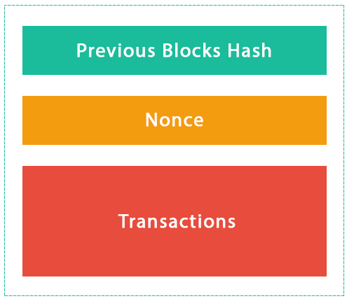

A blockchain is a fully-distributed, peer-to-peer software network which makes use of cryptography to securely host applications, store data, and easily transfer digital instruments of value. Originally proposed by Satoshi Nakamoto in 2008 as the back-end for the Bitcoin cryptocurrency.([Nakamoto, 2008](https://bitcoin.org/bitcoin.pdf)), Blockchain is now distinct from Bitcoin as a platform and stands on its own right seperated from the cryptocurrency implemenations from where it was born. Satoshi Nakamoto married his distributed consesus protocol to [Adam Backs](http://www.cypherspace.org/adam/) Hashcash algorithm which pioneered the use of mining to send transaction creating a simple database that is decentralized and stored in the nodes of its network.

In a Blockchain, the chronologically ordered data points are grouped into individual storage units called blocks. These blocks are then ordered sequentially and stored in a decentralized manner across all the participating nodes to form the Blockchain. At its core, Blockchain is a peer-to-peer distributed ledger that is cryptographically secure, append-only, immutable (extremely hard to change), and updateable only via consensus or agreement among peers. It enables the creation of a programmable, scalable, distributed, trust infrastructure which facilitates wide variety of services including smart contracts, public ledger systems, Dapps (decentralized applications), DAOs (decentralized autonomous organizations), and DACs (decentralized autonomous corporations).

Blockchain is also basically a method to achieve state machine replication.

The power of blockchain systems is that they represent a combination of technologies which enables a distributed network to achieve concensus in a decentralized manner using

- Peer-to-peer networking :  "This system, what’s most interesting about it is, you’re interacting with peers, you’re exchanging information with a person down the street." —[Shawn Fanning](https://en.wikipedia.org/wiki/Shawn_Fanning), cofounder of Napster Peer to Peer networks are a group of computers such as those on Napster or the Bittorrent network that can communicate among themselves without relying on a single central authority and therefore not presenting a single point of failure. Peer-to-peer systems are distributed software systems that consist of nodes (individual computers), which make their computational resources (e.g., processing power, storage capacity, or information distribution) directly available to another. When joining a peer-to-peer system, each computer becomes a node of the system with equal rights and roles.Blockchain brings the magical ability to serve as a tool for achieving and maintaining integrity in purely distributed peer-to-peer systems that have the potential to change whole industries due to disintermediation.
- State Machine Replication : A state machine is a computer or device that remembers the status of something at a given instant in time. Keeping track of transitions of these states is important and that’s what the blockchain does well in an immutable way.In the blockchain, the transition history is a persistent part of the information about that state. State machines are key for implementing distributed systems that have to be fault-tolerant. Apache Bookkeeper is an example of an implementation of a Replicated state machine which replicates logs.

- Asymmetric cryptography : A way for these computers to send a message encrypted for specific recipients such that anyone can verify the sender’s authenticity, but only intended recipients can read the message contents. In Bitcoin and Ethereum, asymmetric cryptography is used to create a set of credentials for your account, to ensure that only you can transfer your tokens.

- [Cryptographic hashing](http://pradeeploganathan.com/blockchain/hashing/) : A way to generate a small, unique “fingerprint” for any data, allowing quick comparison of large datasets and a secure way to verify that data has not been altered. In the blockchain implementations of Bitcoin and Ethereum, the Merkle tree data structure is used to record the canonical order of transactions, which is then hashed into a “fingerprint” that serves as a basis of comparison for computers on the network, and around which they can quickly synchronize. For more on Hashing see [What is a hash?](http://pradeeploganathan.com/blockchain/hashing/)

## Basic Block Structure

The strucutre of a basic block in a blockchain is below.

A block is simply a selection of transactions bundled together in order to organize them logically. It is made up of transactions and its size is variable depending on the type and design of the blockchain in use. A reference to a previous block is also included in the block uunless it's a genesis block. A genesis block is the first block in the blockchain that was hardcoded at the time the blockchain was started. The structure of a block is also dependent on the type and design of a blockchain, but generally there are a few attributes that are essential to the functionality of a block, such as the block header, pointers to previous blocks, the time stamp, nonce, transaction counter, transactions, and other attributes. The hash in blockchain is created from the data that was in the previous block. The hash is a fingerprint of this data and locks blocks in order and time.

## **Blockchain**

The term Blockchain, from  a technical perspective can refer to a data structure, an algorithm, a suite of technologies and a peer to per network with a common application area. As a data structure, blockchain can be thought of as data put together into units called blocks. These blocks are connected to one another like a chain, hence the name blockchain. The blocks are chained to each other using a specific numbering scheme which depends on hashing the previous block. As an algorithm Blockchain is a sequence of instructions that negotiates the informational content of many blockchain-data-structures in a purely distributed peer-to-peer system.

## BlockChain Network

The Blockchain network consists of nodes. Each node contains a complete record of all the transactions that were ever recorded in that blockchain. The nodes are located all over the world and can be operated by anyone. It’s difficult, expensive, and time-consuming to operate a full node, so people don’t do it for free.The underlying blockchain algorithm rewards them for their service. The reward is usually a token or cryptocurrency, like Bitcoin.

Photo by [Fré Sonneveld](http://unsplash.com/photos/K8iHtzoIKQ4?utm_source=unsplash&utm_medium=referral&utm_content=creditCopyText) on [Unsplash](https://unsplash.com/?utm_source=unsplash&utm_medium=referral&utm_content=creditCopyText)
