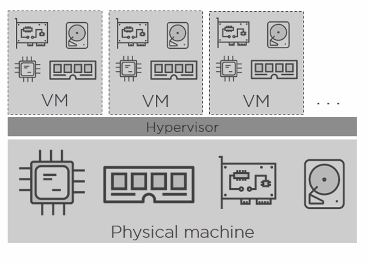
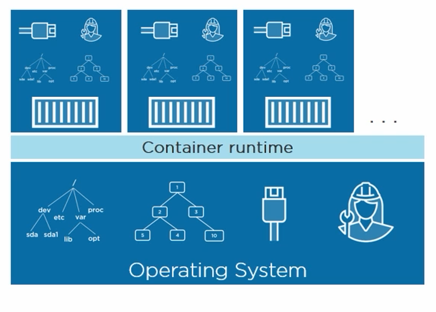
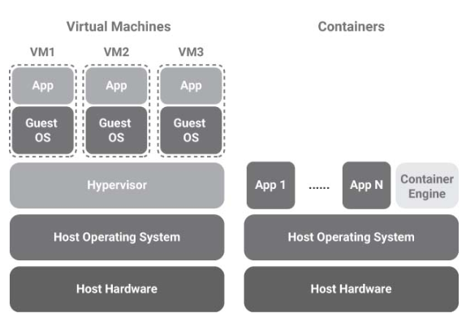

**What is Docker?**

This post is part of a three post series on Docker

- [What is Docker](https://pradeeploganathan.com/docker/docker-part-1/)
- [Docker Architecture](https://pradeeploganathan.com/docker/docker-architecture/)
- [Docker on Windows](https://pradeeploganathan.com/docker/docker-part-3-installing-docker-on-windows/)

Docker is a container technology for packaging an application along with all its dependencies. Docker did not invent containers, it made container technology simpler and easier to use. Solomon Hykes started the development of Docker in March 2010 as a PaaS offering from dotCloud, a company which he cofounded along with Sebastien Pahl. This was open sourced in March 2013. In the last quarter of that same year, the name of the company was changed to Docker Inc.

**Difference between Docker and Virtual machine.**

Traditionally applications are deployed in Virtual machines on bare metal boxes in production. This provides isolation and scalability since we can spin off multiple VM’s on a single machine when needed. While providing advantages VM’s also bring their own share of problems. A virtual machine provides you with virtual hardware on which the operating system and the necessary dependencies must be installed. This takes a long time and running a complete copy of the OS and dependencies requires a significant resource overhead. Each virtualized application includes not only the application and its dependencies but the entire guest operating system.

Unlike virtual machines docker containers do not virtualize hardware but run in the user space. Additionally, while a Virtual machine runs on a separate guest OS, docker containers run within the same OS Kernel. Docker helps avoid this by using the container technology built into the operating system. Thus, docker provides resource isolation and allocation benefits of VM’s while being lean, efficient, and portable. Docker also ensures a consistent environment for an application across any system, be it development, staging or a production system. This enables developers to develop and test their programs against a single platform and a single set of dependencies. This puts an end to the age-old developer refrain of ”Hey!!, It works on my machine”.

In a nutshell the aim of a VM is to fully emulate an OS and a hardware stack while the fundamental goal of a container is to make an application portable and self-contained.

Virtual Machine architecture

### **Container**

A container is a logical unit where you can store and run an application and all its dependencies. A container holds an image. An image is a bundled snapshot of everything needed to run a program inside a container. Multiple containers can run copies of the same image. Images are the shippable units in the docker ecosystem. Docker also provides an infrastructure for managing images using registries and indexes. Docker hub ([https://hub.docker.com/) is](https://hub.docker.com/)is) an example of such a registry. it is a public registry of Images. Individuals and organizations can create private repositories holding private images as well.

The Docker platform primarily has two systems, a Container engine which is responsible for container lifecycle and a hub for distributing images. Additionally, we also have Swarm, which is a clustering manager, Kinematic which is a GUI for working with containers and many other tools which complement the Docker ecosystem. Many more of these are getting built by the community making this a much more robust and faster evolving platform.

Container Architecture

Virtual Machine vs Container

**Why is Docker important?**

Containers require less resource overhead than virtualization allowing many container instances to be run simultaneously on a single server. They can be started and stopped rapidly and efficiently in response to demand levels. Containers run natively on the host system providing a level of performance that cannot be matched by a virtual machine.  
Containers are extremely portable and can be migrated between systems quickly and easily. When combined with a container management system such as Docker, OpenShift and Kubernetes, it is possible to deploy and manage containers on a vast scale spanning multiple servers and cloud platforms, potentially running thousands of containers.

The fast start up time of Docker containers and the ability to script them has resulted in Docker taking off especially within the developer community more so as it enabled fast iterative development cycles along with portability and isolation. With DevOps becoming a standard across Docker fits in nicely in this methodology allowing teams to manage their build and deployment cycles at a much faster and more predictable pace. Docker containers allow us to package applications and their dependencies in a standardized way enabling the ability to build, ship and run anywhere.

Picture Courtesy - [chuttersnap](https://unsplash.com/@chuttersnap) Location - [Bukit Merah, Singapore](https://en.wikipedia.org/wiki/Bukit_Merah)
